# Project Guide: Budget Management Application

## 1. System Overview

The Budget Management Application is an automated system designed to help individuals track, analyze, and optimize their personal spending habits against predefined budgets. This backend-only solution integrates with financial services, AI, and communication platforms to provide actionable financial insights without requiring user intervention.

The application follows a serverless, event-driven architecture that executes on a weekly schedule to perform financial analysis and automated actions. It captures transaction data from Capital One, categorizes spending using Gemini AI, compares actual spending to budgeted amounts, generates insights, sends email reports, and takes automated savings actions.

### 1.1 Architecture Overview

The application is built on a modular component-based architecture with six primary components that execute sequentially:

1. **Transaction Retriever**: Extracts transaction data from Capital One and stores it in Google Sheets
2. **Transaction Categorizer**: Uses Gemini AI to categorize transactions by matching locations to budget categories
3. **Budget Analyzer**: Compares actual spending to budgeted amounts and calculates variances
4. **Insight Generator**: Creates AI-powered analysis of spending patterns with visualizations
5. **Report Distributor**: Sends formatted email reports with insights to specified recipients
6. **Savings Automator**: Transfers budget surplus to a savings account

The system integrates with the following external services:
- **Capital One API**: For transaction retrieval and fund transfers
- **Google Sheets API**: For budget data storage and retrieval
- **Gemini API**: For transaction categorization and insight generation
- **Gmail API**: For sending automated spending reports

### 1.2 System Flow Diagram

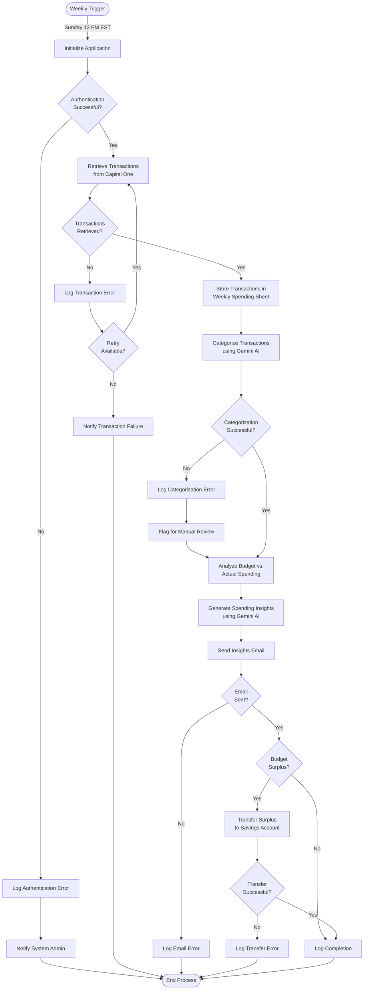

### 1.3 Key Components

| Component | Purpose | Key Responsibilities |
|-----------|---------|---------------------|
| Transaction Retriever | Data acquisition | Authenticate with Capital One API, retrieve transactions, store in Google Sheets |
| Transaction Categorizer | Data processing | Match transaction locations to budget categories using Gemini AI |
| Budget Analyzer | Financial analysis | Compare actual spending to budget, calculate variances and surplus/deficit |
| Insight Generator | Reporting | Generate AI-powered spending analysis and visualizations |
| Report Distributor | Communication | Format and send email reports via Gmail API |
| Savings Automator | Financial action | Transfer surplus funds to savings account via Capital One API |

## 2. Component Details

### 2.1 Transaction Retriever

The Transaction Retriever component serves as the initial data acquisition module in the Budget Management Application workflow. It handles authentication with Capital One API, retrieves transaction data for the past week, and stores it in Google Sheets.

#### 2.1.1 Key Functions

- **authenticate()**: Authenticates with both Capital One and Google Sheets APIs
- **retrieve_transactions()**: Retrieves transactions from Capital One API for the past week
- **store_transactions()**: Stores transactions in the Weekly Spending Google Sheet
- **execute()**: Orchestrates the complete transaction retrieval and storage process
- **check_health()**: Verifies connectivity with Capital One and Google Sheets APIs

#### 2.1.2 Integration Points

- **Capital One API**: Retrieves transaction data using OAuth 2.0 authentication
- **Google Sheets API**: Stores transaction data in the Weekly Spending sheet
- **Authentication Service**: Manages API credentials and tokens

#### 2.1.3 Error Handling

The component implements robust error handling with:
- Retry with exponential backoff for transient API failures
- Comprehensive logging of errors with context
- Graceful degradation when possible
- Clear status reporting for downstream components

#### 2.1.4 Data Flow

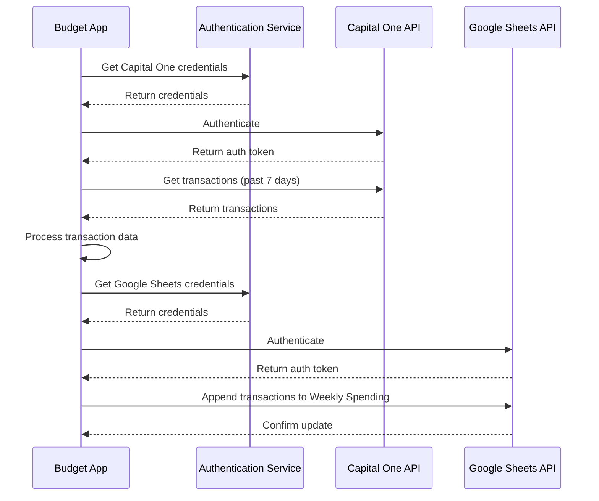

### 2.2 Transaction Categorizer

The Transaction Categorizer component is responsible for categorizing transactions using Gemini AI. It matches transaction locations to budget categories and updates Google Sheets with the assigned categories.

#### 2.2.1 Key Functions

- **authenticate()**: Authenticates with Gemini AI and Google Sheets APIs
- **get_transactions_and_categories()**: Retrieves transactions and budget categories from Google Sheets
- **categorize_transactions()**: Uses Gemini AI to match transaction locations to budget categories
- **apply_categories()**: Applies categorization results to transactions
- **update_sheet_categories()**: Updates transaction categories in Google Sheets
- **execute()**: Orchestrates the complete transaction categorization process

#### 2.2.2 Integration Points

- **Google Sheets API**: Retrieves transactions and budget categories, updates with assigned categories
- **Gemini API**: Performs AI-based categorization of transactions
- **Authentication Service**: Manages API credentials and tokens

#### 2.2.3 AI Prompt Design

The component uses a carefully designed prompt template for Gemini AI:

```
You are a financial transaction categorizer. Your task is to match each transaction location to the most appropriate budget category from the provided list.

TRANSACTION LOCATIONS:
{transaction_locations}

VALID BUDGET CATEGORIES:
{budget_categories}

For each transaction location, respond with the location followed by the best matching category in this format:
"Location: [transaction location] -> Category: [matching category]"

If you're unsure about a category, choose the most likely one based on the transaction location. Every transaction must be assigned to exactly one category from the provided list.
```

#### 2.2.4 Data Flow

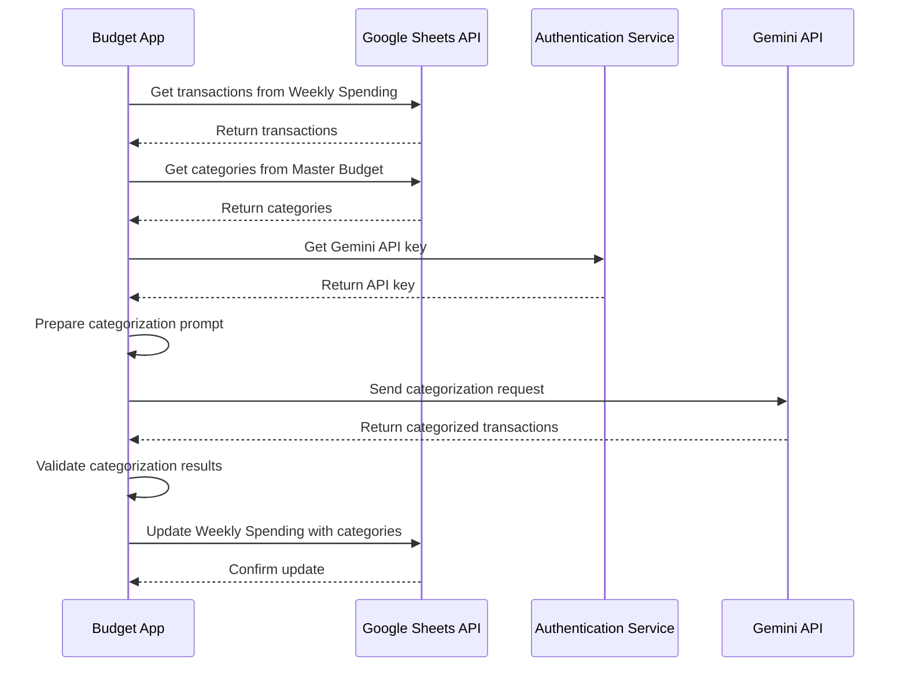

### 2.3 Budget Analyzer

The Budget Analyzer component is responsible for comparing actual spending to budgeted amounts, calculating variances, and determining the overall budget status. It's the third step in the budget management workflow, determining if there's a budget surplus for savings transfer.

#### 2.3.1 Key Functions

- **authenticate()**: Authenticates with Google Sheets API
- **get_transactions_and_budget()**: Retrieves transactions and budget data from Google Sheets
- **analyze_budget()**: Compares actual spending to budget and calculates variances
- **format_analysis_results()**: Formats budget analysis results for reporting
- **execute()**: Orchestrates the complete budget analysis process
- **check_health()**: Verifies connectivity with Google Sheets API

#### 2.3.2 Calculation Logic

The component performs the following calculations:
1. Aggregates transactions by category to determine actual spending
2. Compares actual spending to budgeted amounts for each category
3. Calculates variance amounts (budget - actual) and percentages
4. Determines total budget, total spent, and total variance
5. Identifies budget status (surplus or deficit)
6. Calculates transfer amount for savings (if surplus)

#### 2.3.3 Data Model

The Budget Analysis results include:
- **total_budget**: Sum of all category budget amounts
- **total_spent**: Sum of all category actual spending
- **total_variance**: Total budget - Total spent
- **category_variances**: Detailed analysis for each category
- **transfer_amount**: Amount to transfer to savings (if surplus)
- **budget_status**: "surplus" or "deficit"

#### 2.3.4 Data Flow

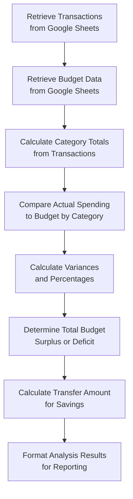

### 2.4 Insight Generator

The Insight Generator component is responsible for creating a comprehensive analysis of spending patterns using Gemini AI. It transforms raw budget analysis data into actionable insights and visualizations for the weekly report.

#### 2.4.1 Key Functions

- **authenticate()**: Authenticates with Gemini AI API
- **generate_insights()**: Uses Gemini AI to create natural language spending analysis
- **create_visualizations()**: Creates charts to visualize budget performance
- **create_report()**: Combines insights and visualizations into a complete report
- **execute()**: Orchestrates the complete insight generation process

#### 2.4.2 Visualization Design

The component creates two primary visualizations:

1. **Category Comparison Chart**: Horizontal bar chart comparing budget vs. actual spending by category
   - X-Axis: Dollar amount
   - Y-Axis: Category names
   - Color coding: Green for under budget, red for over budget

2. **Budget Overview Chart**: Pie chart showing overall budget allocation
   - For surplus: Shows spent amount and remaining amount
   - For deficit: Shows budget amount and overspent amount
   - Color coding: Blue for spent/budget, green for remaining, red for overspent

#### 2.4.3 AI Prompt Design

The component uses a carefully designed prompt template for Gemini AI:

```
You are a personal finance advisor analyzing weekly budget performance. Create a comprehensive analysis of the following budget data:

TOTAL BUDGET STATUS:
Total Budget: ${total_budget}
Total Spent: ${total_spent}
Variance: ${total_variance} ({status})

CATEGORY BREAKDOWN:
{category_breakdown}

Please provide a detailed analysis including:
1. A clear summary of the overall budget status at the top
2. Analysis of categories with significant variances (over/under budget)
3. Spending patterns and trends
4. Actionable recommendations for improving budget adherence
5. Positive reinforcement for categories within budget

Format your response as an email with clear sections and bullet points where appropriate. The email should be informative but concise, focusing on the most important insights.
```

#### 2.4.4 Data Flow

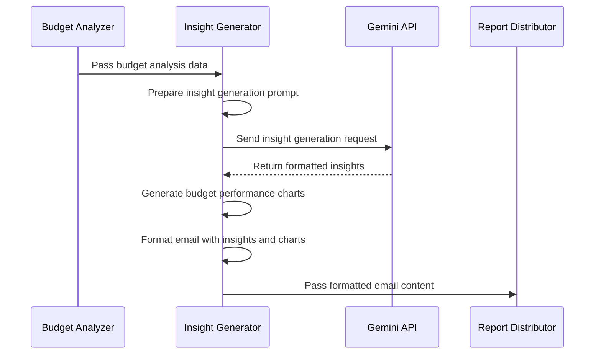

### 2.5 Report Distributor

The Report Distributor component is responsible for sending the generated insights via email to specified recipients. It handles email formatting, delivery, and confirmation.

#### 2.5.1 Key Functions

- **authenticate()**: Authenticates with Gmail API
- **validate_report()**: Ensures the report is complete and ready to send
- **send_report()**: Sends the report via email with charts
- **verify_delivery()**: Confirms email was delivered successfully
- **execute()**: Orchestrates the complete report distribution process
- **check_health()**: Verifies connectivity with Gmail API

#### 2.5.2 Email Configuration

The component sends emails with the following configuration:
- **Sender**: Configured email address (njdifiore@gmail.com)
- **Recipients**: Configured recipients (njdifiore@gmail.com, nick@blitzy.com)
- **Subject**: "Budget Update: ${surplus_amount} under budget this week" or "Budget Update: ${deficit_amount} over budget this week"
- **Content Type**: HTML with inline images
- **Attachments**: Budget performance charts embedded inline

#### 2.5.3 Email Structure

The email is structured with:
1. **Header**: Overall budget status with surplus/deficit amount prominently displayed
2. **Visualizations**: Embedded charts showing budget performance
3. **Insights**: AI-generated analysis and recommendations
4. **Category Details**: Breakdown of performance by category
5. **Footer**: Standard closing and next steps

#### 2.5.4 Data Flow

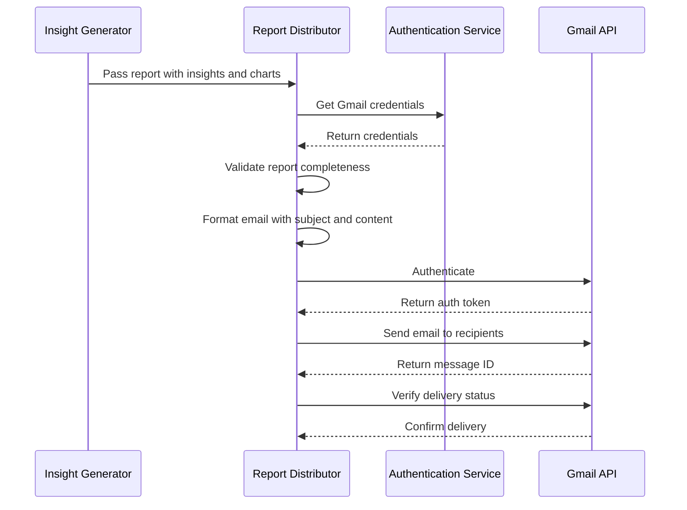

### 2.6 Savings Automator

The Savings Automator component is responsible for transferring budget surplus to a savings account. It calculates the transfer amount based on budget analysis and initiates the transfer via Capital One API.

#### 2.6.1 Key Functions

- **authenticate()**: Authenticates with Capital One API
- **validate_transfer_amount()**: Ensures the transfer amount meets requirements
- **verify_account_status()**: Confirms both checking and savings accounts are active
- **verify_sufficient_funds()**: Ensures checking account has sufficient funds
- **initiate_transfer()**: Initiates the transfer from checking to savings
- **verify_transfer()**: Confirms the transfer completed successfully
- **execute()**: Orchestrates the complete savings automation process

#### 2.6.2 Transfer Logic

The component implements the following transfer logic:
1. If budget variance is positive (surplus), transfer amount = variance
2. If budget variance is negative (deficit), no transfer is made
3. Transfer amount must meet minimum threshold (configurable)
4. Both accounts must be active and checking must have sufficient funds
5. Transfer is verified after initiation to confirm completion

#### 2.6.3 Security Measures

The component implements several security measures:
- Secure credential handling via Authentication Service
- Account status verification before transfer
- Sufficient funds verification before transfer
- Transfer amount validation
- Post-transfer verification
- Circuit breaker pattern to prevent repeated failed attempts

#### 2.6.4 Data Flow

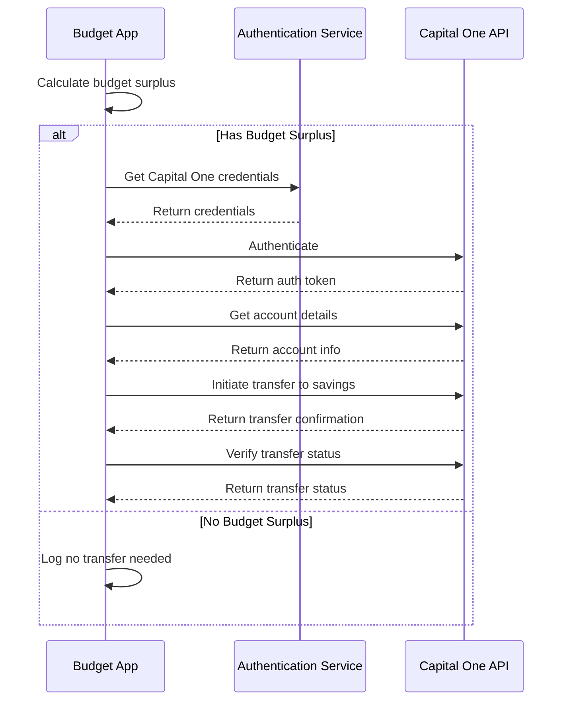

## 3. API Integrations

### 3.1 Capital One API

The Capital One API integration handles transaction retrieval and fund transfers. It uses OAuth 2.0 authentication and implements comprehensive error handling and retry mechanisms.

#### 3.1.1 Key Endpoints

| Endpoint | Method | Purpose | Request Parameters |
|----------|--------|---------|-------------------|
| `/accounts/{id}/transactions` | GET | Retrieve transactions | `startDate`, `endDate` |
| `/accounts/{id}` | GET | Get account details | None |
| `/transfers` | POST | Initiate fund transfer | `sourceAccountId`, `destinationAccountId`, `amount` |
| `/transfers/{id}` | GET | Check transfer status | None |

#### 3.1.2 Authentication Flow

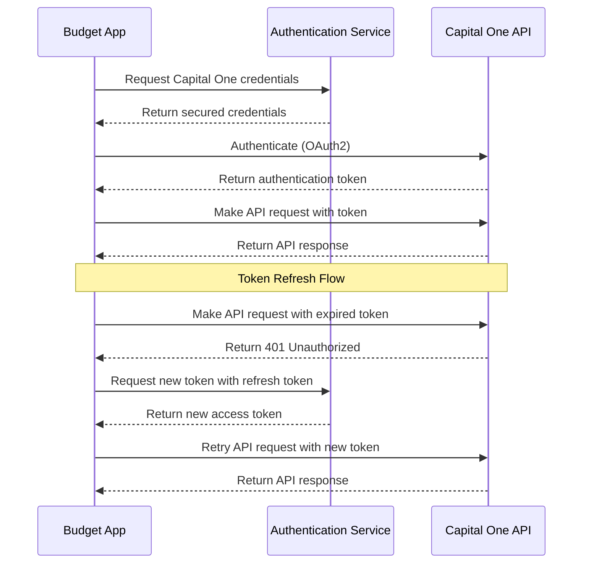

#### 3.1.3 Error Handling

The Capital One client implements:
- Retry with exponential backoff for transient errors
- Token refresh for authentication failures
- Comprehensive error logging with context
- Secure handling of financial data (account masking)
- Circuit breaker pattern for critical operations

### 3.2 Google Sheets API

The Google Sheets API integration handles budget data storage and retrieval. It provides methods for reading and writing transaction data, budget categories, and analysis results.

#### 3.2.1 Key Operations

| Operation | Purpose | Implementation |
|-----------|---------|----------------|
| read_sheet() | Read data from Google Sheets | GET request to sheets.values.get |
| append_rows() | Add new transactions | POST request to sheets.values.append |
| update_values() | Update transaction categories | PUT request to sheets.values.update |
| batch_update() | Perform multiple updates | POST request to spreadsheets.batchUpdate |

#### 3.2.2 Sheet Structure

The integration works with two primary sheets:

1. **Weekly Spending Sheet**:
   - Column A: Transaction Location
   - Column B: Transaction Amount
   - Column C: Transaction Time
   - Column D: Corresponding Category

2. **Master Budget Sheet**:
   - Column A: Spending Category
   - Column B: Weekly Amount

#### 3.2.3 Data Flow

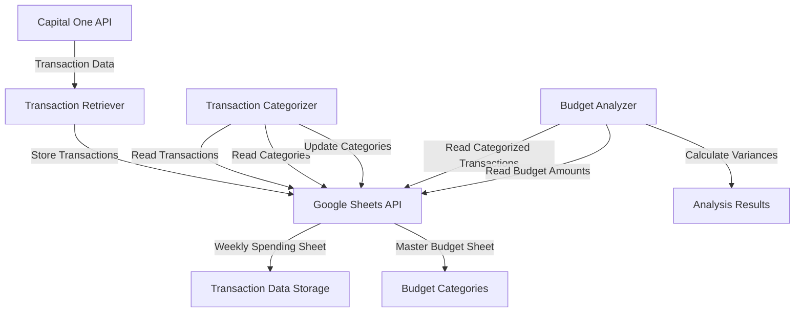

### 3.3 Gemini API

The Gemini API integration provides AI capabilities for transaction categorization and insight generation. It handles prompt formatting, response parsing, and error handling.

#### 3.3.1 Key Operations

| Operation | Purpose | Implementation |
|-----------|---------|----------------|
| generate_completion() | Send prompt to Gemini AI | POST request to models/{model}:generateContent |
| categorize_transactions() | Match transactions to categories | Formats prompt with transaction locations and categories |
| generate_spending_insights() | Create budget analysis | Formats prompt with budget data and variances |

#### 3.3.2 Prompt Engineering

The integration uses carefully designed prompts:

1. **Categorization Prompt**: Instructs Gemini to match transaction locations to budget categories with specific output format
2. **Insights Prompt**: Instructs Gemini to analyze budget performance and provide recommendations with specific structure

#### 3.3.3 Response Parsing

The integration implements parsing logic to:
- Extract category assignments from categorization responses
- Validate that assigned categories exist in the budget
- Format insights for email delivery
- Handle potential errors in AI responses

### 3.4 Gmail API

The Gmail API integration handles email delivery of budget reports. It manages authentication, email formatting with HTML and attachments, and delivery verification.

#### 3.4.1 Key Operations

| Operation | Purpose | Implementation |
|-----------|---------|----------------|
| send_email() | Send budget report email | POST request to users.messages.send |
| verify_delivery() | Confirm email delivery | GET request to users.messages.get |

#### 3.4.2 Email Formatting

The integration creates emails with:
- HTML content for rich formatting
- Inline images for charts and visualizations
- Proper MIME structure for multipart content
- Subject line reflecting budget status

#### 3.4.3 Security Measures

The integration implements:
- Secure credential handling via Authentication Service
- Email address validation
- Content validation before sending
- Delivery verification after sending

## 4. Error Handling and Resilience

### 4.1 Error Handling Strategy

The application implements a comprehensive error handling strategy with multiple layers:

#### 4.1.1 Component-Level Error Handling

Each component implements:
- Try-except blocks around critical operations
- Detailed error logging with context
- Status reporting for downstream components
- Graceful degradation when possible

#### 4.1.2 API-Level Error Handling

API clients implement:
- Retry with exponential backoff for transient errors
- Authentication error handling with token refresh
- Rate limiting awareness
- Timeout handling
- Comprehensive error context capture

#### 4.1.3 System-Level Error Handling

The main application implements:
- Component execution status tracking
- Correlation IDs for request tracing
- Structured logging for all operations
- Health checks before execution

### 4.2 Retry Mechanisms

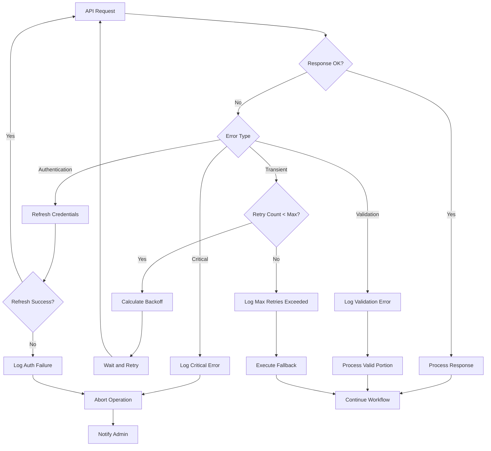

### 4.3 Graceful Degradation

The application implements graceful degradation to handle partial failures:

| Component | Degradation Strategy |
|-----------|---------------------|
| Transaction Retriever | Proceed with available transactions if some fail |
| Transaction Categorizer | Use available categories, flag uncategorized transactions |
| Budget Analyzer | Analyze available categories, note missing data |
| Insight Generator | Generate insights with available data, use templates if AI fails |
| Report Distributor | Send plain text if HTML formatting fails, continue without charts |
| Savings Automator | Skip transfer if any verification fails, document in logs |

### 4.4 Circuit Breaker Pattern

The application implements circuit breakers for critical operations:

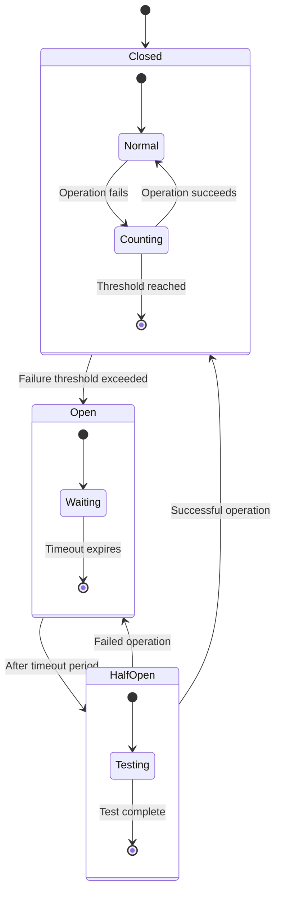

## 5. Monitoring and Logging

### 5.1 Logging Strategy

The application implements structured logging with:

#### 5.1.1 Log Levels

| Level | Usage |
|-------|-------|
| DEBUG | Detailed information for debugging |
| INFO | Confirmation of normal operation |
| WARNING | Indication of potential issues |
| ERROR | Error that prevents operation |
| CRITICAL | Error that prevents system function |

#### 5.1.2 Log Structure

Each log entry includes:
- Timestamp
- Component name
- Operation name
- Correlation ID
- Status information
- Context data (with sensitive information masked)
- Error details (when applicable)

#### 5.1.3 Performance Logging

The application tracks performance metrics:
- Component execution time
- API response time
- Overall process duration
- Resource utilization

### 5.2 Monitoring Approach

The application is designed for monitoring through:

#### 5.2.1 Health Checks

Each component implements a `check_health()` method that:
- Verifies API connectivity
- Validates authentication
- Checks data access
- Returns detailed health status

#### 5.2.2 Execution Metrics

The application tracks:
- Job execution success/failure
- Component execution status
- Transaction processing counts
- Categorization accuracy
- Budget variance trends
- Savings transfer amounts

#### 5.2.3 Alerting

The application supports alerting on:
- Job execution failure
- Component execution failure
- API integration issues
- Data validation errors
- Transfer failures

### 5.3 Observability

The application provides observability through:

#### 5.3.1 Structured Logs

```json
{
  "timestamp": "2023-07-23T12:01:15.123Z",
  "execution_id": "exec-2023-07-23-12-00-00",
  "component": "savings_automator",
  "operation": "transfer_funds",
  "status": "success",
  "details": {
    "amount": "45.67",
    "source_account": "xxxx1234",
    "destination_account": "xxxx5678",
    "transfer_id": "tr-98765"
  },
  "duration_ms": 1250,
  "severity": "INFO"
}
```

#### 5.3.2 Performance Metrics

The application tracks:
- End-to-end execution time
- Component-level execution time
- API response times
- Resource utilization
- Success rates

#### 5.3.3 Business Metrics

The application provides:
- Budget adherence percentage
- Category-level variance trends
- Savings transfer history
- Categorization accuracy

## 6. Security Considerations

### 6.1 Authentication Security

The application implements secure authentication:

#### 6.1.1 API Authentication

| API | Authentication Method | Security Measures |
|-----|----------------------|-------------------|
| Capital One | OAuth 2.0 | Token refresh, secure storage, TLS |
| Google Sheets | OAuth 2.0 | Service account, secure storage, TLS |
| Gemini | API Key | Secure storage, request validation |
| Gmail | OAuth 2.0 | Token refresh, secure storage, TLS |

#### 6.1.2 Credential Management

The application secures credentials through:
- Environment variables for local development
- Secret Manager for cloud deployment
- No hardcoded credentials
- Credential rotation support

### 6.2 Data Security

The application protects sensitive data:

#### 6.2.1 Data Protection

| Data Type | Protection Measures |
|-----------|---------------------|
| Account Numbers | Masked in logs (e.g., XXXX-XXXX-XXXX-1234) |
| API Tokens | Never logged, stored securely |
| Transaction Data | Transmitted over TLS, validated before processing |
| Budget Data | Accessed with minimal permissions |

#### 6.2.2 Secure Communication

All API communication uses:
- TLS 1.2+ encryption
- Certificate validation
- Secure headers
- Request/response validation

### 6.3 Financial Operation Security

The application implements additional security for financial operations:

#### 6.3.1 Transfer Security

Before any transfer:
1. Validate transfer amount meets requirements
2. Verify account status (both accounts active)
3. Verify sufficient funds available
4. Use secure API for transfer initiation
5. Verify transfer completion
6. Log transfer details (with sensitive data masked)

#### 6.3.2 Authorization Controls

The application follows the principle of least privilege:
- Read-only access where possible
- Specific account access only
- Minimal API scopes
- Service account with limited permissions

## 7. Deployment and Infrastructure

### 7.1 Deployment Architecture

The application is deployed as a serverless Cloud Run job on Google Cloud Platform:

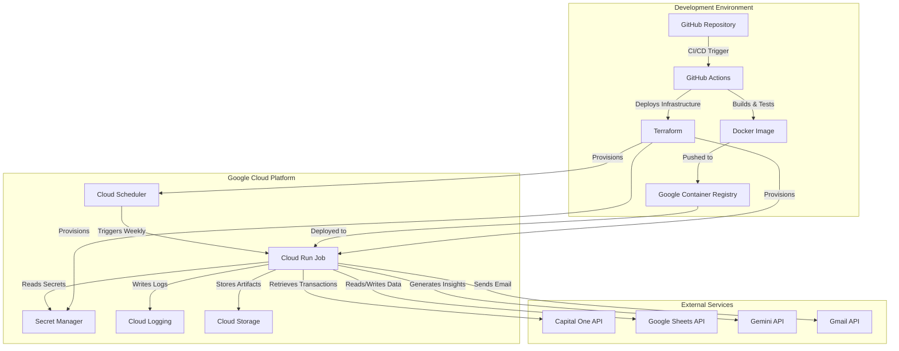

### 7.2 Infrastructure Components

| Component | Purpose | Configuration |
|-----------|---------|--------------|
| Cloud Run Jobs | Execute the budget management application | 1 vCPU, 2GB memory, 10-minute timeout |
| Cloud Scheduler | Trigger weekly job execution | Cron schedule: `0 12 * * 0` (Sunday 12 PM EST) |
| Secret Manager | Store API credentials securely | Separate secrets for each API integration |
| Cloud Storage | Store application logs | Standard storage class, 30-day retention |
| Cloud Logging | Centralized log management | Structured JSON logs |

### 7.3 Containerization

The application is containerized using Docker:

```dockerfile
# Use Python slim image to minimize container size
FROM python:3.11-slim

# Set working directory
WORKDIR /app

# Copy requirements first for better layer caching
COPY requirements.txt .
RUN pip install --no-cache-dir -r requirements.txt

# Copy application code
COPY . .

# Set environment variables
ENV PYTHONUNBUFFERED=1

# Run the application
CMD ["python", "main.py"]
```

### 7.4 CI/CD Pipeline

The application uses GitHub Actions for CI/CD:

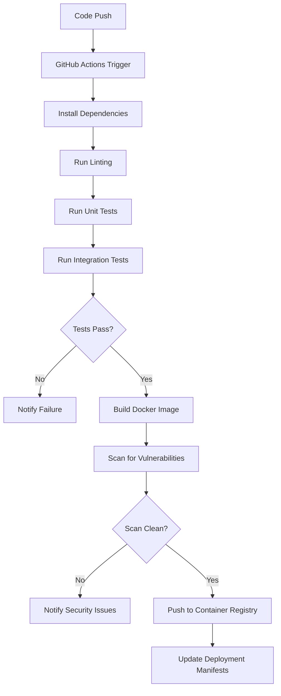

## 8. Testing Strategy

### 8.1 Testing Approach

The application implements a comprehensive testing strategy:

#### 8.1.1 Unit Testing

Tests for individual components and functions with mocked dependencies:
- Transaction Retriever tests
- Transaction Categorizer tests
- Budget Analyzer tests
- Insight Generator tests
- Report Distributor tests
- Savings Automator tests

#### 8.1.2 Integration Testing

Tests for component interactions:
- Transaction retrieval and storage flow
- Categorization flow
- Budget analysis flow
- Insight generation flow
- Reporting flow
- Savings flow

#### 8.1.3 End-to-End Testing

Tests for complete system functionality:
- Weekly budget process
- Error recovery
- Security
- Performance

### 8.2 Test Automation

The application uses:
- Pytest for test framework
- GitHub Actions for CI/CD integration
- Mock objects for external dependencies
- Fixtures for test data
- Coverage reporting

### 8.3 Test Data Management

The application manages test data through:
- JSON fixtures for transactions, budget data, and API responses
- Mock API clients for external services
- Test environment configuration
- Data generators for performance testing

## 9. Maintenance and Support

### 9.1 Maintenance Procedures

| Procedure | Frequency | Description |
|-----------|-----------|-------------|
| Dependency Updates | Monthly | Update Python packages and base container image |
| Security Patching | As needed | Apply security patches to dependencies |
| Credential Rotation | Quarterly | Rotate API keys and service account credentials |
| Performance Review | Quarterly | Review execution metrics and optimize resources |

### 9.2 Troubleshooting Guide

| Issue | Troubleshooting Steps |
|-------|----------------------|
| Job Execution Failure | Check Cloud Run logs, verify API credentials, check for service outages |
| Transaction Retrieval Issues | Verify Capital One API access, check date range configuration |
| Categorization Problems | Review Gemini API prompts, test with sample transactions |
| Budget Analysis Errors | Verify sheet structure, check calculation logic |
| Email Delivery Failures | Verify Gmail API permissions, check recipient addresses |
| Transfer Failures | Verify account status, check transfer limits, confirm sufficient funds |

### 9.3 Disaster Recovery

| Scenario | Recovery Procedure | Recovery Time |
|----------|-------------------|---------------|
| Job Execution Failure | Manual trigger via Cloud Console | < 1 hour |
| Infrastructure Corruption | Redeploy via Terraform | < 4 hours |
| Data Access Issue | Verify and update API credentials | < 2 hours |
| Code Deployment Issue | Rollback to previous container version | < 30 minutes |

## 10. Conclusion

The Budget Management Application provides an automated solution for personal budget tracking, analysis, and optimization. By integrating with financial services, AI, and communication platforms, it eliminates the manual effort typically required for budget management while providing actionable insights and automated savings.

The serverless, event-driven architecture ensures reliable weekly execution with minimal infrastructure management. The modular component design allows for easy maintenance and future enhancements. The comprehensive error handling and monitoring ensure reliable operation even when external services experience issues.

By automating the entire process from transaction capture to analysis and action, the system delivers significant time savings while promoting better financial outcomes through consistent budget tracking and automated savings.

A Budget Management Application is an automated system designed to help individuals track, analyze, and optimize their personal spending habits against predefined budgets. This backend-only solution integrates with financial services, AI, and communication platforms to provide actionable financial insights without requiring user intervention.

The application addresses the core challenge of maintaining financial discipline by automating budget tracking, spending categorization, and savings allocation. It eliminates the manual effort typically required for budget reconciliation and provides timely, data-driven insights on spending patterns.

# PROJECT STATUS

The Budget Management Application is nearing completion with most core functionality implemented and tested. The application architecture, integration points, and deployment infrastructure are well-established, with remaining work focused on final testing, optimization, and production readiness.

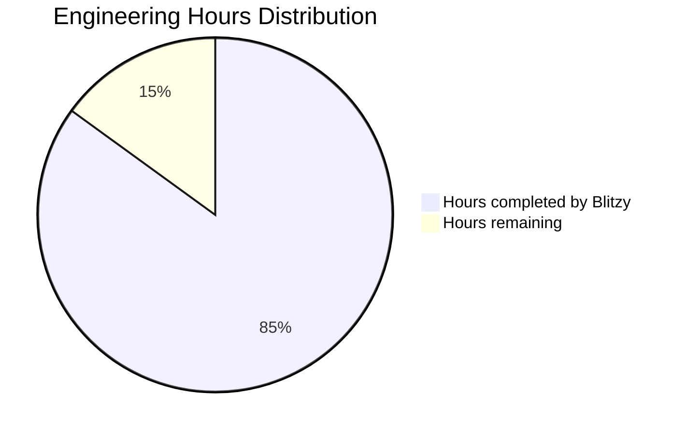

## Project Completion Metrics

| Metric | Value |
|--------|-------|
| Estimated engineering hours | 200 hours |
| Hours completed by Blitzy | 170 hours (85%) |
| Hours remaining | 30 hours (15%) |
| Current status | Pre-production |

## Completed Components

- ✅ Core application architecture and design
- ✅ API client implementations (Capital One, Google Sheets, Gemini, Gmail)
- ✅ Main functional components (Transaction Retriever, Categorizer, Budget Analyzer)
- ✅ Data models and validation logic
- ✅ Error handling and logging framework
- ✅ Infrastructure as code (Terraform)
- ✅ CI/CD pipeline configuration
- ✅ Test framework and fixtures

## Remaining Tasks

- ⏳ Final end-to-end testing with production APIs
- ⏳ Performance optimization for large transaction volumes
- ⏳ Security hardening and vulnerability scanning
- ⏳ Documentation refinement
- ⏳ Production deployment and monitoring setup

The application is currently in a pre-production state with all core functionality implemented. The remaining work focuses on ensuring production readiness, optimizing performance, and finalizing documentation before the official launch.

# TECHNOLOGY STACK

## 3.1 PROGRAMMING LANGUAGES

| Language | Version | Usage | Justification |
|----------|---------|-------|---------------|
| Python | 3.11+ | Core application logic | Python's extensive library support for API integrations, data processing, and AI interactions makes it ideal for this serverless application. Its readability and maintainability align with the project's backend-only nature. |
| SQL | Standard | Data queries | For structured queries against Google Sheets data, providing efficient data aggregation and analysis capabilities. |

## 3.2 FRAMEWORKS & LIBRARIES

| Framework/Library | Version | Purpose | Justification |
|-------------------|---------|---------|---------------|
| Google API Client | 2.100.0+ | Google service integration | Official library for Google Sheets and Gmail API integration with comprehensive documentation and support. |
| Pandas | 2.1.0+ | Data manipulation | Efficient data processing for transaction categorization and budget analysis with powerful aggregation capabilities. |
| Matplotlib/Seaborn | 3.7.0+/0.12.2+ | Chart generation | Creating visual representations of budget performance for email reports. |
| Requests | 2.31.0+ | API communication | Reliable HTTP library for API interactions where dedicated SDKs aren't available. |
| Google Generative AI | 0.3.0+ | AI integration | Official library for interacting with Google's Gemini AI models. |
| Pytest | 7.4.0+ | Testing | Comprehensive testing framework to ensure reliability of financial operations. |
| Tenacity | 8.2.3+ | Retry logic | Implements robust retry mechanisms for API calls with exponential backoff. |
| NumPy | 1.24.0+ | Numerical operations | Supports data processing and mathematical operations for budget calculations. |
| Pydantic | 2.3.0+ | Data validation | Ensures data integrity through strong typing and validation. |
| Google Cloud Logging | 3.6.0+ | Logging service | Structured logging for monitoring and troubleshooting. |
| Google Cloud Secret Manager | 2.16.3+ | Credential storage | Secure management of API keys and credentials. |

## 3.3 DATABASES & STORAGE

| Storage Solution | Version | Purpose | Justification |
|------------------|---------|---------|---------------|
| Google Sheets | N/A | Primary data storage | Aligns with requirements to use existing Google Sheets for budget data and transaction tracking. Provides familiar interface for data review. |
| Cloud Storage | N/A | Temporary file storage | For storing generated charts and reports before email delivery. |
| Secret Manager | N/A | Credential storage | Secure storage of API keys and authentication tokens for third-party services. |

## 3.4 THIRD-PARTY SERVICES

| Service | Purpose | Integration Method | Justification |
|---------|---------|-------------------|---------------|
| Capital One API | Transaction retrieval and fund transfers | REST API | Required for accessing financial data and performing automated savings transfers. |
| Google Sheets API | Budget data storage and retrieval | Google API Client | Specified in requirements for storing transaction data and budget information. |
| Gemini API | Transaction categorization and insight generation | REST API | Provides AI capabilities for transaction categorization and generating spending insights. |
| Gmail API | Email delivery | Google API Client | Required for sending automated spending reports to specified recipients. |
| Google Cloud Run | Application execution | Serverless jobs | Provides reliable, scheduled execution with minimal infrastructure management. |
| Google Cloud Scheduler | Job scheduling | Cloud service | Enables weekly execution of the budget management workflow. |

## 3.5 DEVELOPMENT & DEPLOYMENT

| Tool/Service | Version | Purpose | Justification |
|--------------|---------|---------|---------------|
| Google Cloud SDK | Latest | Cloud resource management | Required for deploying and managing Google Cloud Run jobs. |
| Docker | Latest | Containerization | Ensures consistent execution environment for the Cloud Run job. |
| Terraform | 1.0.0+ | Infrastructure as Code | Automates the provisioning and management of cloud resources. |
| GitHub | N/A | Version control | Industry standard for code management and collaboration. |
| GitHub Actions | N/A | CI/CD pipeline | Automates testing and deployment to Google Cloud Run. |
| Black/Flake8/isort | 23.7.0+/6.1.0+/5.12.0+ | Code formatting and linting | Ensures code quality and consistent style. |
| Mypy | 1.5.1+ | Type checking | Enhances code reliability through static type analysis. |

## 3.6 ARCHITECTURE DIAGRAM

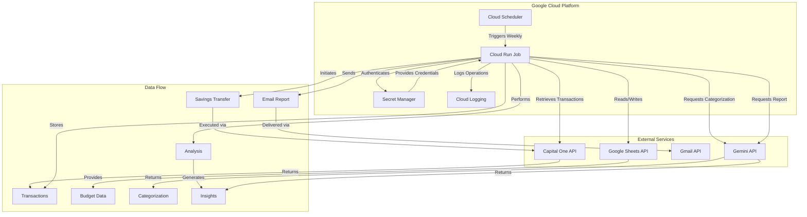

# Prerequisites

## System Requirements

### Software Requirements

- **Python**: Version 3.11 or higher
- **pip**: Latest version for package management
- **virtualenv**: For creating isolated Python environments
- **git**: For version control and code management
- **Docker**: For containerization (required for local development and testing)

### Cloud Services Accounts

- **Google Cloud Platform Account**: Required for deploying and running the application
  - Enabled APIs: Cloud Run, Cloud Scheduler, Secret Manager, Cloud Logging
  - Appropriate IAM permissions to create and manage resources
  
- **Capital One Developer Account**: Required for accessing banking data
  - API access credentials (Client ID and Client Secret)
  - Permissions for transaction retrieval and fund transfers
  
- **Google Workspace Account**: Required for Google services integration
  - Access to Google Sheets API for data storage
  - Access to Gmail API for sending reports
  
- **Gemini API Access**: Required for AI-powered categorization and insights
  - API key with appropriate usage limits

### Hardware Requirements

- **Development Environment**: Any system capable of running Python 3.11+ and Docker
- **Memory**: Minimum 2GB RAM recommended for local development
- **Storage**: At least 1GB free disk space for application code, dependencies, and data

## Dependencies

The application requires the following key dependencies:

### Core Dependencies
- **requests**: For API communication
- **google-api-python-client**: For Google services integration
- **pandas**: For data manipulation and analysis
- **matplotlib/seaborn**: For chart generation
- **google-generativeai**: For Gemini AI integration

### Development Dependencies
- **pytest**: For testing
- **black/isort/flake8**: For code formatting and linting
- **mypy**: For type checking

A complete list of dependencies with version requirements is available in `src/backend/requirements.txt`.

## Environment Setup

Before running the application, you need to set up the following:

### Google Sheets Configuration

1. Create two Google Sheets:
   - **Master Budget**: Contains budget categories and weekly amounts
   - **Weekly Spending**: Will store transaction data and categorization

2. Share both sheets with the service account email (generated during deployment)

### API Credentials

The application requires credentials for the following services:

1. **Capital One API**:
   - Client ID and Client Secret
   - Account IDs for checking and savings accounts

2. **Google APIs**:
   - Service Account credentials with appropriate scopes:
     - `https://www.googleapis.com/auth/spreadsheets` for Google Sheets
     - `https://www.googleapis.com/auth/gmail.send` for Gmail

3. **Gemini API**:
   - API Key with access to required models

These credentials should be stored securely in Google Secret Manager for production deployment or in a local `.env` file for development.

### Environment Variables

The application uses environment variables for configuration. Key variables include:

- API credentials and endpoints
- Google Sheet IDs
- Email settings (sender, recipients)
- Logging configuration

For local development, copy `src/backend/.env.example` to `src/backend/.env` and update with your values.

## Verification

Before running the application, verify that all prerequisites are correctly set up:

1. Run the environment setup script:
   ```bash
   cd src/scripts/setup
   ./setup_environment.sh
   ```

2. Verify API access:
   ```bash
   cd src/scripts/setup
   python verify_api_access.py --verbose
   ```

This will check connectivity to all required external services and confirm that your credentials are working properly.

# Budget Management Application Project Guide

## 1. Project Overview

The Budget Management Application is a serverless, event-driven system designed to help individuals track, analyze, and optimize their personal spending habits against predefined budgets. This backend-only solution integrates with financial services, AI, and communication platforms to provide actionable financial insights without requiring user intervention.

### 1.1 Key Features

- **Automated Transaction Retrieval**: Weekly extraction of transaction data from Capital One checking account
- **AI-Powered Categorization**: Automatic categorization of transactions using Gemini AI
- **Budget Analysis**: Comparison of actual spending to budgeted amounts by category
- **Intelligent Insights**: AI-generated summary of spending patterns with actionable recommendations
- **Automated Reporting**: Email delivery of spending insights to specified recipients
- **Automated Savings**: Transfer of unspent budget amounts to a designated savings account

### 1.2 System Architecture

The application follows a serverless architecture using Google Cloud Run jobs with scheduled execution via Google Cloud Scheduler. It integrates with the following external services:

- **Capital One API**: For transaction retrieval and fund transfers
- **Google Sheets API**: For budget data storage and retrieval
- **Gemini API**: For transaction categorization and insight generation
- **Gmail API**: For sending automated spending reports

### 1.3 Workflow Overview

The Budget Management Application operates on a weekly schedule, executing the following workflow:

1. **Transaction Retrieval**: Extracts transaction data from Capital One checking account
2. **Transaction Categorization**: Uses Gemini AI to categorize transactions based on their locations
3. **Budget Analysis**: Compares actual spending to budgeted amounts and calculates variances
4. **Insight Generation**: Creates AI-powered analysis and visualizations of spending patterns
5. **Report Distribution**: Sends email reports with insights and charts to specified recipients
6. **Savings Automation**: Transfers budget surplus to a savings account if available

## 2. Component Architecture

The application is structured as a set of modular components, each responsible for a specific part of the budget management workflow:

### 2.1 Transaction Retriever

**Purpose**: Extracts transaction data from Capital One and stores it in Google Sheets.

**Key Responsibilities**:
- Authenticate with Capital One API
- Retrieve transactions from the specified checking account for the past week
- Transform transaction data into the required format
- Store transaction data in the Weekly Spending Google Sheet

**Dependencies**:
- Capital One API for transaction data
- Google Sheets API for data storage
- Authentication Service for secure API access

**Error Handling**:
- Implements retry with exponential backoff for API failures
- Validates transaction data before storage
- Logs detailed error information for troubleshooting

### 2.2 Transaction Categorizer

**Purpose**: Assigns budget categories to transactions based on their locations using Gemini AI.

**Key Responsibilities**:
- Retrieve transaction data from the Weekly Spending sheet
- Retrieve budget categories from the Master Budget sheet
- Generate AI prompts for transaction categorization
- Process AI responses to extract category assignments
- Update the Weekly Spending sheet with assigned categories

**Dependencies**:
- Google Sheets API for data retrieval and storage
- Gemini API for AI-powered categorization
- Transaction Retriever component (upstream)
- Budget Analyzer component (downstream)

**Error Handling**:
- Implements retry logic for API failures
- Validates categorization results against known categories
- Ensures minimum categorization threshold is met

### 2.3 Budget Analyzer

**Purpose**: Compares actual spending to budgeted amounts, calculates variances, and determines the overall budget status.

**Key Responsibilities**:
- Retrieve categorized transactions from the Weekly Spending sheet
- Retrieve budget amounts from the Master Budget sheet
- Aggregate transactions by category
- Calculate variances between actual and budgeted amounts
- Determine total budget surplus or deficit

**Dependencies**:
- Google Sheets API for data retrieval
- Transaction Categorizer component (upstream)
- Insight Generator component (downstream)
- Savings Automator component (downstream)

**Error Handling**:
- Validates calculation results for mathematical accuracy
- Handles missing or incomplete data gracefully
- Logs detailed analysis information for auditing

### 2.4 Insight Generator

**Purpose**: Creates a comprehensive analysis of spending patterns using Gemini AI and generates visualizations.

**Key Responsibilities**:
- Prepare budget analysis data for AI processing
- Generate natural language insights using Gemini AI
- Create visualizations of budget performance
- Format content for email delivery

**Dependencies**:
- Gemini API for insight generation
- Budget Analyzer component (upstream)
- Report Distributor component (downstream)
- Visualization libraries for chart generation

**Error Handling**:
- Implements fallback mechanisms for AI failures
- Ensures critical information is included even if visualization fails
- Validates AI-generated content for relevance and completeness

### 2.5 Report Distributor

**Purpose**: Sends the generated insights via email to specified recipients.

**Key Responsibilities**:
- Authenticate with Gmail API
- Format email with insights and charts
- Send email to specified recipients
- Verify email delivery
- Log delivery status

**Dependencies**:
- Gmail API for email delivery
- Insight Generator component (upstream)
- Email content and attachments

**Error Handling**:
- Implements retry logic for transient email delivery failures
- Validates email content and recipients before sending
- Verifies delivery status after sending

### 2.6 Savings Automator

**Purpose**: Transfers budget surplus to a savings account based on budget analysis.

**Key Responsibilities**:
- Calculate transfer amount based on budget surplus
- Authenticate with Capital One API
- Initiate transfer from checking to savings account
- Verify transfer completion
- Log transfer details

**Dependencies**:
- Capital One API for fund transfer
- Budget Analyzer component (upstream)
- Budget surplus data

**Error Handling**:
- Implements circuit breaker pattern for critical financial operations
- Validates transfer amount and account status before initiating transfer
- Verifies sufficient funds and transfer completion

## 3. Data Flow

The Budget Management Application processes data through a sequential workflow with the following primary data flows:

### 3.1 Transaction Data Flow

1. **Data Acquisition**:
   - The Transaction Retriever authenticates with Capital One API
   - Transactions from the past week are retrieved
   - Transaction data (location, amount, timestamp) is extracted and transformed
   - Formatted transaction data is written to the Weekly Spending Google Sheet

2. **Data Categorization**:
   - The Transaction Categorizer reads transaction locations from the Weekly Spending sheet
   - Budget categories are retrieved from the Master Budget sheet
   - Transaction locations and budget categories are sent to Gemini AI for matching
   - Categorization results are validated and written back to the Weekly Spending sheet

3. **Data Analysis**:
   - The Budget Analyzer aggregates transactions by category from the Weekly Spending sheet
   - Budget amounts are retrieved from the Master Budget sheet
   - Variances are calculated by comparing actual spending to budgeted amounts
   - Total budget surplus or deficit is determined

4. **Insight Generation**:
   - The Insight Generator sends budget analysis data to Gemini AI
   - Gemini AI generates natural language insights and recommendations
   - Charts are created to visualize budget performance
   - Insights and charts are formatted into an email report

5. **Report Distribution**:
   - The Report Distributor formats the insights into an email with charts
   - The email is sent via Gmail API to specified recipients
   - Delivery status is verified and logged

6. **Savings Automation**:
   - If a budget surplus exists, the Savings Automator calculates the transfer amount
   - Account status and available funds are verified
   - The transfer is initiated via Capital One API from checking to savings account
   - Transfer confirmation is logged for record-keeping

### 3.2 Data Models

#### Transaction Model
- **location**: Merchant name or transaction location
- **amount**: Transaction amount in USD
- **timestamp**: Transaction date and time
- **category**: Assigned budget category
- **transaction_id**: Unique identifier from Capital One

#### Budget Category Model
- **name**: Category name
- **weekly_amount**: Weekly budget amount for the category

#### Budget Analysis Model
- **category_variances**: Variance amounts and percentages by category
- **total_budget**: Sum of all category budget amounts
- **total_spent**: Sum of all category actual amounts
- **total_variance**: Total budget - Total actual
- **budget_status**: "Surplus" or "Deficit"
- **transfer_amount**: Amount to transfer to savings (if surplus)

#### Report Model
- **insights**: AI-generated analysis text
- **chart_files**: Paths to generated chart images
- **email_subject**: Subject line for the email report
- **email_body**: Formatted HTML content for the email

#### Transfer Model
- **transfer_id**: Unique identifier for the transfer
- **amount**: Transfer amount
- **timestamp**: Date and time of the transfer
- **status**: Transfer status (initiated, completed, failed)

## 4. External Integrations

The Budget Management Application integrates with several external services to perform its functions:

### 4.1 Capital One API

**Purpose**: Retrieve transaction data and perform savings transfers

**Integration Points**:
- `/accounts/{id}/transactions`: Retrieve transactions for the past week
- `/accounts/{id}`: Get account details for checking and savings accounts
- `/transfers`: Initiate fund transfers between accounts
- `/transfers/{id}`: Verify transfer status

**Authentication**: OAuth 2.0 with client credentials flow

**Error Handling**:
- Retry with exponential backoff for transient errors
- Circuit breaker pattern for persistent failures
- Detailed error logging for troubleshooting

### 4.2 Google Sheets API

**Purpose**: Store and retrieve transaction and budget data

**Integration Points**:
- Weekly Spending sheet: Store transaction data and categories
- Master Budget sheet: Store budget categories and amounts

**Authentication**: OAuth 2.0 with service account

**Error Handling**:
- Retry with exponential backoff for API failures
- Validation of sheet structure and data formats
- Fallback mechanisms for partial data retrieval

### 4.3 Gemini API

**Purpose**: Categorize transactions and generate spending insights

**Integration Points**:
- Transaction categorization: Match transaction locations to budget categories
- Insight generation: Create natural language analysis of spending patterns

**Authentication**: API key authentication

**Error Handling**:
- Prompt optimization for reliable results
- Fallback templates for AI failures
- Validation of AI-generated content

### 4.4 Gmail API

**Purpose**: Send email reports with spending insights

**Integration Points**:
- Email composition: Create MIME messages with HTML content and attachments
- Email sending: Deliver reports to specified recipients

**Authentication**: OAuth 2.0 with appropriate scopes

**Error Handling**:
- Retry logic for transient delivery failures
- Fallback to plain text if HTML formatting fails
- Delivery verification after sending

## 5. Deployment Architecture

The Budget Management Application is deployed as a serverless application on Google Cloud Platform:

### 5.1 Cloud Infrastructure

- **Google Cloud Run Jobs**: Executes the budget management application
- **Google Cloud Scheduler**: Triggers weekly job execution (Sunday 12 PM EST)
- **Google Secret Manager**: Stores API credentials securely
- **Google Cloud Storage**: Stores application logs and temporary files

### 5.2 Containerization

- **Docker**: Application is containerized for consistent execution
- **Container Registry**: Stores application container images
- **Cloud Build**: Automates container building and deployment

### 5.3 CI/CD Pipeline

- **GitHub Actions**: Automates testing and deployment
- **Terraform**: Manages infrastructure as code
- **Automated Testing**: Ensures code quality and reliability

### 5.4 Monitoring and Logging

- **Cloud Logging**: Centralized log management
- **Cloud Monitoring**: Performance and health monitoring
- **Alerting**: Notifications for job failures or errors

## 6. Security Considerations

The Budget Management Application implements several security measures to protect sensitive financial data:

### 6.1 Authentication and Authorization

- **OAuth 2.0**: Secure authentication for all APIs
- **Secret Manager**: Secure storage of API credentials
- **Principle of Least Privilege**: Minimal permissions for each API integration

### 6.2 Data Protection

- **TLS Encryption**: Secure communication with all external APIs
- **Data Minimization**: Only essential data is collected and processed
- **No Persistent Storage**: Sensitive data is not stored beyond processing

### 6.3 Error Handling and Logging

- **Sensitive Data Masking**: Financial data is masked in logs
- **Structured Logging**: Consistent format for all log entries
- **Correlation IDs**: Trace requests across components

### 6.4 Financial Transaction Security

- **Validation**: Multiple validation steps before initiating transfers
- **Verification**: Confirmation of transfer completion
- **Idempotency**: Prevention of duplicate transfers

## 7. Testing Strategy

The Budget Management Application implements a comprehensive testing strategy:

### 7.1 Unit Testing

- **Component Tests**: Verify individual component functionality
- **Mock Dependencies**: Simulate external API responses
- **Error Handling**: Test recovery from various failure scenarios

### 7.2 Integration Testing

- **Component Chains**: Test multiple components working together
- **API Integration**: Verify correct interaction with external services
- **Data Flow**: Ensure proper data passing between components

### 7.3 End-to-End Testing

- **Complete Workflow**: Test the entire budget management process
- **Error Recovery**: Verify system recovery from failures
- **Performance**: Measure execution time and resource usage

### 7.4 Security Testing

- **Credential Handling**: Verify secure storage and usage of API keys
- **Data Protection**: Test proper masking of financial data
- **API Security**: Verify secure authentication and communication

## 8. Maintenance and Operations

### 8.1 Monitoring

- **Job Execution**: Track success/failure of weekly jobs
- **API Health**: Monitor external API availability
- **Performance Metrics**: Track execution time and resource usage

### 8.2 Alerting

- **Job Failures**: Immediate notification for failed executions
- **API Outages**: Alerts for external service unavailability
- **Security Events**: Notifications for authentication failures

### 8.3 Disaster Recovery

- **Job Failure Recovery**: Automatic retry or manual triggering
- **Data Consistency**: Validation checks to ensure data integrity
- **Rollback Capability**: Revert to previous versions if needed

### 8.4 Regular Maintenance

- **Dependency Updates**: Regular updates of libraries and dependencies
- **Credential Rotation**: Periodic rotation of API keys and tokens
- **Performance Optimization**: Regular review and improvement

## 9. Getting Started

### 9.1 Prerequisites

- Python 3.11+
- Google Cloud Platform account
- Capital One developer account with API access
- Google Workspace account with access to Sheets and Gmail
- Gemini API access
- Docker (for local development and testing)

### 9.2 Local Development Setup

1. Clone the repository
   ```bash
   git clone <repository-url>
   cd budget-management-application
   ```

2. Set up a virtual environment
   ```bash
   python -m venv venv
   source venv/bin/activate  # On Windows: venv\Scripts\activate
   ```

3. Install dependencies
   ```bash
   pip install -r src/backend/requirements.txt
   ```

4. Configure environment variables
   ```bash
   cp src/backend/.env.example src/backend/.env
   # Edit .env with your API credentials and configuration
   ```

5. Run tests
   ```bash
   cd src/backend
   pytest
   ```

### 9.3 Cloud Deployment

1. Set up Google Cloud project
   ```bash
   gcloud projects create budget-management-app
   gcloud config set project budget-management-app
   ```

2. Enable required APIs
   ```bash
   gcloud services enable run.googleapis.com cloudscheduler.googleapis.com secretmanager.googleapis.com
   ```

3. Deploy using Terraform
   ```bash
   cd src/backend/deploy/terraform
   terraform init
   terraform apply
   ```

4. Set up secrets in Google Secret Manager
   ```bash
   cd src/scripts/deployment
   ./setup_secrets.sh
   ```

5. Deploy the Cloud Run job
   ```bash
   cd src/scripts/deployment
   ./deploy_cloud_run.sh
   ```

6. Configure Cloud Scheduler
   ```bash
   cd src/scripts/deployment
   ./setup_cloud_scheduler.sh
   ```

### 9.4 Configuration

The application requires the following configuration:

#### Google Sheets Setup

1. Create two Google Sheets:
   - **Master Budget**: Contains budget categories and weekly amounts
   - **Weekly Spending**: Will store transaction data and categorization

2. Share both sheets with the service account email (generated during deployment)

#### API Credentials

- **Capital One API**: Client ID, Client Secret, and Account IDs
- **Google APIs**: Service account credentials with access to Sheets and Gmail
- **Gemini API**: API Key

Store these credentials in Google Secret Manager or in the .env file for local development.

## 10. Troubleshooting

### 10.1 Common Issues

- **API Authentication Failures**: Verify credentials in Secret Manager or .env file
- **Missing Transactions**: Check Capital One API access and date range configuration
- **Categorization Issues**: Review Gemini AI prompts and test with sample transactions
- **Email Delivery Failures**: Verify Gmail API permissions and recipient addresses

### 10.2 Logs

Check Cloud Run job execution logs for detailed error information:

```bash
gcloud logging read "resource.type=cloud_run_job AND resource.labels.job_name=budget-management-job" --limit=10
```

### 10.3 Health Checks

Run the health check script to verify all integrations:

```bash
cd src/scripts/maintenance
python health_check.py
```

### 10.4 Manual Execution

To trigger the job manually:

```bash
# Using Google Cloud Console
gcloud run jobs execute budget-management-job --region us-east1

# Or using the provided script
cd src/scripts/manual
python trigger_job.py
```

## 11. Conclusion

The Budget Management Application provides a powerful, automated solution for personal budget tracking and optimization. By leveraging cloud services, AI, and financial APIs, it eliminates the manual effort typically required for budget management while providing actionable insights and automated savings.

The modular architecture allows for easy maintenance and extension, while the serverless deployment minimizes infrastructure management overhead. The comprehensive testing and monitoring ensure reliable operation with minimal intervention.

By following this guide, you should be able to understand, deploy, and maintain the Budget Management Application for effective personal financial management.

# Project Structure

The Budget Management Application follows a well-organized structure to support its serverless architecture and integration with multiple external services. Below is a comprehensive breakdown of the project's organization:

## Directory Structure

```
.
├── .github/                      # GitHub configuration files
│   ├── workflows/                # CI/CD workflow definitions
│   │   ├── ci.yml                # Continuous Integration workflow
│   │   └── cd.yml                # Continuous Deployment workflow
│   ├── ISSUE_TEMPLATE/           # Templates for GitHub issues
│   └── PULL_REQUEST_TEMPLATE.md  # Template for pull requests
│
├── infrastructure/               # Infrastructure configuration
│   ├── diagrams/                 # Architecture and flow diagrams
│   ├── docs/                     # Infrastructure documentation
│   ├── environments/             # Environment-specific variables
│   │   ├── dev.tfvars            # Development environment variables
│   │   └── prod.tfvars           # Production environment variables
│   └── monitoring/               # Monitoring configuration
│       ├── alerts/               # Alert definitions
│       ├── dashboards/           # Dashboard configurations
│       └── logs/                 # Log metric definitions
│
├── src/                          # Source code
│   ├── backend/                  # Main application code
│   │   ├── api_clients/          # API integration clients
│   │   │   ├── capital_one_client.py    # Capital One API client
│   │   │   ├── gemini_client.py         # Gemini AI API client
│   │   │   ├── gmail_client.py          # Gmail API client
│   │   │   └── google_sheets_client.py  # Google Sheets API client
│   │   │
│   │   ├── components/           # Core functional components
│   │   │   ├── budget_analyzer.py       # Budget analysis logic
│   │   │   ├── insight_generator.py     # AI insight generation
│   │   │   ├── report_distributor.py    # Email report distribution
│   │   │   ├── savings_automator.py     # Automated savings transfers
│   │   │   ├── transaction_categorizer.py # Transaction categorization
│   │   │   └── transaction_retriever.py   # Transaction retrieval
│   │   │
│   │   ├── config/               # Application configuration
│   │   │   ├── logging_config.py        # Logging configuration
│   │   │   └── settings.py              # Application settings
│   │   │
│   │   ├── deploy/               # Deployment configuration
│   │   │   ├── terraform/              # Terraform IaC files
│   │   │   │   ├── cloud_run.tf        # Cloud Run job configuration
│   │   │   │   ├── cloud_scheduler.tf  # Scheduler configuration
│   │   │   │   ├── iam.tf              # IAM permissions
│   │   │   │   ├── main.tf             # Main Terraform configuration
│   │   │   │   ├── outputs.tf          # Output definitions
│   │   │   │   ├── secret_manager.tf   # Secret Manager configuration
│   │   │   │   └── variables.tf        # Variable definitions
│   │   │   │
│   │   │   └── cloud_build.yaml        # Cloud Build configuration
│   │   │
│   │   ├── docs/                 # Application documentation
│   │   │   ├── api_integration.md      # API integration details
│   │   │   ├── architecture.md         # Architecture documentation
│   │   │   ├── deployment.md           # Deployment guide
│   │   │   ├── development.md          # Development guide
│   │   │   ├── monitoring.md           # Monitoring documentation
│   │   │   ├── security.md             # Security documentation
│   │   │   └── testing.md              # Testing guide
│   │   │
│   │   ├── models/               # Data models
│   │   │   ├── budget.py               # Budget data model
│   │   │   ├── category.py             # Category data model
│   │   │   ├── report.py               # Report data model
│   │   │   ├── transaction.py          # Transaction data model
│   │   │   └── transfer.py             # Transfer data model
│   │   │
│   │   ├── services/             # Shared services
│   │   │   ├── authentication_service.py    # Authentication service
│   │   │   ├── data_transformation_service.py # Data transformation
│   │   │   ├── error_handling_service.py    # Error handling
│   │   │   └── logging_service.py           # Logging service
│   │   │
│   │   ├── templates/            # Templates
│   │   │   ├── ai_prompts/             # AI prompt templates
│   │   │   │   ├── categorization_prompt.txt  # Categorization prompt
│   │   │   │   └── insight_generation_prompt.txt # Insight prompt
│   │   │   └── email_template.html     # Email template
│   │   │
│   │   ├── tests/                # Application tests
│   │   │   ├── fixtures/               # Test fixtures
│   │   │   │   ├── data/               # Test data
│   │   │   │   ├── budget.py           # Budget fixtures
│   │   │   │   ├── categories.py       # Category fixtures
│   │   │   │   └── transactions.py     # Transaction fixtures
│   │   │   │
│   │   │   ├── integration/            # Integration tests
│   │   │   │   ├── test_analysis_flow.py     # Budget analysis flow
│   │   │   │   ├── test_categorization_flow.py # Categorization flow
│   │   │   │   ├── test_end_to_end.py        # End-to-end tests
│   │   │   │   ├── test_reporting_flow.py    # Reporting flow
│   │   │   │   ├── test_savings_flow.py      # Savings flow
│   │   │   │   └── test_transaction_flow.py  # Transaction flow
│   │   │   │
│   │   │   ├── mocks/                  # Test mocks
│   │   │   │   ├── mock_capital_one_client.py  # Capital One mock
│   │   │   │   ├── mock_gemini_client.py       # Gemini mock
│   │   │   │   ├── mock_gmail_client.py        # Gmail mock
│   │   │   │   └── mock_google_sheets_client.py # Sheets mock
│   │   │   │
│   │   │   └── unit/                   # Unit tests
│   │   │       ├── test_budget_analyzer.py      # Budget analyzer tests
│   │   │       ├── test_capital_one_client.py   # Capital One client tests
│   │   │       ├── test_gemini_client.py        # Gemini client tests
│   │   │       ├── test_gmail_client.py         # Gmail client tests
│   │   │       ├── test_google_sheets_client.py # Sheets client tests
│   │   │       ├── test_insight_generator.py    # Insight generator tests
│   │   │       ├── test_report_distributor.py   # Report distributor tests
│   │   │       ├── test_savings_automator.py    # Savings automator tests
│   │   │       ├── test_transaction_categorizer.py # Categorizer tests
│   │   │       └── test_transaction_retriever.py   # Retriever tests
│   │   │
│   │   ├── utils/                # Utility functions
│   │   │   ├── date_utils.py            # Date utilities
│   │   │   ├── error_handlers.py        # Error handling utilities
│   │   │   ├── formatters.py            # Data formatting utilities
│   │   │   └── validation.py            # Data validation utilities
│   │   │
│   │   ├── .dockerignore         # Docker ignore file
│   │   ├── .env.example          # Example environment variables
│   │   ├── Dockerfile            # Docker configuration
│   │   ├── README.md             # Backend documentation
│   │   ├── main.py               # Application entry point
│   │   ├── pyproject.toml        # Python project configuration
│   │   ├── requirements.txt      # Python dependencies
│   │   └── setup.py              # Package setup script
│   │
│   ├── scripts/                  # Utility scripts
│   │   ├── config/               # Script configuration
│   │   ├── cron/                 # Scheduled tasks
│   │   ├── deployment/           # Deployment scripts
│   │   │   ├── apply_terraform.sh      # Apply Terraform configuration
│   │   │   ├── build_docker_image.sh   # Build Docker image
│   │   │   ├── deploy_cloud_run.sh     # Deploy Cloud Run job
│   │   │   ├── rollback.sh             # Rollback deployment
│   │   │   ├── setup_cloud_scheduler.sh # Set up Cloud Scheduler
│   │   │   ├── setup_secrets.sh        # Set up Secret Manager
│   │   │   └── validate_deployment.py  # Validate deployment
│   │   │
│   │   ├── development/          # Development utilities
│   │   │   ├── create_fixtures.py      # Create test fixtures
│   │   │   ├── generate_test_data.py   # Generate test data
│   │   │   ├── local_run.py            # Run locally
│   │   │   ├── mock_api_server.py      # Mock API server
│   │   │   ├── run_tests.sh            # Run tests
│   │   │   └── setup_local_env.sh      # Set up local environment
│   │   │
│   │   ├── disaster_recovery/    # Disaster recovery scripts
│   │   │   ├── emergency_stop.py       # Emergency stop
│   │   │   ├── rebuild_environment.sh  # Rebuild environment
│   │   │   ├── recovery_validation.py  # Validate recovery
│   │   │   ├── restore_from_backup.py  # Restore from backup
│   │   │   └── verify_integrity.py     # Verify data integrity
│   │   │
│   │   ├── maintenance/          # Maintenance scripts
│   │   │   ├── backup_sheets.py        # Backup Google Sheets
│   │   │   ├── cleanup_logs.py         # Clean up logs
│   │   │   ├── health_check.py         # System health check
│   │   │   ├── rotate_credentials.py   # Rotate credentials
│   │   │   └── update_dependencies.sh  # Update dependencies
│   │   │
│   │   ├── manual/               # Manual operation scripts
│   │   │   ├── debug_job.py            # Debug job execution
│   │   │   ├── fix_categorization.py   # Fix categorization
│   │   │   ├── force_transfer.py       # Force savings transfer
│   │   │   ├── reset_categories.py     # Reset categories
│   │   │   ├── send_test_email.py      # Send test email
│   │   │   └── trigger_job.py          # Trigger job manually
│   │   │
│   │   ├── monitoring/           # Monitoring scripts
│   │   │   ├── alert_setup.py          # Set up alerts
│   │   │   ├── analyze_logs.py         # Analyze logs
│   │   │   ├── check_job_status.py     # Check job status
│   │   │   ├── generate_dashboard.py   # Generate dashboard
│   │   │   └── performance_report.py   # Generate performance report
│   │   │
│   │   ├── setup/                # Setup scripts
│   │   │   ├── configure_credentials.py # Configure credentials
│   │   │   ├── initialize_sheets.py    # Initialize Google Sheets
│   │   │   ├── install_dependencies.sh # Install dependencies
│   │   │   ├── setup_environment.sh    # Set up environment
│   │   │   └── verify_api_access.py    # Verify API access
│   │   │
│   │   ├── templates/            # Script templates
│   │   │   ├── deployment_report.md    # Deployment report template
│   │   │   ├── maintenance_checklist.md # Maintenance checklist
│   │   │   ├── python_template.py      # Python script template
│   │   │   ├── recovery_runbook.md     # Recovery runbook template
│   │   │   └── shell_template.sh       # Shell script template
│   │   │
│   │   ├── tools/                # Utility tools
│   │   │   ├── ai_prompt_tester.py     # Test AI prompts
│   │   │   ├── api_response_analyzer.py # Analyze API responses
│   │   │   ├── budget_calculator.py    # Budget calculator
│   │   │   ├── sheet_validator.py      # Validate sheet structure
│   │   │   ├── transaction_simulator.py # Simulate transactions
│   │   │   └── visual_report_generator.py # Generate visual reports
│   │   │
│   │   ├── utils/                # Script utilities
│   │   │   ├── api_testing.py          # API testing utilities
│   │   │   ├── categorize_manually.py  # Manual categorization
│   │   │   ├── check_capital_one_status.py # Check Capital One status
│   │   │   ├── export_data.py          # Export data
│   │   │   ├── format_sheets.py        # Format Google Sheets
│   │   │   ├── import_data.py          # Import data
│   │   │   ├── sheet_operations.py     # Sheet operations
│   │   │   ├── test_categorization.py  # Test categorization
│   │   │   └── validate_budget.py      # Validate budget
│   │   │
│   │   ├── README.md             # Scripts documentation
│   │   ├── requirements.txt      # Script dependencies
│   │   └── setup.py              # Script package setup
│   │
│   └── test/                     # Comprehensive test suite
│       ├── ci/                   # CI test configuration
│       ├── contracts/            # API contracts for testing
│       ├── docker/               # Docker test configuration
│       ├── e2e/                  # End-to-end tests
│       ├── fixtures/             # Test fixtures
│       │   ├── json/                   # JSON test data
│       │   │   ├── api_responses/      # API response fixtures
│       │   │   ├── budget/             # Budget fixtures
│       │   │   ├── expected/           # Expected result fixtures
│       │   │   └── transactions/       # Transaction fixtures
│       │   │
│       │   ├── budget.py               # Budget fixtures
│       │   ├── categories.py           # Category fixtures
│       │   └── transactions.py         # Transaction fixtures
│       │
│       ├── integration/          # Integration tests
│       ├── mocks/                # Test mocks
│       ├── performance/          # Performance tests
│       ├── security/             # Security tests
│       ├── unit/                 # Unit tests
│       ├── utils/                # Test utilities
│       │   ├── assertion_helpers.py    # Assertion helpers
│       │   ├── fixture_loader.py       # Fixture loading utilities
│       │   ├── mock_factory.py         # Mock factory
│       │   ├── response_validator.py   # Response validation
│       │   ├── retry_utils.py          # Retry utilities
│       │   ├── test_data_generator.py  # Test data generation
│       │   ├── test_helpers.py         # Test helper functions
│       │   └── test_logging.py         # Test logging
│       │
│       ├── .coveragerc           # Coverage configuration
│       ├── .env.test.example     # Example test environment variables
│       ├── README.md             # Test documentation
│       ├── conftest.py           # Pytest configuration
│       ├── pytest.ini            # Pytest settings
│       ├── requirements.txt      # Test dependencies
│       └── setup.py              # Test package setup
│
├── .gitignore                    # Git ignore file
├── LICENSE                       # Project license
└── README.md                     # Project documentation
```

## Core Components

The application is organized around six core functional components that work together to provide the complete budget management workflow:

1. **Transaction Retriever**: Extracts transaction data from Capital One and stores it in Google Sheets
2. **Transaction Categorizer**: Uses Gemini AI to categorize transactions based on their locations
3. **Budget Analyzer**: Compares actual spending to budgeted amounts and calculates variances
4. **Insight Generator**: Creates AI-powered analysis of spending patterns and recommendations
5. **Report Distributor**: Formats and sends email reports with insights and visualizations
6. **Savings Automator**: Transfers budget surplus to a savings account automatically

## API Clients

The application integrates with four external APIs through dedicated client modules:

1. **Capital One Client**: Handles transaction retrieval and fund transfers
2. **Google Sheets Client**: Manages reading and writing budget and transaction data
3. **Gemini Client**: Facilitates AI-powered categorization and insight generation
4. **Gmail Client**: Handles email composition and delivery

## Data Models

The application uses several data models to represent its core entities:

1. **Transaction**: Represents financial transactions with location, amount, and timestamp
2. **Category**: Represents budget categories with names and allocated amounts
3. **Budget**: Represents the overall budget structure with categories and time periods
4. **Report**: Represents the generated insights and analysis for email delivery
5. **Transfer**: Represents savings transfers with source, destination, and amount

## Utility Functions

The application includes various utility modules for common operations:

1. **Date Utilities**: Functions for date manipulation and formatting
2. **Error Handlers**: Standardized error handling and recovery mechanisms
3. **Formatters**: Data formatting utilities for display and storage
4. **Validation**: Data validation utilities to ensure data integrity

## Testing Structure

The testing framework is comprehensive, covering multiple testing levels:

1. **Unit Tests**: Test individual components and functions in isolation
2. **Integration Tests**: Test interactions between components
3. **End-to-End Tests**: Test complete workflows from start to finish
4. **Performance Tests**: Test system performance under various conditions
5. **Security Tests**: Test security aspects of the application

## Infrastructure Management

The infrastructure is managed using Infrastructure as Code (IaC) with Terraform:

1. **Cloud Run Job**: Serverless execution environment for the application
2. **Cloud Scheduler**: Triggers the job on a weekly schedule
3. **Secret Manager**: Securely stores API credentials and secrets
4. **IAM Permissions**: Manages access control for Google Cloud resources

## CI/CD Pipeline

The application uses GitHub Actions for continuous integration and deployment:

1. **CI Workflow**: Runs tests, linting, and security scans on code changes
2. **CD Workflow**: Builds and deploys the application to Google Cloud Platform
3. **Dependency Management**: Automatically updates dependencies with Dependabot

# Budget Management Application - Code Guide

This guide provides a detailed explanation of the codebase for the Budget Management Application, a serverless system designed to automate personal budget tracking, analysis, and optimization.

## Table of Contents

1. [Project Overview](#project-overview)
2. [Architecture](#architecture)
3. [Directory Structure](#directory-structure)
4. [Core Components](#core-components)
5. [API Clients](#api-clients)
6. [Models](#models)
7. [Utilities](#utilities)
8. [Configuration](#configuration)
9. [Services](#services)
10. [Testing](#testing)
11. [Deployment](#deployment)
12. [Scripts](#scripts)
13. [Infrastructure](#infrastructure)
14. [Development Workflow](#development-workflow)
15. [Troubleshooting](#troubleshooting)

## Project Overview

The Budget Management Application is a serverless, event-driven system that automates personal budget management. It runs on a weekly schedule to:

1. Retrieve transactions from Capital One
2. Categorize transactions using Gemini AI
3. Compare actual spending to budgeted amounts
4. Generate insights about spending patterns
5. Send email reports with these insights
6. Transfer surplus funds to a savings account

The application is designed to run without user intervention beyond initial setup, providing automated financial management and insights.

## Architecture

The application follows a modular, component-based architecture:

- **Serverless Execution**: Runs as a Google Cloud Run job triggered by Cloud Scheduler
- **Event-Driven Design**: Processes data in a sequential workflow with clear boundaries
- **Integration-Centric**: Leverages existing APIs (Capital One, Google Sheets, Gemini, Gmail)
- **Stateless Operation**: Maintains no persistent state between executions

The system uses Google Sheets as its primary data store, with two sheets:
- **Master Budget**: Contains budget categories and allocated amounts
- **Weekly Spending**: Tracks actual transactions and their categorization

## Directory Structure

The project is organized into the following main directories:

```
src/
├── backend/         # Main application code
│   ├── api_clients/   # API integration clients
│   ├── components/    # Core functional components
│   ├── config/        # Application configuration
│   ├── deploy/        # Deployment configuration
│   ├── models/        # Data models
│   ├── services/      # Shared services
│   ├── templates/     # Email and AI prompt templates
│   └── utils/         # Utility functions
├── scripts/         # Utility scripts for setup, deployment, etc.
└── test/            # Test suite
```

## Core Components

The application is built around six core components that form the processing pipeline:

### 1. Transaction Retriever (`src/backend/components/transaction_retriever.py`)

This component is responsible for retrieving transaction data from Capital One and storing it in Google Sheets.

**Key Functions:**
- `authenticate()`: Authenticates with Capital One and Google Sheets APIs
- `retrieve_transactions()`: Gets transactions from Capital One for the past week
- `store_transactions()`: Stores transactions in the Weekly Spending Google Sheet
- `execute()`: Orchestrates the complete retrieval and storage process

**Dependencies:**
- Capital One API client for transaction retrieval
- Google Sheets API client for data storage
- Authentication service for secure API access

### 2. Transaction Categorizer (`src/backend/components/transaction_categorizer.py`)

This component categorizes transactions using Gemini AI by matching transaction locations to budget categories.

**Key Functions:**
- `get_transactions_and_categories()`: Retrieves transactions and budget categories from Google Sheets
- `categorize_transactions()`: Uses Gemini AI to assign categories to transactions
- `apply_categories()`: Updates transaction objects with assigned categories
- `update_sheet_categories()`: Updates Google Sheets with the categorization results
- `execute()`: Orchestrates the complete categorization process

**Dependencies:**
- Gemini API client for AI-powered categorization
- Google Sheets API client for data retrieval and updates
- Transaction and Category models for data representation

### 3. Budget Analyzer (`src/backend/components/budget_analyzer.py`)

This component analyzes spending against budget by comparing actual spending to budgeted amounts.

**Key Functions:**
- `get_categorized_transactions()`: Retrieves categorized transactions from Google Sheets
- `get_budget_data()`: Retrieves budget categories and amounts from Master Budget
- `analyze_budget()`: Compares actual spending to budget by category
- `calculate_total_variance()`: Determines overall budget surplus or deficit
- `execute()`: Orchestrates the complete budget analysis process

**Dependencies:**
- Google Sheets API client for data retrieval
- Transaction and Category models for data representation
- Budget model for variance calculations

### 4. Insight Generator (`src/backend/components/insight_generator.py`)

This component generates spending insights using Gemini AI and creates visualizations.

**Key Functions:**
- `generate_insights()`: Uses Gemini AI to create natural language analysis of spending
- `create_visualizations()`: Generates charts to visualize budget performance
- `format_email_content()`: Prepares email content with insights and charts
- `execute()`: Orchestrates the complete insight generation process

**Dependencies:**
- Gemini API client for AI-powered insight generation
- Visualization libraries for chart creation
- Report model for structured insight representation

### 5. Report Distributor (`src/backend/components/report_distributor.py`)

This component sends the generated insights via email to specified recipients.

**Key Functions:**
- `prepare_email()`: Formats email with insights and charts
- `send_email()`: Sends email via Gmail API
- `verify_delivery()`: Confirms email was sent successfully
- `execute()`: Orchestrates the complete email delivery process

**Dependencies:**
- Gmail API client for email delivery
- Email formatting utilities
- Report model for insight content

### 6. Savings Automator (`src/backend/components/savings_automator.py`)

This component transfers budget surplus to a savings account.

**Key Functions:**
- `calculate_transfer_amount()`: Determines amount to transfer based on budget surplus
- `validate_transfer_amount()`: Ensures transfer amount is valid
- `initiate_transfer()`: Transfers funds via Capital One API
- `verify_transfer()`: Confirms transfer completion
- `execute()`: Orchestrates the complete savings transfer process

**Dependencies:**
- Capital One API client for fund transfers
- Transfer model for transaction representation
- Budget analysis results for surplus calculation

## API Clients

The application integrates with several external APIs through dedicated client classes:

### 1. Capital One Client (`src/backend/api_clients/capital_one_client.py`)

Handles interactions with the Capital One API for transaction retrieval and fund transfers.

**Key Functions:**
- `authenticate()`: Authenticates with Capital One API
- `get_transactions()`: Retrieves transactions for a specified date range
- `get_account_details()`: Gets details for a specific account
- `initiate_transfer()`: Initiates a transfer between accounts
- `verify_transfer_completion()`: Verifies that a transfer completed successfully
- `get_weekly_transactions()`: Gets transactions from the past week

**Error Handling:**
- Implements retry with exponential backoff for transient failures
- Securely masks sensitive account information in logs
- Validates API responses before processing

### 2. Google Sheets Client (`src/backend/api_clients/google_sheets_client.py`)

Manages interactions with Google Sheets API for data storage and retrieval.

**Key Functions:**
- `authenticate()`: Authenticates with Google Sheets API
- `get_master_budget_data()`: Retrieves budget categories and amounts
- `get_transactions()`: Retrieves transaction data from Weekly Spending sheet
- `append_transactions()`: Adds new transactions to Weekly Spending sheet
- `update_transaction_categories()`: Updates transaction categories in Weekly Spending sheet

**Data Handling:**
- Formats data appropriately for Google Sheets
- Handles batch operations for efficiency
- Validates data before writing to sheets

### 3. Gemini Client (`src/backend/api_clients/gemini_client.py`)

Interfaces with Google's Gemini AI for transaction categorization and insight generation.

**Key Functions:**
- `authenticate()`: Authenticates with Gemini API
- `categorize_transactions()`: Uses AI to categorize transactions by location
- `generate_insights()`: Creates natural language analysis of spending patterns
- `parse_categorization_response()`: Extracts category assignments from AI response
- `parse_insights_response()`: Formats AI-generated insights for email

**AI Prompt Management:**
- Uses templates for consistent AI interactions
- Validates AI responses for expected format
- Implements fallback mechanisms for AI failures

### 4. Gmail Client (`src/backend/api_clients/gmail_client.py`)

Handles email delivery through the Gmail API.

**Key Functions:**
- `authenticate()`: Authenticates with Gmail API
- `create_message()`: Creates MIME message with proper formatting
- `add_attachments()`: Adds charts and other attachments to email
- `send_message()`: Sends email to specified recipients
- `verify_delivery()`: Confirms email was delivered successfully

**Email Formatting:**
- Supports HTML content with embedded images
- Handles attachments and inline content
- Ensures proper email headers and structure

## Models

The application uses several data models to represent and manipulate financial information:

### 1. Transaction (`src/backend/models/transaction.py`)

Represents a financial transaction with location, amount, timestamp, and category.

**Key Attributes:**
- `location`: Merchant name or transaction location
- `amount`: Transaction amount in USD
- `timestamp`: Transaction date and time
- `category`: Budget category (optional)
- `transaction_id`: Unique identifier from Capital One (optional)
- `description`: Additional transaction details (optional)

**Key Methods:**
- `set_category()`: Sets or updates the category for the transaction
- `to_dict()`: Converts transaction to dictionary representation
- `to_sheets_format()`: Formats transaction for Google Sheets

**Utility Functions:**
- `create_transaction()`: Factory function to create Transaction objects
- `create_transactions_from_capital_one()`: Creates transactions from Capital One API data
- `create_transactions_from_sheet_data()`: Creates transactions from Google Sheets data
- `group_transactions_by_category()`: Groups transactions by their assigned category
- `calculate_category_totals()`: Calculates total spending by category

### 2. Category (`src/backend/models/category.py`)

Represents a budget category with name and allocated amount.

**Key Attributes:**
- `name`: Category name
- `weekly_amount`: Budgeted amount for the week

**Key Methods:**
- `to_dict()`: Converts category to dictionary representation
- `to_sheets_format()`: Formats category for Google Sheets

**Utility Functions:**
- `create_category()`: Factory function to create Category objects
- `create_categories_from_sheet_data()`: Creates categories from Master Budget data
- `get_category_names()`: Extracts category names from a list of Category objects
- `find_category_by_name()`: Finds a category in a list by its name

### 3. Budget (`src/backend/models/budget.py`)

Represents budget data with categories, amounts, and variance calculations.

**Key Attributes:**
- `categories`: List of budget categories
- `actual_spending`: Dictionary mapping categories to actual spending
- `variances`: Dictionary mapping categories to budget variances

**Key Methods:**
- `calculate_variances()`: Computes variances between actual and budgeted amounts
- `calculate_total_variance()`: Determines overall budget surplus or deficit
- `get_over_budget_categories()`: Identifies categories exceeding their budget
- `get_under_budget_categories()`: Identifies categories under their budget
- `to_dict()`: Converts budget analysis to dictionary representation

### 4. Transfer (`src/backend/models/transfer.py`)

Represents a fund transfer between accounts.

**Key Attributes:**
- `amount`: Transfer amount
- `source_account_id`: Source account identifier
- `destination_account_id`: Destination account identifier
- `transfer_id`: Unique identifier for the transfer
- `status`: Transfer status (pending, completed, failed)
- `timestamp`: Transfer date and time

**Key Methods:**
- `to_dict()`: Converts transfer to dictionary representation
- `to_api_format()`: Formats transfer for Capital One API
- `is_completed()`: Checks if transfer has completed successfully

**Utility Functions:**
- `create_transfer()`: Factory function to create Transfer objects
- `create_transfer_from_capital_one_response()`: Creates transfer from API response
- `validate_transfer_amount()`: Ensures transfer amount is valid

### 5. Report (`src/backend/models/report.py`)

Represents a spending report with insights and visualizations.

**Key Attributes:**
- `budget_status`: Overall budget status (surplus or deficit)
- `total_variance`: Total budget variance amount
- `category_insights`: Dictionary mapping categories to specific insights
- `recommendations`: List of actionable recommendations
- `charts`: List of chart file paths or data

**Key Methods:**
- `to_dict()`: Converts report to dictionary representation
- `to_email_format()`: Formats report for email delivery
- `add_chart()`: Adds a chart to the report
- `add_recommendation()`: Adds a recommendation to the report

## Utilities

The application includes several utility modules for common operations:

### 1. Error Handlers (`src/backend/utils/error_handlers.py`)

Provides standardized error handling mechanisms including retry logic, error classification, and custom exception types.

**Key Components:**
- `APIError`: Custom exception for API-related errors
- `ValidationError`: Custom exception for data validation errors
- `AuthenticationError`: Custom exception for authentication errors
- `retry_with_backoff()`: Decorator for retrying functions with exponential backoff
- `handle_api_error()`: Standardized handling of API errors
- `handle_validation_error()`: Standardized handling of validation errors
- `handle_auth_error()`: Handling of authentication errors with token refresh

### 2. Validation (`src/backend/utils/validation.py`)

Contains functions for validating data structures and inputs.

**Key Functions:**
- `is_valid_transaction()`: Validates transaction data
- `is_valid_category()`: Validates category data
- `is_valid_transfer_amount()`: Validates transfer amount
- `parse_amount()`: Safely parses monetary amounts
- `validate_categorization_results()`: Validates AI categorization results
- `filter_duplicates()`: Removes duplicate transactions

### 3. Formatters (`src/backend/utils/formatters.py`)

Handles data formatting for different outputs and integrations.

**Key Functions:**
- `format_transaction_for_sheets()`: Formats transaction for Google Sheets
- `format_category_for_sheets()`: Formats category for Google Sheets
- `format_currency()`: Formats monetary amounts as currency strings
- `format_percentage()`: Formats decimal values as percentage strings
- `format_email_subject()`: Creates email subject line with budget status
- `format_insights_for_email()`: Formats AI insights for email delivery

### 4. Date Utils (`src/backend/utils/date_utils.py`)

Provides date and time manipulation utilities.

**Key Functions:**
- `get_current_week_range()`: Gets date range for the current week
- `parse_capital_one_date()`: Parses dates from Capital One API format
- `parse_sheets_date()`: Parses dates from Google Sheets format
- `convert_to_est()`: Converts timestamps to Eastern Standard Time
- `format_date_for_display()`: Formats dates for user-friendly display

## Configuration

The application's configuration is managed through several files:

### 1. Settings (`src/backend/config/settings.py`)

Central configuration module for application settings, API credentials, and environment-specific parameters.

**Key Components:**
- `APP_SETTINGS`: Dictionary of application settings
- `API_SETTINGS`: Dictionary of API integration settings
- `RETRY_SETTINGS`: Configuration for API retry behavior
- `get_env_var()`: Retrieves environment variables with fallback
- `get_secret()`: Retrieves secrets from Google Cloud Secret Manager
- `get_api_credentials()`: Gets API credentials for a specific service
- `initialize_settings()`: Validates required configuration

### 2. Logging Config (`src/backend/config/logging_config.py`)

Configures structured logging with context tracking and performance monitoring.

**Key Components:**
- `initialize_logging()`: Sets up logging configuration
- `get_logger()`: Creates a logger with component-specific context
- `get_component_logger()`: Creates a logger for a specific component
- `LoggingContext`: Context manager for tracking operation context
- `PerformanceLogger`: Utility for measuring and logging execution time

## Services

The application includes several service modules for shared functionality:

### 1. Authentication Service (`src/backend/services/authentication_service.py`)

Manages authentication with external APIs and secure credential handling.

**Key Functions:**
- `authenticate_capital_one()`: Authenticates with Capital One API
- `authenticate_google_sheets()`: Authenticates with Google Sheets API
- `authenticate_gemini()`: Authenticates with Gemini API
- `authenticate_gmail()`: Authenticates with Gmail API
- `get_token()`: Retrieves authentication token for a service
- `refresh_token()`: Refreshes expired authentication tokens

### 2. Logging Service (`src/backend/services/logging_service.py`)

Provides enhanced logging capabilities with structured logs and context tracking.

**Key Functions:**
- `initialize_logging()`: Sets up logging configuration
- `get_component_logger()`: Creates a logger for a specific component
- `log_with_context()`: Logs messages with additional context
- `mask_sensitive_data()`: Redacts sensitive information in logs
- `log_execution_metrics()`: Logs performance metrics for operations

### 3. Error Handling Service (`src/backend/services/error_handling_service.py`)

Centralizes error handling logic for consistent error management.

**Key Functions:**
- `handle_component_error()`: Standardized handling of component errors
- `handle_api_client_error()`: Standardized handling of API client errors
- `format_error_response()`: Creates consistent error response format
- `log_error_details()`: Logs detailed error information
- `determine_error_severity()`: Classifies errors by severity

### 4. Data Transformation Service (`src/backend/services/data_transformation_service.py`)

Handles data transformation between different formats and systems.

**Key Functions:**
- `transform_capital_one_transactions()`: Converts Capital One transaction format
- `transform_for_sheets()`: Prepares data for Google Sheets
- `transform_for_api()`: Formats data for API requests
- `transform_for_report()`: Structures data for reporting
- `transform_for_visualization()`: Prepares data for chart generation

## Testing

The application includes a comprehensive test suite:

### 1. Unit Tests (`src/test/unit/`)

Tests individual components and functions in isolation.

**Key Test Files:**
- `test_transaction_retriever.py`: Tests for the Transaction Retriever component
- `test_transaction_categorizer.py`: Tests for the Transaction Categorizer component
- `test_budget_analyzer.py`: Tests for the Budget Analyzer component
- `test_insight_generator.py`: Tests for the Insight Generator component
- `test_report_distributor.py`: Tests for the Report Distributor component
- `test_savings_automator.py`: Tests for the Savings Automator component
- `test_capital_one_client.py`: Tests for the Capital One API client
- `test_google_sheets_client.py`: Tests for the Google Sheets API client
- `test_gemini_client.py`: Tests for the Gemini API client
- `test_gmail_client.py`: Tests for the Gmail API client

### 2. Integration Tests (`src/test/integration/`)

Tests interactions between components and external services.

**Key Test Files:**
- `test_transaction_flow.py`: Tests the transaction retrieval and categorization flow
- `test_analysis_flow.py`: Tests the budget analysis flow
- `test_insight_flow.py`: Tests the insight generation flow
- `test_reporting_flow.py`: Tests the email reporting flow
- `test_savings_flow.py`: Tests the savings transfer flow
- `test_end_to_end.py`: Tests the complete application workflow

### 3. Test Utilities (`src/test/utils/`)

Provides utilities for testing.

**Key Files:**
- `fixture_loader.py`: Loads test fixtures from files
- `test_helpers.py`: Helper functions for tests
- `assertion_helpers.py`: Custom assertions for testing
- `mock_factory.py`: Creates mock objects for testing
- `test_data_generator.py`: Generates test data

### 4. Test Mocks (`src/test/mocks/`)

Contains mock implementations of external services.

**Key Files:**
- `capital_one_client.py`: Mock Capital One API client
- `google_sheets_client.py`: Mock Google Sheets API client
- `gemini_client.py`: Mock Gemini API client
- `gmail_client.py`: Mock Gmail API client
- `secret_manager.py`: Mock Secret Manager

### 5. Test Fixtures (`src/test/fixtures/`)

Contains test data for use in tests.

**Key Files:**
- `transactions.py`: Test transaction data
- `categories.py`: Test category data
- `budget.py`: Test budget data
- `api_responses.py`: Mock API responses

## Deployment

The application is deployed using Terraform to Google Cloud Platform:

### 1. Terraform Configuration (`src/backend/deploy/terraform/`)

Defines the infrastructure as code for deploying the application.

**Key Files:**
- `main.tf`: Main Terraform configuration
- `variables.tf`: Input variables for the configuration
- `outputs.tf`: Output values from the deployment
- `cloud_run.tf`: Cloud Run job configuration
- `cloud_scheduler.tf`: Cloud Scheduler configuration
- `secret_manager.tf`: Secret Manager configuration
- `iam.tf`: IAM permissions configuration

### 2. Dockerfile (`src/backend/Dockerfile`)

Defines the container image for the application.

**Key Components:**
- Base image: Python 3.11-slim
- Dependencies installation
- Application code copying
- Environment configuration
- Entrypoint configuration

### 3. Cloud Build (`src/backend/deploy/cloud_build.yaml`)

Configures the CI/CD pipeline for building and deploying the application.

**Key Steps:**
- Build the container image
- Run tests
- Push the image to Container Registry
- Deploy to Cloud Run
- Configure Cloud Scheduler

## Scripts

The application includes various utility scripts:

### 1. Setup Scripts (`src/scripts/setup/`)

Scripts for setting up the application environment.

**Key Files:**
- `verify_api_access.py`: Verifies access to required APIs
- `configure_credentials.py`: Configures API credentials
- `initialize_sheets.py`: Sets up Google Sheets for the application
- `setup_environment.sh`: Sets up the development environment

### 2. Deployment Scripts (`src/scripts/deployment/`)

Scripts for deploying the application.

**Key Files:**
- `setup_secrets.sh`: Sets up secrets in Secret Manager
- `apply_terraform.sh`: Applies Terraform configuration
- `deploy_cloud_run.sh`: Deploys the Cloud Run job
- `setup_cloud_scheduler.sh`: Configures Cloud Scheduler
- `validate_deployment.py`: Validates the deployment

### 3. Monitoring Scripts (`src/scripts/monitoring/`)

Scripts for monitoring the application.

**Key Files:**
- `check_job_status.py`: Checks the status of the Cloud Run job
- `analyze_logs.py`: Analyzes application logs
- `alert_setup.py`: Sets up monitoring alerts
- `performance_report.py`: Generates performance reports

### 4. Disaster Recovery Scripts (`src/scripts/disaster_recovery/`)

Scripts for disaster recovery.

**Key Files:**
- `emergency_stop.py`: Stops the application in case of emergency
- `restore_from_backup.py`: Restores data from backup
- `verify_integrity.py`: Verifies data integrity
- `rebuild_environment.sh`: Rebuilds the environment

### 5. Maintenance Scripts (`src/scripts/maintenance/`)

Scripts for maintaining the application.

**Key Files:**
- `backup_sheets.py`: Backs up Google Sheets data
- `rotate_credentials.py`: Rotates API credentials
- `health_check.py`: Performs health checks
- `update_dependencies.sh`: Updates dependencies

### 6. Development Scripts (`src/scripts/development/`)

Scripts for development.

**Key Files:**
- `local_run.py`: Runs the application locally
- `mock_api_server.py`: Runs a mock API server
- `generate_test_data.py`: Generates test data
- `create_fixtures.py`: Creates test fixtures

## Infrastructure

The application's infrastructure is defined in the `infrastructure/` directory:

### 1. Environments (`infrastructure/environments/`)

Contains environment-specific configuration.

**Key Files:**
- `dev.tfvars`: Development environment variables
- `prod.tfvars`: Production environment variables

### 2. Monitoring (`infrastructure/monitoring/`)

Contains monitoring configuration.

**Key Files:**
- `dashboards/budget_management_dashboard.json`: Dashboard configuration
- `alerts/budget_management_alerts.json`: Alert configuration
- `logs/log_metrics.json`: Log-based metrics configuration

### 3. Documentation (`infrastructure/docs/`)

Contains infrastructure documentation.

**Key Files:**
- `infrastructure_overview.md`: Overview of the infrastructure
- `deployment_guide.md`: Guide for deploying the infrastructure
- `monitoring_guide.md`: Guide for monitoring the infrastructure
- `disaster_recovery.md`: Disaster recovery procedures

### 4. Diagrams (`infrastructure/diagrams/`)

Contains infrastructure diagrams.

**Key Files:**
- `infrastructure_architecture.png`: Architecture diagram
- `deployment_flow.png`: Deployment flow diagram
- `monitoring_setup.png`: Monitoring setup diagram

## Development Workflow

The application uses GitHub Actions for CI/CD:

### 1. CI Workflow (`.github/workflows/ci.yml`)

Continuous integration workflow that runs on pull requests.

**Key Steps:**
- Checkout code
- Set up Python
- Install dependencies
- Run linting
- Run unit tests
- Run integration tests
- Generate test coverage report

### 2. CD Workflow (`.github/workflows/cd.yml`)

Continuous deployment workflow that runs on pushes to the main branch.

**Key Steps:**
- Checkout code
- Set up Google Cloud SDK
- Authenticate with Google Cloud
- Build and push container image
- Apply Terraform configuration
- Deploy to Cloud Run
- Configure Cloud Scheduler
- Run validation tests

### 3. Dependency Review (`.github/workflows/dependency-review.yml`)

Workflow that reviews dependencies for security vulnerabilities.

**Key Steps:**
- Checkout code
- Run dependency review
- Generate vulnerability report

## Troubleshooting

The application includes several troubleshooting tools:

### 1. Manual Trigger (`src/scripts/manual/trigger_job.py`)

Script for manually triggering the Cloud Run job.

### 2. Debug Job (`src/scripts/manual/debug_job.py`)

Script for debugging the Cloud Run job with additional logging.

### 3. Fix Categorization (`src/scripts/manual/fix_categorization.py`)

Script for manually fixing transaction categorization.

### 4. Force Transfer (`src/scripts/manual/force_transfer.py`)

Script for manually forcing a savings transfer.

### 5. Send Test Email (`src/scripts/manual/send_test_email.py`)

Script for sending a test email to verify email delivery.

### 6. Reset Categories (`src/scripts/manual/reset_categories.py`)

Script for resetting transaction categories.

## Conclusion

The Budget Management Application is a comprehensive, well-structured system for automating personal budget management. It follows best practices for serverless architecture, error handling, testing, and deployment, making it reliable and maintainable.

By leveraging external APIs and AI capabilities, it provides powerful financial insights and automated actions without requiring user intervention beyond initial setup.

# Development Guidelines

## 1. Development Environment Setup

### Prerequisites

Before setting up the development environment, ensure you have the following prerequisites installed:

- **Python 3.11+**: The application is built using Python 3.11 or higher
- **Git**: For version control
- **Docker**: For containerized development and testing (optional but recommended)
- **Google Cloud SDK**: For interacting with Google Cloud services
- **API Access**:
  - Capital One API credentials
  - Google Workspace (for Sheets and Gmail)
  - Gemini API access

### Repository Setup

Clone the repository and navigate to the project directory:

```bash
# Clone the repository
git clone <repository-url>
cd budget-management-app
```

### Python Environment Setup

Set up a Python virtual environment and install dependencies:

```bash
# Navigate to the backend directory
cd src/backend

# Create and activate a virtual environment
python -m venv venv
source venv/bin/activate  # On Windows: venv\Scripts\activate

# Install dependencies
pip install -r requirements.txt

# Install development dependencies
pip install -r requirements-dev.txt
```

### Environment Configuration

Create a `.env` file for environment variables:

```bash
# Copy the example environment file
cp .env.example .env

# Edit the .env file with your API credentials and configuration
```

The `.env` file contains configuration for:
- Application settings (debug mode, logging level)
- Execution schedule settings
- Transaction processing settings
- API credentials and configuration for:
  - Capital One API
  - Google Sheets API
  - Gemini API
  - Gmail API
- Google Cloud settings

For development, ensure the following settings are set:
```
DEBUG=True
TESTING=True
```

### Automated Setup Script

For convenience, you can use the provided setup script to automate the development environment setup:

```bash
# Navigate to the project root
cd <project-root>

# Run the setup script
bash src/scripts/development/setup_local_env.sh
```

### Mock APIs for Development

The application includes mock implementations of all external APIs for development and testing:

```bash
# Start the mock API server
python src/scripts/development/mock_api_server.py
```

To use the mock APIs, set the following in your `.env` file:
```
MOCK_API_ENABLED=True
LOCAL_PORT=8080  # Port for the mock API server
```

## 2. Project Structure

### Directory Structure

The Budget Management Application follows a modular structure:

```
src/backend/
├── api_clients/         # API integration clients
├── components/          # Core business logic components
├── config/              # Application configuration
├── deploy/              # Deployment configuration
├── docs/                # Documentation
├── models/              # Data models
├── services/            # Shared services
├── templates/           # Email and AI prompt templates
├── tests/               # Test suite
├── utils/               # Utility functions
├── main.py              # Application entry point
└── requirements.txt     # Python dependencies
```

Additional directories at the project root:

```
src/scripts/            # Utility scripts for development, deployment, etc.
src/test/               # Comprehensive test suite
infrastructure/         # Infrastructure configuration
```

### Key Components

The application is structured around the following key components:

1. **Transaction Retriever** (`components/transaction_retriever.py`)
   - Extracts transaction data from Capital One
   - Stores transactions in Google Sheets

2. **Transaction Categorizer** (`components/transaction_categorizer.py`)
   - Uses Gemini AI to categorize transactions
   - Updates transaction categories in Google Sheets

3. **Budget Analyzer** (`components/budget_analyzer.py`)
   - Compares actual spending to budgeted amounts
   - Calculates variances and determines budget status

4. **Insight Generator** (`components/insight_generator.py`)
   - Uses Gemini AI to generate spending insights
   - Creates visualizations of budget performance

5. **Report Distributor** (`components/report_distributor.py`)
   - Formats and sends email reports via Gmail
   - Includes insights and visualizations

6. **Savings Automator** (`components/savings_automator.py`)
   - Calculates surplus amount for savings
   - Transfers funds via Capital One API

Each component follows a similar structure with an `execute()` method that serves as the main entry point and returns a status dictionary that's passed to the next component in the workflow.

### API Clients

The application includes dedicated clients for each external API:

1. **Capital One Client** (`api_clients/capital_one_client.py`)
2. **Google Sheets Client** (`api_clients/google_sheets_client.py`)
3. **Gemini Client** (`api_clients/gemini_client.py`)
4. **Gmail Client** (`api_clients/gmail_client.py`)

Each client encapsulates the details of interacting with its respective API, including authentication, error handling, and retry logic.

## 3. Development Workflow

### Local Development

For local development, you can run the application using the provided script:

```bash
# Navigate to the project root
cd <project-root>

# Activate the virtual environment if not already activated
source src/backend/venv/bin/activate  # On Windows: src\backend\venv\Scripts\activate

# Run the application locally
python src/scripts/development/local_run.py
```

The `local_run.py` script provides several options:

```bash
# Run with debug logging
python src/scripts/development/local_run.py --debug

# Run with mock APIs (if not already enabled in .env)
python src/scripts/development/local_run.py --mock-api

# Skip actual financial transactions (dry run)
python src/scripts/development/local_run.py --dry-run

# Skip sending emails
python src/scripts/development/local_run.py --skip-email

# Skip savings transfer
python src/scripts/development/local_run.py --skip-transfer
```

### Development Cycle

Follow this development cycle for making changes to the application:

1. **Create a Feature Branch**
   ```bash
   git checkout -b feature/your-feature-name
   ```

2. **Make Changes**
   - Implement your changes following the coding standards
   - Add or update tests as needed

3. **Run Tests**
   ```bash
   # Run unit tests
   python -m pytest src/backend/tests/unit

   # Run integration tests
   python -m pytest src/backend/tests/integration

   # Run with coverage
   python -m pytest --cov=src/backend src/backend/tests/
   ```

4. **Run Linting**
   ```bash
   # Run flake8 for linting
   flake8 src/backend

   # Run mypy for type checking
   mypy src/backend
   ```

5. **Local Execution**
   ```bash
   # Run the application locally to test your changes
   python src/scripts/development/local_run.py
   ```

6. **Commit Changes**
   ```bash
   git add .
   git commit -m "Descriptive commit message"
   ```

7. **Push Changes**
   ```bash
   git push origin feature/your-feature-name
   ```

8. **Create Pull Request**
   - Create a pull request on GitHub
   - Fill in the PR template with details about your changes
   - Request reviews from team members

### Coding Standards

Follow these coding standards for consistency across the codebase:

#### Python Style Guide
- Follow [PEP 8](https://www.python.org/dev/peps/pep-0008/) style guide
- Use 4 spaces for indentation (no tabs)
- Maximum line length of 88 characters (compatible with Black formatter)
- Use snake_case for variables, functions, and methods
- Use PascalCase for classes
- Use UPPER_CASE for constants

#### Documentation
- Use docstrings for all modules, classes, and functions
- Follow [Google style docstrings](https://google.github.io/styleguide/pyguide.html#38-comments-and-docstrings)
- Include type hints for function parameters and return values
- Document exceptions that may be raised

Example docstring:
```python
def calculate_transfer_amount(budget_analysis: Dict[str, Any]) -> Decimal:
    """Calculate the amount to transfer to savings based on budget surplus.

    Args:
        budget_analysis: Dictionary containing budget analysis results,
            including total_variance and status.

    Returns:
        Decimal amount to transfer to savings (0 if no surplus).

    Raises:
        ValueError: If budget_analysis is missing required keys.
    """
```

#### Error Handling
- Use specific exception types rather than generic exceptions
- Handle exceptions at the appropriate level
- Log exceptions with context information
- Use the provided error handling utilities in `utils/error_handlers.py`

## 4. Testing

### Testing Approach

The application uses a comprehensive testing approach with multiple levels of testing:

1. **Unit Testing**: Testing individual functions and classes in isolation with mocked dependencies
2. **Integration Testing**: Testing interactions between components with mocked external services
3. **End-to-End Testing**: Testing the complete application workflow with mock APIs
4. **Performance Testing**: Testing application performance under various conditions
5. **Security Testing**: Testing security aspects of the application

### Running Tests

Run tests using the pytest command:

```bash
# Run all tests
python -m pytest

# Run unit tests only
python -m pytest src/backend/tests/unit

# Run integration tests only
python -m pytest src/backend/tests/integration

# Run tests with coverage
python -m pytest --cov=src/backend src/backend/tests/

# Generate coverage report
python -m pytest --cov=src/backend --cov-report=html src/backend/tests/
```

You can also use the provided script for running tests:

```bash
bash src/scripts/development/run_tests.sh
```

### Writing Tests

Follow these guidelines when writing tests:

#### Unit Tests

Unit tests should test a single function or method in isolation. Use mocks for external dependencies.

Example unit test:

```python
def test_calculate_transfer_amount_with_surplus():
    # Arrange
    budget_analysis = {
        "total_variance": Decimal("50.00"),
        "status": "surplus"
    }
    
    # Act
    result = calculate_transfer_amount(budget_analysis)
    
    # Assert
    assert result == Decimal("50.00")
```

#### Integration Tests

Integration tests should test interactions between components. Use mock API clients but test real component interactions.

Example integration test:

```python
def test_transaction_flow():
    # Arrange
    mock_capital_one = MockCapitalOneClient()
    mock_sheets = MockGoogleSheetsClient()
    
    # Configure mocks
    transactions = create_test_transactions(5)
    mock_capital_one.set_transactions(transactions)
    
    retriever = TransactionRetriever(
        capital_one_client=mock_capital_one,
        sheets_client=mock_sheets
    )
    
    # Act
    result = retriever.execute()
    
    # Assert
    assert result["status"] == "success"
    assert result["transaction_count"] == 5
    # Verify data was written to sheets
    assert len(mock_sheets.get_sheet_data("Weekly Spending")) == 5
```

### Test Best Practices

Follow these best practices when writing tests:

1. **Descriptive Test Names**: Use descriptive names that clearly indicate what is being tested and the expected outcome
2. **Arrange-Act-Assert Pattern**: Structure tests with clear setup, action, and verification phases
3. **Test Independence**: Each test should run independently without relying on the state from other tests
4. **Focused Tests**: Each test should verify a single behavior or aspect of functionality
5. **Realistic Test Data**: Use realistic test data that resembles production data
6. **Error Case Testing**: Test both successful and failure scenarios
7. **Boundary Testing**: Test edge cases and boundary conditions
8. **Mocking External Services**: Always mock external services for faster and more reliable tests
9. **Test Coverage**: Aim for high code coverage, especially for critical business logic
10. **Performance Considerations**: Keep tests fast to encourage regular testing

## 5. Debugging

Use these techniques for debugging the application:

### Logging
The application uses structured logging via the `logging_service.py` module. To enable debug logging:

1. Set `LOG_LEVEL=DEBUG` in your `.env` file, or
2. Run with the `--debug` flag: `python src/scripts/development/local_run.py --debug`

Log messages include component name, operation, and context information to help with debugging.

### Interactive Debugging
You can use Python's built-in debugger (pdb) or an IDE like VS Code or PyCharm for interactive debugging:

```python
# Add a breakpoint in your code
import pdb; pdb.set_trace()
```

Or use the `breakpoint()` function in Python 3.7+:

```python
# Add a breakpoint in your code
breakpoint()
```

### Debugging API Interactions
For debugging API interactions:

1. Enable debug logging for requests:
   ```python
   import logging
   logging.getLogger('urllib3').setLevel(logging.DEBUG)
   ```

2. Use the mock API server with debug mode:
   ```bash
   python src/scripts/development/mock_api_server.py --debug
   ```

3. Inspect request/response data in the logs

### Common Issues and Solutions

| Issue | Possible Cause | Solution |
|-------|---------------|----------|
| API Authentication Failure | Invalid or expired credentials | Check API credentials in `.env` file |
| Missing Transactions | Date range issue or API error | Verify date range calculation and API response |
| Categorization Issues | Prompt format or AI response parsing | Check AI prompt template and response parsing logic |
| Email Delivery Failure | Gmail API permissions or formatting | Verify Gmail credentials and email format |

## 6. Adding New Features

When adding new features to the application, follow these guidelines:

1. **Understand the Architecture**
   - Review the architecture documentation to understand how components interact
   - Identify where your feature fits in the existing architecture

2. **Plan Your Implementation**
   - Define the requirements and acceptance criteria
   - Design the solution considering existing patterns
   - Identify any new dependencies or API changes

3. **Implement the Feature**
   - Follow the coding standards
   - Implement the feature in the appropriate component(s)
   - Add appropriate error handling and logging

4. **Add Tests**
   - Write unit tests for new functions and methods
   - Add integration tests for component interactions
   - Update existing tests if behavior changes

5. **Update Documentation**
   - Update relevant documentation files
   - Add docstrings to new code
   - Update README if necessary

6. **Review and Refine**
   - Review your own code before submitting
   - Address any issues found during testing
   - Refactor for clarity and maintainability

## 7. Contribution Guidelines

To contribute to the project:

1. **Fork the Repository**
   - Fork the repository on GitHub
   - Clone your fork locally

2. **Create a Feature Branch**
   ```bash
   git checkout -b feature/your-feature-name
   ```

3. **Make Changes**
   - Follow the coding standards
   - Add appropriate tests
   - Update documentation

4. **Submit a Pull Request**
   - Push your changes to your fork
   - Create a pull request to the main repository
   - Fill out the pull request template
   - Request reviews from maintainers

5. **Address Review Feedback**
   - Make requested changes
   - Respond to comments
   - Update your pull request as needed

6. **Merge**
   - Once approved, your pull request will be merged
   - Delete your feature branch after merging

## 8. Troubleshooting

### Common Development Issues

#### Environment Setup Issues

| Issue | Solution |
|-------|----------|
| Missing dependencies | Run `pip install -r requirements.txt` |
| Environment variables not loaded | Check that `.env` file exists and is properly formatted |
| Python version mismatch | Ensure you're using Python 3.11+ |

#### API Integration Issues

| Issue | Solution |
|-------|----------|
| Capital One API authentication failure | Verify API credentials in `.env` file |
| Google Sheets API access denied | Check service account permissions and credentials |
| Gemini API rate limiting | Implement backoff strategy or reduce request frequency |
| Gmail API authentication failure | Verify service account has domain-wide delegation |

#### Testing Issues

| Issue | Solution |
|-------|----------|
| Tests failing due to missing fixtures | Ensure `conftest.py` is properly set up |
| Mock API not responding | Check that mock API server is running |
| Coverage report not generating | Install pytest-cov with `pip install pytest-cov` |

#### Local Execution Issues

| Issue | Solution |
|-------|----------|
| Module not found errors | Ensure Python path includes the project root |
| Permission denied errors | Check file permissions for credentials and data directories |
| Timeout errors | Increase timeout settings or check network connectivity |

### Getting Help

If you encounter issues that you can't resolve, use these resources for help:

1. **Documentation**
   - Check the documentation in the `docs/` directory
   - Review code comments and docstrings

2. **Issue Tracker**
   - Search existing issues on GitHub
   - Create a new issue with detailed information

3. **Team Communication**
   - Reach out to team members on Slack
   - Discuss issues in team meetings

# HUMAN INPUTS NEEDED

| Task | Description | Priority | Estimated Hours |
|------|-------------|----------|----------------|
| API Credentials Setup | Configure Capital One API credentials, Google API service account, and Gemini API key in Secret Manager or .env file | High | 2 |
| Google Sheets Configuration | Create and configure Master Budget and Weekly Spending sheets with proper formatting and share with service account | High | 1 |
| Environment Variables | Set required environment variables including WEEKLY_SPENDING_SHEET_ID, MASTER_BUDGET_SHEET_ID, CAPITAL_ONE_CHECKING_ACCOUNT_ID, and CAPITAL_ONE_SAVINGS_ACCOUNT_ID | High | 0.5 |
| AI Prompt Testing | Test and refine the categorization and insight generation prompts with sample data to ensure accurate results | Medium | 2 |
| Email Template Customization | Customize the email template HTML for better formatting and branding | Low | 1 |
| Capital One API Integration Testing | Test the Capital One API integration with real credentials to ensure transaction retrieval and transfer functionality works correctly | High | 3 |
| Google Cloud Setup | Set up Google Cloud project, enable required APIs, and configure service accounts with appropriate permissions | High | 2 |
| Cloud Run Job Configuration | Configure the Cloud Run job with appropriate memory, CPU, and timeout settings | Medium | 1 |
| Cloud Scheduler Setup | Configure Cloud Scheduler to trigger the job weekly on Sundays at 12 PM EST | Medium | 0.5 |
| QA/Bug Fixes | Examine the generated code and fix compilation and package dependency issues | High | 8 |
| Security Review | Review credential handling and API authentication to ensure secure implementation | High | 2 |
| Logging Configuration | Configure appropriate log levels and ensure sensitive data is properly masked in logs | Medium | 1 |
| Error Handling Testing | Test error scenarios to ensure proper retry and fallback mechanisms | Medium | 2 |
| End-to-End Testing | Perform complete end-to-end testing of the weekly process with real data | High | 4 |
| Documentation Updates | Update documentation with specific setup instructions and troubleshooting guidance | Medium | 2 |