# Technical Specifications

## 1. INTRODUCTION

### EXECUTIVE SUMMARY

The Budget Management Application is an automated system designed to help individuals track, analyze, and optimize their personal spending habits against predefined budgets. This backend-only solution integrates with financial services, AI, and communication platforms to provide actionable financial insights without requiring user intervention.

The application addresses the core challenge of maintaining financial discipline by automating budget tracking, spending categorization, and savings allocation. It eliminates the manual effort typically required for budget reconciliation and provides timely, data-driven insights on spending patterns.

The primary stakeholder and user is the individual whose financial data is being processed. The system operates autonomously on their behalf, requiring no direct interaction beyond initial setup and configuration.

The expected business impact includes improved financial discipline, increased savings rates, and reduced cognitive load associated with budget management. By automating the entire process from transaction capture to analysis and action, the system delivers significant time savings while promoting better financial outcomes.

### SYSTEM OVERVIEW

#### Project Context

| Aspect | Description |
|--------|-------------|
| Business Context | Personal finance management in an increasingly complex financial landscape where manual tracking is time-consuming and error-prone |
| Current Limitations | Existing solutions typically require manual categorization of transactions and don't automatically take action based on budget performance |
| Integration Landscape | The system integrates with banking infrastructure (Capital One), productivity tools (Google Sheets), AI services (Gemini), and communication platforms (Gmail) |

#### High-Level Description

The Budget Management Application is a serverless, event-driven system that executes on a weekly schedule to perform financial analysis and automated actions. It captures transaction data, categorizes spending, compares actual spending to budgeted amounts, generates insights, and takes automated savings actions.

Key architectural decisions include:
- Serverless execution via Google Cloud Run jobs
- Integration with external APIs rather than building custom interfaces
- AI-powered transaction categorization and insight generation
- Automated financial actions based on budget performance

Major system components include:
- Data acquisition module (Capital One API integration)
- Data storage module (Google Sheets integration)
- Analysis and categorization module (Gemini AI integration)
- Reporting module (Gemini AI and Gmail integration)
- Automated savings module (Capital One API integration)

The core technical approach leverages cloud-based serverless architecture to minimize infrastructure management while providing reliable, scheduled execution of the budget management workflow.

#### Success Criteria

| Criteria Type | Description |
|---------------|-------------|
| Measurable Objectives | - Accurate categorization of >95% of transactions<br>- Weekly execution reliability of >99%<br>- Successful transfer of surplus funds to savings account |
| Critical Success Factors | - Reliable API integrations with financial institutions<br>- Accurate AI-based categorization<br>- Clear, actionable spending insights<br>- Automated savings allocation |
| Key Performance Indicators | - Percentage of budget adherence<br>- Growth rate of automated savings<br>- Reduction in over-budget categories over time |

### SCOPE

#### In-Scope

**Core Features and Functionalities:**

| Feature | Description |
|---------|-------------|
| Transaction Retrieval | Automated weekly extraction of transaction data from Capital One checking account |
| Transaction Categorization | AI-powered mapping of transactions to budget categories |
| Budget Analysis | Comparison of actual spending to budgeted amounts by category |
| Insight Generation | AI-generated summary of spending patterns with emphasis on budget status |
| Automated Reporting | Email delivery of spending insights to specified recipients |
| Automated Savings | Transfer of unspent budget amounts to a designated savings account |

**Implementation Boundaries:**

| Boundary Type | Description |
|---------------|-------------|
| System Boundaries | Backend-only application with no user interface, operating on scheduled intervals |
| User Coverage | Single user (account owner) with no multi-user support |
| Data Domains | Financial transaction data, budget category data, and spending analysis |
| Execution Environment | Google Cloud Run jobs with scheduled execution |

#### Out-of-Scope

- User interface or dashboard for viewing budget information
- Mobile application or notifications
- Support for multiple financial institutions beyond Capital One
- Manual transaction categorization or recategorization
- Historical data analysis beyond the current week
- Financial forecasting or predictive analytics
- Multi-user or household budget management
- Custom budget category creation through the application
- Integration with investment accounts or retirement planning
- Tax implications or tax planning features

## 2. PRODUCT REQUIREMENTS

### 2.1 FEATURE CATALOG

#### Transaction Retrieval and Processing

| Metadata | Details |
|----------|---------|
| ID | F-001 |
| Feature Name | Transaction Retrieval from Capital One |
| Feature Category | Data Acquisition |
| Priority Level | Critical |
| Status | Proposed |

**Description**:
- **Overview**: Automatically extract transaction data from a specified Capital One checking account on a weekly basis.
- **Business Value**: Eliminates manual data entry and ensures accurate financial data capture.
- **User Benefits**: Saves time and reduces errors in transaction tracking.
- **Technical Context**: Requires secure API integration with Capital One banking services.

**Dependencies**:
- **System Dependencies**: Google Cloud Run jobs environment
- **External Dependencies**: Capital One API access and authentication
- **Integration Requirements**: Secure credential management for Capital One API

#### Transaction Categorization

| Metadata | Details |
|----------|---------|
| ID | F-002 |
| Feature Name | AI-Powered Transaction Categorization |
| Feature Category | Data Processing |
| Priority Level | Critical |
| Status | Proposed |

**Description**:
- **Overview**: Use Gemini AI to categorize transactions by matching transaction locations to budget categories.
- **Business Value**: Automates the tedious process of manual transaction categorization.
- **User Benefits**: Ensures consistent categorization without user intervention.
- **Technical Context**: Requires AI integration to interpret transaction data and match to predefined categories.

**Dependencies**:
- **Prerequisite Features**: F-001 (Transaction Retrieval)
- **External Dependencies**: Gemini API access and authentication
- **Integration Requirements**: Access to Master Budget categories for matching

#### Budget Analysis

| Metadata | Details |
|----------|---------|
| ID | F-003 |
| Feature Name | Budget Comparison and Analysis |
| Feature Category | Financial Analysis |
| Priority Level | Critical |
| Status | Proposed |

**Description**:
- **Overview**: Compare actual spending to budgeted amounts by category and calculate variances.
- **Business Value**: Provides actionable insights on budget adherence.
- **User Benefits**: Helps identify spending patterns and budget issues without manual calculation.
- **Technical Context**: Requires data processing to aggregate transactions by category and compare to budget.

**Dependencies**:
- **Prerequisite Features**: F-001, F-002
- **System Dependencies**: Access to Google Sheets API
- **Integration Requirements**: Read access to Master Budget and Weekly Spending sheets

#### Insight Generation

| Metadata | Details |
|----------|---------|
| ID | F-004 |
| Feature Name | AI-Generated Spending Insights |
| Feature Category | Reporting |
| Priority Level | High |
| Status | Proposed |

**Description**:
- **Overview**: Generate a comprehensive analysis of spending patterns with emphasis on budget status using Gemini AI.
- **Business Value**: Transforms raw data into actionable insights.
- **User Benefits**: Provides clear understanding of financial position without manual analysis.
- **Technical Context**: Requires natural language generation capabilities to create human-readable reports.

**Dependencies**:
- **Prerequisite Features**: F-003
- **External Dependencies**: Gemini API
- **Integration Requirements**: Access to processed budget comparison data

#### Automated Reporting

| Metadata | Details |
|----------|---------|
| ID | F-005 |
| Feature Name | Email Delivery of Spending Insights |
| Feature Category | Communication |
| Priority Level | High |
| Status | Proposed |

**Description**:
- **Overview**: Send AI-generated spending insights via email to specified recipients.
- **Business Value**: Ensures timely delivery of financial information.
- **User Benefits**: Receives financial insights without having to check a separate system.
- **Technical Context**: Requires email service integration to deliver formatted reports.

**Dependencies**:
- **Prerequisite Features**: F-004
- **External Dependencies**: Gmail API access and authentication
- **Integration Requirements**: Email formatting and delivery capabilities

#### Automated Savings

| Metadata | Details |
|----------|---------|
| ID | F-006 |
| Feature Name | Surplus Budget Transfer to Savings |
| Feature Category | Financial Action |
| Priority Level | Critical |
| Status | Proposed |

**Description**:
- **Overview**: Automatically transfer unspent budget amounts to a designated savings account.
- **Business Value**: Enforces savings discipline based on budget performance.
- **User Benefits**: Automates wealth building without requiring manual transfers.
- **Technical Context**: Requires secure banking API integration to initiate transfers.

**Dependencies**:
- **Prerequisite Features**: F-003
- **External Dependencies**: Capital One API for transfer functionality
- **Integration Requirements**: Secure transaction processing and confirmation

### 2.2 FUNCTIONAL REQUIREMENTS TABLE

#### Transaction Retrieval (F-001)

| Requirement Details | Specifications |
|---------------------|----------------|
| ID | F-001-RQ-001 |
| Description | System shall retrieve all transactions from the specified Capital One checking account for the past week |
| Acceptance Criteria | All transactions from the past 7 days are successfully retrieved with complete details |
| Priority | Must-Have |
| Complexity | Medium |

**Technical Specifications**:
- **Input Parameters**: Account identifier, date range (past week)
- **Output/Response**: Complete transaction dataset including location, amount, and timestamp
- **Performance Criteria**: Complete retrieval in under 30 seconds
- **Data Requirements**: Transaction location, amount, and timestamp must be captured

**Validation Rules**:
- **Business Rules**: Only retrieve transactions from the specified checking account
- **Data Validation**: Verify transaction data completeness and format
- **Security Requirements**: Secure API authentication and data transmission

| Requirement Details | Specifications |
|---------------------|----------------|
| ID | F-001-RQ-002 |
| Description | System shall populate the Weekly Spending Google Sheet with retrieved transaction data |
| Acceptance Criteria | All retrieved transactions are correctly inserted into the Weekly Spending sheet with proper formatting |
| Priority | Must-Have |
| Complexity | Low |

**Technical Specifications**:
- **Input Parameters**: Processed transaction dataset
- **Output/Response**: Updated Google Sheet with new transaction entries
- **Performance Criteria**: Sheet update completed in under 15 seconds
- **Data Requirements**: Transaction location, amount, and timestamp columns populated

**Validation Rules**:
- **Business Rules**: Do not duplicate existing transactions
- **Data Validation**: Ensure proper data types and formatting in sheet
- **Security Requirements**: Secure Google Sheets API authentication

#### Transaction Categorization (F-002)

| Requirement Details | Specifications |
|---------------------|----------------|
| ID | F-002-RQ-001 |
| Description | System shall use Gemini AI to categorize each transaction by matching transaction location to budget categories |
| Acceptance Criteria | At least 95% of transactions are correctly categorized according to Master Budget categories |
| Priority | Must-Have |
| Complexity | High |

**Technical Specifications**:
- **Input Parameters**: Transaction location, list of budget categories from Master Budget
- **Output/Response**: Matched category for each transaction
- **Performance Criteria**: Categorization completed in under 60 seconds for a week's transactions
- **Data Requirements**: Transaction locations and Master Budget categories

**Validation Rules**:
- **Business Rules**: Each transaction must be assigned to exactly one category from the Master Budget
- **Data Validation**: Verify category exists in Master Budget
- **Security Requirements**: Secure Gemini API authentication

| Requirement Details | Specifications |
|---------------------|----------------|
| ID | F-002-RQ-002 |
| Description | System shall update the Weekly Spending sheet with the corresponding spending category for each transaction |
| Acceptance Criteria | All transactions in Weekly Spending sheet have a valid category assigned |
| Priority | Must-Have |
| Complexity | Low |

**Technical Specifications**:
- **Input Parameters**: Transaction IDs and assigned categories
- **Output/Response**: Updated Weekly Spending sheet with categories
- **Performance Criteria**: Sheet update completed in under 15 seconds
- **Data Requirements**: Valid category names from Master Budget

**Validation Rules**:
- **Business Rules**: Categories must match those in Master Budget exactly
- **Data Validation**: No transactions should have missing categories
- **Security Requirements**: Secure Google Sheets API authentication

#### Budget Analysis (F-003)

| Requirement Details | Specifications |
|---------------------|----------------|
| ID | F-003-RQ-001 |
| Description | System shall aggregate actual spending by category from the Weekly Spending sheet |
| Acceptance Criteria | Accurate totals calculated for each spending category |
| Priority | Must-Have |
| Complexity | Medium |

**Technical Specifications**:
- **Input Parameters**: Categorized transaction data
- **Output/Response**: Sum of spending by category
- **Performance Criteria**: Calculation completed in under 15 seconds
- **Data Requirements**: Transaction amounts and categories

**Validation Rules**:
- **Business Rules**: Include all transactions from the specified week
- **Data Validation**: Verify mathematical accuracy of sums
- **Security Requirements**: Secure data handling

| Requirement Details | Specifications |
|---------------------|----------------|
| ID | F-003-RQ-002 |
| Description | System shall compare actual spending to budgeted amounts by category from the Master Budget |
| Acceptance Criteria | Accurate variance calculations (over/under budget) for each category |
| Priority | Must-Have |
| Complexity | Medium |

**Technical Specifications**:
- **Input Parameters**: Aggregated spending by category, budgeted amounts by category
- **Output/Response**: Variance amounts and percentages by category
- **Performance Criteria**: Comparison completed in under 10 seconds
- **Data Requirements**: Weekly budget amounts from Master Budget

**Validation Rules**:
- **Business Rules**: Calculate both absolute and percentage variances
- **Data Validation**: Verify mathematical accuracy of calculations
- **Security Requirements**: Secure data handling

| Requirement Details | Specifications |
|---------------------|----------------|
| ID | F-003-RQ-003 |
| Description | System shall calculate the total budget surplus or deficit for the week |
| Acceptance Criteria | Accurate calculation of total remaining budget or overspent amount |
| Priority | Must-Have |
| Complexity | Low |

**Technical Specifications**:
- **Input Parameters**: All category variances
- **Output/Response**: Total budget variance amount
- **Performance Criteria**: Calculation completed in under 5 seconds
- **Data Requirements**: Category variance data

**Validation Rules**:
- **Business Rules**: Sum all category variances to determine overall budget position
- **Data Validation**: Verify mathematical accuracy
- **Security Requirements**: Secure data handling

#### Insight Generation (F-004)

| Requirement Details | Specifications |
|---------------------|----------------|
| ID | F-004-RQ-001 |
| Description | System shall use Gemini AI to generate a comprehensive analysis of spending patterns |
| Acceptance Criteria | Generated insights include overall budget status, category-specific analysis, and actionable recommendations |
| Priority | Must-Have |
| Complexity | High |

**Technical Specifications**:
- **Input Parameters**: Budget comparison data, category variances
- **Output/Response**: Natural language analysis with charts
- **Performance Criteria**: Generation completed in under 30 seconds
- **Data Requirements**: Complete budget analysis data

**Validation Rules**:
- **Business Rules**: Highlight categories with significant variances
- **Data Validation**: Verify accuracy of referenced data in insights
- **Security Requirements**: Secure Gemini API authentication

| Requirement Details | Specifications |
|---------------------|----------------|
| ID | F-004-RQ-002 |
| Description | System shall format the email with budget status prominently displayed at the top |
| Acceptance Criteria | Email clearly shows total budget surplus/deficit in the subject line and at the top of the email body |
| Priority | Must-Have |
| Complexity | Medium |

**Technical Specifications**:
- **Input Parameters**: Generated insights, total budget variance
- **Output/Response**: Formatted email content with proper highlighting
- **Performance Criteria**: Formatting completed in under 10 seconds
- **Data Requirements**: Budget status data and insights

**Validation Rules**:
- **Business Rules**: Budget status must be immediately visible
- **Data Validation**: Verify formatting is email-compatible
- **Security Requirements**: No sensitive data in email subject

#### Automated Reporting (F-005)

| Requirement Details | Specifications |
|---------------------|----------------|
| ID | F-005-RQ-001 |
| Description | System shall send the generated insights via email to specified recipients |
| Acceptance Criteria | Email successfully delivered to njdifiore@gmail.com and nick@blitzy.com with correct content |
| Priority | Must-Have |
| Complexity | Medium |

**Technical Specifications**:
- **Input Parameters**: Formatted email content, recipient addresses
- **Output/Response**: Email delivery confirmation
- **Performance Criteria**: Email sent in under 10 seconds
- **Data Requirements**: Valid email addresses and formatted content

**Validation Rules**:
- **Business Rules**: Send from njdifiore@gmail.com to specified recipients
- **Data Validation**: Verify email addresses are valid
- **Security Requirements**: Secure Gmail API authentication

| Requirement Details | Specifications |
|---------------------|----------------|
| ID | F-005-RQ-002 |
| Description | System shall include visual charts in the email to illustrate spending patterns |
| Acceptance Criteria | Email contains at least one chart showing category spending vs. budget |
| Priority | Should-Have |
| Complexity | Medium |

**Technical Specifications**:
- **Input Parameters**: Budget comparison data
- **Output/Response**: Visual charts embedded in email
- **Performance Criteria**: Chart generation completed in under 15 seconds
- **Data Requirements**: Category spending and budget data

**Validation Rules**:
- **Business Rules**: Charts must be clear and properly labeled
- **Data Validation**: Verify chart data accuracy
- **Security Requirements**: No sensitive data in charts

#### Automated Savings (F-006)

| Requirement Details | Specifications |
|---------------------|----------------|
| ID | F-006-RQ-001 |
| Description | System shall calculate the amount to transfer to savings based on budget surplus |
| Acceptance Criteria | Accurate calculation of transferable amount (total budget surplus) |
| Priority | Must-Have |
| Complexity | Low |

**Technical Specifications**:
- **Input Parameters**: Total budget variance
- **Output/Response**: Transfer amount (if positive)
- **Performance Criteria**: Calculation completed in under 5 seconds
- **Data Requirements**: Budget surplus amount

**Validation Rules**:
- **Business Rules**: Only transfer if there is a budget surplus
- **Data Validation**: Verify amount is positive and within transfer limits
- **Security Requirements**: Secure data handling

| Requirement Details | Specifications |
|---------------------|----------------|
| ID | F-006-RQ-002 |
| Description | System shall initiate a transfer from checking to savings account via Capital One API |
| Acceptance Criteria | Successful transfer of the correct amount with proper confirmation |
| Priority | Must-Have |
| Complexity | High |

**Technical Specifications**:
- **Input Parameters**: Transfer amount, source and destination account identifiers
- **Output/Response**: Transfer confirmation and transaction ID
- **Performance Criteria**: Transfer initiated in under 30 seconds
- **Data Requirements**: Valid account identifiers and sufficient funds

**Validation Rules**:
- **Business Rules**: Do not transfer if amount is zero or negative
- **Data Validation**: Verify transfer amount is within account limits
- **Security Requirements**: Secure Capital One API authentication and transaction processing

### 2.3 FEATURE RELATIONSHIPS

#### Feature Dependencies Map

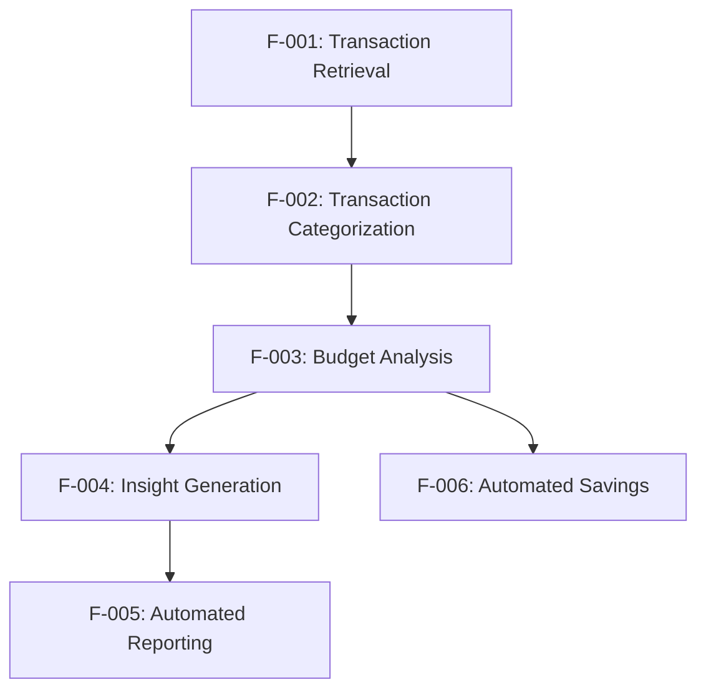
```mermaid
graph TD
    F001[F-001: Transaction Retrieval] --> F002[F-002: Transaction Categorization]
    F002 --> F003[F-003: Budget Analysis]
    F003 --> F004[F-004: Insight Generation]
    F003 --> F006[F-006: Automated Savings]
    F004 --> F005[F-005: Automated Reporting]
```

#### Integration Points

| Feature | Integration Points |
|---------|-------------------|
| F-001 | Capital One API, Google Sheets API |
| F-002 | Gemini API, Google Sheets API |
| F-003 | Google Sheets API |
| F-004 | Gemini API |
| F-005 | Gmail API |
| F-006 | Capital One API |

#### Shared Components

| Component | Used By Features |
|-----------|-----------------|
| Google Sheets Access | F-001, F-002, F-003 |
| Capital One API Client | F-001, F-006 |
| Gemini API Client | F-002, F-004 |
| Email Formatter | F-004, F-005 |

#### Common Services

| Service | Purpose | Used By Features |
|---------|---------|-----------------|
| Authentication Service | Manage API credentials | F-001, F-002, F-004, F-005, F-006 |
| Data Transformation | Convert between data formats | F-001, F-002, F-003 |
| Logging Service | Track system operations | All features |
| Error Handling | Manage exceptions | All features |

### 2.4 IMPLEMENTATION CONSIDERATIONS

#### Transaction Retrieval (F-001)

| Consideration | Details |
|---------------|---------|
| Technical Constraints | Capital One API rate limits and authentication requirements |
| Performance Requirements | Complete transaction retrieval in under 30 seconds |
| Security Implications | Secure storage of API credentials and handling of financial data |
| Maintenance Requirements | Regular validation of API integration as Capital One may update their API |

#### Transaction Categorization (F-002)

| Consideration | Details |
|---------------|---------|
| Technical Constraints | Gemini API token limits and response time variability |
| Performance Requirements | Complete categorization of a week's transactions in under 60 seconds |
| Scalability Considerations | Handle varying transaction volumes efficiently |
| Maintenance Requirements | Periodic review of categorization accuracy and refinement of AI prompts |

#### Budget Analysis (F-003)

| Consideration | Details |
|---------------|---------|
| Technical Constraints | Google Sheets API access and rate limits |
| Performance Requirements | Complete analysis calculations in under 30 seconds total |
| Scalability Considerations | Handle growing transaction history and category list |
| Maintenance Requirements | Ensure calculation logic remains accurate if budget structure changes |

#### Insight Generation (F-004)

| Consideration | Details |
|---------------|---------|
| Technical Constraints | Gemini API token limits and response formatting |
| Performance Requirements | Generate insights in under 30 seconds |
| Security Implications | Ensure no sensitive financial data is exposed in generated content |
| Maintenance Requirements | Regular refinement of AI prompts for better insight quality |

#### Automated Reporting (F-005)

| Consideration | Details |
|---------------|---------|
| Technical Constraints | Gmail API sending limits and email size restrictions |
| Performance Requirements | Send email in under 10 seconds after content generation |
| Security Implications | Secure handling of email credentials and financial data |
| Maintenance Requirements | Monitor email deliverability and format compatibility |

#### Automated Savings (F-006)

| Consideration | Details |
|---------------|---------|
| Technical Constraints | Capital One API transaction limits and authentication requirements |
| Performance Requirements | Complete transfer initiation in under 30 seconds |
| Security Implications | Secure handling of banking credentials and transaction processing |
| Maintenance Requirements | Regular validation of transfer functionality and error handling |

### 2.5 TRACEABILITY MATRIX

| Requirement ID | Feature ID | Business Need | Technical Implementation |
|----------------|------------|---------------|--------------------------|
| F-001-RQ-001 | F-001 | Automated transaction capture | Capital One API integration |
| F-001-RQ-002 | F-001 | Transaction data storage | Google Sheets API integration |
| F-002-RQ-001 | F-002 | Automated categorization | Gemini AI integration |
| F-002-RQ-002 | F-002 | Category tracking | Google Sheets update |
| F-003-RQ-001 | F-003 | Spending aggregation | Data processing logic |
| F-003-RQ-002 | F-003 | Budget comparison | Variance calculation logic |
| F-003-RQ-003 | F-003 | Overall budget status | Total variance calculation |
| F-004-RQ-001 | F-004 | Spending insights | Gemini AI integration |
| F-004-RQ-002 | F-004 | Clear budget status | Email formatting logic |
| F-005-RQ-001 | F-005 | Automated communication | Gmail API integration |
| F-005-RQ-002 | F-005 | Visual data representation | Chart generation logic |
| F-006-RQ-001 | F-006 | Savings calculation | Budget surplus logic |
| F-006-RQ-002 | F-006 | Automated savings | Capital One API transfer function |

## 3. TECHNOLOGY STACK

### 3.1 PROGRAMMING LANGUAGES

| Language | Version | Usage | Justification |
|----------|---------|-------|---------------|
| Python | 3.11+ | Core application logic | Python's extensive library support for API integrations, data processing, and AI interactions makes it ideal for this serverless application. Its readability and maintainability align with the project's backend-only nature. |
| SQL | Standard | Data queries | For structured queries against Google Sheets data, providing efficient data aggregation and analysis capabilities. |

### 3.2 FRAMEWORKS & LIBRARIES

| Framework/Library | Version | Purpose | Justification |
|-------------------|---------|---------|---------------|
| Google API Client | 2.100.0+ | Google service integration | Official library for Google Sheets and Gmail API integration with comprehensive documentation and support. |
| Capital One API SDK | Latest | Banking integration | Required for secure transaction retrieval and fund transfers with Capital One services. |
| Pandas | 2.1.0+ | Data manipulation | Efficient data processing for transaction categorization and budget analysis with powerful aggregation capabilities. |
| Matplotlib/Seaborn | 3.7.0+ | Chart generation | Creating visual representations of budget performance for email reports. |
| Requests | 2.31.0+ | API communication | Reliable HTTP library for API interactions where dedicated SDKs aren't available. |
| python-dotenv | 1.0.0+ | Configuration management | Secure management of API keys and credentials through environment variables. |
| Pytest | 7.4.0+ | Testing | Comprehensive testing framework to ensure reliability of financial operations. |

### 3.3 DATABASES & STORAGE

| Storage Solution | Version | Purpose | Justification |
|------------------|---------|---------|---------------|
| Google Sheets | N/A | Primary data storage | Aligns with requirements to use existing Google Sheets for budget data and transaction tracking. Provides familiar interface for data review. |
| Cloud Storage | N/A | Temporary file storage | For storing generated charts and reports before email delivery. |
| Secret Manager | N/A | Credential storage | Secure storage of API keys and authentication tokens for third-party services. |

### 3.4 THIRD-PARTY SERVICES

| Service | Purpose | Integration Method | Justification |
|---------|---------|-------------------|---------------|
| Capital One API | Transaction retrieval and fund transfers | REST API | Required for accessing financial data and performing automated savings transfers. |
| Google Sheets API | Budget data storage and retrieval | Google API Client | Specified in requirements for storing transaction data and budget information. |
| Gemini API | Transaction categorization and insight generation | REST API | Provides AI capabilities for transaction categorization and generating spending insights. |
| Gmail API | Email delivery | Google API Client | Required for sending automated spending reports to specified recipients. |
| Google Cloud Run | Application execution | Serverless jobs | Provides reliable, scheduled execution with minimal infrastructure management. |
| Google Cloud Scheduler | Job scheduling | Cloud service | Enables weekly execution of the budget management workflow. |

### 3.5 DEVELOPMENT & DEPLOYMENT

| Tool/Service | Version | Purpose | Justification |
|--------------|---------|---------|---------------|
| Google Cloud SDK | Latest | Cloud resource management | Required for deploying and managing Google Cloud Run jobs. |
| Docker | Latest | Containerization | Ensures consistent execution environment for the Cloud Run job. |
| GitHub | N/A | Version control | Industry standard for code management and collaboration. |
| GitHub Actions | N/A | CI/CD pipeline | Automates testing and deployment to Google Cloud Run. |
| Cloud Build | N/A | Container building | Integrates with Google Cloud for efficient container deployment. |
| Cloud Logging | N/A | Application monitoring | Provides visibility into job execution and error tracking. |

### 3.6 ARCHITECTURE DIAGRAM

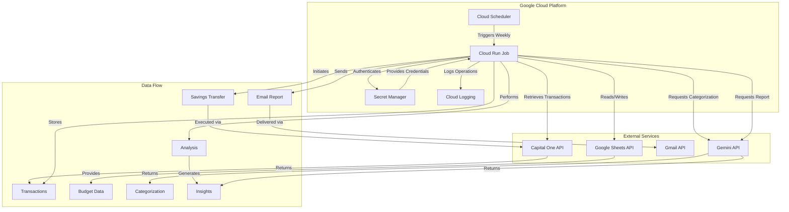
```mermaid
graph TD
    subgraph "Google Cloud Platform"
        CR[Cloud Run Job]
        CS[Cloud Scheduler]
        SM[Secret Manager]
        CL[Cloud Logging]
    end
    
    subgraph "External Services"
        CO[Capital One API]
        GS[Google Sheets API]
        GM[Gmail API]
        GE[Gemini API]
    end
    
    subgraph "Data Flow"
        T[Transactions]
        B[Budget Data]
        C[Categorization]
        A[Analysis]
        I[Insights]
        E[Email Report]
        S[Savings Transfer]
    end
    
    CS -->|Triggers Weekly| CR
    CR -->|Authenticates| SM
    SM -->|Provides Credentials| CR
    
    CR -->|Retrieves Transactions| CO
    CO -->|Returns| T
    CR -->|Stores| T
    
    CR -->|Reads/Writes| GS
    GS -->|Provides| B
    
    CR -->|Requests Categorization| GE
    GE -->|Returns| C
    
    CR -->|Performs| A
    A -->|Generates| I
    
    CR -->|Requests Report| GE
    GE -->|Returns| I
    
    CR -->|Sends| E
    E -->|Delivered via| GM
    
    CR -->|Initiates| S
    S -->|Executed via| CO
    
    CR -->|Logs Operations| CL
```

## 4. PROCESS FLOWCHART

### 4.1 SYSTEM WORKFLOWS

#### 4.1.1 Core Business Process

The Budget Management Application follows a weekly automated workflow that processes financial data without user intervention beyond initial setup.

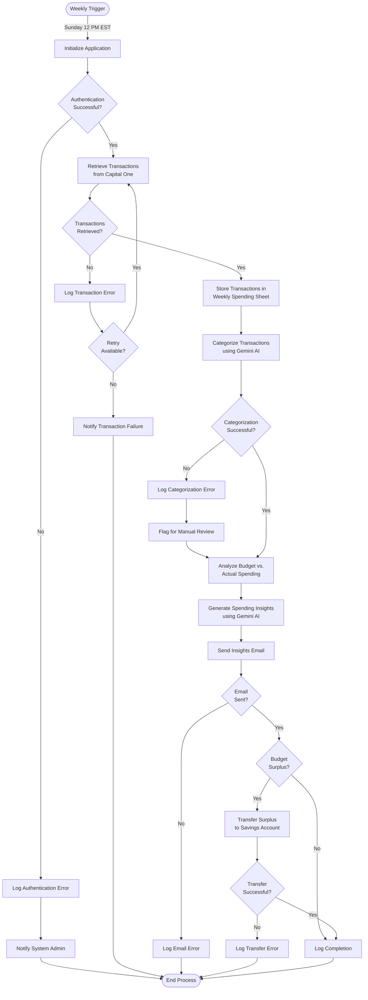
```mermaid
flowchart TD
    Start([Weekly Trigger]) -->|Sunday 12 PM EST| Init[Initialize Application]
    Init --> Auth{Authentication<br>Successful?}
    Auth -->|No| LogError[Log Authentication Error]
    LogError --> Notify[Notify System Admin]
    Notify --> End([End Process])
    
    Auth -->|Yes| RetrieveTx[Retrieve Transactions<br>from Capital One]
    RetrieveTx --> TxSuccess{Transactions<br>Retrieved?}
    TxSuccess -->|No| LogTxError[Log Transaction Error]
    LogTxError --> RetryTx{Retry<br>Available?}
    RetryTx -->|Yes| RetrieveTx
    RetryTx -->|No| NotifyTxFail[Notify Transaction Failure]
    NotifyTxFail --> End
    
    TxSuccess -->|Yes| StoreTx[Store Transactions in<br>Weekly Spending Sheet]
    StoreTx --> CategorizeTx[Categorize Transactions<br>using Gemini AI]
    CategorizeTx --> CatSuccess{Categorization<br>Successful?}
    CatSuccess -->|No| LogCatError[Log Categorization Error]
    LogCatError --> ManualCat[Flag for Manual Review]
    ManualCat --> AnalyzeBudget
    
    CatSuccess -->|Yes| AnalyzeBudget[Analyze Budget vs.<br>Actual Spending]
    AnalyzeBudget --> GenerateInsights[Generate Spending Insights<br>using Gemini AI]
    GenerateInsights --> SendEmail[Send Insights Email]
    SendEmail --> EmailSent{Email<br>Sent?}
    EmailSent -->|No| LogEmailError[Log Email Error]
    LogEmailError --> End
    
    EmailSent -->|Yes| CheckSurplus{Budget<br>Surplus?}
    CheckSurplus -->|No| LogComplete[Log Completion]
    CheckSurplus -->|Yes| TransferSavings[Transfer Surplus<br>to Savings Account]
    TransferSavings --> TransferSuccess{Transfer<br>Successful?}
    TransferSuccess -->|No| LogTransferError[Log Transfer Error]
    LogTransferError --> End
    
    TransferSuccess -->|Yes| LogComplete
    LogComplete --> End
```

#### 4.1.2 Integration Workflow

This diagram illustrates the data flow between different systems and APIs in the application.

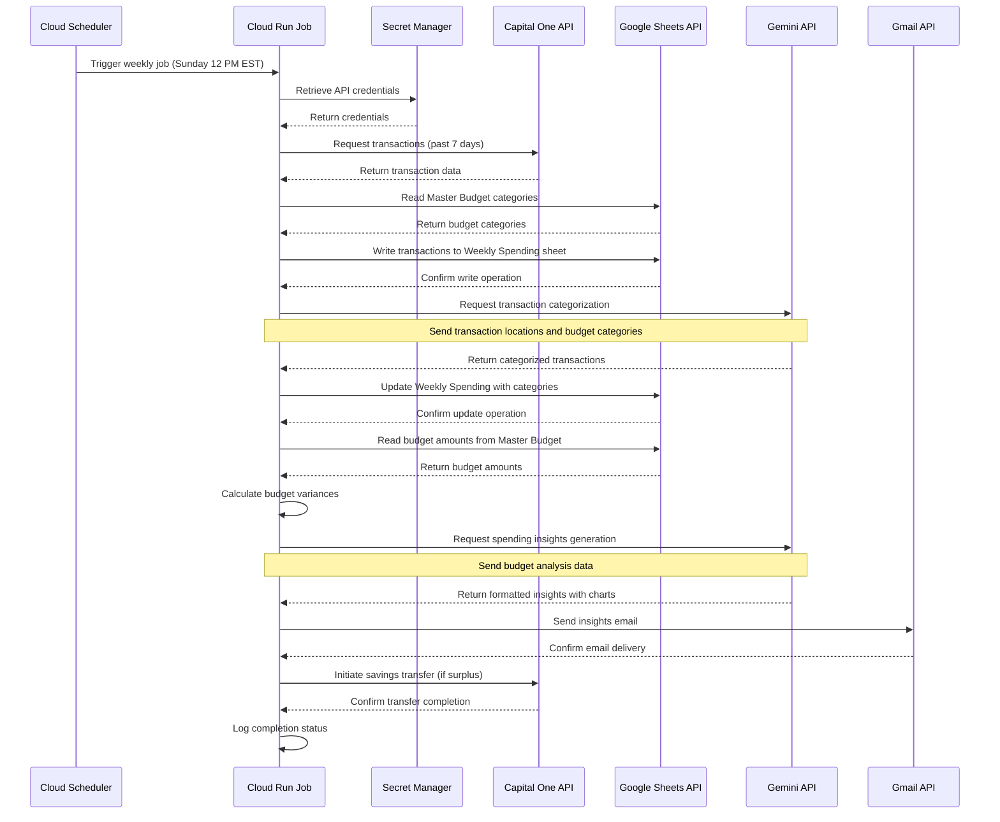
```mermaid
sequenceDiagram
    participant CS as Cloud Scheduler
    participant CR as Cloud Run Job
    participant SM as Secret Manager
    participant CO as Capital One API
    participant GS as Google Sheets API
    participant GE as Gemini API
    participant GM as Gmail API
    
    CS->>CR: Trigger weekly job (Sunday 12 PM EST)
    CR->>SM: Retrieve API credentials
    SM-->>CR: Return credentials
    
    CR->>CO: Request transactions (past 7 days)
    CO-->>CR: Return transaction data
    
    CR->>GS: Read Master Budget categories
    GS-->>CR: Return budget categories
    CR->>GS: Write transactions to Weekly Spending sheet
    GS-->>CR: Confirm write operation
    
    CR->>GE: Request transaction categorization
    Note over CR,GE: Send transaction locations and budget categories
    GE-->>CR: Return categorized transactions
    
    CR->>GS: Update Weekly Spending with categories
    GS-->>CR: Confirm update operation
    CR->>GS: Read budget amounts from Master Budget
    GS-->>CR: Return budget amounts
    
    CR->>CR: Calculate budget variances
    
    CR->>GE: Request spending insights generation
    Note over CR,GE: Send budget analysis data
    GE-->>CR: Return formatted insights with charts
    
    CR->>GM: Send insights email
    GM-->>CR: Confirm email delivery
    
    CR->>CO: Initiate savings transfer (if surplus)
    CO-->>CR: Confirm transfer completion
    
    CR->>CR: Log completion status
```

### 4.2 FLOWCHART REQUIREMENTS

#### 4.2.1 Transaction Retrieval and Storage Workflow

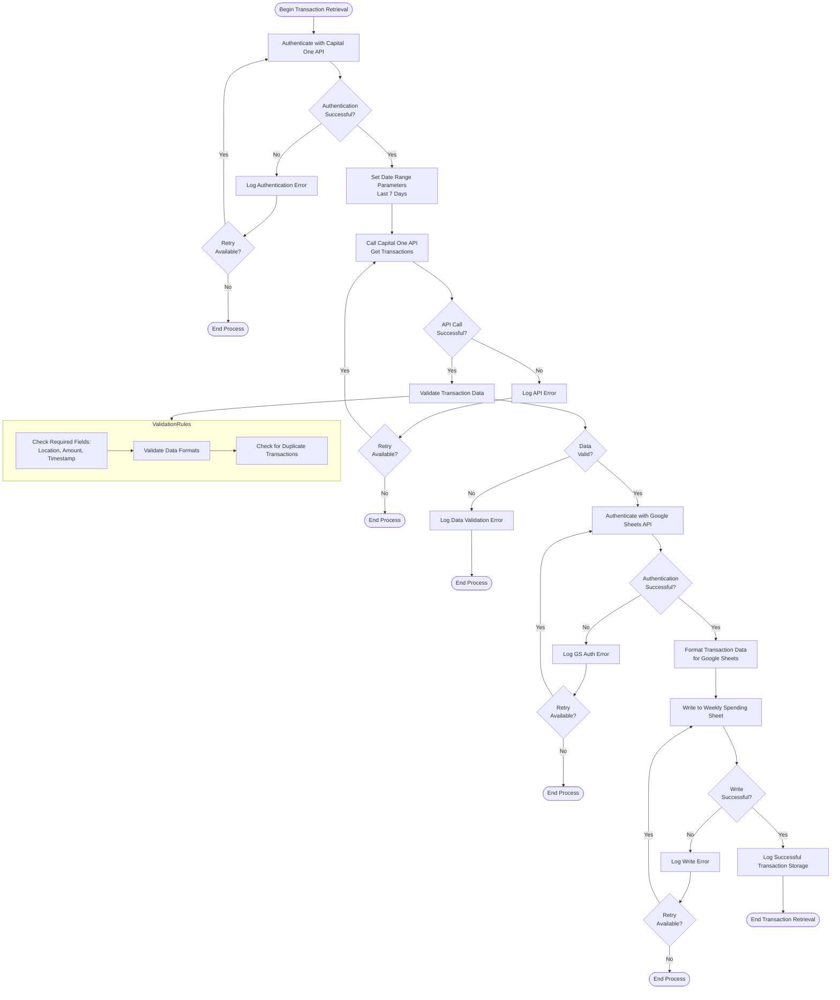
```mermaid
flowchart TD
    Start([Begin Transaction Retrieval]) --> Auth[Authenticate with Capital One API]
    Auth --> AuthCheck{Authentication<br>Successful?}
    AuthCheck -->|No| LogAuthError[Log Authentication Error]
    LogAuthError --> RetryAuth{Retry<br>Available?}
    RetryAuth -->|Yes| Auth
    RetryAuth -->|No| End1([End Process])
    
    AuthCheck -->|Yes| SetParams[Set Date Range Parameters<br>Last 7 Days]
    SetParams --> CallAPI[Call Capital One API<br>Get Transactions]
    CallAPI --> APICheck{API Call<br>Successful?}
    APICheck -->|No| LogAPIError[Log API Error]
    LogAPIError --> RetryAPI{Retry<br>Available?}
    RetryAPI -->|Yes| CallAPI
    RetryAPI -->|No| End2([End Process])
    
    APICheck -->|Yes| ValidateData[Validate Transaction Data]
    ValidateData --> DataCheck{Data<br>Valid?}
    DataCheck -->|No| LogDataError[Log Data Validation Error]
    LogDataError --> End3([End Process])
    
    DataCheck -->|Yes| GSAuth[Authenticate with Google Sheets API]
    GSAuth --> GSAuthCheck{Authentication<br>Successful?}
    GSAuthCheck -->|No| LogGSAuthError[Log GS Auth Error]
    LogGSAuthError --> RetryGSAuth{Retry<br>Available?}
    RetryGSAuth -->|Yes| GSAuth
    RetryGSAuth -->|No| End4([End Process])
    
    GSAuthCheck -->|Yes| PrepareData[Format Transaction Data<br>for Google Sheets]
    PrepareData --> WriteData[Write to Weekly Spending Sheet]
    WriteData --> WriteCheck{Write<br>Successful?}
    WriteCheck -->|No| LogWriteError[Log Write Error]
    LogWriteError --> RetryWrite{Retry<br>Available?}
    RetryWrite -->|Yes| WriteData
    RetryWrite -->|No| End5([End Process])
    
    WriteCheck -->|Yes| LogSuccess[Log Successful Transaction Storage]
    LogSuccess --> End6([End Transaction Retrieval])
    
    subgraph ValidationRules
        CheckFields[Check Required Fields:<br>Location, Amount, Timestamp]
        CheckFormat[Validate Data Formats]
        CheckDuplicates[Check for Duplicate Transactions]
    end
    
    ValidateData --> ValidationRules
    CheckFields --> CheckFormat
    CheckFormat --> CheckDuplicates
```

#### 4.2.2 Transaction Categorization Workflow

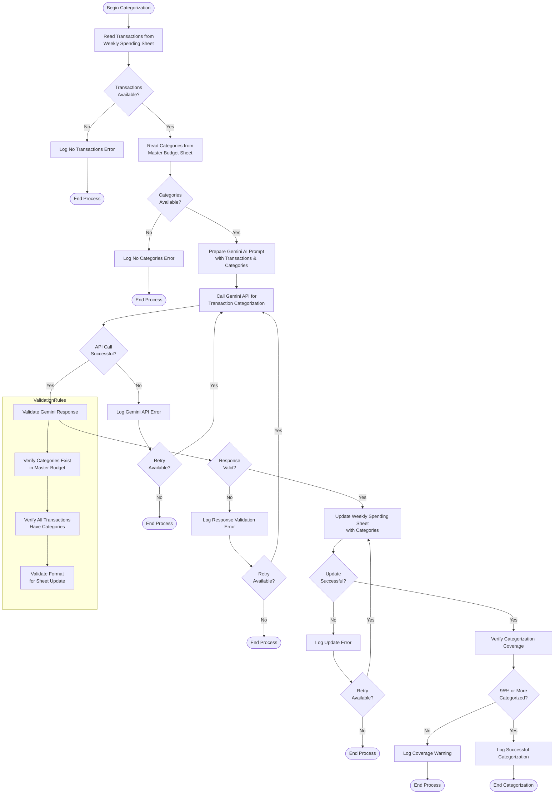
```mermaid
flowchart TD
    Start([Begin Categorization]) --> ReadTx[Read Transactions from<br>Weekly Spending Sheet]
    ReadTx --> TxCheck{Transactions<br>Available?}
    TxCheck -->|No| LogNoTx[Log No Transactions Error]
    LogNoTx --> End1([End Process])
    
    TxCheck -->|Yes| ReadCat[Read Categories from<br>Master Budget Sheet]
    ReadCat --> CatCheck{Categories<br>Available?}
    CatCheck -->|No| LogNoCat[Log No Categories Error]
    LogNoCat --> End2([End Process])
    
    CatCheck -->|Yes| PrepPrompt[Prepare Gemini AI Prompt<br>with Transactions & Categories]
    PrepPrompt --> CallGemini[Call Gemini API for<br>Transaction Categorization]
    CallGemini --> GeminiCheck{API Call<br>Successful?}
    GeminiCheck -->|No| LogGeminiError[Log Gemini API Error]
    LogGeminiError --> RetryGemini{Retry<br>Available?}
    RetryGemini -->|Yes| CallGemini
    RetryGemini -->|No| End3([End Process])
    
    GeminiCheck -->|Yes| ValidateResp[Validate Gemini Response]
    ValidateResp --> RespCheck{Response<br>Valid?}
    RespCheck -->|No| LogRespError[Log Response Validation Error]
    LogRespError --> RetryResp{Retry<br>Available?}
    RetryResp -->|Yes| CallGemini
    RetryResp -->|No| End4([End Process])
    
    RespCheck -->|Yes| UpdateSheet[Update Weekly Spending Sheet<br>with Categories]
    UpdateSheet --> UpdateCheck{Update<br>Successful?}
    UpdateCheck -->|No| LogUpdateError[Log Update Error]
    LogUpdateError --> RetryUpdate{Retry<br>Available?}
    RetryUpdate -->|Yes| UpdateSheet
    RetryUpdate -->|No| End5([End Process])
    
    UpdateCheck -->|Yes| VerifyCoverage[Verify Categorization Coverage]
    VerifyCoverage --> CoverageCheck{95% or More<br>Categorized?}
    CoverageCheck -->|No| LogCoverageWarning[Log Coverage Warning]
    LogCoverageWarning --> End6([End Process])
    
    CoverageCheck -->|Yes| LogSuccess[Log Successful Categorization]
    LogSuccess --> End7([End Categorization])
    
    subgraph ValidationRules
        ValidateResp --> CheckCatExists[Verify Categories Exist<br>in Master Budget]
        CheckCatExists --> CheckAllTx[Verify All Transactions<br>Have Categories]
        CheckAllTx --> CheckFormat[Validate Format<br>for Sheet Update]
    end
```

#### 4.2.3 Budget Analysis Workflow

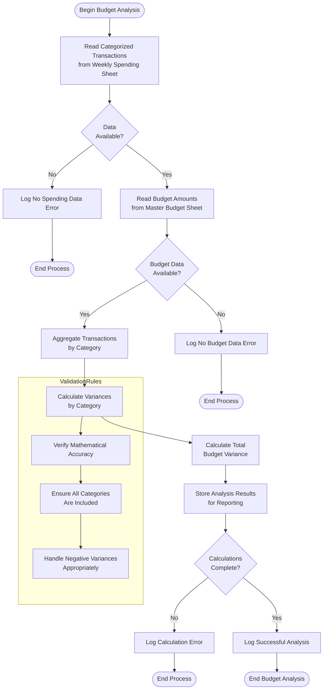
```mermaid
flowchart TD
    Start([Begin Budget Analysis]) --> ReadSpending[Read Categorized Transactions<br>from Weekly Spending Sheet]
    ReadSpending --> SpendingCheck{Data<br>Available?}
    SpendingCheck -->|No| LogNoSpending[Log No Spending Data Error]
    LogNoSpending --> End1([End Process])
    
    SpendingCheck -->|Yes| ReadBudget[Read Budget Amounts<br>from Master Budget Sheet]
    ReadBudget --> BudgetCheck{Budget Data<br>Available?}
    BudgetCheck -->|No| LogNoBudget[Log No Budget Data Error]
    LogNoBudget --> End2([End Process])
    
    BudgetCheck -->|Yes| AggregateTx[Aggregate Transactions<br>by Category]
    AggregateTx --> CalculateVar[Calculate Variances<br>by Category]
    CalculateVar --> CalculateTotal[Calculate Total<br>Budget Variance]
    
    CalculateTotal --> StoreResults[Store Analysis Results<br>for Reporting]
    StoreResults --> VarCheck{Calculations<br>Complete?}
    VarCheck -->|No| LogCalcError[Log Calculation Error]
    LogCalcError --> End3([End Process])
    
    VarCheck -->|Yes| LogSuccess[Log Successful Analysis]
    LogSuccess --> End4([End Budget Analysis])
    
    subgraph ValidationRules
        CalculateVar --> CheckMath[Verify Mathematical Accuracy]
        CheckMath --> CheckCategories[Ensure All Categories<br>Are Included]
        CheckCategories --> CheckNegatives[Handle Negative Variances<br>Appropriately]
    end
```

#### 4.2.4 Insight Generation and Reporting Workflow

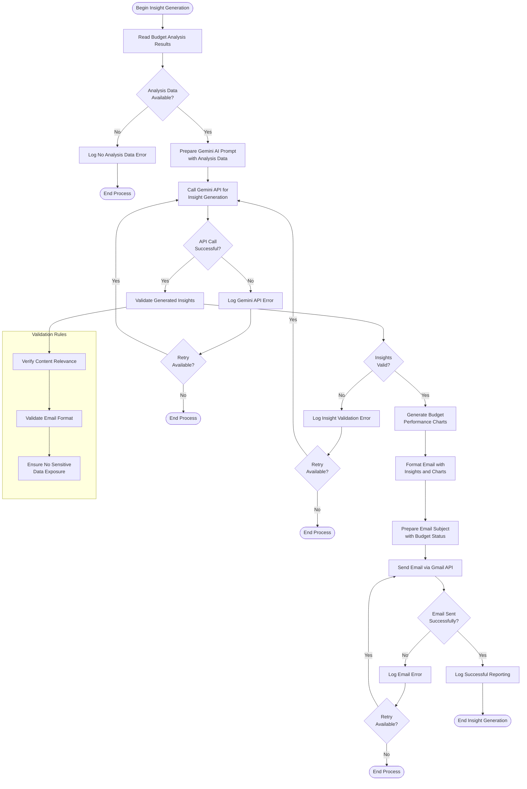
```mermaid
flowchart TD
    Start([Begin Insight Generation]) --> ReadAnalysis[Read Budget Analysis Results]
    ReadAnalysis --> AnalysisCheck{Analysis Data<br>Available?}
    AnalysisCheck -->|No| LogNoAnalysis[Log No Analysis Data Error]
    LogNoAnalysis --> End1([End Process])
    
    AnalysisCheck -->|Yes| PrepPrompt[Prepare Gemini AI Prompt<br>with Analysis Data]
    PrepPrompt --> CallGemini[Call Gemini API for<br>Insight Generation]
    CallGemini --> GeminiCheck{API Call<br>Successful?}
    GeminiCheck -->|No| LogGeminiError[Log Gemini API Error]
    LogGeminiError --> RetryGemini{Retry<br>Available?}
    RetryGemini -->|Yes| CallGemini
    RetryGemini -->|No| End2([End Process])
    
    GeminiCheck -->|Yes| ValidateInsights[Validate Generated Insights]
    ValidateInsights --> InsightCheck{Insights<br>Valid?}
    InsightCheck -->|No| LogInsightError[Log Insight Validation Error]
    LogInsightError --> RetryInsights{Retry<br>Available?}
    RetryInsights -->|Yes| CallGemini
    RetryInsights -->|No| End3([End Process])
    
    InsightCheck -->|Yes| GenerateCharts[Generate Budget<br>Performance Charts]
    GenerateCharts --> FormatEmail[Format Email with<br>Insights and Charts]
    FormatEmail --> PrepareSubject[Prepare Email Subject<br>with Budget Status]
    
    PrepareSubject --> SendEmail[Send Email via Gmail API]
    SendEmail --> EmailCheck{Email Sent<br>Successfully?}
    EmailCheck -->|No| LogEmailError[Log Email Error]
    LogEmailError --> RetryEmail{Retry<br>Available?}
    RetryEmail -->|Yes| SendEmail
    RetryEmail -->|No| End4([End Process])
    
    EmailCheck -->|Yes| LogSuccess[Log Successful Reporting]
    LogSuccess --> End5([End Insight Generation])
    
    subgraph ValidationRules[Validation Rules]
        CheckContent[Verify Content Relevance]
        CheckFormat[Validate Email Format]
        CheckSensitive[Ensure No Sensitive<br>Data Exposure]
    end
    
    ValidateInsights --> CheckContent
    CheckContent --> CheckFormat
    CheckFormat --> CheckSensitive
```

#### 4.2.5 Automated Savings Workflow

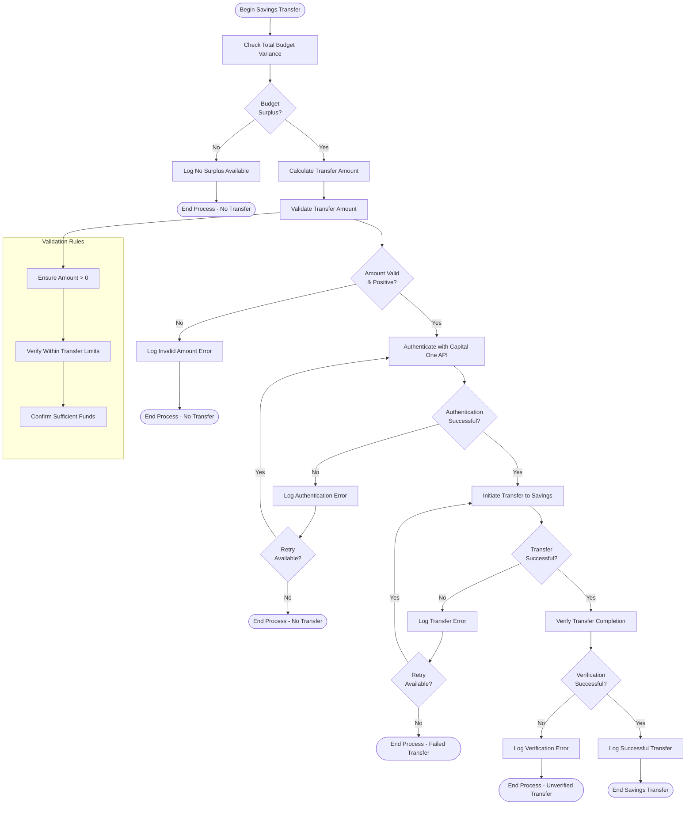
```mermaid
flowchart TD
    Start([Begin Savings Transfer]) --> CheckBudget[Check Total Budget Variance]
    CheckBudget --> SurplusCheck{Budget<br>Surplus?}
    SurplusCheck -->|No| LogNoSurplus[Log No Surplus Available]
    LogNoSurplus --> End1([End Process - No Transfer])
    
    SurplusCheck -->|Yes| CalculateAmount[Calculate Transfer Amount]
    CalculateAmount --> ValidateAmount[Validate Transfer Amount]
    ValidateAmount --> AmountCheck{Amount Valid<br>& Positive?}
    AmountCheck -->|No| LogInvalidAmount[Log Invalid Amount Error]
    LogInvalidAmount --> End2([End Process - No Transfer])
    
    AmountCheck -->|Yes| AuthCapOne[Authenticate with Capital One API]
    AuthCapOne --> AuthCheck{Authentication<br>Successful?}
    AuthCheck -->|No| LogAuthError[Log Authentication Error]
    LogAuthError --> RetryAuth{Retry<br>Available?}
    RetryAuth -->|Yes| AuthCapOne
    RetryAuth -->|No| End3([End Process - No Transfer])
    
    AuthCheck -->|Yes| InitiateTransfer[Initiate Transfer to Savings]
    InitiateTransfer --> TransferCheck{Transfer<br>Successful?}
    TransferCheck -->|No| LogTransferError[Log Transfer Error]
    LogTransferError --> RetryTransfer{Retry<br>Available?}
    RetryTransfer -->|Yes| InitiateTransfer
    RetryTransfer -->|No| End4([End Process - Failed Transfer])
    
    TransferCheck -->|Yes| VerifyTransfer[Verify Transfer Completion]
    VerifyTransfer --> VerifyCheck{Verification<br>Successful?}
    VerifyCheck -->|No| LogVerifyError[Log Verification Error]
    LogVerifyError --> End5([End Process - Unverified Transfer])
    
    VerifyCheck -->|Yes| LogSuccess[Log Successful Transfer]
    LogSuccess --> End6([End Savings Transfer])
    
    subgraph ValidationRules[Validation Rules]
        CheckPositive[Ensure Amount > 0]
        CheckLimit[Verify Within Transfer Limits]
        CheckFunds[Confirm Sufficient Funds]
    end
    
    ValidateAmount --> CheckPositive
    CheckPositive --> CheckLimit
    CheckLimit --> CheckFunds
```

### 4.3 TECHNICAL IMPLEMENTATION

#### 4.3.1 State Management Diagram

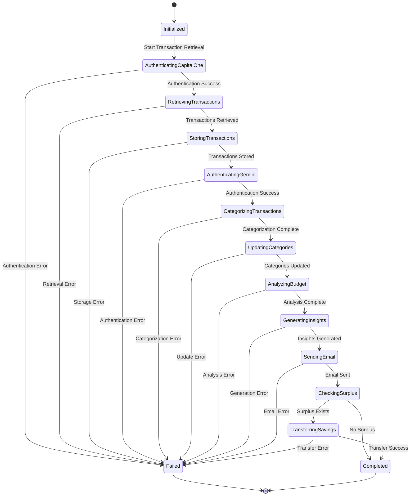
```mermaid
stateDiagram-v2
    [*] --> Initialized
    
    Initialized --> AuthenticatingCapitalOne: Start Transaction Retrieval
    AuthenticatingCapitalOne --> RetrievingTransactions: Authentication Success
    AuthenticatingCapitalOne --> Failed: Authentication Error
    
    RetrievingTransactions --> StoringTransactions: Transactions Retrieved
    RetrievingTransactions --> Failed: Retrieval Error
    
    StoringTransactions --> AuthenticatingGemini: Transactions Stored
    StoringTransactions --> Failed: Storage Error
    
    AuthenticatingGemini --> CategorizingTransactions: Authentication Success
    AuthenticatingGemini --> Failed: Authentication Error
    
    CategorizingTransactions --> UpdatingCategories: Categorization Complete
    CategorizingTransactions --> Failed: Categorization Error
    
    UpdatingCategories --> AnalyzingBudget: Categories Updated
    UpdatingCategories --> Failed: Update Error
    
    AnalyzingBudget --> GeneratingInsights: Analysis Complete
    AnalyzingBudget --> Failed: Analysis Error
    
    GeneratingInsights --> SendingEmail: Insights Generated
    GeneratingInsights --> Failed: Generation Error
    
    SendingEmail --> CheckingSurplus: Email Sent
    SendingEmail --> Failed: Email Error
    
    CheckingSurplus --> TransferringSavings: Surplus Exists
    CheckingSurplus --> Completed: No Surplus
    
    TransferringSavings --> Completed: Transfer Success
    TransferringSavings --> Failed: Transfer Error
    
    Failed --> [*]
    Completed --> [*]
```

#### 4.3.2 Error Handling Flow

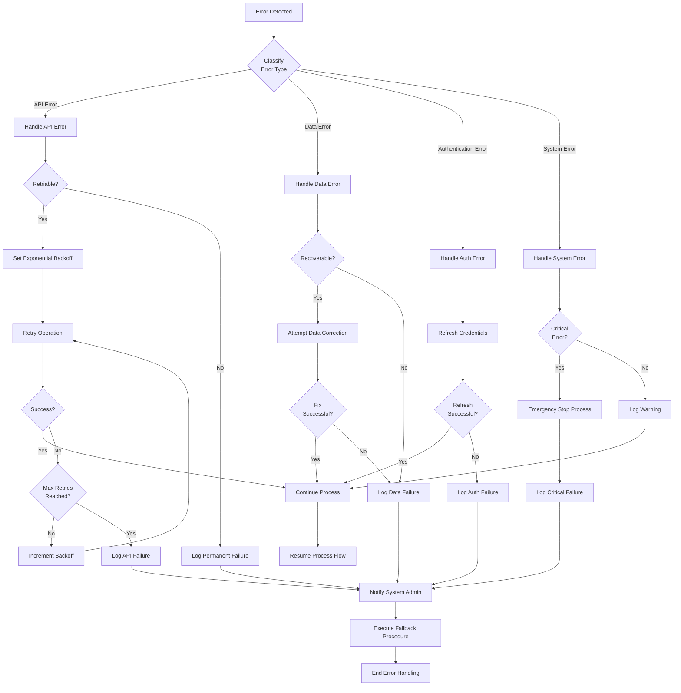
```mermaid
flowchart TD
    Error[Error Detected] --> Classify{Classify<br>Error Type}
    
    Classify -->|API Error| APIError[Handle API Error]
    APIError --> Retriable{Retriable?}
    Retriable -->|Yes| SetBackoff[Set Exponential Backoff]
    SetBackoff --> Retry[Retry Operation]
    Retry --> RetrySuccess{Success?}
    RetrySuccess -->|Yes| Continue[Continue Process]
    RetrySuccess -->|No| MaxRetries{Max Retries<br>Reached?}
    MaxRetries -->|No| IncrementBackoff[Increment Backoff]
    IncrementBackoff --> Retry
    MaxRetries -->|Yes| LogAPIFailure[Log API Failure]
    LogAPIFailure --> NotifyAdmin[Notify System Admin]
    
    Retriable -->|No| LogPermanentFailure[Log Permanent Failure]
    LogPermanentFailure --> NotifyAdmin
    
    Classify -->|Data Error| DataError[Handle Data Error]
    DataError --> Recoverable{Recoverable?}
    Recoverable -->|Yes| AttemptFix[Attempt Data Correction]
    AttemptFix --> FixSuccess{Fix<br>Successful?}
    FixSuccess -->|Yes| Continue
    FixSuccess -->|No| LogDataFailure[Log Data Failure]
    LogDataFailure --> NotifyAdmin
    
    Recoverable -->|No| LogDataFailure
    
    Classify -->|Authentication Error| AuthError[Handle Auth Error]
    AuthError --> RefreshToken[Refresh Credentials]
    RefreshToken --> TokenSuccess{Refresh<br>Successful?}
    TokenSuccess -->|Yes| Continue
    TokenSuccess -->|No| LogAuthFailure[Log Auth Failure]
    LogAuthFailure --> NotifyAdmin
    
    Classify -->|System Error| SysError[Handle System Error]
    SysError --> Critical{Critical<br>Error?}
    Critical -->|Yes| EmergencyStop[Emergency Stop Process]
    EmergencyStop --> LogCritical[Log Critical Failure]
    LogCritical --> NotifyAdmin
    
    Critical -->|No| LogWarning[Log Warning]
    LogWarning --> Continue
    
    Continue --> Resume[Resume Process Flow]
    NotifyAdmin --> Fallback[Execute Fallback Procedure]
    Fallback --> End[End Error Handling]
```

### 4.4 INTEGRATION SEQUENCE DIAGRAMS

#### 4.4.1 Capital One API Integration

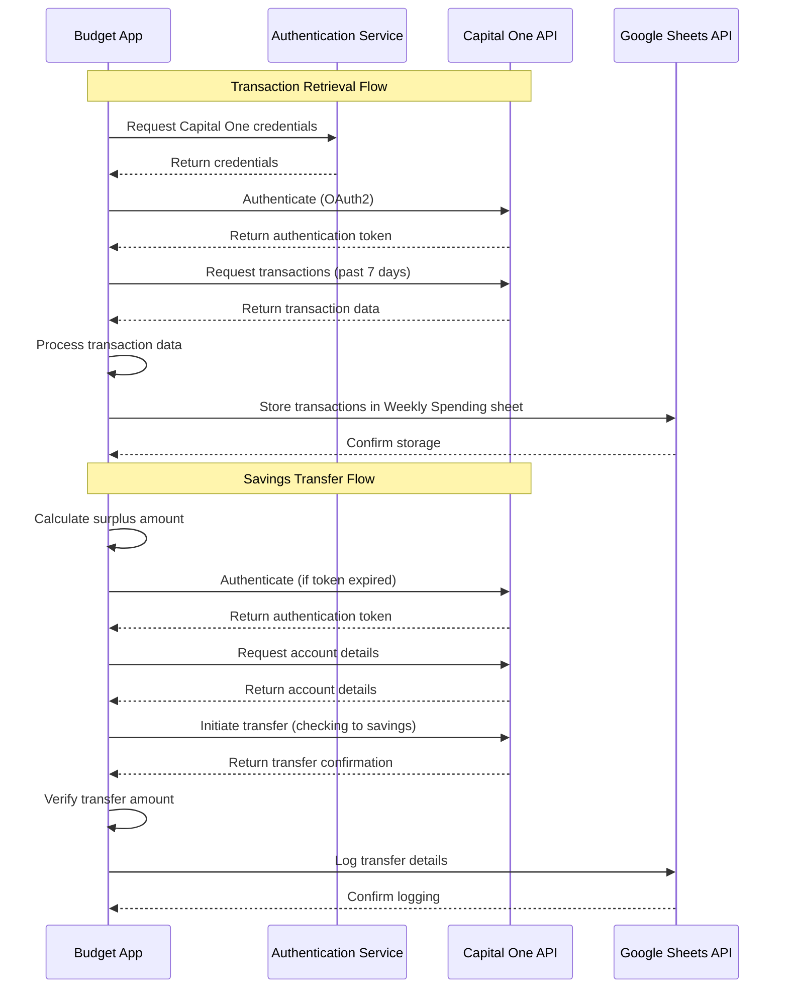
```mermaid
sequenceDiagram
    participant App as Budget App
    participant Auth as Authentication Service
    participant CO as Capital One API
    participant GS as Google Sheets API
    
    Note over App,CO: Transaction Retrieval Flow
    App->>Auth: Request Capital One credentials
    Auth-->>App: Return credentials
    App->>CO: Authenticate (OAuth2)
    CO-->>App: Return authentication token
    App->>CO: Request transactions (past 7 days)
    CO-->>App: Return transaction data
    App->>App: Process transaction data
    App->>GS: Store transactions in Weekly Spending sheet
    GS-->>App: Confirm storage
    
    Note over App,CO: Savings Transfer Flow
    App->>App: Calculate surplus amount
    App->>CO: Authenticate (if token expired)
    CO-->>App: Return authentication token
    App->>CO: Request account details
    CO-->>App: Return account details
    App->>CO: Initiate transfer (checking to savings)
    CO-->>App: Return transfer confirmation
    App->>App: Verify transfer amount
    App->>GS: Log transfer details
    GS-->>App: Confirm logging
```

#### 4.4.2 Gemini AI Integration

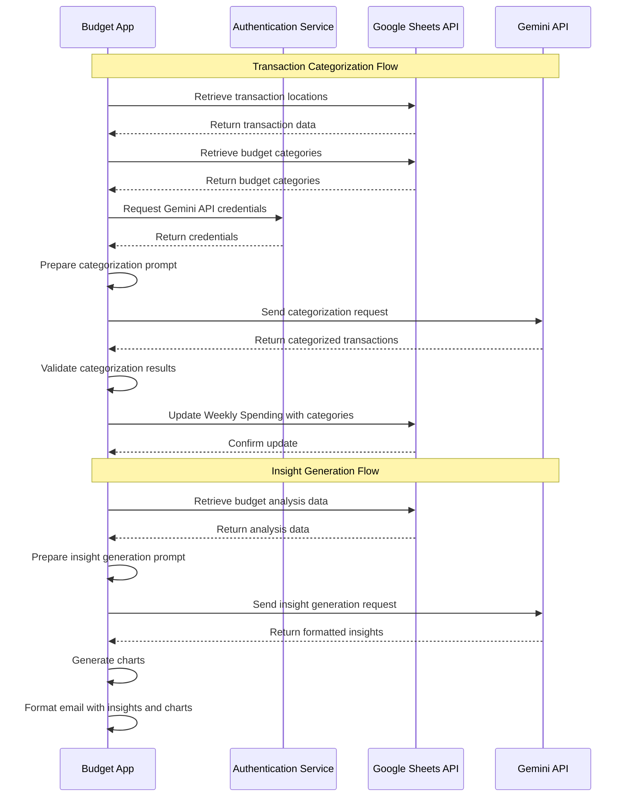
```mermaid
sequenceDiagram
    participant App as Budget App
    participant Auth as Authentication Service
    participant GS as Google Sheets API
    participant GE as Gemini API
    
    Note over App,GE: Transaction Categorization Flow
    App->>GS: Retrieve transaction locations
    GS-->>App: Return transaction data
    App->>GS: Retrieve budget categories
    GS-->>App: Return budget categories
    App->>Auth: Request Gemini API credentials
    Auth-->>App: Return credentials
    App->>App: Prepare categorization prompt
    App->>GE: Send categorization request
    GE-->>App: Return categorized transactions
    App->>App: Validate categorization results
    App->>GS: Update Weekly Spending with categories
    GS-->>App: Confirm update
    
    Note over App,GE: Insight Generation Flow
    App->>GS: Retrieve budget analysis data
    GS-->>App: Return analysis data
    App->>App: Prepare insight generation prompt
    App->>GE: Send insight generation request
    GE-->>App: Return formatted insights
    App->>App: Generate charts
    App->>App: Format email with insights and charts
```

#### 4.4.3 Gmail API Integration

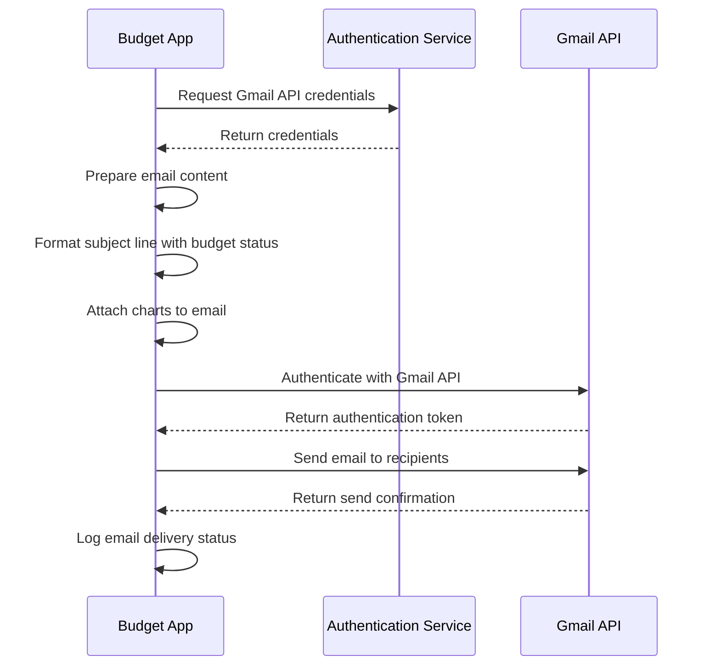
```mermaid
sequenceDiagram
    participant App as Budget App
    participant Auth as Authentication Service
    participant GM as Gmail API
    
    App->>Auth: Request Gmail API credentials
    Auth-->>App: Return credentials
    App->>App: Prepare email content
    App->>App: Format subject line with budget status
    App->>App: Attach charts to email
    App->>GM: Authenticate with Gmail API
    GM-->>App: Return authentication token
    App->>GM: Send email to recipients
    GM-->>App: Return send confirmation
    App->>App: Log email delivery status
```

### 4.5 STATE TRANSITION DIAGRAM FOR BUDGET ANALYSIS


```mermaid
stateDiagram-v2
    [*] --> DataCollection
    
    state DataCollection {
        [*] --> TransactionRetrieval
        TransactionRetrieval --> TransactionStorage
        TransactionStorage --> [*]
    }
    
    DataCollection --> Categorization
    
    state Categorization {
        [*] --> AIProcessing
        AIProcessing --> CategoryAssignment
        CategoryAssignment --> ValidationCheck
        ValidationCheck --> CategoryUpdate
        CategoryUpdate --> [*]
    }
    
    Categorization --> Analysis
    
    state Analysis {
        [*] --> DataAggregation
        DataAggregation --> VarianceCalculation
        VarianceCalculation --> TotalBudgetStatus
        TotalBudgetStatus --> [*]
    }
    
    Analysis --> Reporting
    
    state Reporting {
        [*] --> InsightGeneration
        InsightGeneration --> ChartCreation
        ChartCreation --> EmailFormatting
        EmailFormatting --> EmailDelivery
        EmailDelivery --> [*]
    }
    
    Reporting --> SavingsAction
    
    state SavingsAction {
        [*] --> SurplusCheck
        SurplusCheck --> TransferInitiation: Surplus exists
        SurplusCheck --> NoAction: No surplus
        TransferInitiation --> TransferConfirmation
        TransferConfirmation --> [*]
        NoAction --> [*]
    }
    
    SavingsAction --> [*]
```

## 5. SYSTEM ARCHITECTURE

### 5.1 HIGH-LEVEL ARCHITECTURE

#### 5.1.1 System Overview

The Budget Management Application follows a serverless, event-driven architecture designed to operate autonomously on a scheduled basis. This architecture was selected to minimize infrastructure management while providing reliable execution of the budget management workflow.

**Architectural Style and Rationale:**
- **Serverless Architecture**: The application is implemented as a Google Cloud Run job, eliminating the need for server provisioning and management while providing on-demand execution.
- **Event-Driven Design**: The system operates on a scheduled trigger (weekly execution) and processes data in a sequential workflow with clear boundaries between processing stages.
- **Integration-Centric Approach**: Rather than building custom interfaces, the system leverages existing APIs (Capital One, Google Sheets, Gemini, Gmail) to perform its core functions.

**Key Architectural Principles:**
- **Separation of Concerns**: Each component handles a specific aspect of the budget management process (data acquisition, categorization, analysis, reporting, action).
- **Statelessness**: The application maintains no persistent state between executions, relying on external systems (Google Sheets) for data persistence.
- **Idempotency**: Operations are designed to be safely repeatable without causing unintended side effects.
- **Security-First Design**: Sensitive operations (banking transactions, email access) use secure authentication methods and credential management.

**System Boundaries and Interfaces:**
- The system operates as a backend-only application with no user interface.
- External boundaries include integration points with Capital One banking services, Google Workspace (Sheets, Gmail), and Gemini AI.
- Internal boundaries separate the core functional modules: data acquisition, categorization, analysis, reporting, and automated savings.

#### 5.1.2 Core Components Table

| Component Name | Primary Responsibility | Key Dependencies | Critical Considerations |
|----------------|------------------------|------------------|-------------------------|
| Transaction Retriever | Extract transaction data from Capital One and store in Google Sheets | Capital One API, Google Sheets API | Secure credential management, error handling for API failures |
| Transaction Categorizer | Categorize transactions using Gemini AI based on transaction locations | Gemini API, Google Sheets API | AI prompt engineering, category matching accuracy |
| Budget Analyzer | Compare actual spending to budgeted amounts and calculate variances | Google Sheets API | Data aggregation performance, calculation accuracy |
| Insight Generator | Create spending analysis and recommendations using Gemini AI | Gemini API, Budget Analyzer | Natural language generation quality, insight relevance |
| Report Distributor | Format and send email reports via Gmail | Gmail API, Insight Generator | Email formatting, delivery reliability |
| Savings Automator | Transfer surplus funds to savings account | Capital One API, Budget Analyzer | Transaction security, error handling for financial operations |
| Scheduler | Trigger weekly execution of the application | Google Cloud Scheduler | Reliable scheduling, failure notification |

#### 5.1.3 Data Flow Description

The Budget Management Application processes data through a sequential workflow with the following primary data flows:

1. **Transaction Data Acquisition**:
   - The Scheduler triggers the application execution every Sunday at 12 PM EST.
   - The Transaction Retriever authenticates with Capital One API and requests transactions from the past week.
   - Transaction data (location, amount, timestamp) is extracted and transformed into the required format.
   - Formatted transaction data is written to the Weekly Spending Google Sheet.

2. **Transaction Categorization**:
   - The Transaction Categorizer reads transaction locations from the Weekly Spending sheet.
   - Budget categories are retrieved from the Master Budget sheet.
   - Transaction locations and budget categories are sent to Gemini AI for matching.
   - Categorization results are validated and written back to the Weekly Spending sheet.

3. **Budget Analysis**:
   - The Budget Analyzer aggregates transactions by category from the Weekly Spending sheet.
   - Budget amounts are retrieved from the Master Budget sheet.
   - Variances are calculated by comparing actual spending to budgeted amounts.
   - Total budget surplus or deficit is determined.

4. **Insight Generation and Reporting**:
   - The Insight Generator sends budget analysis data to Gemini AI.
   - Gemini AI generates natural language insights and recommendations.
   - The Report Distributor formats the insights into an email with charts.
   - The email is sent via Gmail API to specified recipients.

5. **Automated Savings**:
   - If a budget surplus exists, the Savings Automator calculates the transfer amount.
   - The transfer is initiated via Capital One API from checking to savings account.
   - Transfer confirmation is logged for record-keeping.

#### 5.1.4 External Integration Points

| System Name | Integration Type | Data Exchange Pattern | Protocol/Format | SLA Requirements |
|-------------|------------------|------------------------|-----------------|------------------|
| Capital One API | REST API | Request-Response | HTTPS/JSON | 99.9% availability, <2s response time |
| Google Sheets API | REST API | Request-Response | HTTPS/JSON | 99.9% availability, <3s response time |
| Gemini API | REST API | Request-Response | HTTPS/JSON | 99% availability, <5s response time |
| Gmail API | REST API | Request-Response | HTTPS/JSON | 99.9% availability, <3s response time |
| Google Cloud Scheduler | Cloud Service | Event Trigger | N/A | 99.9% scheduling reliability |

### 5.2 COMPONENT DETAILS

#### 5.2.1 Transaction Retriever

**Purpose and Responsibilities:**
- Authenticate with Capital One API
- Retrieve transaction data from the specified checking account for the past week
- Transform transaction data into the required format
- Store transaction data in the Weekly Spending Google Sheet

**Technologies and Frameworks:**
- Python requests library for API communication
- Google API Client library for Google Sheets integration
- OAuth2 for Capital One authentication
- JSON processing for data transformation

**Key Interfaces:**
- Capital One API for transaction retrieval
- Google Sheets API for data storage
- Internal interfaces to pass transaction data to the Transaction Categorizer

**Data Persistence Requirements:**
- No local persistence; all data is stored in Google Sheets
- Temporary in-memory storage during processing

**Scaling Considerations:**
- Designed to handle typical personal transaction volume (10-100 transactions per week)
- API rate limiting considerations for Capital One and Google Sheets APIs

**Component Interaction Diagram:**

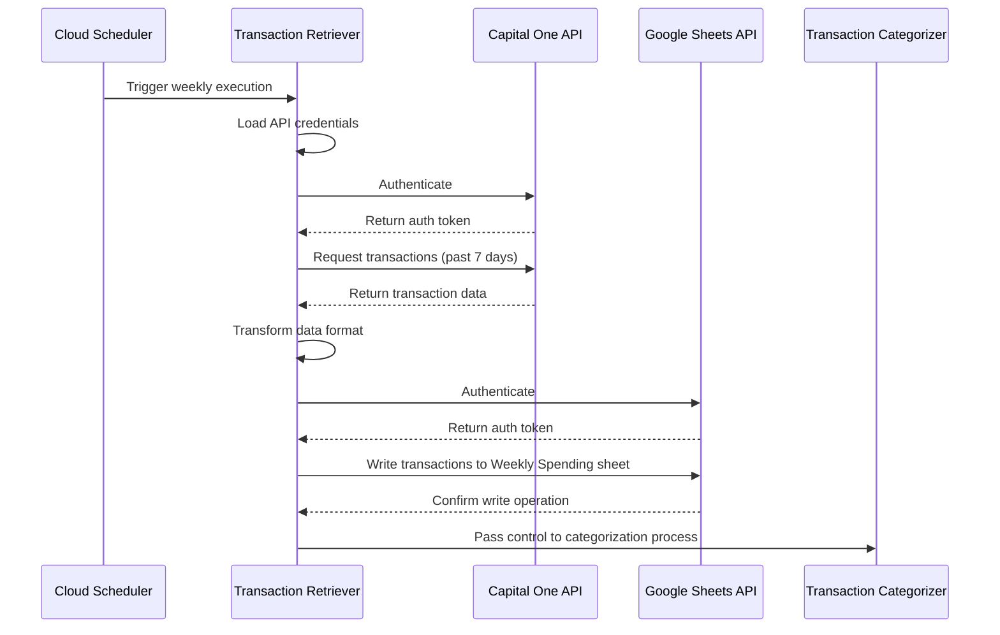
```mermaid
sequenceDiagram
    participant Scheduler as Cloud Scheduler
    participant Retriever as Transaction Retriever
    participant CapOne as Capital One API
    participant Sheets as Google Sheets API
    participant Categorizer as Transaction Categorizer
    
    Scheduler->>Retriever: Trigger weekly execution
    Retriever->>Retriever: Load API credentials
    Retriever->>CapOne: Authenticate
    CapOne-->>Retriever: Return auth token
    Retriever->>CapOne: Request transactions (past 7 days)
    CapOne-->>Retriever: Return transaction data
    Retriever->>Retriever: Transform data format
    Retriever->>Sheets: Authenticate
    Sheets-->>Retriever: Return auth token
    Retriever->>Sheets: Write transactions to Weekly Spending sheet
    Sheets-->>Retriever: Confirm write operation
    Retriever->>Categorizer: Pass control to categorization process
```

#### 5.2.2 Transaction Categorizer

**Purpose and Responsibilities:**
- Retrieve transaction locations from Weekly Spending sheet
- Retrieve budget categories from Master Budget sheet
- Prepare and send categorization request to Gemini AI
- Validate categorization results
- Update Weekly Spending sheet with assigned categories

**Technologies and Frameworks:**
- Google API Client library for Google Sheets integration
- Gemini API client for AI integration
- Natural language processing for category matching

**Key Interfaces:**
- Google Sheets API for data retrieval and storage
- Gemini API for AI-powered categorization
- Internal interfaces to receive data from Transaction Retriever and pass to Budget Analyzer

**Data Persistence Requirements:**
- No local persistence; all data is stored in Google Sheets
- Temporary in-memory storage during processing

**Scaling Considerations:**
- Designed for weekly batch processing of personal transaction volume
- Token limits and rate limiting for Gemini API

**Sequence Diagram:**

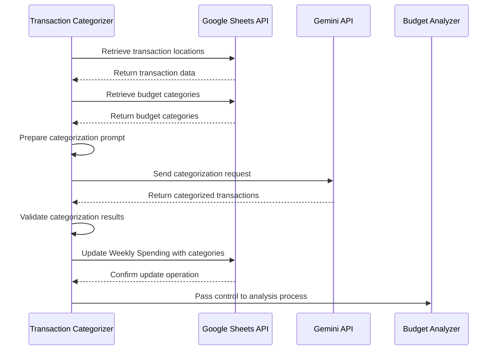
```mermaid
sequenceDiagram
    participant Categorizer as Transaction Categorizer
    participant Sheets as Google Sheets API
    participant Gemini as Gemini API
    participant Analyzer as Budget Analyzer
    
    Categorizer->>Sheets: Retrieve transaction locations
    Sheets-->>Categorizer: Return transaction data
    Categorizer->>Sheets: Retrieve budget categories
    Sheets-->>Categorizer: Return budget categories
    Categorizer->>Categorizer: Prepare categorization prompt
    Categorizer->>Gemini: Send categorization request
    Gemini-->>Categorizer: Return categorized transactions
    Categorizer->>Categorizer: Validate categorization results
    Categorizer->>Sheets: Update Weekly Spending with categories
    Sheets-->>Categorizer: Confirm update operation
    Categorizer->>Analyzer: Pass control to analysis process
```

#### 5.2.3 Budget Analyzer

**Purpose and Responsibilities:**
- Aggregate transactions by category from Weekly Spending sheet
- Retrieve budget amounts from Master Budget sheet
- Calculate variances by comparing actual spending to budgeted amounts
- Determine total budget surplus or deficit

**Technologies and Frameworks:**
- Google API Client library for Google Sheets integration
- Pandas for data manipulation and analysis
- NumPy for numerical calculations

**Key Interfaces:**
- Google Sheets API for data retrieval
- Internal interfaces to receive data from Transaction Categorizer and pass to Insight Generator and Savings Automator

**Data Persistence Requirements:**
- No local persistence; analysis results are passed to subsequent components
- Temporary in-memory storage during processing

**Scaling Considerations:**
- Designed for efficient processing of personal budget data
- Optimization for Google Sheets API calls to minimize latency

**State Transition Diagram:**

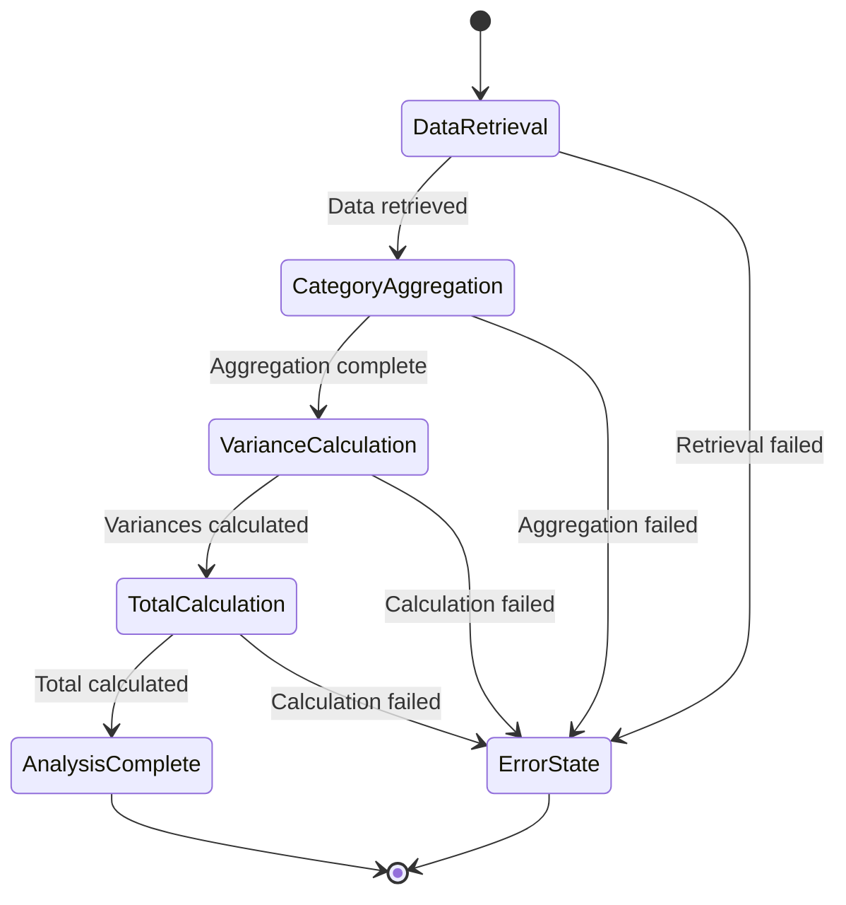
```mermaid
stateDiagram-v2
    [*] --> DataRetrieval
    
    DataRetrieval --> CategoryAggregation: Data retrieved
    DataRetrieval --> ErrorState: Retrieval failed
    
    CategoryAggregation --> VarianceCalculation: Aggregation complete
    CategoryAggregation --> ErrorState: Aggregation failed
    
    VarianceCalculation --> TotalCalculation: Variances calculated
    VarianceCalculation --> ErrorState: Calculation failed
    
    TotalCalculation --> AnalysisComplete: Total calculated
    TotalCalculation --> ErrorState: Calculation failed
    
    AnalysisComplete --> [*]
    ErrorState --> [*]
```

#### 5.2.4 Insight Generator

**Purpose and Responsibilities:**
- Prepare and send insight generation request to Gemini AI
- Process and format AI-generated insights
- Generate charts to visualize budget performance
- Format email content with insights and charts

**Technologies and Frameworks:**
- Gemini API client for AI integration
- Matplotlib/Seaborn for chart generation
- HTML/CSS for email formatting

**Key Interfaces:**
- Gemini API for insight generation
- Internal interfaces to receive data from Budget Analyzer and pass to Report Distributor

**Data Persistence Requirements:**
- Temporary storage of generated charts as image files
- No long-term persistence requirements

**Scaling Considerations:**
- Designed for weekly batch processing
- Token limits and rate limiting for Gemini API

**Sequence Diagram:**

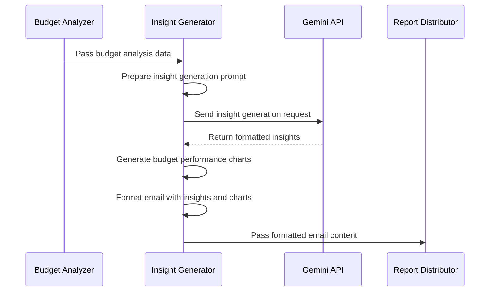
```mermaid
sequenceDiagram
    participant Analyzer as Budget Analyzer
    participant Generator as Insight Generator
    participant Gemini as Gemini API
    participant Distributor as Report Distributor
    
    Analyzer->>Generator: Pass budget analysis data
    Generator->>Generator: Prepare insight generation prompt
    Generator->>Gemini: Send insight generation request
    Gemini-->>Generator: Return formatted insights
    Generator->>Generator: Generate budget performance charts
    Generator->>Generator: Format email with insights and charts
    Generator->>Distributor: Pass formatted email content
```

#### 5.2.5 Report Distributor

**Purpose and Responsibilities:**
- Authenticate with Gmail API
- Format email subject line with budget status
- Send email with insights and charts to specified recipients
- Log email delivery status

**Technologies and Frameworks:**
- Google API Client library for Gmail integration
- OAuth2 for Gmail authentication
- MIME for email formatting

**Key Interfaces:**
- Gmail API for email sending
- Internal interfaces to receive content from Insight Generator

**Data Persistence Requirements:**
- No local persistence; emails are sent via Gmail
- Delivery status is logged but not persistently stored

**Scaling Considerations:**
- Designed for sending a single weekly report
- Gmail API sending limits and rate limiting

**Sequence Diagram:**

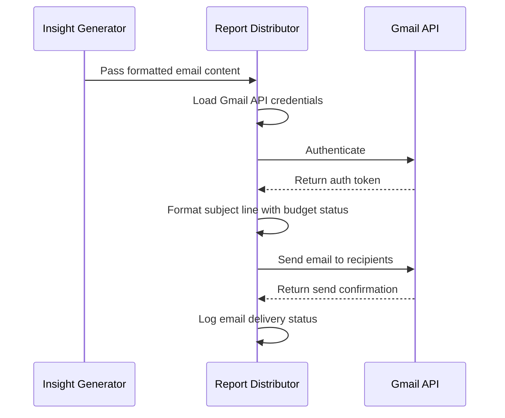
```mermaid
sequenceDiagram
    participant Generator as Insight Generator
    participant Distributor as Report Distributor
    participant Gmail as Gmail API
    
    Generator->>Distributor: Pass formatted email content
    Distributor->>Distributor: Load Gmail API credentials
    Distributor->>Gmail: Authenticate
    Gmail-->>Distributor: Return auth token
    Distributor->>Distributor: Format subject line with budget status
    Distributor->>Gmail: Send email to recipients
    Gmail-->>Distributor: Return send confirmation
    Distributor->>Distributor: Log email delivery status
```

#### 5.2.6 Savings Automator

**Purpose and Responsibilities:**
- Calculate transfer amount based on budget surplus
- Authenticate with Capital One API
- Initiate transfer from checking to savings account
- Verify transfer completion

**Technologies and Frameworks:**
- Python requests library for API communication
- OAuth2 for Capital One authentication
- JSON processing for data transformation

**Key Interfaces:**
- Capital One API for fund transfer
- Internal interfaces to receive budget surplus data from Budget Analyzer

**Data Persistence Requirements:**
- No local persistence; transfer confirmation is logged but not persistently stored

**Scaling Considerations:**
- Designed for processing a single weekly transfer
- Capital One API transaction limits and rate limiting

**State Transition Diagram:**

```mermaid
stateDiagram-v2
    [*] --> SurplusCheck
    
    SurplusCheck --> Authentication: Surplus exists
    SurplusCheck --> Complete: No surplus
    
    Authentication --> TransferInitiation: Authentication successful
    Authentication --> ErrorState: Authentication failed
    
    TransferInitiation --> TransferVerification: Transfer initiated
    TransferInitiation --> ErrorState: Initiation failed
    
    TransferVerification --> Complete: Transfer verified
    TransferVerification --> ErrorState: Verification failed
    
    Complete --> [*]
    ErrorState --> [*]
```

### 5.3 TECHNICAL DECISIONS

#### 5.3.1 Architecture Style Decisions

| Decision | Options Considered | Selected Approach | Rationale |
|----------|-------------------|-------------------|-----------|
| Application Architecture | Microservices, Monolithic, Serverless | Serverless (Google Cloud Run jobs) | Eliminates infrastructure management, provides reliable scheduled execution, and is cost-effective for weekly batch processing |
| Integration Approach | Custom interfaces, API integration | API integration | Leverages existing APIs (Capital One, Google Sheets, Gemini, Gmail) to minimize development effort and maintenance |
| Processing Model | Real-time, Batch | Weekly batch processing | Aligns with the requirement for weekly budget analysis and reporting |
| State Management | Stateful, Stateless | Stateless with external persistence | Simplifies the application by storing all persistent data in Google Sheets, making the application itself stateless |

**Architecture Decision Record (ADR):**

```mermaid
graph TD
    A[Problem: Budget Management Architecture] --> B{Key Decision Points}
    B --> C[Execution Environment]
    B --> D[Data Storage]
    B --> E[Integration Method]
    B --> F[Processing Model]
    
    C --> C1[Options: Self-hosted, Cloud VMs, Serverless]
    C1 --> C2[Selected: Serverless - Google Cloud Run jobs]
    C2 --> C3[Rationale: Low maintenance, cost-effective for periodic execution]
    
    D --> D1[Options: Database, File System, External Service]
    D1 --> D2[Selected: Google Sheets as primary data store]
    D2 --> D3[Rationale: Aligns with requirements, familiar to user, no additional infrastructure]
    
    E --> E1[Options: Custom interfaces, Direct API integration]
    E1 --> E2[Selected: Direct API integration with external services]
    E2 --> E3[Rationale: Reduces development effort, leverages existing capabilities]
    
    F --> F1[Options: Real-time processing, Batch processing]
    F1 --> F2[Selected: Weekly batch processing]
    F2 --> F3[Rationale: Matches user requirements for weekly budget analysis]
```

#### 5.3.2 Communication Pattern Choices

| Pattern | Use Case | Justification |
|---------|----------|---------------|
| Synchronous Request-Response | API interactions with Capital One, Google Sheets, Gemini, Gmail | Simplifies implementation, provides immediate confirmation of operation success or failure |
| Sequential Processing | Overall application workflow | Ensures each step completes successfully before proceeding to the next, maintaining data integrity |
| Retry with Exponential Backoff | Handling transient API failures | Improves reliability by automatically retrying failed operations with increasing delays |

#### 5.3.3 Data Storage Solution Rationale

| Data Type | Storage Solution | Justification |
|-----------|------------------|---------------|
| Transaction Data | Google Sheets (Weekly Spending) | Aligns with requirements, provides visibility to the user, enables easy manual corrections if needed |
| Budget Data | Google Sheets (Master Budget) | Aligns with requirements, allows user to update budget categories and amounts independently of the application |
| Credentials | Google Secret Manager | Securely stores API keys and tokens, integrates well with Google Cloud Run |
| Generated Reports | No persistent storage | Reports are delivered via email, no need for persistent storage |

#### 5.3.4 Security Mechanism Selection

| Security Concern | Selected Mechanism | Justification |
|------------------|-------------------|---------------|
| API Authentication | OAuth 2.0 | Industry standard for secure API authentication, supported by all integrated services |
| Credential Storage | Secret Manager | Secure, managed service for storing sensitive credentials, integrates with Google Cloud Run |
| Data Transmission | HTTPS/TLS | Ensures encrypted communication with all external APIs |
| Access Control | Principle of least privilege | Application uses minimal permissions required for each API integration |

**Decision Tree for Authentication:**

```mermaid
graph TD
    A[Authentication Mechanism Selection] --> B{API Support}
    B -->|All APIs support OAuth 2.0| C[Use OAuth 2.0 for all integrations]
    B -->|Mixed support| D[Use OAuth where supported, API keys elsewhere]
    
    C --> E{Credential Storage}
    E -->|Cloud-hosted application| F[Use Secret Manager]
    E -->|Local development| G[Use environment variables with dotenv]
    
    F --> H[Implement token refresh handling]
    G --> H
    
    H --> I{Access Scopes}
    I --> J[Minimize scopes to required permissions only]
    J --> K[Document all required permissions]
```

### 5.4 CROSS-CUTTING CONCERNS

#### 5.4.1 Monitoring and Observability Approach

The Budget Management Application implements a comprehensive monitoring strategy to ensure reliable operation:

- **Execution Monitoring**: Google Cloud Run provides built-in execution monitoring, tracking job success/failure and execution time.
- **Application Logging**: Structured logging captures key events, errors, and performance metrics throughout the execution flow.
- **Integration Health Checks**: The application verifies the availability and responsiveness of each external API before attempting operations.
- **Data Validation**: Input and output data is validated at each processing stage to detect anomalies or inconsistencies.

**Key Monitoring Metrics:**
- Job execution success rate
- End-to-end execution time
- API response times
- Transaction categorization accuracy
- Email delivery success rate
- Savings transfer success rate

#### 5.4.2 Logging and Tracing Strategy

| Log Level | Usage | Examples |
|-----------|-------|----------|
| INFO | Normal operation events | Job start/completion, API calls, data processing steps |
| WARNING | Potential issues that don't prevent execution | Slow API responses, partial data retrieval |
| ERROR | Issues that prevent specific operations | API failures, data validation errors |
| CRITICAL | Issues that prevent overall job completion | Authentication failures, critical dependency unavailability |

**Logging Implementation:**
- Structured JSON logs for machine readability
- Correlation IDs to track request flow across components
- Sensitive data redaction to prevent credential or financial data exposure
- Integration with Google Cloud Logging for centralized log management

#### 5.4.3 Error Handling Patterns

The application implements a robust error handling strategy to manage failures at different levels:

- **Transient Failures**: Automatic retry with exponential backoff for temporary API issues
- **Validation Errors**: Clear error messages with specific validation failure details
- **Authentication Failures**: Automatic token refresh and retry for expired credentials
- **Critical Failures**: Graceful degradation where possible, clear failure notification

**Error Handling Flow:**

```mermaid
flowchart TD
    A[Error Detected] --> B{Error Type}
    
    B -->|API Error| C{Transient?}
    C -->|Yes| D[Implement Retry with Backoff]
    C -->|No| E[Log Detailed Error]
    
    B -->|Data Validation Error| F[Log Validation Details]
    F --> G{Critical for Process?}
    G -->|Yes| H[Abort Process]
    G -->|No| I[Continue with Warnings]
    
    B -->|Authentication Error| J[Attempt Token Refresh]
    J --> K{Refresh Successful?}
    K -->|Yes| L[Retry Operation]
    K -->|No| M[Log Authentication Failure]
    
    D --> N{Max Retries Reached?}
    N -->|Yes| O[Escalate to Critical Error]
    N -->|No| P[Retry with Increased Delay]
    
    E --> Q[Notify System Administrator]
    H --> Q
    M --> Q
    O --> Q
    
    I --> R[Continue Process]
    L --> R
    
    Q --> S[End Error Handling]
    R --> S
```

#### 5.4.4 Authentication and Authorization Framework

The application uses OAuth 2.0 for authentication with all external APIs:

- **Capital One API**: OAuth 2.0 with client credentials flow for secure banking operations
- **Google APIs** (Sheets, Gmail): OAuth 2.0 with service account for backend operations
- **Gemini API**: API key authentication as per Google AI service requirements

**Authentication Process:**
1. Retrieve credentials from Secret Manager
2. Obtain authentication tokens for each service
3. Implement automatic token refresh for expired credentials
4. Use secure, encrypted communication channels (HTTPS)

**Authorization Approach:**
- Follow principle of least privilege for all API permissions
- Request only the specific scopes needed for each operation
- Regularly audit and review required permissions

#### 5.4.5 Performance Requirements and SLAs

| Component | Performance Target | SLA Requirement |
|-----------|-------------------|-----------------|
| End-to-End Execution | Complete within 5 minutes | 99% successful completion rate |
| Transaction Retrieval | Complete within 30 seconds | 99.5% successful retrieval rate |
| Transaction Categorization | 95% accurate categorization | 99% categorization completion rate |
| Email Delivery | Deliver within 1 minute of generation | 99.5% successful delivery rate |
| Savings Transfer | Complete within 1 minute of initiation | 99.9% successful transfer rate |

#### 5.4.6 Disaster Recovery Procedures

The Budget Management Application implements the following disaster recovery procedures:

- **Job Failure Recovery**: Automatic retry of the entire job if initial execution fails
- **Data Consistency**: Validation checks to ensure data integrity across processing stages
- **Manual Intervention**: Clear error notifications to enable manual intervention when needed
- **Rollback Capability**: No destructive operations that would require complex rollbacks

**Recovery Procedures by Failure Type:**
- **API Unavailability**: Retry with exponential backoff, notify if persistent
- **Data Corruption**: Validate data at each stage, abort process if critical data is invalid
- **Authentication Failure**: Attempt credential refresh, notify for manual intervention
- **Processing Error**: Log detailed context, enable manual execution after issue resolution

## 6. SYSTEM COMPONENTS DESIGN

### 6.1 TRANSACTION RETRIEVER COMPONENT

#### 6.1.1 Component Overview

The Transaction Retriever component is responsible for extracting transaction data from Capital One and storing it in Google Sheets. It serves as the initial data acquisition module in the Budget Management Application workflow.

**Primary Responsibilities:**
- Authenticate with Capital One API
- Retrieve transactions from the specified checking account for the past week
- Format transaction data for storage
- Write transaction data to the Weekly Spending Google Sheet

**Key Dependencies:**
- Capital One API for transaction data
- Google Sheets API for data storage
- Secret Manager for credential retrieval

#### 6.1.2 Component Structure

```mermaid
classDiagram
    class TransactionRetriever {
        -capital_one_client
        -sheets_client
        -config
        +retrieve_transactions(date_range)
        +store_transactions(transactions)
        +execute()
    }
    
    class CapitalOneClient {
        -credentials
        -auth_token
        +authenticate()
        +get_transactions(account_id, start_date, end_date)
        +refresh_token()
    }
    
    class GoogleSheetsClient {
        -credentials
        -spreadsheet_id
        +authenticate()
        +append_rows(sheet_name, data)
        +read_sheet(sheet_name, range)
    }
    
    class TransactionFormatter {
        +format_for_sheets(transactions)
        +validate_transaction_data(transactions)
    }
    
    TransactionRetriever --> CapitalOneClient : uses
    TransactionRetriever --> GoogleSheetsClient : uses
    TransactionRetriever --> TransactionFormatter : uses
```

#### 6.1.3 Interface Specifications

**Input Interfaces:**

| Interface | Type | Description | Data Format |
|-----------|------|-------------|-------------|
| Configuration | Internal | Application settings including account IDs, date ranges, and sheet identifiers | Python dictionary |
| Credentials | External | Authentication credentials for Capital One and Google Sheets APIs | JSON from Secret Manager |
| Execution Trigger | External | Weekly scheduled trigger from Cloud Scheduler | Cloud Run job event |

**Output Interfaces:**

| Interface | Type | Description | Data Format |
|-----------|------|-------------|-------------|
| Transaction Data | External | Formatted transaction data written to Google Sheets | Tabular data (rows and columns) |
| Execution Status | Internal | Status information passed to the next component | Python object with status and metadata |
| Logs | External | Execution logs for monitoring and troubleshooting | Structured JSON logs |

**API Specifications:**

```python
# Main component interface
def execute(config: Dict) -> Dict:
    """
    Execute the transaction retrieval process.
    
    Args:
        config: Configuration dictionary with account IDs, date ranges, etc.
        
    Returns:
        Dict containing execution status and metadata
    """

# Capital One API interface
def get_transactions(account_id: str, start_date: str, end_date: str) -> List[Dict]:
    """
    Retrieve transactions from Capital One for the specified account and date range.
    
    Args:
        account_id: Capital One account identifier
        start_date: Start date in ISO format (YYYY-MM-DD)
        end_date: End date in ISO format (YYYY-MM-DD)
        
    Returns:
        List of transaction dictionaries
    """

# Google Sheets API interface
def append_rows(sheet_name: str, data: List[List]) -> Dict:
    """
    Append rows to the specified Google Sheet.
    
    Args:
        sheet_name: Name of the sheet to update
        data: List of rows to append
        
    Returns:
        Dict containing the API response
    """
```

#### 6.1.4 Data Model

**Transaction Data Model:**

| Field | Type | Description | Constraints |
|-------|------|-------------|-------------|
| location | string | Merchant name or transaction location | Required, non-empty |
| amount | decimal | Transaction amount in USD | Required, numeric |
| timestamp | datetime | Transaction date and time | Required, ISO format |
| transaction_id | string | Unique identifier from Capital One | Required, unique |
| description | string | Additional transaction details | Optional |
| category | string | Capital One's transaction category | Optional |

**Google Sheets Data Model:**

| Column | Type | Description | Source |
|--------|------|-------------|--------|
| Transaction Location | string | Merchant name or location | Capital One transaction location |
| Transaction Amount | decimal | Amount in USD | Capital One transaction amount |
| Transaction Time | datetime | Date and time in EST | Capital One timestamp (converted to EST) |
| Corresponding Category | string | Budget category | Initially empty, filled by Categorizer |

#### 6.1.5 Error Handling

| Error Type | Handling Strategy | Recovery Action |
|------------|-------------------|----------------|
| Authentication Failure | Retry with exponential backoff | Attempt credential refresh, notify after max retries |
| API Timeout | Retry with exponential backoff | Retry up to 3 times with increasing delays |
| Rate Limiting | Implement backoff and retry | Wait according to API guidelines, then retry |
| Data Validation Error | Log detailed validation errors | Skip invalid transactions, continue with valid ones |
| Sheet Write Error | Retry with exponential backoff | Attempt alternative batch sizes, notify after max retries |

**Error Handling Flow:**

```mermaid
flowchart TD
    A[API Call] --> B{Response OK?}
    B -->|Yes| C[Process Data]
    B -->|No| D{Error Type}
    
    D -->|Authentication| E[Refresh Credentials]
    E --> F{Refresh OK?}
    F -->|Yes| A
    F -->|No| G[Log Critical Error]
    
    D -->|Timeout/Network| H[Implement Backoff]
    H --> I{Retry Count < Max?}
    I -->|Yes| A
    I -->|No| G
    
    D -->|Rate Limit| J[Wait According to Headers]
    J --> A
    
    D -->|Data Format| K[Log Data Error]
    K --> L[Skip Invalid Items]
    
    C --> M[Validation]
    M --> N{Data Valid?}
    N -->|Yes| O[Continue Process]
    N -->|No| P[Log Validation Error]
    P --> L
    
    L --> O
    G --> Q[Notify Admin]
    Q --> R[End Process]
```

#### 6.1.6 Performance Considerations

- **API Efficiency**: Minimize the number of API calls by retrieving transactions in batches
- **Rate Limiting**: Implement rate limiting awareness to avoid Capital One API throttling
- **Batch Processing**: Use batch operations for Google Sheets to minimize API calls
- **Caching**: Implement token caching to reduce authentication overhead
- **Timeout Handling**: Set appropriate timeouts for API calls to prevent hanging operations

**Performance Targets:**
- Complete transaction retrieval in under 30 seconds
- Process up to 100 transactions per week efficiently
- Maintain Google Sheets write operations under 15 seconds

### 6.2 TRANSACTION CATEGORIZER COMPONENT

#### 6.2.1 Component Overview

The Transaction Categorizer component is responsible for assigning budget categories to transactions based on their locations using Gemini AI. It processes the raw transaction data and enhances it with categorization information.

**Primary Responsibilities:**
- Retrieve transaction data from the Weekly Spending sheet
- Retrieve budget categories from the Master Budget sheet
- Generate AI prompts for transaction categorization
- Process AI responses to extract category assignments
- Update the Weekly Spending sheet with assigned categories

**Key Dependencies:**
- Google Sheets API for data retrieval and storage
- Gemini API for AI-powered categorization
- Transaction Retriever component (upstream)
- Budget Analyzer component (downstream)

#### 6.2.2 Component Structure

```mermaid
classDiagram
    class TransactionCategorizer {
        -sheets_client
        -gemini_client
        -config
        +retrieve_transactions()
        +retrieve_categories()
        +categorize_transactions(transactions, categories)
        +update_sheet_with_categories(transactions)
        +execute()
    }
    
    class GoogleSheetsClient {
        -credentials
        -spreadsheet_id
        +authenticate()
        +read_sheet(sheet_name, range)
        +update_cells(sheet_name, range, values)
    }
    
    class GeminiClient {
        -api_key
        +generate_completion(prompt)
        +parse_response(response)
    }
    
    class PromptGenerator {
        +create_categorization_prompt(transactions, categories)
        +format_transactions_for_prompt(transactions)
    }
    
    class CategoryMatcher {
        +match_categories(ai_response, valid_categories)
        +validate_category_assignments(assignments)
    }
    
    TransactionCategorizer --> GoogleSheetsClient : uses
    TransactionCategorizer --> GeminiClient : uses
    TransactionCategorizer --> PromptGenerator : uses
    TransactionCategorizer --> CategoryMatcher : uses
```

#### 6.2.3 Interface Specifications

**Input Interfaces:**

| Interface | Type | Description | Data Format |
|-----------|------|-------------|-------------|
| Transaction Data | External | Uncategorized transactions from Weekly Spending sheet | Tabular data (rows and columns) |
| Budget Categories | External | Valid spending categories from Master Budget sheet | List of category strings |
| Configuration | Internal | Settings including sheet IDs, column names, and AI parameters | Python dictionary |
| Execution Status | Internal | Status information from the Transaction Retriever | Python object with status and metadata |

**Output Interfaces:**

| Interface | Type | Description | Data Format |
|-----------|------|-------------|-------------|
| Categorized Transactions | External | Transactions with assigned categories in Weekly Spending sheet | Updated tabular data |
| Categorization Metrics | Internal | Statistics about categorization success rate | Python dictionary |
| Execution Status | Internal | Status information passed to the Budget Analyzer | Python object with status and metadata |
| Logs | External | Execution logs for monitoring and troubleshooting | Structured JSON logs |

**API Specifications:**

```python
# Main component interface
def execute(previous_status: Dict) -> Dict:
    """
    Execute the transaction categorization process.
    
    Args:
        previous_status: Status information from the Transaction Retriever
        
    Returns:
        Dict containing execution status and categorization metrics
    """

# Gemini AI interface
def categorize_transactions(transactions: List[Dict], categories: List[str]) -> Dict:
    """
    Categorize transactions using Gemini AI.
    
    Args:
        transactions: List of transaction dictionaries with location information
        categories: List of valid budget categories
        
    Returns:
        Dict containing categorized transactions and metrics
    """

# Google Sheets update interface
def update_sheet_with_categories(transactions: List[Dict]) -> Dict:
    """
    Update the Weekly Spending sheet with assigned categories.
    
    Args:
        transactions: List of transaction dictionaries with assigned categories
        
    Returns:
        Dict containing the update status
    """
```

#### 6.2.4 Data Model

**Transaction with Category Data Model:**

| Field | Type | Description | Constraints |
|-------|------|-------------|-------------|
| location | string | Merchant name or transaction location | Required, non-empty |
| amount | decimal | Transaction amount in USD | Required, numeric |
| timestamp | datetime | Transaction date and time | Required, ISO format |
| category | string | Assigned budget category | Required, must match a valid category |
| row_index | integer | Row index in the Google Sheet | Required for updates |
| confidence | float | AI confidence score for categorization | Optional |

**Category Data Model:**

| Field | Type | Description | Constraints |
|-------|------|-------------|-------------|
| name | string | Category name | Required, non-empty |
| weekly_amount | decimal | Weekly budget amount | Required, numeric |

#### 6.2.5 AI Prompt Design

**Categorization Prompt Template:**

```
You are a financial transaction categorizer. Your task is to match each transaction location to the most appropriate budget category from the provided list.

TRANSACTION LOCATIONS:
{transaction_locations}

VALID BUDGET CATEGORIES:
{budget_categories}

For each transaction location, respond with the location followed by the best matching category in this format:
"Location: [transaction location] -> Category: [matching category]"

If you're unsure about a category, choose the most likely one based on the transaction location. Every transaction must be assigned to exactly one category from the provided list.
```

**Response Parsing Logic:**
1. Split the response by line breaks
2. For each line, extract the transaction location and assigned category using regex
3. Validate that each assigned category exists in the list of valid categories
4. Create a mapping of transaction locations to categories
5. Apply the mapping to the original transaction data

#### 6.2.6 Error Handling

| Error Type | Handling Strategy | Recovery Action |
|------------|-------------------|----------------|
| Missing Transactions | Log warning and continue | Proceed with available transactions |
| Missing Categories | Log critical error and abort | Notify administrator for manual intervention |
| AI Response Format Error | Retry with modified prompt | After 3 failures, flag for manual categorization |
| Category Validation Error | Log warning and attempt correction | Use fuzzy matching to find closest valid category |
| Sheet Update Error | Retry with exponential backoff | After max retries, log error but continue process |

**Error Handling Flow:**

```mermaid
flowchart TD
    A[Retrieve Data] --> B{Data Complete?}
    B -->|Yes| C[Generate AI Prompt]
    B -->|No| D{Missing Data Type}
    
    D -->|Transactions| E[Log Warning]
    E --> F[Continue with Available Data]
    D -->|Categories| G[Log Critical Error]
    G --> H[Abort Process]
    
    C --> I[Call Gemini API]
    I --> J{Response Valid?}
    J -->|Yes| K[Parse Response]
    J -->|No| L{Retry Count < 3?}
    L -->|Yes| M[Modify Prompt]
    M --> I
    L -->|No| N[Flag for Manual Review]
    
    K --> O{Categories Valid?}
    O -->|Yes| P[Update Sheet]
    O -->|No| Q[Attempt Fuzzy Matching]
    Q --> R{Matching Successful?}
    R -->|Yes| P
    R -->|No| N
    
    P --> S{Update Successful?}
    S -->|Yes| T[Continue Process]
    S -->|No| U{Retry Count < 3?}
    U -->|Yes| P
    U -->|No| V[Log Error]
    V --> T
    
    F --> T
    N --> T
    H --> W[End Process]
    T --> W
```

#### 6.2.7 Performance Considerations

- **Batch Processing**: Group transactions for efficient AI processing
- **Prompt Optimization**: Design prompts to minimize token usage while maximizing accuracy
- **Response Caching**: Cache categorization results for similar merchants to reduce API calls
- **Parallel Processing**: Consider parallel API calls for large transaction volumes
- **Sheet Update Efficiency**: Use batch updates for Google Sheets to minimize API calls

**Performance Targets:**
- Achieve 95% or higher categorization accuracy
- Complete categorization in under 60 seconds for typical weekly transaction volume
- Minimize Gemini API token usage through efficient prompts

### 6.3 BUDGET ANALYZER COMPONENT

#### 6.3.1 Component Overview

The Budget Analyzer component is responsible for comparing actual spending to budgeted amounts, calculating variances, and determining the overall budget status. It processes categorized transaction data and prepares it for insight generation.

**Primary Responsibilities:**
- Retrieve categorized transactions from the Weekly Spending sheet
- Retrieve budget amounts from the Master Budget sheet
- Aggregate transactions by category
- Calculate variances between actual and budgeted amounts
- Determine total budget surplus or deficit

**Key Dependencies:**
- Google Sheets API for data retrieval
- Transaction Categorizer component (upstream)
- Insight Generator component (downstream)
- Savings Automator component (downstream)

#### 6.3.2 Component Structure

```mermaid
classDiagram
    class BudgetAnalyzer {
        -sheets_client
        -config
        +retrieve_categorized_transactions()
        +retrieve_budget_amounts()
        +aggregate_by_category(transactions)
        +calculate_variances(actual, budget)
        +calculate_total_variance(variances)
        +execute()
    }
    
    class GoogleSheetsClient {
        -credentials
        -spreadsheet_id
        +authenticate()
        +read_sheet(sheet_name, range)
    }
    
    class TransactionAggregator {
        +group_by_category(transactions)
        +sum_by_category(grouped_transactions)
    }
    
    class VarianceCalculator {
        +calculate_category_variances(actual, budget)
        +calculate_total_variance(variances)
        +calculate_percentage_variances(actual, budget)
    }
    
    class DataValidator {
        +validate_transaction_data(transactions)
        +validate_budget_data(budget)
        +validate_calculation_results(variances)
    }
    
    BudgetAnalyzer --> GoogleSheetsClient : uses
    BudgetAnalyzer --> TransactionAggregator : uses
    BudgetAnalyzer --> VarianceCalculator : uses
    BudgetAnalyzer --> DataValidator : uses
```

#### 6.3.3 Interface Specifications

**Input Interfaces:**

| Interface | Type | Description | Data Format |
|-----------|------|-------------|-------------|
| Categorized Transactions | External | Transactions with assigned categories from Weekly Spending sheet | Tabular data (rows and columns) |
| Budget Amounts | External | Weekly budget amounts by category from Master Budget sheet | Tabular data (rows and columns) |
| Configuration | Internal | Settings including sheet IDs, column names, and calculation parameters | Python dictionary |
| Execution Status | Internal | Status information from the Transaction Categorizer | Python object with status and metadata |

**Output Interfaces:**

| Interface | Type | Description | Data Format |
|-----------|------|-------------|-------------|
| Budget Analysis | Internal | Complete analysis results including variances and totals | Python dictionary |
| Total Budget Variance | Internal | Overall budget surplus or deficit amount | Decimal value |
| Execution Status | Internal | Status information passed to downstream components | Python object with status and metadata |
| Logs | External | Execution logs for monitoring and troubleshooting | Structured JSON logs |

**API Specifications:**

```python
# Main component interface
def execute(previous_status: Dict) -> Dict:
    """
    Execute the budget analysis process.
    
    Args:
        previous_status: Status information from the Transaction Categorizer
        
    Returns:
        Dict containing execution status and budget analysis results
    """

# Analysis interface
def analyze_budget(transactions: List[Dict], budget: Dict[str, Decimal]) -> Dict:
    """
    Analyze actual spending against budget.
    
    Args:
        transactions: List of categorized transaction dictionaries
        budget: Dictionary mapping categories to budget amounts
        
    Returns:
        Dict containing analysis results including variances and totals
    """

# Variance calculation interface
def calculate_variances(actual: Dict[str, Decimal], budget: Dict[str, Decimal]) -> Dict:
    """
    Calculate variances between actual spending and budget.
    
    Args:
        actual: Dictionary mapping categories to actual spending amounts
        budget: Dictionary mapping categories to budget amounts
        
    Returns:
        Dict containing variance amounts and percentages by category
    """
```

#### 6.3.4 Data Model

**Budget Analysis Data Model:**

| Field | Type | Description | Constraints |
|-------|------|-------------|-------------|
| category | string | Budget category name | Required, non-empty |
| budget_amount | decimal | Weekly budget amount | Required, numeric |
| actual_amount | decimal | Actual spending amount | Required, numeric |
| variance_amount | decimal | Budget amount - Actual amount | Required, numeric |
| variance_percentage | float | (Variance amount / Budget amount) * 100 | Required, numeric |
| transaction_count | integer | Number of transactions in category | Required, non-negative |

**Total Budget Status Data Model:**

| Field | Type | Description | Constraints |
|-------|------|-------------|-------------|
| total_budget | decimal | Sum of all category budget amounts | Required, positive |
| total_actual | decimal | Sum of all category actual amounts | Required, non-negative |
| total_variance | decimal | Total budget - Total actual | Required |
| status | string | "Surplus" or "Deficit" | Required |
| transfer_amount | decimal | Amount to transfer to savings (if surplus) | Required, non-negative |

#### 6.3.5 Calculation Logic

**Category Aggregation:**
1. Group transactions by assigned category
2. Sum transaction amounts within each category
3. Handle categories with no transactions by setting actual amount to zero

**Variance Calculation:**
1. For each category, calculate variance amount = budget amount - actual amount
   - Positive variance indicates under-budget (savings)
   - Negative variance indicates over-budget (overspending)
2. Calculate variance percentage = (variance amount / budget amount) * 100
3. Calculate total budget amount = sum of all category budget amounts
4. Calculate total actual amount = sum of all category actual amounts
5. Calculate total variance = total budget amount - total actual amount

**Transfer Amount Calculation:**
1. If total variance > 0 (surplus), transfer amount = total variance
2. If total variance <= 0 (deficit), transfer amount = 0

#### 6.3.6 Error Handling

| Error Type | Handling Strategy | Recovery Action |
|------------|-------------------|----------------|
| Missing Transaction Data | Log warning and continue | Proceed with available data, mark missing categories |
| Missing Budget Data | Log critical error and abort | Notify administrator for manual intervention |
| Calculation Error | Log error and attempt fallback calculation | Use simplified calculation method if possible |
| Zero Budget Amount | Log warning and handle division by zero | Set variance percentage to null or special value |
| Negative Budget Amount | Log warning and flag as potential data issue | Proceed with calculation but flag result |

**Error Handling Flow:**

```mermaid
flowchart TD
    A[Retrieve Data] --> B{Data Complete?}
    B -->|Yes| C[Validate Data]
    B -->|No| D{Missing Data Type}
    
    D -->|Transactions| E[Log Warning]
    E --> F[Continue with Available Data]
    D -->|Budget| G[Log Critical Error]
    G --> H[Abort Process]
    
    C --> I{Data Valid?}
    I -->|Yes| J[Perform Calculations]
    I -->|No| K[Log Validation Errors]
    K --> L{Fixable?}
    L -->|Yes| M[Apply Data Corrections]
    M --> J
    L -->|No| G
    
    J --> N{Calculation Successful?}
    N -->|Yes| O[Validate Results]
    N -->|No| P[Log Calculation Error]
    P --> Q{Fallback Available?}
    Q -->|Yes| R[Use Fallback Calculation]
    R --> O
    Q -->|No| G
    
    O --> S{Results Valid?}
    S -->|Yes| T[Continue Process]
    S -->|No| U[Log Result Errors]
    U --> V{Critical Error?}
    V -->|Yes| G
    V -->|No| W[Flag Issues and Continue]
    W --> T
    
    F --> J
    H --> X[End Process]
```

#### 6.3.7 Performance Considerations

- **Data Retrieval Efficiency**: Minimize Google Sheets API calls by retrieving all necessary data at once
- **Calculation Optimization**: Use efficient data structures for aggregation and calculation
- **Memory Management**: Process data in chunks if transaction volume is large
- **Error Tolerance**: Continue processing despite non-critical errors to ensure completion
- **Validation Efficiency**: Implement fast validation checks without excessive overhead

**Performance Targets:**
- Complete budget analysis in under 30 seconds
- Handle up to 500 transactions efficiently
- Maintain calculation accuracy to two decimal places

### 6.4 INSIGHT GENERATOR COMPONENT

#### 6.4.1 Component Overview

The Insight Generator component is responsible for creating a comprehensive analysis of spending patterns using Gemini AI. It transforms raw budget analysis data into actionable insights and visualizations for the weekly report.

**Primary Responsibilities:**
- Prepare budget analysis data for AI processing
- Generate natural language insights using Gemini AI
- Create visualizations of budget performance
- Format content for email delivery

**Key Dependencies:**
- Gemini API for insight generation
- Budget Analyzer component (upstream)
- Report Distributor component (downstream)
- Visualization libraries for chart generation

#### 6.4.2 Component Structure

```mermaid
classDiagram
    class InsightGenerator {
        -gemini_client
        -chart_generator
        -config
        +prepare_analysis_data(budget_analysis)
        +generate_insights(analysis_data)
        +create_visualizations(budget_analysis)
        +format_email_content(insights, charts)
        +execute()
    }
    
    class GeminiClient {
        -api_key
        +generate_completion(prompt)
        +parse_response(response)
    }
    
    class ChartGenerator {
        +create_category_comparison_chart(budget_analysis)
        +create_budget_status_chart(total_status)
        +save_chart_as_image(chart, filename)
    }
    
    class PromptGenerator {
        +create_insight_prompt(analysis_data)
        +format_analysis_for_prompt(budget_analysis)
    }
    
    class EmailFormatter {
        +format_email_body(insights, charts)
        +create_email_subject(total_variance)
        +prepare_attachments(chart_files)
    }
    
    InsightGenerator --> GeminiClient : uses
    InsightGenerator --> ChartGenerator : uses
    InsightGenerator --> PromptGenerator : uses
    InsightGenerator --> EmailFormatter : uses
```

#### 6.4.3 Interface Specifications

**Input Interfaces:**

| Interface | Type | Description | Data Format |
|-----------|------|-------------|-------------|
| Budget Analysis | Internal | Complete analysis results from Budget Analyzer | Python dictionary |
| Configuration | Internal | Settings including AI parameters and visualization options | Python dictionary |
| Execution Status | Internal | Status information from the Budget Analyzer | Python object with status and metadata |

**Output Interfaces:**

| Interface | Type | Description | Data Format |
|-----------|------|-------------|-------------|
| Email Content | Internal | Formatted email body with insights and embedded charts | HTML string |
| Email Subject | Internal | Subject line with budget status | String |
| Chart Files | External | Generated chart images for email embedding | Image files (PNG/JPEG) |
| Execution Status | Internal | Status information passed to the Report Distributor | Python object with status and metadata |
| Logs | External | Execution logs for monitoring and troubleshooting | Structured JSON logs |

**API Specifications:**

```python
# Main component interface
def execute(previous_status: Dict) -> Dict:
    """
    Execute the insight generation process.
    
    Args:
        previous_status: Status information from the Budget Analyzer
        
    Returns:
        Dict containing execution status and email content
    """

# Insight generation interface
def generate_insights(analysis_data: Dict) -> str:
    """
    Generate natural language insights using Gemini AI.
    
    Args:
        analysis_data: Budget analysis data formatted for AI processing
        
    Returns:
        String containing generated insights
    """

# Visualization interface
def create_visualizations(budget_analysis: Dict) -> List[str]:
    """
    Create visualizations of budget performance.
    
    Args:
        budget_analysis: Complete budget analysis results
        
    Returns:
        List of file paths to generated chart images
    """

# Email formatting interface
def format_email_content(insights: str, chart_files: List[str]) -> Dict:
    """
    Format email content with insights and charts.
    
    Args:
        insights: Generated natural language insights
        chart_files: List of file paths to chart images
        
    Returns:
        Dict containing email subject and body
    """
```

#### 6.4.4 AI Prompt Design

**Insight Generation Prompt Template:**

```
You are a personal finance advisor analyzing weekly budget performance. Create a comprehensive analysis of the following budget data:

TOTAL BUDGET STATUS:
Total Budget: ${total_budget}
Total Spent: ${total_spent}
Variance: ${total_variance} ({status})

CATEGORY BREAKDOWN:
{category_breakdown}

Please provide a detailed analysis including:
1. A clear summary of the overall budget status at the top
2. Analysis of categories with significant variances (over/under budget)
3. Spending patterns and trends
4. Actionable recommendations for improving budget adherence
5. Positive reinforcement for categories within budget

Format your response as an email with clear sections and bullet points where appropriate. The email should be informative but concise, focusing on the most important insights.
```

**Category Breakdown Format:**
```
Category: {category_name}
Budget: ${budget_amount}
Actual: ${actual_amount}
Variance: ${variance_amount} ({variance_percentage}%)
```

#### 6.4.5 Visualization Design

**Category Comparison Chart:**
- Chart Type: Horizontal bar chart
- X-Axis: Dollar amount
- Y-Axis: Category names
- Series: Budget amount and actual spending amount
- Color Coding: Green for under budget, red for over budget
- Title: "Weekly Spending by Category"

**Budget Status Chart:**
- Chart Type: Pie chart or donut chart
- Segments: Spent amount and remaining amount (if surplus)
- Color Coding: Green for remaining budget, blue for spent amount
- Title: "Weekly Budget Overview"

**Chart Generation Logic:**
1. Use Matplotlib/Seaborn to create charts based on budget analysis data
2. Apply consistent styling and color scheme
3. Add clear labels and legends
4. Save charts as PNG files with appropriate resolution
5. Prepare charts for email embedding

#### 6.4.6 Email Formatting

**Email Subject Format:**
- If surplus: "Budget Update: ${surplus_amount} under budget this week"
- If deficit: "Budget Update: ${deficit_amount} over budget this week"

**Email Body Structure:**
1. **Header Section**: Overall budget status with surplus/deficit amount prominently displayed
2. **Visualization Section**: Embedded charts showing budget performance
3. **Insight Section**: AI-generated analysis and recommendations
4. **Category Details Section**: Breakdown of performance by category
5. **Footer Section**: Standard closing and next steps

**HTML Email Template:**
```html
<!DOCTYPE html>
<html>
<head>
    <style>
        body { font-family: Arial, sans-serif; }
        .header { font-size: 18px; font-weight: bold; color: #333; }
        .surplus { color: green; }
        .deficit { color: red; }
        .chart-container { margin: 20px 0; }
        .category { margin: 10px 0; }
        .category-name { font-weight: bold; }
    </style>
</head>
<body>
    <div class="header">
        Weekly Budget Update: <span class="{status_class}">${variance_amount} {status_text}</span>
    </div>
    
    <div class="chart-container">
        
        
    </div>
    
    <div class="insights">
        {ai_generated_insights}
    </div>
    
    <div class="categories">
        <h3>Category Breakdown:</h3>
        {category_details}
    </div>
</body>
</html>
```

#### 6.4.7 Error Handling

| Error Type | Handling Strategy | Recovery Action |
|------------|-------------------|----------------|
| AI Generation Failure | Retry with simplified prompt | After max retries, use template-based fallback |
| Chart Generation Error | Log error and continue without chart | Use text-based representation as fallback |
| Missing Analysis Data | Log warning and use available data | Generate partial insights with disclaimer |
| Email Formatting Error | Log error and use plain text format | Ensure critical information is included |
| Large Response Handling | Truncate and summarize if too large | Focus on most important insights |

**Error Handling Flow:**

```mermaid
flowchart TD
    A[Prepare Analysis Data] --> B{Data Complete?}
    B -->|Yes| C[Generate AI Insights]
    B -->|No| D[Log Warning]
    D --> E[Use Available Data]
    
    C --> F{AI Generation Successful?}
    F -->|Yes| G[Create Visualizations]
    F -->|No| H{Retry Count < 3?}
    H -->|Yes| I[Simplify Prompt]
    I --> C
    H -->|No| J[Use Template Fallback]
    
    G --> K{Chart Generation Successful?}
    K -->|Yes| L[Format Email Content]
    K -->|No| M[Log Error]
    M --> N[Continue Without Charts]
    
    E --> C
    J --> L
    N --> L
    
    L --> O{Formatting Successful?}
    O -->|Yes| P[Continue Process]
    O -->|No| Q[Use Plain Text Fallback]
    Q --> P
```

#### 6.4.8 Performance Considerations

- **AI Token Optimization**: Design prompts to minimize token usage while maximizing insight quality
- **Chart Generation Efficiency**: Use optimized rendering settings for faster chart generation
- **Memory Management**: Clean up temporary files after email formatting
- **Response Size Management**: Handle potentially large AI responses efficiently
- **Parallel Processing**: Generate insights and charts in parallel when possible

**Performance Targets:**
- Complete insight generation in under 30 seconds
- Generate charts in under 15 seconds
- Optimize email content for quick loading and rendering

### 6.5 REPORT DISTRIBUTOR COMPONENT

#### 6.5.1 Component Overview

The Report Distributor component is responsible for sending the generated insights via email to specified recipients. It handles email formatting, delivery, and confirmation.

**Primary Responsibilities:**
- Authenticate with Gmail API
- Format email with insights and charts
- Send email to specified recipients
- Verify email delivery
- Log delivery status

**Key Dependencies:**
- Gmail API for email delivery
- Insight Generator component (upstream)
- Email content and attachments

#### 6.5.2 Component Structure

```mermaid
classDiagram
    class ReportDistributor {
        -gmail_client
        -config
        +prepare_email(email_content, subject)
        +attach_charts(email, chart_files)
        +send_email(email, recipients)
        +verify_delivery(message_id)
        +execute()
    }
    
    class GmailClient {
        -credentials
        +authenticate()
        +create_message(sender, recipients, subject, body)
        +add_attachments(message, files)
        +send_message(message)
        +get_message_status(message_id)
    }
    
    class EmailValidator {
        +validate_email_addresses(recipients)
        +validate_email_content(content)
        +validate_attachments(files)
    }
    
    class MIMEMessageBuilder {
        +create_mime_message()
        +set_headers(message, sender, recipients, subject)
        +set_html_content(message, html_content)
        +add_inline_images(message, image_files)
        +finalize_message(message)
    }
    
    ReportDistributor --> GmailClient : uses
    ReportDistributor --> EmailValidator : uses
    ReportDistributor --> MIMEMessageBuilder : uses
```

#### 6.5.3 Interface Specifications

**Input Interfaces:**

| Interface | Type | Description | Data Format |
|-----------|------|-------------|-------------|
| Email Content | Internal | Formatted email body with insights | HTML string |
| Email Subject | Internal | Subject line with budget status | String |
| Chart Files | External | Generated chart images for email embedding | Image files (PNG/JPEG) |
| Configuration | Internal | Settings including recipient addresses and email parameters | Python dictionary |
| Execution Status | Internal | Status information from the Insight Generator | Python object with status and metadata |

**Output Interfaces:**

| Interface | Type | Description | Data Format |
|-----------|------|-------------|-------------|
| Email Delivery Status | Internal | Status of email delivery | Python dictionary |
| Execution Status | Internal | Status information passed to the Savings Automator | Python object with status and metadata |
| Logs | External | Execution logs for monitoring and troubleshooting | Structured JSON logs |

**API Specifications:**

```python
# Main component interface
def execute(previous_status: Dict) -> Dict:
    """
    Execute the report distribution process.
    
    Args:
        previous_status: Status information from the Insight Generator
        
    Returns:
        Dict containing execution status and email delivery status
    """

# Email preparation interface
def prepare_email(email_content: str, subject: str, chart_files: List[str]) -> MIMEMultipart:
    """
    Prepare email with content and charts.
    
    Args:
        email_content: HTML email body
        subject: Email subject line
        chart_files: List of chart image file paths
        
    Returns:
        MIME message object ready for sending
    """

# Email sending interface
def send_email(email: MIMEMultipart, recipients: List[str]) -> Dict:
    """
    Send email to specified recipients.
    
    Args:
        email: Prepared MIME message
        recipients: List of recipient email addresses
        
    Returns:
        Dict containing send status and message ID
    """
```

#### 6.5.4 Email Configuration

**Email Settings:**

| Setting | Value | Description |
|---------|-------|-------------|
| Sender | njdifiore@gmail.com | Email address to send from |
| Recipients | njdifiore@gmail.com, nick@blitzy.com | Email addresses to send to |
| Reply-To | njdifiore@gmail.com | Reply-to email address |
| Content Type | multipart/related | MIME type for HTML email with inline images |
| Priority | Normal | Email priority flag |

**MIME Message Structure:**
- Headers: From, To, Subject, Content-Type, MIME-Version
- HTML Body: Formatted email content with insights
- Inline Images: Charts embedded with Content-ID references
- Content Encoding: Base64 for binary attachments

#### 6.5.5 Gmail API Integration

**Authentication Flow:**
1. Retrieve Gmail API credentials from Secret Manager
2. Authenticate using OAuth 2.0 with appropriate scopes
3. Obtain access token for API requests
4. Refresh token if expired

**Email Sending Process:**
1. Create MIME message with headers, content, and attachments
2. Encode message in base64url format
3. Call Gmail API's `users.messages.send` method
4. Retrieve message ID from response
5. Verify delivery status

**Required API Permissions:**
- `https://www.googleapis.com/auth/gmail.send` - Permission to send email

#### 6.5.6 Error Handling

| Error Type | Handling Strategy | Recovery Action |
|------------|-------------------|----------------|
| Authentication Failure | Retry with credential refresh | Notify after max retries |
| Invalid Recipients | Log error and continue with valid recipients | Remove invalid addresses |
| Content Formatting Error | Log error and use plain text fallback | Ensure critical information is included |
| Attachment Error | Log error and continue without problematic attachments | Include text description of missing charts |
| API Error | Retry with exponential backoff | After max retries, log failure |

**Error Handling Flow:**

```mermaid
flowchart TD
    A[Prepare Email] --> B{Content Valid?}
    B -->|Yes| C[Validate Recipients]
    B -->|No| D[Log Content Error]
    D --> E[Use Plain Text Fallback]
    
    C --> F{Recipients Valid?}
    F -->|Yes| G[Authenticate Gmail API]
    F -->|No| H[Log Recipient Error]
    H --> I[Filter Invalid Recipients]
    I --> J{Any Valid Recipients?}
    J -->|Yes| G
    J -->|No| K[Log Critical Error]
    K --> L[End Process]
    
    G --> M{Authentication Successful?}
    M -->|Yes| N[Send Email]
    M -->|No| O{Retry Count < 3?}
    O -->|Yes| P[Refresh Credentials]
    P --> G
    O -->|No| Q[Log Auth Failure]
    Q --> L
    
    E --> C
    
    N --> R{Send Successful?}
    R -->|Yes| S[Verify Delivery]
    R -->|No| T{Retry Count < 3?}
    T -->|Yes| U[Implement Backoff]
    U --> N
    T -->|No| V[Log Send Failure]
    V --> L
    
    S --> W{Verification Successful?}
    W -->|Yes| X[Log Success]
    W -->|No| Y[Log Warning]
    
    X --> Z[Continue Process]
    Y --> Z
```

#### 6.5.7 Performance Considerations

- **Authentication Caching**: Cache authentication tokens to reduce API calls
- **Attachment Optimization**: Optimize image sizes for email delivery
- **Retry Strategy**: Implement intelligent retry strategy for transient failures
- **Recipient Batching**: Send to multiple recipients in a single API call
- **Delivery Verification**: Implement asynchronous delivery verification

**Performance Targets:**
- Complete email preparation in under 10 seconds
- Send email in under 5 seconds
- Optimize attachments for quick loading (< 500KB total)

### 6.6 SAVINGS AUTOMATOR COMPONENT

#### 6.6.1 Component Overview

The Savings Automator component is responsible for transferring budget surplus to a savings account. It calculates the transfer amount based on budget analysis and initiates the transfer via Capital One API.

**Primary Responsibilities:**
- Calculate transfer amount based on budget surplus
- Authenticate with Capital One API
- Initiate transfer from checking to savings account
- Verify transfer completion
- Log transfer details

**Key Dependencies:**
- Capital One API for fund transfer
- Budget Analyzer component (upstream)
- Budget surplus data

#### 6.6.2 Component Structure

```mermaid
classDiagram
    class SavingsAutomator {
        -capital_one_client
        -config
        +calculate_transfer_amount(budget_analysis)
        +validate_transfer_amount(amount)
        +initiate_transfer(amount)
        +verify_transfer(transfer_id)
        +execute()
    }
    
    class CapitalOneClient {
        -credentials
        -auth_token
        +authenticate()
        +get_account_details(account_id)
        +initiate_transfer(source_id, destination_id, amount)
        +get_transfer_status(transfer_id)
        +refresh_token()
    }
    
    class TransferValidator {
        +validate_amount(amount)
        +validate_accounts(source, destination)
        +validate_balance(account, amount)
    }
    
    class TransferLogger {
        +log_transfer_details(transfer)
        +log_transfer_status(status)
        +create_transfer_record(transfer_data)
    }
    
    SavingsAutomator --> CapitalOneClient : uses
    SavingsAutomator --> TransferValidator : uses
    SavingsAutomator --> TransferLogger : uses
```

#### 6.6.3 Interface Specifications

**Input Interfaces:**

| Interface | Type | Description | Data Format |
|-----------|------|-------------|-------------|
| Budget Analysis | Internal | Complete analysis results including total variance | Python dictionary |
| Configuration | Internal | Settings including account IDs and transfer parameters | Python dictionary |
| Execution Status | Internal | Status information from previous components | Python object with status and metadata |

**Output Interfaces:**

| Interface | Type | Description | Data Format |
|-----------|------|-------------|-------------|
| Transfer Status | Internal | Status of the savings transfer | Python dictionary |
| Execution Status | Internal | Final status information for the overall process | Python object with status and metadata |
| Logs | External | Execution logs for monitoring and troubleshooting | Structured JSON logs |

**API Specifications:**

```python
# Main component interface
def execute(previous_status: Dict) -> Dict:
    """
    Execute the savings automation process.
    
    Args:
        previous_status: Status information from previous components
        
    Returns:
        Dict containing execution status and transfer status
    """

# Transfer amount calculation interface
def calculate_transfer_amount(budget_analysis: Dict) -> Decimal:
    """
    Calculate the amount to transfer based on budget surplus.
    
    Args:
        budget_analysis: Complete budget analysis results
        
    Returns:
        Decimal amount to transfer (0 if no surplus)
    """

# Transfer initiation interface
def initiate_transfer(amount: Decimal) -> Dict:
    """
    Initiate transfer from checking to savings account.
    
    Args:
        amount: Amount to transfer
        
    Returns:
        Dict containing transfer status and details
    """
```

#### 6.6.4 Transfer Logic

**Transfer Amount Calculation:**
1. Retrieve total budget variance from budget analysis
2. If variance > 0 (surplus), transfer amount = variance
3. If variance <= 0 (deficit), transfer amount = 0
4. Round transfer amount to nearest cent
5. Validate transfer amount is within acceptable limits

**Transfer Validation Rules:**
- Transfer amount must be positive
- Transfer amount must be at least $1.00 (configurable minimum)
- Transfer amount must not exceed available balance in checking account
- Both source and destination accounts must be active

**Transfer Process:**
1. Authenticate with Capital One API
2. Verify account details and balances
3. Initiate transfer with specified amount
4. Retrieve transfer confirmation and ID
5. Verify transfer status
6. Log transfer details

#### 6.6.5 Capital One API Integration

**Authentication Flow:**
1. Retrieve Capital One API credentials from Secret Manager
2. Authenticate using OAuth 2.0 with appropriate scopes
3. Obtain access token for API requests
4. Refresh token if expired

**Account Verification:**
1. Retrieve checking account details to verify status and balance
2. Retrieve savings account details to verify status
3. Confirm sufficient funds for transfer

**Transfer Execution:**
1. Create transfer request with source account, destination account, and amount
2. Submit transfer request to Capital One API
3. Retrieve transfer ID and confirmation
4. Check transfer status to confirm completion

#### 6.6.6 Error Handling

| Error Type | Handling Strategy | Recovery Action |
|------------|-------------------|----------------|
| Authentication Failure | Retry with credential refresh | Notify after max retries |
| Insufficient Funds | Log error and abort transfer | Notify with clear explanation |
| Account Status Error | Log error and abort transfer | Verify account status manually |
| API Error | Retry with exponential backoff | After max retries, log failure |
| Transfer Verification Error | Log warning and continue | Manually verify transfer later |

**Error Handling Flow:**

```mermaid
flowchart TD
    A[Calculate Transfer Amount] --> B{Surplus Exists?}
    B -->|Yes| C[Validate Transfer Amount]
    B -->|No| D[Log No Surplus]
    D --> E[End Process - No Transfer]
    
    C --> F{Amount Valid?}
    F -->|Yes| G[Authenticate Capital One API]
    F -->|No| H[Log Invalid Amount]
    H --> E
    
    G --> I{Authentication Successful?}
    I -->|Yes| J[Verify Account Status]
    I -->|No| K{Retry Count < 3?}
    K -->|Yes| L[Refresh Credentials]
    L --> G
    K -->|No| M[Log Auth Failure]
    M --> E
    
    J --> N{Accounts Active?}
    N -->|Yes| O[Check Available Balance]
    N -->|No| P[Log Account Error]
    P --> E
    
    O --> Q{Sufficient Funds?}
    Q -->|Yes| R[Initiate Transfer]
    Q -->|No| S[Log Insufficient Funds]
    S --> E
    
    R --> T{Transfer Initiated?}
    T -->|Yes| U[Verify Transfer]
    T -->|No| V{Retry Count < 3?}
    V -->|Yes| W[Implement Backoff]
    W --> R
    V -->|No| X[Log Transfer Failure]
    X --> E
    
    U --> Y{Verification Successful?}
    Y -->|Yes| Z[Log Successful Transfer]
    Y -->|No| AA[Log Verification Warning]
    
    Z --> AB[End Process - Transfer Complete]
    AA --> AB
```

#### 6.6.7 Performance Considerations

- **Authentication Caching**: Cache authentication tokens to reduce API calls
- **Validation Efficiency**: Perform client-side validation before API calls
- **Retry Strategy**: Implement intelligent retry strategy for transient failures
- **Transaction Security**: Ensure secure handling of financial transaction data
- **Idempotency**: Design transfer requests to be idempotent to prevent duplicate transfers

**Performance Targets:**
- Complete transfer calculation and validation in under 5 seconds
- Initiate transfer in under 10 seconds
- Verify transfer completion in under 15 seconds

### 6.7 SCHEDULER COMPONENT

#### 6.7.1 Component Overview

The Scheduler component is responsible for triggering the Budget Management Application on a weekly basis. It ensures reliable, timely execution of the budget management workflow.

**Primary Responsibilities:**
- Schedule weekly execution of the application
- Trigger the application at the specified time
- Monitor execution status
- Handle execution failures

**Key Dependencies:**
- Google Cloud Scheduler for job scheduling
- Google Cloud Run for job execution
- Logging and monitoring services

#### 6.7.2 Component Structure

```mermaid
classDiagram
    class CloudScheduler {
        -job_name
        -schedule
        -target_url
        -time_zone
        +create_job()
        +update_job()
        +delete_job()
        +pause_job()
        +resume_job()
    }
    
    class CloudRunJob {
        -job_name
        -container_image
        -service_account
        -environment_variables
        +create_job()
        +update_job()
        +delete_job()
        +run_job()
    }
    
    class SchedulerMonitor {
        +check_job_status()
        +get_execution_history()
        +alert_on_failure()
    }
    
    CloudScheduler --> CloudRunJob : triggers
    CloudScheduler --> SchedulerMonitor : monitored by
```

#### 6.7.3 Scheduling Configuration

**Schedule Settings:**

| Setting | Value | Description |
|---------|-------|-------------|
| Frequency | Weekly | Job runs once per week |
| Day | Sunday | Execution day |
| Time | 12:00 PM | Execution time |
| Time Zone | Eastern Standard Time (EST) | Reference time zone |
| Retry Policy | Retry up to 3 times with exponential backoff | Handling for transient failures |

**Cloud Scheduler Configuration:**
```yaml
name: budget-management-weekly-job
schedule: "0 12 * * 0"  # 12 PM every Sunday
timeZone: "America/New_York"
target:
  type: "CloudRunJob"
  jobName: "projects/[PROJECT_ID]/locations/[LOCATION]/jobs/budget-management-job"
  serviceAccount: "budget-management-service@[PROJECT_ID].iam.gserviceaccount.com"
retryConfig:
  retryCount: 3
  maxRetryDuration: "3600s"
  minBackoffDuration: "60s"
  maxBackoffDuration: "300s"
  maxDoublings: 3
```

#### 6.7.4 Cloud Run Job Configuration

**Job Settings:**

| Setting | Value | Description |
|---------|-------|-------------|
| Container Image | budget-management:latest | Docker image containing the application |
| Memory | 2Gi | Memory allocation for the job |
| CPU | 1 | CPU allocation for the job |
| Timeout | 10 minutes | Maximum execution time |
| Service Account | budget-management-service | Identity for API authentication |
| Environment Variables | Configured in Secret Manager | Configuration and credentials |

**Cloud Run Job Configuration:**
```yaml
name: budget-management-job
template:
  containers:
    - image: gcr.io/[PROJECT_ID]/budget-management:latest
      resources:
        limits:
          cpu: "1"
          memory: "2Gi"
      env:
        - name: GOOGLE_CLOUD_PROJECT
          value: "[PROJECT_ID]"
        - name: WEEKLY_SPENDING_SHEET_ID
          valueFrom:
            secretKeyRef:
              name: budget-app-config
              key: weekly_spending_sheet_id
        - name: MASTER_BUDGET_SHEET_ID
          valueFrom:
            secretKeyRef:
              name: budget-app-config
              key: master_budget_sheet_id
  timeoutSeconds: 600
  serviceAccountName: budget-management-service@[PROJECT_ID].iam.gserviceaccount.com
```

#### 6.7.5 Monitoring and Alerting

**Monitoring Metrics:**
- Job execution success/failure
- Execution duration
- Error count
- Component-specific metrics

**Alerting Rules:**
- Alert on job failure
- Alert on execution timeout
- Alert on repeated failures
- Alert on critical component errors

**Logging Configuration:**
- Structured JSON logs
- Log levels: INFO, WARNING, ERROR, CRITICAL
- Log retention: 30 days
- Log export to Cloud Storage for long-term retention

#### 6.7.6 Error Handling

| Error Type | Handling Strategy | Recovery Action |
|------------|-------------------|----------------|
| Scheduling Error | Automatic retry | Alert after max retries |
| Job Execution Failure | Automatic retry with backoff | Alert after max retries |
| Timeout | Increase timeout or optimize execution | Alert on repeated timeouts |
| Resource Constraints | Increase resource allocation | Alert on resource exhaustion |

**Error Handling Flow:**

```mermaid
flowchart TD
    A[Schedule Trigger] --> B{Trigger Successful?}
    B -->|Yes| C[Execute Cloud Run Job]
    B -->|No| D[Log Scheduler Error]
    D --> E{Retry Count < Max?}
    E -->|Yes| F[Retry Trigger]
    F --> A
    E -->|No| G[Alert on Scheduler Failure]
    
    C --> H{Job Started?}
    H -->|Yes| I[Monitor Execution]
    H -->|No| J[Log Job Start Error]
    J --> K{Retry Count < Max?}
    K -->|Yes| L[Retry Job Start]
    L --> C
    K -->|No| M[Alert on Job Start Failure]
    
    I --> N{Job Completed?}
    N -->|Yes| O{Execution Successful?}
    N -->|No| P[Check Timeout]
    
    P --> Q{Timed Out?}
    Q -->|Yes| R[Log Timeout Error]
    R --> S[Alert on Timeout]
    Q -->|No| T[Log Execution Error]
    T --> U{Retry Count < Max?}
    U -->|Yes| V[Retry Job Execution]
    V --> C
    U -->|No| W[Alert on Execution Failure]
    
    O -->|Yes| X[Log Successful Execution]
    O -->|No| Y[Log Execution Error]
    Y --> Z{Retry Count < Max?}
    Z -->|Yes| AA[Retry Job Execution]
    AA --> C
    Z -->|No| AB[Alert on Execution Failure]
    
    X --> AC[End Process]
    S --> AC
    G --> AC
    M --> AC
    W --> AC
    AB --> AC
```

#### 6.7.7 Performance Considerations

- **Scheduling Accuracy**: Ensure reliable triggering at the specified time
- **Resource Allocation**: Allocate sufficient resources for job execution
- **Timeout Configuration**: Set appropriate timeout based on expected execution time
- **Retry Strategy**: Configure intelligent retry strategy for transient failures
- **Monitoring Overhead**: Minimize monitoring overhead while ensuring visibility

**Performance Targets:**
- Scheduling accuracy within 1 minute of specified time
- Job startup time under 30 seconds
- Complete execution within 5 minutes
- Minimal resource utilization when idle

### 6.1 CORE SERVICES ARCHITECTURE

While the Budget Management Application does not employ a traditional microservices architecture, it does utilize a modular component-based design that separates concerns into distinct functional services. This section outlines how these components interact and the architectural patterns employed to ensure reliability and performance.

#### 6.1.1 SERVICE COMPONENTS

The application is structured as a set of logical service components that operate within a single Cloud Run job execution context:

| Service Component | Primary Responsibility | Key Dependencies |
|-------------------|------------------------|------------------|
| Transaction Retriever | Extract and store transaction data | Capital One API, Google Sheets API |
| Transaction Categorizer | Categorize transactions using AI | Gemini API, Google Sheets API |
| Budget Analyzer | Compare spending to budget | Google Sheets API |
| Insight Generator | Create spending analysis | Gemini API |
| Report Distributor | Send email reports | Gmail API |
| Savings Automator | Transfer surplus funds | Capital One API |

**Service Boundaries and Communication Patterns:**

```mermaid
graph TD
    subgraph "Budget Management Application"
        TR[Transaction Retriever]
        TC[Transaction Categorizer]
        BA[Budget Analyzer]
        IG[Insight Generator]
        RD[Report Distributor]
        SA[Savings Automator]
    end
    
    subgraph "External Services"
        CO[Capital One API]
        GS[Google Sheets API]
        GM[Gmail API]
        GE[Gemini API]
    end
    
    TR -->|Sequential Flow| TC
    TC -->|Sequential Flow| BA
    BA -->|Sequential Flow| IG
    BA -->|Parallel Flow| SA
    IG -->|Sequential Flow| RD
    
    TR <-->|REST API| CO
    TR <-->|REST API| GS
    TC <-->|REST API| GS
    TC <-->|REST API| GE
    BA <-->|REST API| GS
    IG <-->|REST API| GE
    RD <-->|REST API| GM
    SA <-->|REST API| CO
```

**Inter-service Communication:**

| Pattern | Implementation | Use Cases |
|---------|----------------|-----------|
| Sequential Processing | Direct method calls with status passing | Primary workflow execution |
| Shared State | In-memory data structures | Passing analysis results between components |
| Error Propagation | Exception handling with status codes | Communicating failures between components |

The application does not require traditional service discovery mechanisms as all components run within the same execution context. Load balancing is handled at the Cloud Run platform level rather than within the application.

#### 6.1.2 RETRY AND FALLBACK MECHANISMS

| Mechanism | Implementation | Applied To |
|-----------|----------------|-----------|
| Exponential Backoff | Increasing delay between retry attempts | All external API calls |
| Circuit Breaker | Fail fast after threshold of errors | Capital One API transactions |
| Fallback Content | Template-based alternatives | Gemini AI insight generation |
| Graceful Degradation | Continue with partial functionality | Email delivery without charts |

**Retry Pattern Implementation:**

```mermaid
sequenceDiagram
    participant App as Application Component
    participant API as External API
    
    App->>API: Initial Request
    API-->>App: Error Response
    Note over App: Wait initial backoff (e.g., 1s)
    
    App->>API: Retry #1
    API-->>App: Error Response
    Note over App: Wait 2x backoff (e.g., 2s)
    
    App->>API: Retry #2
    API-->>App: Error Response
    Note over App: Wait 4x backoff (e.g., 4s)
    
    App->>API: Retry #3
    API-->>App: Success Response
    Note over App: Process successful response
```

#### 6.1.3 SCALABILITY DESIGN

As a scheduled batch job with predictable workload, the application employs a simplified scalability approach:

| Aspect | Strategy | Implementation |
|--------|----------|----------------|
| Execution Scaling | Fixed resource allocation | Predefined CPU/memory in Cloud Run job |
| Workload Handling | Efficient batch processing | Process all transactions in single execution |
| Resource Optimization | Memory-efficient data structures | Pandas for data processing, cleanup of temporary files |

**Resource Allocation Strategy:**

| Resource | Allocation | Justification |
|----------|------------|---------------|
| CPU | 1 vCPU | Sufficient for sequential processing of personal transaction volume |
| Memory | 2 GB | Accommodates data processing and AI operations |
| Execution Timeout | 10 minutes | Allows for API latency while preventing runaway processes |

The application does not require auto-scaling as it processes a predictable weekly volume of personal transactions. Performance optimization focuses on efficient API usage and data processing rather than distributed computing patterns.

#### 6.1.4 RESILIENCE PATTERNS

| Pattern | Implementation | Purpose |
|---------|----------------|---------|
| Idempotent Operations | Transaction deduplication | Prevent duplicate financial transactions |
| Comprehensive Logging | Structured JSON logs | Enable troubleshooting and audit trail |
| Stateless Execution | External data persistence | Allow clean restart after failures |
| Graceful Degradation | Fallback mechanisms | Continue operation with reduced functionality |

**Fault Tolerance Implementation:**

```mermaid
flowchart TD
    A[Component Operation] --> B{Operation Successful?}
    B -->|Yes| C[Continue Process]
    B -->|No| D{Critical Operation?}
    
    D -->|Yes| E{Retry Available?}
    D -->|No| F[Log Warning]
    F --> G[Continue with Degraded Functionality]
    
    E -->|Yes| H[Implement Retry with Backoff]
    E -->|No| I[Log Critical Error]
    I --> J[Abort Process]
    
    H --> K{Retry Successful?}
    K -->|Yes| C
    K -->|No| L{Max Retries Reached?}
    L -->|Yes| I
    L -->|No| H
    
    G --> C
    C --> M[Next Operation]
```

**Disaster Recovery Approach:**

| Scenario | Recovery Mechanism | Recovery Time Objective |
|----------|-------------------|-------------------------|
| Job Execution Failure | Automatic retry via Cloud Scheduler | < 1 hour |
| Data Access Failure | Retry with exponential backoff | < 15 minutes |
| API Service Outage | Alert notification, manual intervention | Next scheduled execution |

The application employs a "fail fast" philosophy for critical operations like financial transactions, with comprehensive logging to facilitate manual intervention when necessary. Since the application is non-critical and runs weekly, the recovery strategy prioritizes data integrity over immediate recovery.

#### 6.1.5 SERVICE DEGRADATION POLICIES

The application implements a tiered approach to service degradation:

```mermaid
graph TD
    subgraph "Tier 1: Critical Functions"
        T1A[Transaction Retrieval]
        T1B[Basic Budget Analysis]
    end
    
    subgraph "Tier 2: Important Functions"
        T2A[Transaction Categorization]
        T2B[Email Notification]
    end
    
    subgraph "Tier 3: Enhanced Functions"
        T3A[AI-Generated Insights]
        T3B[Chart Generation]
    end
    
    subgraph "Tier 4: Automated Actions"
        T4A[Savings Transfer]
    end
    
    T1A --> T2A
    T1B --> T2B
    T2A --> T3A
    T2B --> T3B
    T3A --> T4A
    
    style T1A fill:#d4f1f9
    style T1B fill:#d4f1f9
    style T2A fill:#e1f5fe
    style T2B fill:#e1f5fe
    style T3A fill:#e8f5e9
    style T3B fill:#e8f5e9
    style T4A fill:#f9fbe7
```

**Degradation Policy:**

| Tier | Functions | Degradation Policy |
|------|-----------|-------------------|
| Tier 1 | Transaction retrieval, basic analysis | Must succeed or abort process |
| Tier 2 | Categorization, email notification | Can use fallbacks if primary method fails |
| Tier 3 | AI insights, chart generation | Can be simplified or omitted if necessary |
| Tier 4 | Savings transfer | Can be skipped with notification |

This tiered approach ensures that the most critical functions are prioritized during execution, with graceful degradation of enhanced features when necessary. The application will always attempt to provide basic budget information even if enhanced features are unavailable.

## 6.2 DATABASE DESIGN

Database Design is not applicable to this system in the traditional sense. The Budget Management Application does not utilize a conventional database management system (DBMS) for data persistence. Instead, it leverages Google Sheets as the primary data store, with the following justification:

1. **Alignment with Requirements**: The project explicitly specifies Google Sheets ("Master Budget" and "Weekly Spending") as the data storage mechanism.

2. **Simplified Architecture**: Using Google Sheets eliminates the need for database server management, schema migrations, and complex query optimization.

3. **User Accessibility**: Google Sheets provides a familiar interface for the user to review and potentially modify data outside the application.

4. **Appropriate Scale**: For personal budget management with weekly processing of a limited number of transactions, Google Sheets offers sufficient performance and capacity.

### 6.2.1 GOOGLE SHEETS DATA STRUCTURE

While not a traditional database, the Google Sheets implementation follows structured data organization principles:

#### Master Budget Sheet

| Column Name | Data Type | Description | Constraints |
|-------------|-----------|-------------|-------------|
| Spending Category | String | Name of budget category | Primary key, Unique, Required |
| Weekly Amount | Decimal | Budgeted amount for the week | Required, Non-negative |

#### Weekly Spending Sheet

| Column Name | Data Type | Description | Constraints |
|-------------|-----------|-------------|-------------|
| Transaction Location | String | Merchant name or location | Required |
| Transaction Amount | Decimal | Amount in USD | Required, Non-negative |
| Transaction Time | DateTime | Transaction timestamp in EST | Required |
| Corresponding Category | String | Budget category | Required, Foreign key to Master Budget |

### 6.2.2 DATA RELATIONSHIPS

```mermaid
erDiagram
    MASTER_BUDGET {
        string spending_category PK
        decimal weekly_amount
    }
    
    WEEKLY_SPENDING {
        string transaction_location
        decimal transaction_amount
        datetime transaction_time
        string corresponding_category FK
    }
    
    MASTER_BUDGET ||--o{ WEEKLY_SPENDING : "categorizes"
```

### 6.2.3 DATA ACCESS PATTERNS

The application interacts with Google Sheets through the Google Sheets API with the following access patterns:

#### Read Operations

| Operation | Sheet | Purpose | Frequency |
|-----------|-------|---------|-----------|
| Read Categories | Master Budget | Retrieve budget categories and amounts | Once per execution |
| Read Transactions | Weekly Spending | Retrieve existing transactions | Once per execution |

#### Write Operations

| Operation | Sheet | Purpose | Frequency |
|-----------|-------|---------|-----------|
| Append Transactions | Weekly Spending | Add new transactions | Once per execution |
| Update Categories | Weekly Spending | Update transaction categories | Once per execution |

### 6.2.4 DATA MANAGEMENT APPROACH

Since the application uses Google Sheets instead of a traditional database, data management follows a simplified approach:

#### Data Persistence Strategy

```mermaid
flowchart TD
    A[Application Memory] -->|Temporary Storage| B[In-Memory Data Structures]
    B -->|Google Sheets API| C[Google Sheets]
    C -->|Google Drive| D[Cloud Storage]
    
    E[Capital One API] -->|Transaction Data| A
    A -->|AI Processing| F[Gemini API]
    F -->|Categorization Results| A
    
    G[Budget Analysis] -->|Generated in Memory| A
    A -->|Email Content| H[Gmail API]
```

#### Data Backup and Recovery

Google Sheets provides built-in versioning and backup capabilities:

1. **Version History**: Google Sheets automatically maintains version history, allowing recovery from unintended changes.
2. **Google Drive Backup**: Data is backed up as part of Google's standard cloud storage practices.
3. **Manual Export**: The user can manually export sheets to local storage if desired.

### 6.2.5 PERFORMANCE CONSIDERATIONS

While Google Sheets is not designed for high-performance database operations, the application implements several optimizations:

#### Batch Operations

| Operation Type | Optimization Approach |
|----------------|----------------------|
| Read Operations | Retrieve entire ranges in single API calls |
| Write Operations | Batch updates to minimize API calls |

#### Data Volume Management

The application manages data volume by:

1. **Focused Data Retrieval**: Only retrieving the specific date ranges needed (past week's transactions)
2. **Efficient Data Structures**: Using optimized in-memory structures (Pandas DataFrames) for processing
3. **Minimal Storage**: Storing only essential transaction data

### 6.2.6 COMPLIANCE AND SECURITY

Although not using a traditional database, the application still addresses data security concerns:

#### Data Protection

| Aspect | Implementation |
|--------|----------------|
| Access Control | Google Sheets permissions model |
| API Authentication | OAuth 2.0 with minimal scopes |
| Credential Storage | Google Secret Manager |

#### Financial Data Handling

| Consideration | Approach |
|---------------|----------|
| Transaction Security | Secure API communication (HTTPS) |
| Sensitive Data | No persistent storage of account credentials |
| Audit Trail | Logging of all data modifications |

### 6.2.7 ALTERNATIVE CONSIDERATIONS

For future scalability, the following alternative data storage approaches were considered but not implemented due to current requirements:

1. **Cloud SQL Database**: Would provide more robust querying capabilities but add complexity
2. **Firestore/NoSQL**: Would offer flexible schema but is unnecessary for the structured data in this application
3. **BigQuery**: Would enable advanced analytics but is excessive for personal transaction volume

The current Google Sheets implementation satisfies all requirements while maintaining simplicity and user accessibility, which are prioritized over database performance optimizations that would be unnecessary at this scale.

## 6.3 INTEGRATION ARCHITECTURE

The Budget Management Application relies heavily on integration with external systems to fulfill its core functionality. This section details the integration architecture that enables the application to interact with financial services, AI capabilities, and communication platforms.

### 6.3.1 API DESIGN

#### Protocol Specifications

| Protocol | Usage | Justification |
|----------|-------|---------------|
| HTTPS/REST | Primary integration protocol | Industry standard for API communication with strong security |
| OAuth 2.0 | Authentication flow | Secure delegation of access without sharing credentials |
| JSON | Data exchange format | Lightweight, human-readable format supported by all integration points |

#### Authentication Methods

| API | Authentication Method | Implementation Details |
|-----|----------------------|------------------------|
| Capital One API | OAuth 2.0 | Client credentials flow with refresh token mechanism |
| Google APIs | OAuth 2.0 | Service account authentication for backend services |
| Gemini API | API Key | Simple key-based authentication as per Google AI standards |

**Authentication Flow:**

```mermaid
sequenceDiagram
    participant App as Budget App
    participant SM as Secret Manager
    participant Auth as OAuth Provider
    participant API as External API
    
    App->>SM: Retrieve credentials
    SM-->>App: Return secured credentials
    App->>Auth: Request access token
    Auth-->>App: Return access token
    App->>API: Make API request with token
    API-->>App: Return API response
    
    Note over App,API: Token Refresh Flow
    App->>API: Make API request with expired token
    API-->>App: Return 401 Unauthorized
    App->>Auth: Request new token with refresh token
    Auth-->>App: Return new access token
    App->>API: Retry API request with new token
    API-->>App: Return API response
```

#### Authorization Framework

| API | Scope/Permission Model | Least Privilege Implementation |
|-----|------------------------|--------------------------------|
| Capital One API | Account-specific scopes | Request only transaction read and transfer permissions for specific accounts |
| Google Sheets API | Sheet-specific scopes | Request read/write access only to specific sheets |
| Gmail API | Limited sending scope | Request only send-as permission without read access |
| Gemini API | Model-specific access | Request access only to required AI models |

#### Rate Limiting Strategy

| API | Rate Limits | Handling Strategy |
|-----|-------------|-------------------|
| Capital One API | Varies by endpoint | Exponential backoff with jitter, request batching |
| Google APIs | 60 requests/minute/user | Request batching, quota monitoring |
| Gemini API | Token-based limits | Prompt optimization, response caching |

**Rate Limit Handling:**

```mermaid
flowchart TD
    A[API Request] --> B{Rate Limited?}
    B -->|No| C[Process Response]
    B -->|Yes| D[Extract Rate Limit Headers]
    D --> E[Calculate Backoff Time]
    E --> F[Add Random Jitter]
    F --> G[Wait for Backoff Period]
    G --> H{Retry Count < Max?}
    H -->|Yes| A
    H -->|No| I[Log Rate Limit Failure]
    I --> J[Execute Fallback]
```

#### Versioning Approach

| API | Versioning Strategy | Compatibility Handling |
|-----|---------------------|------------------------|
| Capital One API | Header-based versioning | Explicit version specification in requests |
| Google APIs | Path-based versioning | Target stable API versions |
| Gemini API | Model versioning | Specify model version in requests |

#### Documentation Standards

| Documentation Type | Format | Location |
|--------------------|--------|----------|
| API Specifications | OpenAPI 3.0 | Code repository `/docs/api-specs/` |
| Integration Guides | Markdown | Code repository `/docs/integration/` |
| Authentication Flows | Sequence diagrams | Code repository `/docs/auth/` |
| Error Handling | Decision trees | Code repository `/docs/errors/` |

### 6.3.2 MESSAGE PROCESSING

#### Event Processing Patterns

The Budget Management Application follows a sequential event processing pattern where each step in the workflow triggers the next step upon completion.

```mermaid
flowchart LR
    A[Scheduler Event] --> B[Transaction Retrieval]
    B --> C[Transaction Categorization]
    C --> D[Budget Analysis]
    D --> E[Insight Generation]
    E --> F[Email Delivery]
    D --> G[Savings Transfer]
    
    style A fill:#f9f,stroke:#333,stroke-width:2px
    style B fill:#bbf,stroke:#333,stroke-width:2px
    style C fill:#bbf,stroke:#333,stroke-width:2px
    style D fill:#bbf,stroke:#333,stroke-width:2px
    style E fill:#bbf,stroke:#333,stroke-width:2px
    style F fill:#bbf,stroke:#333,stroke-width:2px
    style G fill:#bbf,stroke:#333,stroke-width:2px
```

#### Batch Processing Flows

The application employs batch processing for efficiency in handling weekly transaction data:

| Process | Batch Strategy | Implementation |
|---------|----------------|----------------|
| Transaction Retrieval | Weekly aggregation | Retrieve all transactions from the past 7 days in a single batch |
| Sheet Updates | Bulk operations | Use batch update API calls to minimize API requests |
| AI Processing | Grouped requests | Process multiple transactions in a single AI request |

**Batch Processing Sequence:**

```mermaid
sequenceDiagram
    participant Scheduler as Cloud Scheduler
    participant App as Budget App
    participant CapOne as Capital One API
    participant Sheets as Google Sheets API
    participant Gemini as Gemini API
    participant Gmail as Gmail API
    
    Scheduler->>App: Weekly trigger
    
    Note over App,CapOne: Batch Transaction Retrieval
    App->>CapOne: Get transactions (past 7 days)
    CapOne-->>App: Return batch of transactions
    
    Note over App,Sheets: Batch Sheet Update
    App->>Sheets: Batch append transactions
    Sheets-->>App: Confirm batch update
    
    Note over App,Gemini: Batch Categorization
    App->>Gemini: Categorize multiple transactions
    Gemini-->>App: Return categorized batch
    
    App->>Sheets: Batch update categories
    Sheets-->>App: Confirm batch update
    
    App->>App: Analyze budget data
    
    Note over App,Gemini: Insight Generation
    App->>Gemini: Generate insights from analysis
    Gemini-->>App: Return formatted insights
    
    App->>Gmail: Send email report
    Gmail-->>App: Confirm delivery
    
    Note over App,CapOne: Savings Transfer
    App->>CapOne: Initiate transfer (if surplus)
    CapOne-->>App: Confirm transfer
```

#### Error Handling Strategy

| Error Type | Handling Approach | Recovery Mechanism |
|------------|-------------------|-------------------|
| Transient Errors | Retry with backoff | Exponential backoff with maximum retry limit |
| Data Validation Errors | Fallback processing | Continue with valid data, log invalid items |
| Authentication Errors | Token refresh | Automatic token refresh and retry |
| Critical Errors | Fail operation | Clear error notification, manual intervention |

**Error Handling Flow:**

```mermaid
flowchart TD
    A[Integration Operation] --> B{Success?}
    B -->|Yes| C[Process Response]
    B -->|No| D{Error Type}
    
    D -->|Transient| E{Retry Count < Max?}
    E -->|Yes| F[Calculate Backoff]
    F --> G[Wait and Retry]
    G --> A
    E -->|No| H[Log Max Retries Exceeded]
    
    D -->|Validation| I[Log Validation Error]
    I --> J[Process Valid Portion]
    
    D -->|Authentication| K[Refresh Credentials]
    K --> L{Refresh Success?}
    L -->|Yes| A
    L -->|No| M[Log Auth Failure]
    
    D -->|Critical| N[Log Critical Error]
    N --> O[Abort Operation]
    
    C --> P[Continue Workflow]
    J --> P
    H --> Q[Execute Fallback]
    Q --> P
    M --> O
    O --> R[Notify Admin]
```

### 6.3.3 EXTERNAL SYSTEMS

#### Third-party Integration Patterns

| System | Integration Pattern | Implementation |
|--------|---------------------|----------------|
| Capital One | Direct API integration | REST API calls with OAuth authentication |
| Google Sheets | Client library | Google API Client for Python |
| Gemini AI | REST API | Direct HTTP requests with API key |
| Gmail | Client library | Google API Client for Python |

#### API Gateway Configuration

The Budget Management Application does not employ a dedicated API gateway as it acts as a client to external APIs rather than exposing its own APIs. However, it implements gateway-like patterns for managing external API interactions:

```mermaid
graph TD
    subgraph "Budget Management Application"
        subgraph "API Client Layer"
            CO[Capital One Client]
            GS[Google Sheets Client]
            GM[Gmail Client]
            GE[Gemini Client]
        end
        
        subgraph "Business Logic Layer"
            TR[Transaction Retriever]
            TC[Transaction Categorizer]
            BA[Budget Analyzer]
            IG[Insight Generator]
            RD[Report Distributor]
            SA[Savings Automator]
        end
    end
    
    subgraph "External Services"
        CapOne[Capital One API]
        Sheets[Google Sheets API]
        Gmail[Gmail API]
        Gemini[Gemini API]
    end
    
    CO <--> CapOne
    GS <--> Sheets
    GM <--> Gmail
    GE <--> Gemini
    
    TR --> CO
    TR --> GS
    TC --> GS
    TC --> GE
    BA --> GS
    IG --> GE
    RD --> GM
    SA --> CO
```

#### External Service Contracts

| Service | Contract Type | Key Requirements |
|---------|---------------|------------------|
| Capital One API | REST API | Transaction retrieval, fund transfer capabilities |
| Google Sheets API | REST API | Read/write access to specified sheets |
| Gemini API | REST API | Text generation, categorization capabilities |
| Gmail API | REST API | Email composition and sending capabilities |

**Capital One Integration Contract:**

```mermaid
classDiagram
    class CapitalOneClient {
        +authenticate()
        +getTransactions(accountId, startDate, endDate)
        +getAccountDetails(accountId)
        +initiateTransfer(sourceId, destinationId, amount)
        +getTransferStatus(transferId)
    }
    
    class Transaction {
        +String transactionId
        +String location
        +Decimal amount
        +DateTime timestamp
        +String description
    }
    
    class Account {
        +String accountId
        +String accountType
        +Decimal balance
        +String status
    }
    
    class Transfer {
        +String transferId
        +String sourceAccountId
        +String destinationAccountId
        +Decimal amount
        +DateTime timestamp
        +String status
    }
    
    CapitalOneClient ..> Transaction : retrieves
    CapitalOneClient ..> Account : accesses
    CapitalOneClient ..> Transfer : creates
```

**Google Sheets Integration Contract:**

```mermaid
classDiagram
    class GoogleSheetsClient {
        +authenticate()
        +readSheet(spreadsheetId, range)
        +appendRows(spreadsheetId, range, values)
        +updateCells(spreadsheetId, range, values)
        +batchUpdate(spreadsheetId, requests)
    }
    
    class SpreadsheetData {
        +String spreadsheetId
        +String range
        +List~List~Object~~ values
    }
    
    class UpdateResult {
        +String spreadsheetId
        +Integer updatedRows
        +Integer updatedColumns
        +String updatedRange
    }
    
    GoogleSheetsClient ..> SpreadsheetData : reads/writes
    GoogleSheetsClient ..> UpdateResult : receives
```

### 6.3.4 INTEGRATION FLOWS

#### Transaction Retrieval and Storage Flow

```mermaid
sequenceDiagram
    participant App as Budget App
    participant Auth as Authentication Service
    participant CapOne as Capital One API
    participant Sheets as Google Sheets API
    
    App->>Auth: Get Capital One credentials
    Auth-->>App: Return credentials
    App->>CapOne: Authenticate
    CapOne-->>App: Return auth token
    
    App->>CapOne: Get transactions (past 7 days)
    CapOne-->>App: Return transactions
    
    App->>App: Process transaction data
    
    App->>Auth: Get Google Sheets credentials
    Auth-->>App: Return credentials
    App->>Sheets: Authenticate
    Sheets-->>App: Return auth token
    
    App->>Sheets: Append transactions to Weekly Spending
    Sheets-->>App: Confirm update
```

#### Transaction Categorization Flow

```mermaid
sequenceDiagram
    participant App as Budget App
    participant Sheets as Google Sheets API
    participant Auth as Authentication Service
    participant Gemini as Gemini API
    
    App->>Sheets: Get transactions from Weekly Spending
    Sheets-->>App: Return transactions
    
    App->>Sheets: Get categories from Master Budget
    Sheets-->>App: Return categories
    
    App->>Auth: Get Gemini API key
    Auth-->>App: Return API key
    
    App->>App: Prepare categorization prompt
    App->>Gemini: Send categorization request
    Gemini-->>App: Return categorized transactions
    
    App->>App: Validate categorization results
    App->>Sheets: Update Weekly Spending with categories
    Sheets-->>App: Confirm update
```

#### Budget Analysis and Reporting Flow

```mermaid
sequenceDiagram
    participant App as Budget App
    participant Sheets as Google Sheets API
    participant Auth as Authentication Service
    participant Gemini as Gemini API
    participant Gmail as Gmail API
    
    App->>Sheets: Get categorized transactions
    Sheets-->>App: Return transactions
    
    App->>Sheets: Get budget amounts
    Sheets-->>App: Return budget data
    
    App->>App: Analyze budget vs. actual
    App->>App: Calculate variances
    
    App->>Auth: Get Gemini API key
    Auth-->>App: Return API key
    
    App->>App: Prepare insight prompt
    App->>Gemini: Generate spending insights
    Gemini-->>App: Return formatted insights
    
    App->>App: Generate charts
    App->>App: Format email content
    
    App->>Auth: Get Gmail credentials
    Auth-->>App: Return credentials
    
    App->>Gmail: Authenticate
    Gmail-->>App: Return auth token
    
    App->>Gmail: Send insights email
    Gmail-->>App: Confirm delivery
```

#### Savings Transfer Flow

```mermaid
sequenceDiagram
    participant App as Budget App
    participant Auth as Authentication Service
    participant CapOne as Capital One API
    
    App->>App: Calculate budget surplus
    
    alt Has Budget Surplus
        App->>Auth: Get Capital One credentials
        Auth-->>App: Return credentials
        
        App->>CapOne: Authenticate
        CapOne-->>App: Return auth token
        
        App->>CapOne: Get account details
        CapOne-->>App: Return account info
        
        App->>CapOne: Initiate transfer to savings
        CapOne-->>App: Return transfer confirmation
        
        App->>CapOne: Verify transfer status
        CapOne-->>App: Return transfer status
    else No Budget Surplus
        App->>App: Log no transfer needed
    end
```

### 6.3.5 API ARCHITECTURE

The Budget Management Application integrates with multiple external APIs, each serving a specific purpose in the workflow:

```mermaid
graph TD
    subgraph "Budget Management Application"
        TR[Transaction Retriever]
        TC[Transaction Categorizer]
        BA[Budget Analyzer]
        IG[Insight Generator]
        RD[Report Distributor]
        SA[Savings Automator]
    end
    
    subgraph "Financial Services"
        CO[Capital One API]
        CO1[Transaction Endpoints]
        CO2[Account Endpoints]
        CO3[Transfer Endpoints]
        
        CO --- CO1
        CO --- CO2
        CO --- CO3
    end
    
    subgraph "Google Services"
        GS[Google Sheets API]
        GS1[Read Endpoints]
        GS2[Write Endpoints]
        
        GM[Gmail API]
        GM1[Send Endpoints]
        
        GE[Gemini API]
        GE1[Text Generation]
        GE2[Classification]
        
        GS --- GS1
        GS --- GS2
        GM --- GM1
        GE --- GE1
        GE --- GE2
    end
    
    TR --> CO1
    TR --> GS2
    TC --> GS1
    TC --> GE2
    TC --> GS2
    BA --> GS1
    IG --> GE1
    RD --> GM1
    SA --> CO2
    SA --> CO3
    
    style CO fill:#f9d5e5,stroke:#333
    style GS fill:#eeeeee,stroke:#333
    style GM fill:#eeeeee,stroke:#333
    style GE fill:#eeeeee,stroke:#333
```

#### API Specifications

**Capital One API:**

| Endpoint | Method | Purpose | Request Parameters |
|----------|--------|---------|-------------------|
| `/accounts/{id}/transactions` | GET | Retrieve transactions | `startDate`, `endDate` |
| `/accounts/{id}` | GET | Get account details | None |
| `/transfers` | POST | Initiate fund transfer | `sourceAccountId`, `destinationAccountId`, `amount` |
| `/transfers/{id}` | GET | Check transfer status | None |

**Google Sheets API:**

| Endpoint | Method | Purpose | Request Parameters |
|----------|--------|---------|-------------------|
| `/spreadsheets/{id}/values/{range}` | GET | Read sheet data | `majorDimension`, `valueRenderOption` |
| `/spreadsheets/{id}/values/{range}:append` | POST | Append rows | `valueInputOption`, `insertDataOption`, `values` |
| `/spreadsheets/{id}/values/{range}` | PUT | Update cells | `valueInputOption`, `values` |
| `/spreadsheets/{id}/values:batchUpdate` | POST | Batch update | `data`, `valueInputOption` |

**Gemini API:**

| Endpoint | Method | Purpose | Request Parameters |
|----------|--------|---------|-------------------|
| `/models/{model}:generateContent` | POST | Generate text | `contents`, `generationConfig`, `safetySettings` |
| `/models/{model}:streamGenerateContent` | POST | Stream generation | `contents`, `generationConfig`, `safetySettings` |

**Gmail API:**

| Endpoint | Method | Purpose | Request Parameters |
|----------|--------|---------|-------------------|
| `/users/{userId}/messages/send` | POST | Send email | `raw` (Base64 encoded MIME message) |
| `/users/{userId}/messages/{id}` | GET | Get message details | `format` |

### 6.3.6 MESSAGE FLOW DIAGRAMS

#### Complete Integration Message Flow

```mermaid
sequenceDiagram
    participant CS as Cloud Scheduler
    participant App as Budget App
    participant SM as Secret Manager
    participant CO as Capital One API
    participant GS as Google Sheets API
    participant GE as Gemini API
    participant GM as Gmail API
    
    CS->>App: Weekly trigger (Sunday 12 PM EST)
    
    App->>SM: Get Capital One credentials
    SM-->>App: Return credentials
    App->>CO: Authenticate
    CO-->>App: Return auth token
    
    App->>CO: Get transactions (past 7 days)
    CO-->>App: Return transactions
    
    App->>SM: Get Google Sheets credentials
    SM-->>App: Return credentials
    App->>GS: Authenticate
    GS-->>App: Return auth token
    
    App->>GS: Append transactions to Weekly Spending
    GS-->>App: Confirm update
    
    App->>GS: Get budget categories from Master Budget
    GS-->>App: Return categories
    
    App->>SM: Get Gemini API key
    SM-->>App: Return API key
    
    App->>GE: Categorize transactions
    GE-->>App: Return categorized transactions
    
    App->>GS: Update Weekly Spending with categories
    GS-->>App: Confirm update
    
    App->>GS: Get budget amounts from Master Budget
    GS-->>App: Return budget data
    
    App->>App: Analyze budget vs. actual
    App->>App: Calculate variances
    
    App->>GE: Generate spending insights
    GE-->>App: Return formatted insights
    
    App->>App: Generate charts
    App->>App: Format email content
    
    App->>SM: Get Gmail credentials
    SM-->>App: Return credentials
    App->>GM: Authenticate
    GM-->>App: Return auth token
    
    App->>GM: Send insights email
    GM-->>App: Confirm delivery
    
    App->>App: Calculate budget surplus
    
    alt Has Budget Surplus
        App->>CO: Get account details
        CO-->>App: Return account info
        
        App->>CO: Initiate transfer to savings
        CO-->>App: Return transfer confirmation
        
        App->>CO: Verify transfer status
        CO-->>App: Return transfer status
    end
    
    App->>App: Log completion
```

#### Error Handling Message Flow

```mermaid
sequenceDiagram
    participant App as Budget App
    participant API as External API
    
    App->>API: API Request
    
    alt Successful Response
        API-->>App: 200 OK with data
        App->>App: Process response
    else Authentication Error (401)
        API-->>App: 401 Unauthorized
        App->>App: Refresh credentials
        App->>API: Retry with new token
        API-->>App: 200 OK with data
    else Rate Limiting (429)
        API-->>App: 429 Too Many Requests
        App->>App: Extract retry-after header
        App->>App: Wait for specified time
        App->>API: Retry request
        API-->>App: 200 OK with data
    else Server Error (5xx)
        API-->>App: 5xx Server Error
        App->>App: Implement exponential backoff
        App->>API: Retry request
        
        alt Successful Retry
            API-->>App: 200 OK with data
        else Max Retries Exceeded
            App->>App: Log failure
            App->>App: Execute fallback
        end
    else Bad Request (4xx)
        API-->>App: 4xx Client Error
        App->>App: Log validation error
        App->>App: Continue with degraded functionality
    end
```

### 6.3.7 INTEGRATION SECURITY

The Budget Management Application implements several security measures to protect sensitive financial data during integration:

```mermaid
graph TD
    subgraph "Security Layers"
        A[Transport Security]
        B[Authentication Security]
        C[Authorization Security]
        D[Data Security]
        E[Credential Management]
    end
    
    A --> A1[HTTPS/TLS 1.2+]
    A --> A2[Certificate Validation]
    
    B --> B1[OAuth 2.0]
    B --> B2[API Keys]
    B --> B3[Token Refresh]
    
    C --> C1[Least Privilege Principle]
    C --> C2[Scoped Permissions]
    
    D --> D1[Data Minimization]
    D --> D2[No Persistent Credentials]
    D --> D3[Secure Data Handling]
    
    E --> E1[Secret Manager]
    E --> E2[Environment Isolation]
    E --> E3[Rotation Policies]
    
    style A fill:#f9f,stroke:#333,stroke-width:1px
    style B fill:#bbf,stroke:#333,stroke-width:1px
    style C fill:#bfb,stroke:#333,stroke-width:1px
    style D fill:#fbf,stroke:#333,stroke-width:1px
    style E fill:#fbb,stroke:#333,stroke-width:1px
```

**Security Implementation by Integration:**

| Integration | Security Measures | Sensitive Data Handling |
|-------------|-------------------|-------------------------|
| Capital One API | OAuth 2.0, TLS 1.2+, Token refresh | Account IDs masked in logs, no storage of full account details |
| Google Sheets API | Service account, Scoped permissions | Access limited to specific sheets only |
| Gemini API | API key, Request/response validation | No PII in prompts, validation of AI outputs |
| Gmail API | OAuth 2.0, Minimal scopes | Send-only permission, no email reading capability |

## 6.4 SECURITY ARCHITECTURE

The Budget Management Application handles sensitive financial data and requires secure integration with banking APIs, making security a critical aspect of the system design. This section outlines the security architecture implemented to protect user financial information and ensure secure operations.

### 6.4.1 AUTHENTICATION FRAMEWORK

The application implements a comprehensive authentication framework to secure access to external APIs and protect sensitive operations.

#### Identity Management

| Component | Authentication Method | Implementation Details |
|-----------|------------------------|------------------------|
| Capital One API | OAuth 2.0 | Client credentials flow with refresh token mechanism |
| Google APIs | OAuth 2.0 | Service account authentication for backend services |
| Gemini API | API Key | Secure API key storage in Secret Manager |

#### Token Handling

| Token Type | Storage Method | Refresh Mechanism | Expiration Handling |
|------------|----------------|-------------------|---------------------|
| OAuth Access Tokens | In-memory only | Automatic refresh when expired | Exponential backoff on auth failures |
| API Keys | Secret Manager | Manual rotation | Graceful error handling |
| Refresh Tokens | Secret Manager | N/A | Alert on expiration |

**Authentication Flow Diagram:**

```mermaid
sequenceDiagram
    participant App as Budget App
    participant SM as Secret Manager
    participant Auth as OAuth Provider
    participant API as External API
    
    App->>SM: Retrieve credentials
    SM-->>App: Return secured credentials
    App->>Auth: Request access token
    Auth-->>App: Return access token + refresh token
    App->>API: Make API request with token
    
    alt Token Valid
        API-->>App: Return API response
    else Token Expired
        API-->>App: Return 401 Unauthorized
        App->>Auth: Request new token with refresh token
        Auth-->>App: Return new access token
        App->>API: Retry API request with new token
        API-->>App: Return API response
    end
```

#### Session Management

As a serverless batch job, the application does not maintain traditional user sessions. Instead, it implements stateless authentication for each API interaction, with credentials retrieved securely at runtime.

### 6.4.2 AUTHORIZATION SYSTEM

#### Permission Management

| Service | Required Permissions | Scope Limitation Strategy |
|---------|---------------------|---------------------------|
| Capital One API | Transaction read, Transfer initiate | Limited to specific accounts only |
| Google Sheets API | Read/write specific sheets | Scoped to specific spreadsheet IDs |
| Gmail API | Send email | Limited to send-only permission |
| Gemini API | Text generation | Limited to required models only |

#### Audit Logging

| Event Type | Logged Information | Retention Period |
|------------|-------------------|------------------|
| API Authentication | Timestamp, Service, Success/Failure | 30 days |
| Data Access | Timestamp, Data Type, Operation | 30 days |
| Financial Transactions | Timestamp, Amount, Status | 90 days |
| Errors | Timestamp, Component, Error Type | 30 days |

**Authorization Flow Diagram:**

```mermaid
flowchart TD
    A[Application Component] --> B{Requires API Access?}
    B -->|Yes| C[Retrieve Credentials]
    B -->|No| J[Continue Execution]
    
    C --> D[Authenticate with API]
    D --> E{Authentication Successful?}
    
    E -->|Yes| F[Check Required Permissions]
    E -->|No| G[Log Auth Failure]
    G --> H[Retry with Backoff]
    H --> D
    
    F --> I{Has Required Permissions?}
    I -->|Yes| J
    I -->|No| K[Log Permission Error]
    K --> L[Abort Operation]
    
    J --> M[Execute API Operation]
    M --> N{Operation Successful?}
    N -->|Yes| O[Log Success]
    N -->|No| P[Log Failure]
    P --> Q{Permission Issue?}
    Q -->|Yes| K
    Q -->|No| R[Handle Error]
```

### 6.4.3 DATA PROTECTION

#### Encryption Standards

| Data Type | Encryption Method | Implementation |
|-----------|-------------------|----------------|
| API Credentials | AES-256 | Google Secret Manager encryption |
| Data in Transit | TLS 1.2+ | HTTPS for all API communications |
| Sensitive Logs | Redaction | PII and financial data masking |

#### Key Management

The application leverages Google Secret Manager for secure credential storage, eliminating the need for a custom key management solution. This provides:

1. Automatic encryption of stored secrets
2. Version control for credentials
3. Fine-grained access control
4. Audit logging of secret access

#### Data Masking Rules

| Data Element | Masking Rule | Example |
|--------------|--------------|---------|
| Account Numbers | Last 4 digits only | XXXX-XXXX-XXXX-1234 |
| Transaction Amounts | No masking (required for functionality) | $123.45 |
| Transaction Locations | No masking (required for categorization) | "Grocery Store" |
| API Tokens | Full masking in logs | [REDACTED] |

#### Secure Communication

All external API communications implement the following security measures:

1. TLS 1.2+ encryption for all HTTP traffic
2. Certificate validation to prevent MITM attacks
3. Secure header practices (no sensitive data in headers)
4. HTTP response validation before processing

**Security Zone Diagram:**

```mermaid
graph TD
    subgraph "Google Cloud Platform" 
        subgraph "Trusted Zone"
            CR[Cloud Run Job]
            SM[Secret Manager]
            CL[Cloud Logging]
        end
    end
    
    subgraph "External Services Zone"
        CO[Capital One API]
        GS[Google Sheets API]
        GM[Gmail API]
        GE[Gemini API]
    end
    
    CR <-->|TLS 1.2+| CO
    CR <-->|TLS 1.2+| GS
    CR <-->|TLS 1.2+| GM
    CR <-->|TLS 1.2+| GE
    
    CR <-->|Encrypted| SM
    CR -->|Masked Data| CL
    
    style CR fill:#bbf,stroke:#333,stroke-width:2px
    style SM fill:#bfb,stroke:#333,stroke-width:2px
    style CL fill:#fbb,stroke:#333,stroke-width:2px
    
    style CO fill:#ffd,stroke:#333,stroke-width:2px
    style GS fill:#ffd,stroke:#333,stroke-width:2px
    style GM fill:#ffd,stroke:#333,stroke-width:2px
    style GE fill:#ffd,stroke:#333,stroke-width:2px
```

### 6.4.4 SECURITY CONTROLS MATRIX

| Control Category | Control Measure | Implementation | Verification Method |
|------------------|-----------------|----------------|---------------------|
| Access Control | Least Privilege | Minimal API scopes | Regular permission audit |
| Authentication | OAuth 2.0 | Implemented for all APIs that support it | Authentication logging |
| Data Protection | Encryption | TLS for all communications | TLS version verification |
| Credential Management | Secret Manager | All API keys and tokens | Access audit logs |
| Logging | Structured Logging | JSON format with sensitive data masking | Log review |
| Error Handling | Secure Failure | No sensitive data in error messages | Error message review |

### 6.4.5 FINANCIAL DATA SECURITY

Given the application's focus on financial data, special attention is paid to securing financial operations:

| Financial Operation | Security Measures | Validation Steps |
|--------------------|-------------------|------------------|
| Transaction Retrieval | Read-only API access, Data validation | Verify transaction count and format |
| Savings Transfer | Amount validation, Transfer confirmation | Verify transfer receipt, Log confirmation |
| Budget Analysis | Data isolation, No persistent storage | Verify data cleanup after processing |

**Financial Transaction Security Flow:**

```mermaid
sequenceDiagram
    participant App as Budget App
    participant SM as Secret Manager
    participant CO as Capital One API
    
    App->>SM: Retrieve banking credentials
    SM-->>App: Return secured credentials
    App->>CO: Authenticate for transfer
    CO-->>App: Return auth token
    
    App->>App: Calculate transfer amount
    App->>App: Validate amount > 0
    App->>App: Validate amount <= surplus
    
    App->>CO: Verify account status
    CO-->>App: Return account details
    App->>App: Validate sufficient funds
    
    App->>CO: Initiate transfer
    CO-->>App: Return transfer ID
    
    App->>CO: Verify transfer completion
    CO-->>App: Confirm transfer status
    
    App->>App: Log transfer details (masked)
```

### 6.4.6 COMPLIANCE CONSIDERATIONS

While this personal budget application is not subject to formal regulatory compliance requirements, it implements security best practices aligned with financial data handling standards:

| Best Practice Area | Implementation | Benefit |
|--------------------|----------------|---------|
| Data Minimization | Only essential data collected and processed | Reduces exposure risk |
| Secure Authentication | OAuth 2.0 and API keys via Secret Manager | Prevents credential theft |
| Audit Logging | Comprehensive logging of all operations | Enables incident investigation |
| Secure Communications | TLS 1.2+ for all API interactions | Prevents data interception |

### 6.4.7 SECURITY MONITORING

The application implements the following security monitoring approaches:

1. **Execution Monitoring**: Cloud Run job execution status and errors
2. **Authentication Monitoring**: Failed authentication attempts with alerting
3. **Operation Logging**: All financial operations logged with timestamps
4. **Error Tracking**: Structured error logging with appropriate masking

**Security Incident Response Process:**

```mermaid
flowchart TD
    A[Security Event Detected] --> B{Severity Assessment}
    
    B -->|Critical| C[Immediate Alert]
    B -->|High| D[Alert Within 15 Minutes]
    B -->|Medium| E[Alert Within 1 Hour]
    B -->|Low| F[Log for Review]
    
    C --> G[Suspend Automated Transfers]
    C --> H[Investigate Incident]
    D --> H
    E --> H
    F --> I[Periodic Review]
    
    H --> J{Incident Confirmed?}
    J -->|Yes| K[Implement Mitigation]
    J -->|No| L[Resume Normal Operation]
    
    K --> M[Update Security Controls]
    M --> N[Document Lessons Learned]
    L --> O[Update Monitoring Rules]
    
    N --> P[End Response Process]
    O --> P
```

## 6.5 MONITORING AND OBSERVABILITY

### 6.5.1 MONITORING INFRASTRUCTURE

The Budget Management Application implements a lightweight but comprehensive monitoring approach appropriate for a scheduled batch job running on Google Cloud Run. The monitoring infrastructure focuses on execution success, integration health, and financial operation accuracy.

#### Metrics Collection

| Metric Category | Key Metrics | Collection Method | Retention |
|-----------------|-------------|-------------------|-----------|
| Job Execution | Success/failure, Duration, Memory usage | Cloud Run metrics | 30 days |
| API Integration | Response times, Error rates, Rate limit usage | Custom logging | 30 days |
| Financial Operations | Transaction count, Categorization accuracy, Transfer success | Custom logging | 90 days |

#### Log Aggregation

The application uses Google Cloud Logging as the centralized log repository with the following configuration:

| Log Type | Content | Severity Levels | Masking Rules |
|----------|---------|-----------------|---------------|
| Application Logs | Component operations, API interactions | INFO, WARNING, ERROR, CRITICAL | Financial data masked |
| Integration Logs | API requests/responses, authentication events | INFO, WARNING, ERROR | Credentials redacted |
| Financial Logs | Transaction processing, transfers | INFO, WARNING, ERROR, CRITICAL | Account numbers masked |

#### Monitoring Architecture

```mermaid
graph TD
    subgraph "Google Cloud Platform"
        CR[Cloud Run Job]
        CL[Cloud Logging]
        CM[Cloud Monitoring]
        CA[Cloud Alerting]
    end
    
    subgraph "External Services"
        CO[Capital One API]
        GS[Google Sheets API]
        GM[Gmail API]
        GE[Gemini API]
    end
    
    CR -->|Execution Metrics| CM
    CR -->|Structured Logs| CL
    
    CR -->|API Metrics| CO
    CR -->|API Metrics| GS
    CR -->|API Metrics| GM
    CR -->|API Metrics| GE
    
    CO -->|Response Metrics| CR
    GS -->|Response Metrics| CR
    GM -->|Response Metrics| CR
    GE -->|Response Metrics| CR
    
    CL -->|Log-based Metrics| CM
    CM -->|Threshold Violations| CA
    CA -->|Notifications| Email
    CA -->|Notifications| SMS
```

#### Alert Management

| Alert Type | Trigger Condition | Severity | Notification Channel |
|------------|-------------------|----------|---------------------|
| Job Failure | Cloud Run job execution fails | Critical | Email + SMS |
| API Integration Failure | Any critical API call fails after retries | High | Email |
| Financial Transfer Error | Savings transfer fails | Critical | Email + SMS |
| Budget Overspend | Weekly spending exceeds budget by >20% | Medium | Email |

### 6.5.2 OBSERVABILITY PATTERNS

#### Health Checks

The application implements the following health check mechanisms:

| Health Check Type | Implementation | Frequency | Success Criteria |
|-------------------|----------------|-----------|------------------|
| Job Execution | Cloud Run job status | Every execution | Exit code 0 |
| API Connectivity | Pre-execution connectivity tests | Start of job | All APIs reachable |
| Data Integrity | Transaction count validation | During execution | Expected count range |

#### Performance Metrics

| Metric | Description | Target | Alert Threshold |
|--------|-------------|--------|----------------|
| End-to-End Execution Time | Total job runtime | < 5 minutes | > 8 minutes |
| Transaction Retrieval Time | Time to get and process transactions | < 30 seconds | > 60 seconds |
| AI Processing Time | Time for Gemini API operations | < 60 seconds | > 120 seconds |
| Email Delivery Time | Time to generate and send email | < 30 seconds | > 60 seconds |

#### Business Metrics

| Metric | Description | Tracking Method | Importance |
|--------|-------------|----------------|------------|
| Categorization Accuracy | % of transactions correctly categorized | Manual review sample | High |
| Budget Adherence | % of categories within budget | Calculated weekly | High |
| Savings Rate | Amount transferred to savings weekly | Transfer logs | High |
| Email Open Rate | Whether insights emails are being read | Email analytics | Medium |

#### SLA Monitoring

While this is a personal application without formal SLAs, the following operational targets are monitored:

| Operation | Target Success Rate | Measurement Period | Recovery Time |
|-----------|---------------------|-------------------|---------------|
| Weekly Execution | 99% | Monthly | < 24 hours |
| Transaction Categorization | 95% accuracy | Weekly | N/A |
| Email Delivery | 99% | Monthly | < 1 hour |
| Savings Transfer | 99.9% | Monthly | < 4 hours |

### 6.5.3 DASHBOARD DESIGN

The application utilizes Google Cloud Monitoring dashboards to visualize key metrics and system health.

#### Main Dashboard Layout

```mermaid
graph TD
    subgraph "Budget Management Dashboard"
        subgraph "System Health"
            A[Job Execution Status]
            B[API Integration Health]
            C[Error Rate Trends]
        end
        
        subgraph "Performance Metrics"
            D[Execution Duration]
            E[API Response Times]
            F[Memory Usage]
        end
        
        subgraph "Business Metrics"
            G[Weekly Budget Status]
            H[Categorization Accuracy]
            I[Savings Transfer Amount]
        end
        
        subgraph "Recent Activity"
            J[Last Execution Log]
            K[Recent Alerts]
            L[Upcoming Executions]
        end
    end
    
    style A fill:#d4f1f9,stroke:#333
    style B fill:#d4f1f9,stroke:#333
    style C fill:#d4f1f9,stroke:#333
    style D fill:#e1f5fe,stroke:#333
    style E fill:#e1f5fe,stroke:#333
    style F fill:#e1f5fe,stroke:#333
    style G fill:#e8f5e9,stroke:#333
    style H fill:#e8f5e9,stroke:#333
    style I fill:#e8f5e9,stroke:#333
    style J fill:#f9fbe7,stroke:#333
    style K fill:#f9fbe7,stroke:#333
    style L fill:#f9fbe7,stroke:#333
```

#### Financial Operations Dashboard

```mermaid
graph TD
    subgraph "Financial Operations Dashboard"
        subgraph "Transaction Processing"
            A[Transaction Volume]
            B[Categorization Success Rate]
            C[Category Distribution]
        end
        
        subgraph "Budget Analysis"
            D[Budget vs. Actual by Category]
            E[Weekly Trend]
            F[Over-Budget Categories]
        end
        
        subgraph "Savings Operations"
            G[Transfer Success Rate]
            H[Weekly Savings Amount]
            I[Savings Trend]
        end
    end
    
    style A fill:#d4f1f9,stroke:#333
    style B fill:#d4f1f9,stroke:#333
    style C fill:#d4f1f9,stroke:#333
    style D fill:#e1f5fe,stroke:#333
    style E fill:#e1f5fe,stroke:#333
    style F fill:#e1f5fe,stroke:#333
    style G fill:#e8f5e9,stroke:#333
    style H fill:#e8f5e9,stroke:#333
    style I fill:#e8f5e9,stroke:#333
```

### 6.5.4 INCIDENT RESPONSE

#### Alert Flow Diagram

```mermaid
flowchart TD
    A[Alert Triggered] --> B{Severity Level}
    
    B -->|Critical| C[Immediate SMS + Email]
    B -->|High| D[Email Notification]
    B -->|Medium| E[Dashboard Alert]
    B -->|Low| F[Log Entry Only]
    
    C --> G[Check System Status]
    D --> G
    E --> G
    
    G --> H{Issue Type}
    
    H -->|Job Failure| I[Check Cloud Run Logs]
    H -->|API Integration| J[Check API Status]
    H -->|Financial Error| K[Check Transaction Logs]
    H -->|Data Issue| L[Check Data Integrity]
    
    I --> M[Follow Job Recovery Runbook]
    J --> N[Follow API Recovery Runbook]
    K --> O[Follow Financial Recovery Runbook]
    L --> P[Follow Data Recovery Runbook]
    
    M --> Q[Resolve and Document]
    N --> Q
    O --> Q
    P --> Q
    
    Q --> R[Post-Incident Review]
```

#### Escalation Procedures

For this personal application, the escalation path is simplified:

1. **Primary Contact**: Application owner (njdifiore@gmail.com)
2. **Secondary Contact**: None (personal application)
3. **Escalation Timeframes**:
   - Critical issues: Immediate notification
   - High severity: Within 1 hour
   - Medium severity: Daily digest
   - Low severity: Weekly summary

#### Runbook Summary

| Incident Type | Runbook | Key Recovery Steps |
|--------------|---------|-------------------|
| Job Execution Failure | job-recovery.md | Check logs, verify credentials, manual trigger |
| API Integration Failure | api-recovery.md | Check API status, verify credentials, test connectivity |
| Financial Error | financial-recovery.md | Verify account status, check transfer limits, manual transfer |
| Data Integrity Issue | data-recovery.md | Validate sheet structure, check categorization, manual correction |

#### Post-Mortem Process

For significant incidents, a simple post-mortem process is followed:

1. **Document the incident**: What happened, when, and impact
2. **Root cause analysis**: Why it happened
3. **Resolution steps**: How it was fixed
4. **Preventive measures**: How to prevent recurrence
5. **Monitoring improvements**: What additional monitoring is needed

### 6.5.5 CUSTOM MONITORING IMPLEMENTATION

The application implements custom monitoring beyond the standard Google Cloud monitoring:

#### Custom Log-Based Metrics

| Metric Name | Log Query | Purpose | Alert Threshold |
|-------------|-----------|---------|----------------|
| categorization_accuracy | jsonPayload.component="categorizer" | Track AI categorization performance | < 90% |
| transaction_count | jsonPayload.component="retriever" | Monitor expected transaction volume | < 3 or > 50 |
| savings_transfer_amount | jsonPayload.component="savings" | Track savings performance | $0 for 2 weeks |

#### Integration Health Checks

```python
# Example implementation of integration health checks
def check_api_health():
    """
    Performs health checks on all required APIs before main execution.
    Returns dict with status of each integration.
    """
    health_status = {}
    
    # Check Capital One API
    try:
        # Lightweight connectivity test
        capital_one_client.test_connectivity()
        health_status['capital_one'] = 'healthy'
    except Exception as e:
        health_status['capital_one'] = f'unhealthy: {str(e)}'
        logger.error(f"Capital One API health check failed: {e}")
    
    # Check Google Sheets API
    # Similar implementation
    
    # Check Gemini API
    # Similar implementation
    
    # Check Gmail API
    # Similar implementation
    
    return health_status
```

#### Financial Operation Verification

The application implements verification steps for all financial operations:

1. **Pre-transfer verification**: Check account status and balance
2. **Transfer amount validation**: Ensure amount is positive and within limits
3. **Post-transfer verification**: Confirm transfer completion
4. **Reconciliation**: Log transfer details for future verification

### 6.5.6 OBSERVABILITY BEST PRACTICES

The application follows these observability best practices:

1. **Structured Logging**: All logs use structured JSON format with consistent fields
2. **Correlation IDs**: Each execution has a unique ID that traces through all operations
3. **Context Enrichment**: Logs include relevant context (component, operation, status)
4. **Sensitive Data Handling**: Financial data is masked in logs
5. **Error Classification**: Errors are categorized by type and severity

**Example Structured Log Format:**

```json
{
  "timestamp": "2023-07-23T12:01:15.123Z",
  "execution_id": "exec-2023-07-23-12-00-00",
  "component": "savings_automator",
  "operation": "transfer_funds",
  "status": "success",
  "details": {
    "amount": "45.67",
    "source_account": "xxxx1234",
    "destination_account": "xxxx5678",
    "transfer_id": "tr-98765"
  },
  "duration_ms": 1250,
  "severity": "INFO"
}
```

By implementing these monitoring and observability practices, the Budget Management Application ensures reliable operation and provides visibility into its performance, even as a personal application running on a weekly schedule.

## 6.6 TESTING STRATEGY

### 6.6.1 TESTING APPROACH

#### Unit Testing

| Aspect | Details |
|--------|---------|
| Testing Framework | Pytest 7.4.0+ |
| Supporting Libraries | pytest-mock, pytest-cov, freezegun |
| Test Organization | Tests organized by component (test_transaction_retriever.py, test_transaction_categorizer.py, etc.) |
| Directory Structure | `/tests/unit/` with subdirectories matching source code structure |

**Mocking Strategy:**

The Budget Management Application relies heavily on external services, requiring a comprehensive mocking approach:

| Service | Mocking Approach | Tools |
|---------|------------------|-------|
| Capital One API | Response mocking with predefined transaction data | pytest-mock, requests-mock |
| Google Sheets API | Mock sheet data and response objects | pytest-mock, MagicMock |
| Gemini API | Predefined AI responses for categorization and insights | pytest-mock |
| Gmail API | Email delivery verification without actual sending | pytest-mock |

**Code Coverage Requirements:**

| Component | Coverage Target | Critical Paths |
|-----------|----------------|----------------|
| Core Logic | 90%+ | Budget calculation, transfer amount determination |
| API Clients | 85%+ | Authentication, error handling, retry logic |
| Utility Functions | 80%+ | Data transformation, validation functions |
| Overall | 85%+ | All critical financial operations |

**Test Naming Conventions:**

```
test_[unit_under_test]_[scenario_being_tested]_[expected_behavior]
```

Examples:
- `test_calculate_transfer_amount_with_surplus_returns_correct_amount`
- `test_categorize_transactions_with_invalid_data_raises_validation_error`
- `test_retrieve_transactions_when_api_fails_retries_three_times`

**Test Data Management:**

| Data Type | Management Approach |
|-----------|---------------------|
| Transaction Data | JSON fixtures in `/tests/fixtures/transactions/` |
| Budget Data | JSON fixtures in `/tests/fixtures/budget/` |
| API Responses | JSON fixtures in `/tests/fixtures/api_responses/` |
| Credentials | Environment variables with test values |

#### Integration Testing

| Aspect | Details |
|--------|---------|
| Testing Framework | Pytest with pytest-integration |
| Test Organization | Tests organized by integration flow (test_transaction_flow.py, test_categorization_flow.py, etc.) |
| Directory Structure | `/tests/integration/` with subdirectories for each integration flow |

**Service Integration Test Approach:**

```mermaid
flowchart TD
    A[Integration Test] --> B{Test Type}
    B -->|Component Chain| C[Test Multiple Components Together]
    B -->|External Service| D[Test Against Mock Service]
    B -->|Critical Path| E[Test End-to-End Flow with Mocks]
    
    C --> F[Transaction Retriever + Categorizer]
    C --> G[Budget Analyzer + Insight Generator]
    
    D --> H[Capital One API Integration]
    D --> I[Google Sheets API Integration]
    D --> J[Gemini API Integration]
    D --> K[Gmail API Integration]
    
    E --> L[Full Weekly Process with Mocked External Services]
```

**API Testing Strategy:**

| API | Testing Approach | Validation Points |
|-----|------------------|-------------------|
| Capital One API | Mock server with predefined responses | Authentication, transaction retrieval, transfer initiation |
| Google Sheets API | Mock server with sheet operations | Read/write operations, error handling |
| Gemini API | Response fixtures for AI operations | Prompt handling, response parsing |
| Gmail API | Delivery verification without sending | Email formatting, attachment handling |

**External Service Mocking:**

| Service | Mocking Tool | Implementation |
|---------|--------------|----------------|
| REST APIs | requests-mock | Intercept HTTP requests and return predefined responses |
| Google APIs | google-api-python-client-mock | Mock Google API client responses |
| File System | pytest tmp_path | Create temporary test files and directories |

**Test Environment Management:**

| Environment | Purpose | Configuration |
|-------------|---------|--------------|
| Local Development | Developer testing | Environment variables via .env.test |
| CI Pipeline | Automated testing | Environment variables via GitHub Secrets |
| Integration | Service integration testing | Containerized environment with mock services |

#### End-to-End Testing

For this backend-only application with no UI, end-to-end testing focuses on complete process execution with controlled inputs and outputs.

**E2E Test Scenarios:**

| Scenario | Description | Validation Points |
|----------|-------------|-------------------|
| Weekly Budget Process | Complete execution of weekly budget workflow | Transaction retrieval, categorization, analysis, reporting, savings transfer |
| Error Recovery | Test system recovery from various failure points | Retry mechanisms, fallback procedures, error reporting |
| Edge Cases | Test with unusual data patterns | Large transaction volumes, missing categories, API failures |

**Test Data Setup/Teardown:**

```mermaid
flowchart TD
    A[Test Setup] --> B[Create Test Accounts]
    B --> C[Populate Test Transactions]
    C --> D[Configure Test Budget]
    D --> E[Execute Test]
    E --> F[Validate Results]
    F --> G[Test Teardown]
    G --> H[Remove Test Data]
    H --> I[Reset Test State]
```

**Performance Testing Requirements:**

| Test Type | Metrics | Thresholds |
|-----------|---------|------------|
| Execution Time | Total job runtime | < 5 minutes |
| API Response Time | External API interaction time | < 30 seconds per API |
| Resource Usage | Memory consumption | < 1GB |
| Throughput | Transaction processing rate | > 10 transactions/second |

### 6.6.2 TEST AUTOMATION

| Aspect | Implementation |
|--------|----------------|
| CI/CD Integration | GitHub Actions workflow for automated testing |
| Test Triggers | On pull request, on merge to main, scheduled weekly |
| Test Reporting | JUnit XML reports, HTML coverage reports |
| Failed Test Handling | Fail build on test failure, detailed error reporting |

**CI/CD Pipeline Integration:**

```mermaid
flowchart TD
    A[Code Push] --> B[GitHub Actions Trigger]
    B --> C[Install Dependencies]
    C --> D[Run Linting]
    D --> E[Run Unit Tests]
    E --> F[Run Integration Tests]
    F --> G[Generate Coverage Report]
    G --> H{All Tests Pass?}
    H -->|Yes| I[Build Container]
    H -->|No| J[Fail Build]
    I --> K[Push to Container Registry]
    K --> L[Deploy to Test Environment]
    L --> M[Run E2E Tests]
    M --> N{E2E Tests Pass?}
    N -->|Yes| O[Mark Ready for Deployment]
    N -->|No| P[Fail Deployment]
```

**Automated Test Execution:**

| Test Type | Execution Frequency | Parallelization |
|-----------|---------------------|-----------------|
| Unit Tests | On every commit | Parallel by module |
| Integration Tests | On PR and merge to main | Sequential with parallelized components |
| E2E Tests | Weekly and before deployment | Sequential |

**Test Reporting Requirements:**

| Report Type | Format | Distribution |
|-------------|--------|--------------|
| Test Results | JUnit XML | CI/CD dashboard |
| Coverage Report | HTML + XML | CI/CD dashboard, code repository |
| Test Summary | Markdown | PR comments, email notification |

### 6.6.3 QUALITY METRICS

| Metric | Target | Measurement Method |
|--------|--------|-------------------|
| Code Coverage | 85%+ overall, 90%+ for critical components | pytest-cov |
| Test Success Rate | 100% | CI/CD pipeline reports |
| Execution Time | < 5 minutes for full test suite | CI/CD pipeline timing |
| Bug Escape Rate | < 2 bugs per release | Post-deployment monitoring |

**Quality Gates:**

```mermaid
flowchart TD
    A[Code Changes] --> B{Linting Passes?}
    B -->|Yes| C{Unit Tests Pass?}
    B -->|No| D[Fix Code Style]
    D --> A
    
    C -->|Yes| E{Integration Tests Pass?}
    C -->|No| F[Fix Failing Tests]
    F --> A
    
    E -->|Yes| G{Coverage Meets Threshold?}
    E -->|No| H[Fix Integration Issues]
    H --> A
    
    G -->|Yes| I{Security Scan Passes?}
    G -->|No| J[Add Missing Tests]
    J --> A
    
    I -->|Yes| K[Ready for Deployment]
    I -->|No| L[Fix Security Issues]
    L --> A
```

**Documentation Requirements:**

| Documentation Type | Content Requirements | Location |
|--------------------|---------------------|----------|
| Test Plan | Test strategy, scope, and approach | `/docs/testing/test_plan.md` |
| Test Cases | Detailed test scenarios and steps | `/tests/README.md` |
| Mocking Guide | How to create and use test mocks | `/docs/testing/mocking_guide.md` |
| Test Coverage Report | Visual coverage report | CI/CD artifacts |

### 6.6.4 TEST ENVIRONMENT ARCHITECTURE

```mermaid
graph TD
    subgraph "Test Environments"
        subgraph "Local Development"
            LD[Developer Workstation]
            LM[Local Mocks]
            LF[Fixture Data]
        end
        
        subgraph "CI Environment"
            CI[GitHub Actions Runner]
            CM[Containerized Mocks]
            CF[Test Fixtures]
        end
        
        subgraph "Integration Environment"
            IE[Cloud Run Test Job]
            IM[Mock Services]
            IF[Test Data Store]
        end
    end
    
    subgraph "Mock Services"
        CO[Mock Capital One API]
        GS[Mock Google Sheets]
        GE[Mock Gemini API]
        GM[Mock Gmail API]
    end
    
    subgraph "Test Data"
        TD1[Transaction Fixtures]
        TD2[Budget Fixtures]
        TD3[Response Templates]
    end
    
    LD --> LM
    LM --> CO
    LM --> GS
    LM --> GE
    LM --> GM
    LF --> TD1
    LF --> TD2
    LF --> TD3
    
    CI --> CM
    CM --> CO
    CM --> GS
    CM --> GE
    CM --> GM
    CF --> TD1
    CF --> TD2
    CF --> TD3
    
    IE --> IM
    IM --> CO
    IM --> GS
    IM --> GE
    IM --> GM
    IF --> TD1
    IF --> TD2
    IF --> TD3
```

### 6.6.5 TEST DATA FLOW

```mermaid
flowchart TD
    A[Test Execution] --> B[Load Test Fixtures]
    
    B --> C[Transaction Data]
    B --> D[Budget Data]
    B --> E[API Response Templates]
    
    C --> F[Mock Capital One API]
    D --> G[Mock Google Sheets API]
    E --> H[Mock Gemini API]
    E --> I[Mock Gmail API]
    
    F --> J[Transaction Retriever Tests]
    G --> K[Budget Analysis Tests]
    H --> L[Categorization Tests]
    H --> M[Insight Generation Tests]
    I --> N[Email Delivery Tests]
    
    J --> O[Validate Transaction Processing]
    K --> P[Validate Budget Calculations]
    L --> Q[Validate Category Assignment]
    M --> R[Validate Insight Content]
    N --> S[Validate Email Format]
    
    O --> T[Test Results]
    P --> T
    Q --> T
    R --> T
    S --> T
    
    T --> U[Generate Test Reports]
```

### 6.6.6 SPECIALIZED TESTING REQUIREMENTS

#### Security Testing

| Test Type | Focus Areas | Tools |
|-----------|------------|-------|
| Credential Handling | Secure storage and usage of API keys | pytest-mock, environment isolation |
| Data Protection | Proper masking of financial data | Custom assertions |
| API Security | Secure authentication and communication | requests-mock with TLS verification |

#### Financial Operation Testing

| Test Type | Focus Areas | Validation Approach |
|-----------|------------|---------------------|
| Transaction Accuracy | Correct transaction processing | Fixture comparison |
| Budget Calculation | Accurate variance calculation | Mathematical validation |
| Transfer Logic | Correct transfer amount determination | Edge case testing |

#### Error Handling and Recovery Testing

| Test Type | Focus Areas | Test Approach |
|-----------|------------|--------------|
| API Failures | Proper retry and fallback | Simulated failures with mock responses |
| Data Validation | Handling of invalid data | Boundary testing with invalid inputs |
| Resource Constraints | Operation under limited resources | Resource constraint simulation |

### 6.6.7 EXAMPLE TEST PATTERNS

**Unit Test Example (Transaction Categorizer):**

```python
def test_categorize_transactions_with_valid_data_returns_correct_categories():
    # Arrange
    transactions = load_fixture("transactions/valid_transactions.json")
    categories = load_fixture("budget/valid_categories.json")
    expected_result = load_fixture("expected/categorized_transactions.json")
    
    gemini_mock = MagicMock()
    gemini_mock.generate_completion.return_value = load_fixture("api_responses/categorization_response.json")
    
    categorizer = TransactionCategorizer(gemini_client=gemini_mock)
    
    # Act
    result = categorizer.categorize_transactions(transactions, categories)
    
    # Assert
    assert result == expected_result
    assert gemini_mock.generate_completion.called_once()
```

**Integration Test Example (Budget Analysis Flow):**

```python
def test_budget_analysis_flow_with_categorized_transactions():
    # Arrange
    sheets_mock = MockGoogleSheetsClient()
    sheets_mock.set_sheet_data("Weekly Spending", load_fixture("sheets/weekly_spending.json"))
    sheets_mock.set_sheet_data("Master Budget", load_fixture("sheets/master_budget.json"))
    
    analyzer = BudgetAnalyzer(sheets_client=sheets_mock)
    
    # Act
    result = analyzer.execute()
    
    # Assert
    assert result["status"] == "success"
    assert "total_variance" in result
    assert len(result["category_variances"]) == len(load_fixture("sheets/master_budget.json"))
    assert result["total_variance"] == pytest.approx(expected_variance, abs=0.01)
```

**E2E Test Example (Weekly Process):**

```python
def test_weekly_budget_process_end_to_end():
    # Arrange
    # Set up all mocks
    capital_one_mock = MockCapitalOneClient()
    sheets_mock = MockGoogleSheetsClient()
    gemini_mock = MockGeminiClient()
    gmail_mock = MockGmailClient()
    
    capital_one_mock.set_transactions(load_fixture("transactions/weekly_transactions.json"))
    sheets_mock.set_sheet_data("Master Budget", load_fixture("sheets/master_budget.json"))
    
    app = BudgetManagementApp(
        capital_one_client=capital_one_mock,
        sheets_client=sheets_mock,
        gemini_client=gemini_mock,
        gmail_client=gmail_mock
    )
    
    # Act
    result = app.run_weekly_process()
    
    # Assert
    assert result["status"] == "success"
    assert sheets_mock.get_sheet_data("Weekly Spending") is not None
    assert len(sheets_mock.get_sheet_data("Weekly Spending")) > 0
    assert gmail_mock.sent_email_count == 1
    
    if result["budget_status"] == "surplus":
        assert capital_one_mock.transfer_initiated
        assert capital_one_mock.transfer_amount == pytest.approx(result["total_variance"], abs=0.01)
```

## 7. USER INTERFACE DESIGN

No user interface required. As specified in the requirements, this is a backend-only application that will be run entirely via Google Cloud Run jobs or the command line. The application does not include a front-end component, as all functionality is automated and executed on a scheduled basis.

The application will communicate with users through:
1. Email reports generated by Gemini AI and sent via Gmail API
2. Data stored in Google Sheets (Master Budget and Weekly Spending)
3. Financial transactions executed through Capital One API

All interaction with the system will be through these automated outputs or by directly accessing the Google Sheets data.

## 8. INFRASTRUCTURE

### 8.1 DEPLOYMENT ENVIRONMENT

#### 8.1.1 Target Environment Assessment

| Aspect | Details |
|--------|---------|
| Environment Type | Cloud-based (Google Cloud Platform) |
| Geographic Distribution | Single region deployment (us-east1) for proximity to EST time zone |
| Resource Requirements | Lightweight compute resources for weekly batch processing |

**Compute Resources:**

| Resource | Requirement | Justification |
|----------|-------------|---------------|
| CPU | 1 vCPU | Sufficient for sequential processing of personal transaction volume |
| Memory | 2 GB | Accommodates data processing and AI operations |
| Storage | Minimal (<1GB) | Application code and temporary files only |
| Network | Standard | No special networking requirements |

**Compliance Considerations:**

As a personal budget management application, there are no formal regulatory requirements. However, the application implements security best practices for handling financial data:

- Secure credential storage
- Encrypted data transmission
- Minimal data retention
- Proper authentication for all API interactions

#### 8.1.2 Environment Management

**Infrastructure as Code Approach:**

The application uses Terraform for infrastructure provisioning with the following components:

```mermaid
graph TD
    A[Terraform Configuration] --> B[Google Cloud Resources]
    B --> C[Cloud Run Job]
    B --> D[Cloud Scheduler]
    B --> E[Secret Manager]
    B --> F[Cloud Storage]
    B --> G[IAM Permissions]
    
    H[GitHub Repository] --> I[GitHub Actions]
    I --> J[CI/CD Pipeline]
    J --> K[Build and Test]
    K --> L[Deploy Infrastructure]
    L --> B
```

**Configuration Management:**

| Configuration Type | Management Approach | Storage Location |
|-------------------|---------------------|------------------|
| Application Config | Environment variables | Cloud Run job configuration |
| API Credentials | Secure secrets | Google Secret Manager |
| Runtime Settings | Command-line arguments | Cloud Run job configuration |

**Environment Promotion Strategy:**

```mermaid
graph LR
    A[Development] --> B[Testing]
    B --> C[Production]
    
    subgraph "Development Environment"
        D[Local Development]
        E[Mock APIs]
    end
    
    subgraph "Testing Environment"
        F[Cloud Run Job - Test]
        G[Test Data]
    end
    
    subgraph "Production Environment"
        H[Cloud Run Job - Prod]
        I[Production Credentials]
    end
```

**Backup and Disaster Recovery:**

| Component | Backup Approach | Recovery Procedure |
|-----------|-----------------|-------------------|
| Application Code | GitHub repository | Redeploy from source |
| Configuration | Terraform state | Reapply Terraform configuration |
| Credentials | Secret Manager versioning | Restore previous version |
| Google Sheets Data | Google Drive backup | Google Sheets version history |

### 8.2 CLOUD SERVICES

#### 8.2.1 Cloud Provider Selection

Google Cloud Platform (GCP) has been selected as the cloud provider for the following reasons:

1. **Native Integration**: Seamless integration with Google Sheets and Gmail APIs
2. **Serverless Options**: Cloud Run jobs provide an ideal platform for scheduled batch processing
3. **Cost Efficiency**: Pay-per-use pricing model is cost-effective for weekly execution
4. **Security Features**: Secret Manager and IAM provide robust security controls

#### 8.2.2 Core Services Required

| Service | Purpose | Configuration |
|---------|---------|--------------|
| Cloud Run Jobs | Execute the budget management application | 1 vCPU, 2GB memory, 10-minute timeout |
| Cloud Scheduler | Trigger weekly job execution | Cron schedule: `0 12 * * 0` (Sunday 12 PM EST) |
| Secret Manager | Store API credentials securely | Separate secrets for each API integration |
| Cloud Storage | Store application logs | Standard storage class, 30-day retention |

#### 8.2.3 High Availability Design

As a personal budget application running on a weekly schedule, high availability is not a critical requirement. The application employs the following reliability measures:

- **Retry Logic**: Automatic retry for transient failures
- **Failure Notifications**: Email alerts for job failures
- **Manual Trigger**: Ability to manually trigger the job if scheduled execution fails

#### 8.2.4 Cost Optimization Strategy

| Service | Cost Optimization Approach | Estimated Monthly Cost |
|---------|----------------------------|------------------------|
| Cloud Run Jobs | Minimal resource allocation, execution only when needed | $0.10 - $0.20 |
| Cloud Scheduler | Single job trigger | Free tier |
| Secret Manager | Minimal secret operations | Free tier - $0.05 |
| Cloud Storage | Minimal storage for logs | Free tier - $0.02 |
| **Total Estimated Cost** | | **$0.12 - $0.27 per month** |

**Cost-saving measures:**
- Serverless architecture eliminates idle resource costs
- Weekly execution minimizes compute usage
- Efficient resource allocation (memory/CPU)
- Leveraging free tier offerings where possible

#### 8.2.5 Security and Compliance Considerations

| Security Aspect | Implementation |
|-----------------|----------------|
| Authentication | Service account with minimal permissions |
| Secret Management | Google Secret Manager for API credentials |
| Network Security | Private Google Cloud APIs where possible |
| Logging | Structured logging with sensitive data masking |

### 8.3 CONTAINERIZATION

#### 8.3.1 Container Platform Selection

The application uses Docker containers for consistent execution environments across development and production:

| Aspect | Selection | Justification |
|--------|-----------|---------------|
| Container Runtime | Docker | Industry standard, well-supported by Google Cloud Run |
| Base Image | Python 3.11-slim | Minimal footprint while providing required Python version |
| Registry | Google Container Registry | Native integration with Google Cloud Run |

#### 8.3.2 Base Image Strategy

```dockerfile
# Use Python slim image to minimize container size
FROM python:3.11-slim

# Set working directory
WORKDIR /app

# Copy requirements first for better layer caching
COPY requirements.txt .
RUN pip install --no-cache-dir -r requirements.txt

# Copy application code
COPY . .

# Set environment variables
ENV PYTHONUNBUFFERED=1

# Run the application
CMD ["python", "main.py"]
```

#### 8.3.3 Image Versioning Approach

| Version Component | Strategy | Example |
|-------------------|----------|---------|
| Semantic Versioning | MAJOR.MINOR.PATCH | v1.2.3 |
| Build Identifier | Git commit hash (short) | v1.2.3-a1b2c3d |
| Latest Tag | For development/testing | latest |

#### 8.3.4 Build Optimization Techniques

- **Layer Caching**: Dependencies installed before copying application code
- **Multi-stage Builds**: For development vs. production environments
- **Minimal Dependencies**: Only required packages included
- **Image Size Optimization**: Using slim base image and removing unnecessary files

#### 8.3.5 Security Scanning Requirements

| Scan Type | Tool | Frequency | Action on Failure |
|-----------|------|-----------|-------------------|
| Vulnerability Scanning | Trivy | Every build | Block deployment if critical vulnerabilities found |
| Secret Detection | git-secrets | Pre-commit | Block commit if secrets detected |
| Dependency Scanning | Safety | Every build | Alert on vulnerable dependencies |

### 8.4 ORCHESTRATION

Detailed orchestration is not applicable for this system as it uses a single Cloud Run job that executes on a schedule. The application does not require complex orchestration, service mesh, or cluster management.

The scheduling and execution are handled by Google Cloud Scheduler and Cloud Run jobs, which provide:

1. Reliable scheduled execution
2. Automatic scaling to zero when not running
3. Managed container execution environment
4. Built-in retry capabilities
5. Execution logs and monitoring

### 8.5 CI/CD PIPELINE

#### 8.5.1 Build Pipeline

```mermaid
flowchart TD
    A[Code Push] --> B[GitHub Actions Trigger]
    B --> C[Install Dependencies]
    C --> D[Run Linting]
    D --> E[Run Unit Tests]
    E --> F[Run Integration Tests]
    F --> G{Tests Pass?}
    G -->|No| H[Notify Failure]
    G -->|Yes| I[Build Docker Image]
    I --> J[Scan for Vulnerabilities]
    J --> K{Scan Clean?}
    K -->|No| L[Notify Security Issues]
    K -->|Yes| M[Push to Container Registry]
    M --> N[Update Deployment Manifests]
```

**Source Control Triggers:**

| Trigger | Action | Environment |
|---------|--------|-------------|
| Push to main | Build, test, deploy | Production |
| Pull request | Build, test | Testing |
| Manual trigger | Build, test, deploy | User-selected |

**Build Environment Requirements:**

| Requirement | Specification | Purpose |
|-------------|---------------|---------|
| Python | 3.11+ | Application runtime |
| Docker | Latest | Container building |
| Terraform | Latest | Infrastructure provisioning |
| Google Cloud SDK | Latest | GCP resource management |

**Quality Gates:**

| Gate | Criteria | Action on Failure |
|------|----------|-------------------|
| Linting | No errors | Block build |
| Unit Tests | 100% pass | Block build |
| Integration Tests | 100% pass | Block build |
| Code Coverage | ≥85% | Warning only |
| Vulnerability Scan | No critical issues | Block deployment |

#### 8.5.2 Deployment Pipeline

```mermaid
flowchart TD
    A[Container Image Ready] --> B[Deploy to Testing]
    B --> C[Run Smoke Tests]
    C --> D{Tests Pass?}
    D -->|No| E[Rollback Testing Deployment]
    D -->|Yes| F[Approve Production Deployment]
    F --> G{Approved?}
    G -->|No| H[Hold Deployment]
    G -->|Yes| I[Deploy to Production]
    I --> J[Run Validation Tests]
    J --> K{Validation Pass?}
    K -->|No| L[Rollback Production]
    K -->|Yes| M[Update Documentation]
    M --> N[Notify Deployment Success]
```

**Deployment Strategy:**

For this simple weekly job, a basic deployment strategy is used:

1. **Testing Deployment**: Deploy to test environment first
2. **Validation**: Run smoke tests to verify basic functionality
3. **Production Deployment**: Deploy to production after approval
4. **Post-deployment Validation**: Verify job can be triggered manually

**Rollback Procedures:**

| Scenario | Rollback Approach | Recovery Time |
|----------|-------------------|---------------|
| Failed Deployment | Revert to previous container image | < 5 minutes |
| Runtime Issues | Restore previous version via Terraform | < 10 minutes |
| Data Issues | No automatic rollback (manual intervention) | Varies |

**Release Management Process:**

1. Code changes merged to main branch
2. CI/CD pipeline builds and tests the application
3. Container image tagged with version and pushed to registry
4. Terraform applies infrastructure changes
5. Cloud Run job updated to use new container image
6. Post-deployment validation performed
7. Release notes updated in documentation

### 8.6 INFRASTRUCTURE MONITORING

#### 8.6.1 Resource Monitoring Approach

```mermaid
graph TD
    subgraph "Monitoring Components"
        A[Cloud Monitoring]
        B[Cloud Logging]
        C[Error Reporting]
        D[Custom Metrics]
    end
    
    subgraph "Monitored Resources"
        E[Cloud Run Job]
        F[Cloud Scheduler]
        G[Secret Manager]
        H[Cloud Storage]
    end
    
    subgraph "Alerting Channels"
        I[Email Alerts]
        J[Logging Dashboards]
    end
    
    E --> A
    E --> B
    F --> A
    F --> B
    G --> A
    H --> A
    
    A --> I
    B --> C
    C --> I
    B --> J
    A --> D
    D --> I
```

#### 8.6.2 Performance Metrics Collection

| Metric | Description | Threshold | Alert |
|--------|-------------|-----------|-------|
| Job Execution Time | Total runtime of the weekly job | > 5 minutes | Warning |
| Memory Usage | Peak memory consumption | > 1.5 GB | Warning |
| API Latency | Response time for external APIs | > 30 seconds | Warning |
| Error Rate | Percentage of operations resulting in errors | > 5% | Critical |

#### 8.6.3 Cost Monitoring and Optimization

| Approach | Implementation | Review Frequency |
|----------|----------------|------------------|
| Budget Alerts | GCP budget notification at 80% and 100% | Monthly |
| Resource Right-sizing | Adjust Cloud Run job resources based on usage | Quarterly |
| Usage Analysis | Review service usage patterns | Monthly |

#### 8.6.4 Security Monitoring

| Security Aspect | Monitoring Approach | Alert Trigger |
|-----------------|---------------------|---------------|
| Authentication Failures | Log analysis for auth failures | > 3 failures in 1 hour |
| API Key Usage | Monitor API key usage patterns | Unusual usage patterns |
| Secret Access | Audit logs for Secret Manager access | Any unauthorized access |
| IAM Changes | Monitor IAM policy changes | Any policy change |

#### 8.6.5 Compliance Auditing

As a personal application, formal compliance auditing is not required. However, the following best practices are implemented:

- Regular review of access permissions
- Monitoring of security-related logs
- Periodic review of security configurations
- Documentation of infrastructure changes

### 8.7 INFRASTRUCTURE ARCHITECTURE

#### 8.7.1 Overall Architecture

```mermaid
graph TD
    subgraph "Google Cloud Platform"
        CS[Cloud Scheduler] -->|Triggers Weekly| CR[Cloud Run Job]
        CR -->|Reads Secrets| SM[Secret Manager]
        CR -->|Writes Logs| CL[Cloud Logging]
        CR -->|Stores Artifacts| CS1[Cloud Storage]
    end
    
    subgraph "External Services"
        CR -->|Retrieves Transactions| CO[Capital One API]
        CR -->|Reads/Writes Data| GS[Google Sheets API]
        CR -->|Generates Insights| GE[Gemini API]
        CR -->|Sends Email| GM[Gmail API]
        
        CO -->|Returns Transactions| CR
        CO -->|Confirms Transfers| CR
        GS -->|Returns Budget Data| CR
        GE -->|Returns AI Content| CR
        GM -->|Confirms Email Delivery| CR
    end
    
    subgraph "Development Environment"
        GH[GitHub Repository]
        GH -->|CI/CD Trigger| GA[GitHub Actions]
        GA -->|Builds & Tests| DI[Docker Image]
        DI -->|Pushed to| GCR[Google Container Registry]
        GCR -->|Deployed to| CR
        GA -->|Deploys Infrastructure| TF[Terraform]
        TF -->|Provisions| CR
        TF -->|Provisions| CS
        TF -->|Provisions| SM
    end
    
    style CS fill:#f9f,stroke:#333,stroke-width:2px
    style CR fill:#bbf,stroke:#333,stroke-width:2px
    style SM fill:#bfb,stroke:#333,stroke-width:2px
    style CL fill:#fbb,stroke:#333,stroke-width:2px
    style CS1 fill:#fbb,stroke:#333,stroke-width:2px
    
    style CO fill:#ffd,stroke:#333,stroke-width:2px
    style GS fill:#ffd,stroke:#333,stroke-width:2px
    style GE fill:#ffd,stroke:#333,stroke-width:2px
    style GM fill:#ffd,stroke:#333,stroke-width:2px
    
    style GH fill:#ddf,stroke:#333,stroke-width:2px
    style GA fill:#ddf,stroke:#333,stroke-width:2px
    style DI fill:#ddf,stroke:#333,stroke-width:2px
    style GCR fill:#ddf,stroke:#333,stroke-width:2px
    style TF fill:#ddf,stroke:#333,stroke-width:2px
```

#### 8.7.2 Deployment Workflow

```mermaid
sequenceDiagram
    participant Dev as Developer
    participant GH as GitHub
    participant GA as GitHub Actions
    participant GCR as Container Registry
    participant TF as Terraform
    participant GCP as Google Cloud Platform
    
    Dev->>GH: Push code changes
    GH->>GA: Trigger CI/CD pipeline
    GA->>GA: Run tests
    GA->>GA: Build Docker image
    GA->>GCR: Push container image
    GA->>TF: Apply infrastructure changes
    TF->>GCP: Update Cloud Run job
    TF->>GCP: Update Cloud Scheduler
    TF->>GCP: Update IAM permissions
    GCP->>GA: Return deployment status
    GA->>GH: Update deployment status
    GH->>Dev: Notify deployment result
```

#### 8.7.3 Environment Promotion Flow

```mermaid
flowchart TD
    A[Development] --> B{Tests Pass?}
    B -->|Yes| C[Deploy to Testing]
    B -->|No| A
    
    C --> D{Smoke Tests Pass?}
    D -->|Yes| E[Manual Approval]
    D -->|No| A
    
    E --> F{Approved?}
    F -->|Yes| G[Deploy to Production]
    F -->|No| A
    
    G --> H{Validation Pass?}
    H -->|Yes| I[Release Complete]
    H -->|No| J[Rollback]
    J --> A
```

### 8.8 RESOURCE SIZING GUIDELINES

| Component | Minimum | Recommended | Scaling Considerations |
|-----------|---------|-------------|------------------------|
| Cloud Run Job | 0.5 vCPU, 1GB RAM | 1 vCPU, 2GB RAM | Increase memory for larger transaction volumes |
| Container Image | N/A | < 500MB | Optimize dependencies to reduce size |
| Execution Timeout | 5 minutes | 10 minutes | Adjust based on API response times |

### 8.9 MAINTENANCE PROCEDURES

| Procedure | Frequency | Description |
|-----------|-----------|-------------|
| Dependency Updates | Monthly | Update Python packages and base container image |
| Security Patching | As needed | Apply security patches to dependencies |
| Credential Rotation | Quarterly | Rotate API keys and service account credentials |
| Performance Review | Quarterly | Review execution metrics and optimize resources |

### 8.10 DISASTER RECOVERY PROCEDURES

| Scenario | Recovery Procedure | Recovery Time Objective |
|----------|-------------------|-------------------------|
| Job Execution Failure | Manual trigger via Cloud Console | < 1 hour |
| Infrastructure Corruption | Redeploy via Terraform | < 4 hours |
| Data Access Issue | Verify and update API credentials | < 2 hours |
| Code Deployment Issue | Rollback to previous container version | < 30 minutes |

## APPENDICES

### A.1 ADDITIONAL TECHNICAL INFORMATION

#### A.1.1 API Authentication Details

| API | Authentication Method | Scope Requirements |
|-----|----------------------|-------------------|
| Capital One API | OAuth 2.0 | `transactions:read`, `accounts:read`, `transfers:write` |
| Google Sheets API | OAuth 2.0 with Service Account | `https://www.googleapis.com/auth/spreadsheets` |
| Gemini API | API Key | Model access permissions |
| Gmail API | OAuth 2.0 | `https://www.googleapis.com/auth/gmail.send` |

#### A.1.2 Weekly Job Execution Timeline

```mermaid
gantt
    title Weekly Budget Management Process
    dateFormat  HH:mm
    axisFormat %H:%M
    
    section Execution
    Job Trigger           :milestone, m1, 12:00, 0m
    Transaction Retrieval :a1, 12:00, 1m
    Data Storage          :a2, after a1, 1m
    Categorization        :a3, after a2, 2m
    Budget Analysis       :a4, after a3, 1m
    Insight Generation    :a5, after a4, 2m
    Email Delivery        :a6, after a5, 1m
    Savings Transfer      :a7, after a6, 1m
    Job Completion        :milestone, m2, after a7, 0m
```

#### A.1.3 Error Handling Matrix

| Error Scenario | Retry Strategy | Fallback Mechanism | Notification |
|----------------|----------------|-------------------|-------------|
| Capital One API Unavailable | 3 retries with exponential backoff | Skip transaction retrieval, use existing data | Email alert |
| Google Sheets Access Error | 3 retries with exponential backoff | Abort process | Email alert |
| Gemini API Failure | 2 retries with modified prompt | Use template-based insights | Warning in email |
| Gmail Delivery Failure | 3 retries | Log error | Console error |
| Transfer Failure | 2 retries | Skip transfer, document in email | Warning in email |

#### A.1.4 Data Retention Policy

| Data Type | Storage Location | Retention Period | Cleanup Method |
|-----------|------------------|------------------|---------------|
| Transaction Data | Google Sheets | Indefinite (user-managed) | Manual deletion |
| API Credentials | Secret Manager | Until manually rotated | Manual rotation |
| Execution Logs | Cloud Logging | 30 days | Automatic expiration |
| Temporary Files | Container filesystem | Duration of execution | Automatic cleanup |

### A.2 GLOSSARY

| Term | Definition |
|------|------------|
| Budget Management Application | The serverless application that automates budget tracking, analysis, and savings allocation |
| Master Budget | Google Sheet containing budget categories and allocated amounts for different time periods |
| Weekly Spending | Google Sheet tracking actual transactions and their categorization |
| Transaction Categorization | Process of matching transaction locations to budget categories using AI |
| Budget Analysis | Comparison of actual spending to budgeted amounts to determine variances |
| Budget Surplus | Positive variance when actual spending is less than budgeted amount |
| Budget Deficit | Negative variance when actual spending exceeds budgeted amount |
| Savings Transfer | Automated movement of surplus funds to a savings account |
| Insight Generation | AI-powered creation of spending analysis and recommendations |

### A.3 ACRONYMS

| Acronym | Expanded Form |
|---------|---------------|
| API | Application Programming Interface |
| GCP | Google Cloud Platform |
| AI | Artificial Intelligence |
| OAuth | Open Authorization |
| JSON | JavaScript Object Notation |
| REST | Representational State Transfer |
| HTTP | Hypertext Transfer Protocol |
| HTTPS | Hypertext Transfer Protocol Secure |
| TLS | Transport Layer Security |
| CI/CD | Continuous Integration/Continuous Deployment |
| IAM | Identity and Access Management |
| SLA | Service Level Agreement |
| EST | Eastern Standard Time |
| CLI | Command Line Interface |
| SDK | Software Development Kit |
| UI | User Interface |
| PII | Personally Identifiable Information |