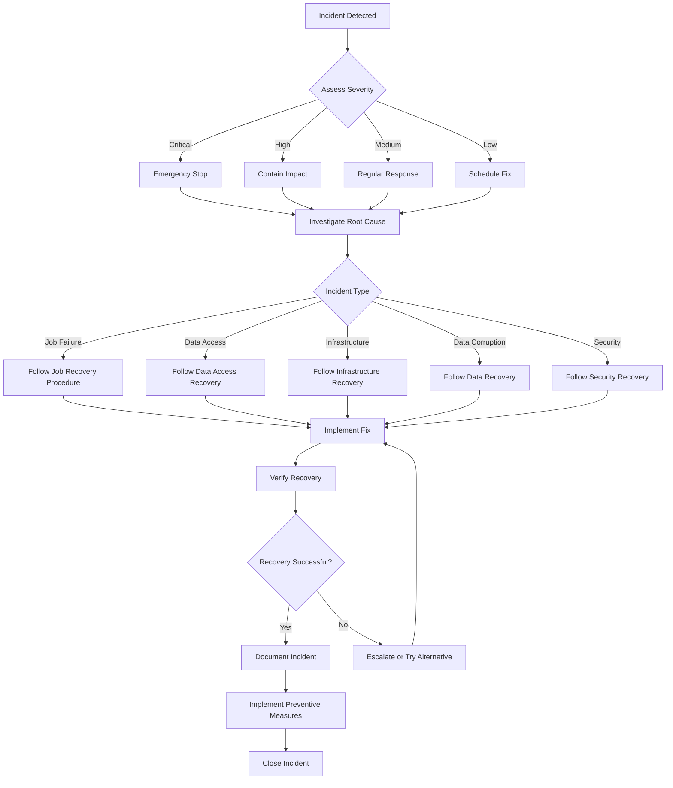

# Disaster Recovery Guide for Budget Management Application

This document provides comprehensive guidance for disaster recovery procedures in the Budget Management Application. It outlines recovery objectives, backup strategies, recovery scenarios, and step-by-step procedures for various failure types.

## 1. Recovery Objectives

The Budget Management Application implements a comprehensive disaster recovery strategy to minimize downtime and data loss in the event of system failures.

| Objective | Target | Description |
|-----------|--------|-------------|
| Recovery Time Objective (RTO) | < 4 hours | Maximum acceptable time to restore system functionality |
| Recovery Point Objective (RPO) | < 1 week | Maximum acceptable data loss period |
| Minimum Business Continuity | Transaction retrieval and basic budget analysis | Core functionality that must be restored first |

These objectives are designed for a personal application with weekly processing requirements, balancing recovery speed with implementation complexity.

## 2. Backup Strategy

The application implements a multi-layered backup strategy to ensure data and configuration can be recovered in case of failures:

### 2.1 Application Code

- **Primary Backup**: GitHub repository with complete version history
- **Backup Frequency**: Continuous (with each commit)
- **Retention Period**: Indefinite
- **Recovery Method**: Clone repository and redeploy

### 2.2 Infrastructure Configuration

- **Primary Backup**: Terraform state files in Google Cloud Storage
- **Secondary Backup**: Terraform configuration files in GitHub repository
- **Backup Frequency**: With each infrastructure change
- **Retention Period**: Indefinite
- **Recovery Method**: Apply Terraform configuration

### 2.3 API Credentials

- **Primary Backup**: Google Secret Manager with version history
- **Secondary Backup**: Encrypted local backup of credentials (manual)
- **Backup Frequency**: With each credential rotation
- **Retention Period**: Previous 3 versions
- **Recovery Method**: Restore from Secret Manager or manual import

### 2.4 Google Sheets Data

- **Primary Backup**: Google's built-in version history
- **Secondary Backup**: Weekly JSON exports to Cloud Storage
- **Tertiary Backup**: In-spreadsheet backup sheets (created before significant changes)
- **Backup Frequency**: Weekly automated, on-demand manual
- **Retention Period**: 90 days for JSON exports, indefinite for in-spreadsheet backups
- **Recovery Method**: Restore from JSON export or copy from backup sheet

### 2.5 Backup Automation

The following scripts automate the backup process:

```bash
# Weekly automated backup
src/scripts/maintenance/backup_sheets.py

# Manual backup before significant changes
src/scripts/manual/backup_sheets.py --manual
```

## 3. Recovery Scenarios

The application has documented recovery procedures for common failure scenarios:

### 3.1 Job Execution Failure

Failure of the Cloud Run job to execute successfully.

**Symptoms**:
- Error notifications from Cloud Monitoring
- Failed job execution in Cloud Run logs
- Missing weekly budget report email

**Potential Causes**:
- API authentication failures
- Resource constraints
- Code errors
- External service outages

**Recovery Time Objective**: < 1 hour

### 3.2 Data Access Issues

Inability to access or modify Google Sheets data.

**Symptoms**:
- API errors in logs related to Google Sheets
- Missing or incomplete data in reports
- Permission errors in logs

**Potential Causes**:
- Expired or invalid credentials
- Permission changes
- Sheet structure changes
- Google Sheets service disruption

**Recovery Time Objective**: < 2 hours

### 3.3 Infrastructure Corruption

Corruption or misconfiguration of cloud infrastructure components.

**Symptoms**:
- Cloud Run job configuration errors
- Cloud Scheduler failures
- IAM permission issues
- Secret Manager access problems

**Potential Causes**:
- Manual configuration changes
- Failed Terraform apply
- GCP service disruption
- Accidental resource deletion

**Recovery Time Objective**: < 4 hours

### 3.4 Data Corruption

Corruption or loss of budget or transaction data.

**Symptoms**:
- Incorrect budget calculations
- Missing transactions
- Unexpected data formats
- Error messages related to data validation

**Potential Causes**:
- Manual data editing errors
- API errors during data updates
- Third-party integration issues
- Bug in data processing code

**Recovery Time Objective**: < 2 hours

### 3.5 Security Incidents

Unauthorized access or credential compromise.

**Symptoms**:
- Unexpected API access patterns
- Unauthorized transactions or transfers
- Credential usage from unexpected locations
- Altered configuration or permissions

**Potential Causes**:
- Credential leakage
- Insufficient access controls
- Social engineering
- Vulnerability exploitation

**Recovery Time Objective**: < 1 hour

## 4. Recovery Procedures

Detailed step-by-step procedures for recovering from each failure scenario.

### 4.1 Job Execution Failure Recovery

1. **Assess the Failure**
   ```bash
   # Check Cloud Run job execution logs
   gcloud logging read "resource.type=cloud_run_job AND resource.labels.job_name=budget-management-job AND severity>=ERROR" --limit 10
   
   # Check job status
   gcloud run jobs executions list --job budget-management-job --region us-east1
   ```

2. **Verify API Credentials**
   ```bash
   # Run verification script
   python src/scripts/disaster_recovery/verify_integrity.py --verbose
   ```

3. **Resolve Specific Issues**
   - For authentication failures, rotate affected credentials
   - For resource constraints, adjust Cloud Run job configuration
   - For code errors, fix and redeploy the application
   - For external service outages, wait for service restoration

4. **Manually Trigger Job**
   ```bash
   # Manually execute the job
   gcloud run jobs execute budget-management-job --region us-east1
   ```

5. **Verify Recovery**
   ```bash
   # Check execution status
   gcloud run jobs executions describe EXECUTION_ID --region us-east1
   ```

### 4.2 Data Access Issues Recovery

1. **Verify Google Sheets API Status**
   - Check [Google Workspace Status Dashboard](https://www.google.com/appsstatus)

2. **Verify Credentials and Permissions**
   ```bash
   # Verify credentials
   python src/scripts/disaster_recovery/verify_integrity.py --verbose
   ```

3. **Rotate Google Sheets Credentials if Necessary**
   ```bash
   # Rotate credentials
   python src/scripts/maintenance/rotate_credentials.py --service google_sheets
   ```

4. **Verify Sheet Structure**
   ```bash
   # Validate sheet structure
   python src/scripts/utils/validate_budget.py
   ```

5. **Restore Sheet Access**
   - Ensure service account has appropriate permissions
   - Verify sheet IDs in configuration match actual sheets

6. **Test Access**
   ```bash
   # Test Google Sheets access
   python src/scripts/utils/sheet_operations.py --test
   ```

### 4.3 Infrastructure Corruption Recovery

1. **Emergency Stop**
   ```bash
   # Stop all running components
   python src/scripts/disaster_recovery/emergency_stop.py --project-id PROJECT_ID --region us-east1
   ```

2. **Assess Corruption Scope**
   ```bash
   # Verify infrastructure integrity
   python src/scripts/disaster_recovery/verify_integrity.py --report
   ```

3. **Rebuild Environment**
   ```bash
   # Complete environment rebuild
   src/scripts/disaster_recovery/rebuild_environment.sh --project-id PROJECT_ID --region us-east1
   ```

4. **Verify Deployment**
   ```bash
   # Validate deployment
   python src/scripts/deployment/validate_deployment.py
   ```

5. **Test Execution**
   ```bash
   # Test job execution
   gcloud run jobs execute budget-management-job --region us-east1
   ```

### 4.4 Data Corruption Recovery

1. **Assess Corruption Scope**
   ```bash
   # Verify data integrity
   python src/scripts/utils/validate_budget.py --detailed
   ```

2. **Identify Last Known Good State**
   ```bash
   # List available backups
   python src/scripts/disaster_recovery/restore_from_backup.py --list
   ```

3. **Restore from Backup**
   ```bash
   # Restore from latest backup
   python src/scripts/disaster_recovery/restore_from_backup.py
   
   # Or restore from specific date
   python src/scripts/disaster_recovery/restore_from_backup.py --date YYYY-MM-DD
   ```

4. **Verify Data Integrity**
   ```bash
   # Validate restored data
   python src/scripts/utils/validate_budget.py --detailed
   ```

5. **Manually Fix Remaining Issues**
   ```bash
   # Fix categorization issues
   python src/scripts/manual/fix_categorization.py
   ```

### 4.5 Security Incident Recovery

1. **Emergency Stop**
   ```bash
   # Stop all running components
   python src/scripts/disaster_recovery/emergency_stop.py --project-id PROJECT_ID --region us-east1 --force
   ```

2. **Assess Security Breach**
   ```bash
   # Check access logs
   gcloud logging read "protoPayload.serviceName=secretmanager.googleapis.com AND protoPayload.methodName=AccessSecretVersion"
   ```

3. **Rotate All Credentials**
   ```bash
   # Rotate all credentials
   python src/scripts/maintenance/rotate_credentials.py --all
   ```

4. **Verify No Unauthorized Changes**
   ```bash
   # Verify system integrity
   python src/scripts/disaster_recovery/verify_integrity.py --verbose --report
   ```

5. **Restore from Known Good State if Necessary**
   ```bash
   # Rebuild environment with new credentials
   src/scripts/disaster_recovery/rebuild_environment.sh --project-id PROJECT_ID --skip-data-restore
   ```

6. **Update Access Controls**
   ```bash
   # Review and update IAM permissions
   python src/scripts/maintenance/update_iam_permissions.py --restrict
   ```

7. **Document Incident**
   - Record incident details, impact, and resolution steps
   - Implement additional security measures as needed

## 5. Recovery Tools

The application includes several scripts in the `src/scripts/disaster_recovery/` directory to support disaster recovery operations.

### 5.1 Emergency Stop

The `emergency_stop.py` script performs an emergency stop of all running components:

```bash
# Stop all components in the default project
python src/scripts/disaster_recovery/emergency_stop.py

# Stop components in a specific project and region
python src/scripts/disaster_recovery/emergency_stop.py --project-id PROJECT_ID --region us-east1

# Force stop without confirmation
python src/scripts/disaster_recovery/emergency_stop.py --force
```

This script:
- Cancels any running Cloud Run job executions
- Pauses Cloud Scheduler jobs to prevent new executions
- Terminates any active API client connections

### 5.2 Environment Rebuild

The `rebuild_environment.sh` script rebuilds the entire environment from scratch:

```bash
# Rebuild the environment with default settings
src/scripts/disaster_recovery/rebuild_environment.sh

# Rebuild with specific settings
src/scripts/disaster_recovery/rebuild_environment.sh --project-id PROJECT_ID --region us-east1 --environment prod

# Skip specific rebuild steps
src/scripts/disaster_recovery/rebuild_environment.sh --skip-data-restore --skip-emergency-stop
```

This script:
- Stops all running components (unless skipped)
- Rebuilds infrastructure using Terraform
- Sets up required secrets in Secret Manager
- Restores data from backups (unless skipped)
- Deploys the application to Cloud Run
- Sets up Cloud Scheduler for weekly execution
- Validates the deployment

### 5.3 Backup Restoration

The `restore_from_backup.py` script restores Google Sheets data from backups:

```bash
# Restore from latest backup
python src/scripts/disaster_recovery/restore_from_backup.py

# Restore from backup closest to a specific date
python src/scripts/disaster_recovery/restore_from_backup.py --date 2023-07-15

# Restore only Master Budget
python src/scripts/disaster_recovery/restore_from_backup.py --master-budget-only

# Restore only from JSON backups (not in-spreadsheet backups)
python src/scripts/disaster_recovery/restore_from_backup.py --json-only
```

This script:
- Finds the appropriate backup (latest or by date)
- Restores Master Budget and/or Weekly Spending sheets
- Supports both JSON file backups and in-spreadsheet backups
- Validates the restored data

### 5.4 Integrity Verification

The `verify_integrity.py` script verifies the integrity of the Budget Management Application system components:

```bash
# Verify system integrity
python src/scripts/disaster_recovery/verify_integrity.py

# Generate detailed integrity report
python src/scripts/disaster_recovery/verify_integrity.py --report

# Send integrity report via email
python src/scripts/disaster_recovery/verify_integrity.py --report --email

# Attempt to fix directory structure issues
python src/scripts/disaster_recovery/verify_integrity.py --fix
```

This script verifies:
- Directory structure and permissions
- Credential files existence and format
- API connectivity for all required services
- Google Sheets data integrity
- Capital One account status

### 5.5 Recovery Validation

The `recovery_validation.py` script validates recovery operations:

```bash
# Validate recovery
python src/scripts/disaster_recovery/recovery_validation.py

# Validate specific components
python src/scripts/disaster_recovery/recovery_validation.py --components infrastructure,data,api

# Generate validation report
python src/scripts/disaster_recovery/recovery_validation.py --report
```

This script validates:
- Infrastructure deployment
- Data restoration
- API connectivity
- Application functionality
- Scheduler configuration

## 6. Incident Response Process

The incident response process provides a structured approach to handling system failures and security incidents.

### 6.1 Incident Detection

Incidents may be detected through:
- Automated alerts from Cloud Monitoring
- Failed job execution notifications
- Missing weekly budget report emails
- Manual observation of system issues

### 6.2 Incident Response Flow



### 6.3 Incident Severity Levels

| Severity | Description | Response Time | Examples |
|----------|-------------|---------------|----------|
| Critical | System completely non-functional or security breach | Immediate | Unauthorized access, complete system failure |
| High | Major functionality impaired | < 1 hour | Job execution failures, data access issues |
| Medium | Limited functionality impaired | < 4 hours | Minor data corruption, performance issues |
| Low | Minimal impact on functionality | < 24 hours | Cosmetic issues, non-critical warnings |

### 6.4 Incident Documentation

For each incident, document:

1. **Incident Summary**
   - Date and time of occurrence
   - Detection method
   - Severity level
   - Brief description

2. **Impact Assessment**
   - Affected components
   - Duration of impact
   - Data loss or corruption extent

3. **Root Cause Analysis**
   - Technical cause
   - Contributing factors
   - Preventability assessment

4. **Resolution Steps**
   - Actions taken
   - Recovery procedures used
   - Time to resolution

5. **Preventive Measures**
   - System improvements
   - Monitoring enhancements
   - Procedure updates

Use the provided template:
```bash
python src/scripts/templates/incident_report.py --generate
```

## 7. Disaster Recovery Testing

Regular testing of disaster recovery procedures ensures they will work when needed.

### 7.1 Testing Schedule

| Test Type | Frequency | Components Tested |
|-----------|-----------|-------------------|
| Backup Verification | Monthly | Verify backups are created and accessible |
| Restore Testing | Quarterly | Test restoration from backups to test environment |
| Full Recovery Simulation | Annually | Complete disaster recovery procedure test |
| Component Recovery | Bi-monthly | Test recovery of individual components |

### 7.2 Testing Procedures

#### Backup Verification

```bash
# Verify backup integrity
python src/scripts/maintenance/verify_backups.py
```

#### Restore Testing

```bash
# Test restoration to test environment
python src/scripts/disaster_recovery/restore_from_backup.py --environment test
```

#### Full Recovery Simulation

```bash
# Simulate complete environment rebuild in test environment
src/scripts/disaster_recovery/rebuild_environment.sh --environment test
```

#### Component Recovery

```bash
# Test specific component recovery
python src/scripts/disaster_recovery/recovery_validation.py --component data --environment test
```

### 7.3 Test Documentation

For each test, document:

1. **Test Summary**
   - Date and time of test
   - Test type and scope
   - Test environment

2. **Test Results**
   - Success/failure status
   - Issues encountered
   - Recovery time measurements

3. **Improvement Opportunities**
   - Procedure gaps identified
   - Efficiency improvements
   - Documentation updates needed

Use the provided template:
```bash
python src/scripts/templates/dr_test_report.py --generate
```

## 8. Maintenance and Updates

Regular maintenance of disaster recovery capabilities ensures they remain effective.

### 8.1 Regular Maintenance Tasks

| Task | Frequency | Description |
|------|-----------|-------------|
| Update Recovery Documentation | Quarterly | Review and update disaster recovery procedures |
| Verify Backup Automation | Monthly | Ensure backup scripts are functioning correctly |
| Rotate Recovery Credentials | Quarterly | Update credentials used for recovery operations |
| Review Recovery Scripts | Bi-annually | Update recovery scripts for compatibility with system changes |

### 8.2 Procedure Updates

When updating disaster recovery procedures:

1. Document the changes and rationale
2. Test the updated procedures in a test environment
3. Update all relevant documentation
4. Communicate changes to stakeholders

### 8.3 Version Control

Maintain version control for disaster recovery documentation and scripts:

- Store all documentation in the GitHub repository
- Include version history in documentation headers
- Test recovery procedures against specific versions
- Tag releases with disaster recovery compatibility information

## 9. References

For more detailed information on disaster recovery for the Budget Management Application, refer to the following documents:

- **Infrastructure Architecture Overview**: See the application architecture diagram in the Deployment Guide for the complete infrastructure layout
- [Monitoring Guide](monitoring_guide.md): Monitoring and alerting configuration
- [Deployment Guide](deployment_guide.md): Deployment procedures and environment setup
- [Google Cloud Run Documentation](https://cloud.google.com/run/docs/)
- [Google Cloud Scheduler Documentation](https://cloud.google.com/scheduler/docs/)
- [Google Secret Manager Documentation](https://cloud.google.com/secret-manager/docs/)

## Appendix A: Recovery Checklists

### A.1 Job Execution Failure Checklist

- [ ] Check Cloud Run job execution logs for errors
- [ ] Verify API credentials are valid
- [ ] Check resource allocation (memory/CPU)
- [ ] Verify external service status
- [ ] Fix identified issues
- [ ] Manually trigger job execution
- [ ] Verify successful execution
- [ ] Document incident and resolution

### A.2 Data Access Issues Checklist

- [ ] Verify Google Sheets API status
- [ ] Check credential validity and permissions
- [ ] Verify sheet structure and IDs
- [ ] Rotate credentials if necessary
- [ ] Test access after fixes
- [ ] Verify data integrity
- [ ] Document incident and resolution

### A.3 Infrastructure Corruption Checklist

- [ ] Perform emergency stop if necessary
- [ ] Assess corruption scope
- [ ] Backup any salvageable configuration
- [ ] Rebuild environment using Terraform
- [ ] Restore credentials and secrets
- [ ] Verify deployment
- [ ] Test functionality
- [ ] Document incident and resolution

### A.4 Data Corruption Checklist

- [ ] Assess corruption scope and impact
- [ ] Identify last known good state
- [ ] Stop any automated processes
- [ ] Restore data from appropriate backup
- [ ] Verify data integrity after restoration
- [ ] Fix any remaining issues manually
- [ ] Test functionality with restored data
- [ ] Document incident and resolution

### A.5 Security Incident Checklist

- [ ] Perform emergency stop immediately
- [ ] Assess security breach scope
- [ ] Identify compromised components
- [ ] Rotate all credentials
- [ ] Verify no unauthorized changes
- [ ] Rebuild environment if necessary
- [ ] Update access controls
- [ ] Document incident thoroughly
- [ ] Implement additional security measures

## Appendix B: Recovery Script Reference

### B.1 Emergency Stop Script

**File**: `src/scripts/disaster_recovery/emergency_stop.py`

**Purpose**: Immediately stops all running components of the Budget Management Application.

**Usage**:
```bash
python src/scripts/disaster_recovery/emergency_stop.py [OPTIONS]
```

**Options**:
- `--project-id PROJECT_ID`: Google Cloud project ID
- `--region REGION`: Google Cloud region (default: us-east1)
- `--app-name APP_NAME`: Application name (default: budget-management)
- `--force`: Skip confirmation prompt
- `--verbose`: Enable detailed logging

### B.2 Environment Rebuild Script

**File**: `src/scripts/disaster_recovery/rebuild_environment.sh`

**Purpose**: Rebuilds the entire Budget Management Application environment from scratch.

**Usage**:
```bash
src/scripts/disaster_recovery/rebuild_environment.sh [OPTIONS]
```

**Options**:
- `--project-id PROJECT_ID`: Google Cloud project ID
- `--region REGION`: Google Cloud region (default: us-east1)
- `--app-name APP_NAME`: Application name (default: budget-management)
- `--environment ENV`: Environment to rebuild (dev/prod, default: dev)
- `--backup-dir DIR`: Directory containing backups
- `--backup-date DATE`: Specific backup date to restore from
- `--force`: Continue despite errors
- `--skip-confirmation`: Skip confirmation prompt
- `--skip-emergency-stop`: Skip emergency stop step
- `--skip-infrastructure`: Skip infrastructure rebuild
- `--skip-secrets`: Skip secrets setup
- `--skip-data-restore`: Skip data restoration
- `--skip-deployment`: Skip application deployment

### B.3 Backup Restoration Script

**File**: `src/scripts/disaster_recovery/restore_from_backup.py`

**Purpose**: Restores Google Sheets data from backups.

**Usage**:
```bash
python src/scripts/disaster_recovery/restore_from_backup.py [OPTIONS]
```

**Options**:
- `--json-only`: Only restore from JSON backups
- `--sheet-only`: Only restore from in-spreadsheet backups
- `--backup-dir DIR`: Directory containing backups
- `--date DATE`: Specific date to restore from (YYYY-MM-DD)
- `--master-budget-only`: Only restore Master Budget
- `--weekly-spending-only`: Only restore Weekly Spending
- `--list`: List available backups without restoring

### B.4 Integrity Verification Script

**File**: `src/scripts/disaster_recovery/verify_integrity.py`

**Purpose**: Verifies the integrity of the Budget Management Application system components.

**Usage**:
```bash
python src/scripts/disaster_recovery/verify_integrity.py [OPTIONS]
```

**Options**:
- `--verbose`: Enable detailed output
- `--report`: Generate integrity report
- `--email`: Send report via email
- `--fix`: Attempt automatic fixes for issues

### B.5 Recovery Validation Script

**File**: `src/scripts/disaster_recovery/recovery_validation.py`

**Purpose**: Validates recovery operations to ensure system is properly restored.

**Usage**:
```bash
python src/scripts/disaster_recovery/recovery_validation.py [OPTIONS]
```

**Options**:
- `--components COMP1,COMP2`: Specific components to validate
- `--report`: Generate validation report
- `--email`: Send report via email
- `--environment ENV`: Environment to validate (dev/prod/test)