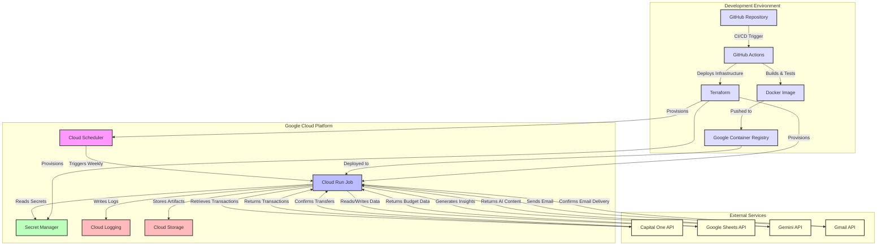
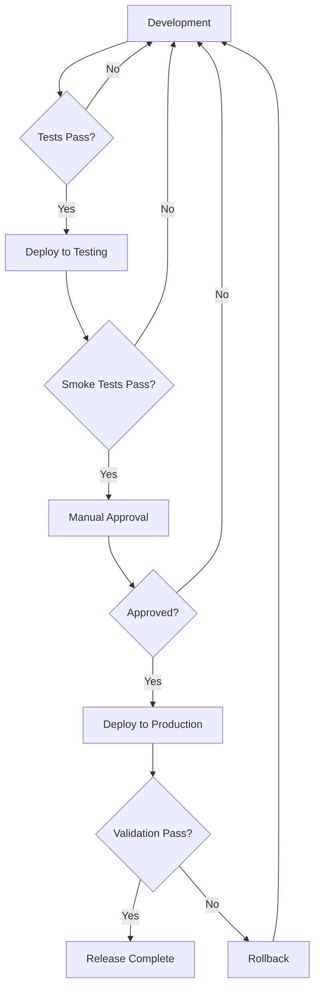
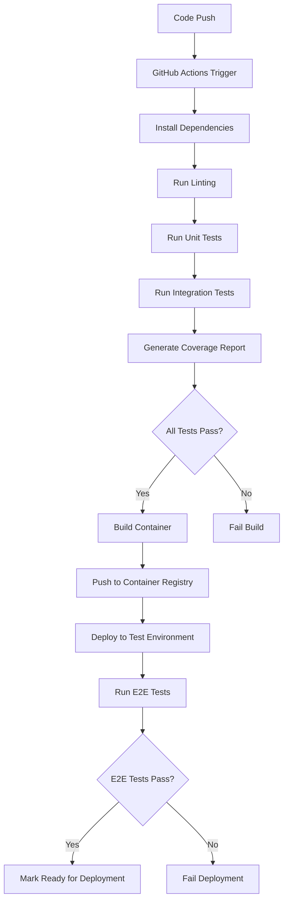

# Infrastructure Overview for Budget Management Application

This document provides a comprehensive overview of the infrastructure architecture for the Budget Management Application. The application is designed as a serverless, event-driven system that executes on a weekly schedule to perform budget analysis and automated financial actions.

## Infrastructure Architecture

The Budget Management Application follows a serverless, cloud-native architecture deployed on Google Cloud Platform. This architecture was selected to minimize infrastructure management while providing reliable execution of the budget management workflow.

### Architecture Diagram


### Key Components

The infrastructure consists of the following key components:

1. **Google Cloud Run Jobs**: Serverless container execution environment that runs the Budget Management Application on a scheduled basis.

2. **Google Cloud Scheduler**: Triggers the Cloud Run job every Sunday at 12 PM EST to execute the budget management workflow.

3. **Google Secret Manager**: Securely stores API credentials and sensitive configuration for Capital One, Google Sheets, Gemini, and Gmail APIs.

4. **Google Container Registry**: Stores the Docker container images for the Budget Management Application.

5. **Google Cloud Logging**: Captures application logs and execution metrics for monitoring and troubleshooting.

6. **Google Cloud Storage**: Stores artifacts such as backup files and generated reports.

7. **Google Cloud Monitoring**: Provides monitoring dashboards and alerting for the application.

### Infrastructure as Code

The entire infrastructure is defined and managed using Terraform, enabling consistent, reproducible deployments across environments. The Terraform configuration is organized as follows:

- `main.tf`: Orchestrates the deployment of all infrastructure components
- `cloud_run.tf`: Defines the Cloud Run job configuration
- `cloud_scheduler.tf`: Sets up the Cloud Scheduler job to trigger the application
- `secret_manager.tf`: Creates and manages secrets for API credentials
- `iam.tf`: Configures IAM permissions for the service account
- `variables.tf`: Defines input variables for the Terraform configuration
- `outputs.tf`: Defines output values from the Terraform deployment

Environment-specific configurations are stored in:
- `infrastructure/environments/dev.tfvars`: Development environment configuration
- `infrastructure/environments/prod.tfvars`: Production environment configuration

## Deployment Environments

The Budget Management Application supports two deployment environments: development and production. Each environment is isolated in its own Google Cloud Project with appropriate configurations.

### Development Environment

The development environment is used for testing new features and configurations before deploying to production.

**Key Characteristics:**
- Project ID: `budget-management-dev`
- Region: `us-east1` (for proximity to EST timezone)
- Container Image: `gcr.io/budget-management-dev/budget-management:latest`
- Log Level: `DEBUG` for detailed logging
- Email Recipients: Only the owner (`njdifiore@gmail.com`)
- Resource Allocation: 1 vCPU, 2GB memory

The development environment uses the same infrastructure components as production but with configurations optimized for testing and debugging.

### Production Environment

The production environment is the live system that processes actual financial data and performs automated actions.

**Key Characteristics:**
- Project ID: `budget-management-prod`
- Region: `us-east1` (for proximity to EST timezone)
- Container Image: `gcr.io/budget-management-prod/budget-management:v1.0.0` (versioned releases)
- Log Level: `INFO` for standard operational logging
- Email Recipients: Both owner addresses (`njdifiore@gmail.com`, `nick@blitzy.com`)
- Resource Allocation: 1 vCPU, 2GB memory

The production environment is configured for reliability and security, with strict versioning of container images and appropriate access controls.

### Environment Promotion Flow

Changes follow a structured promotion flow from development to production:



This flow ensures that only thoroughly tested and validated changes are deployed to the production environment.

## Cloud Services Configuration

The Budget Management Application leverages several Google Cloud Platform services, each configured for optimal performance, security, and cost-efficiency.

### Google Cloud Run Jobs

Cloud Run jobs provide a serverless execution environment for the containerized application.

**Configuration:**
```hcl
resource "google_cloud_run_v2_job" "budget_management_job" {
  name        = "${var.app_name}-job"
  location    = var.region
  project     = var.project_id
  description = "Budget Management Application weekly job for transaction processing and budget analysis"
  
  template {
    template {
      containers {
        image = var.container_image
        resources {
          limits {
            cpu    = var.cpu
            memory = var.memory
          }
        }
        # Environment variables and secret mounts
      }
      service_account = var.service_account_email
      timeout         = "${var.timeout_seconds}s"
    }
    max_retries = var.max_retries
  }
}
```

**Key Settings:**
- CPU: 1 vCPU (sufficient for sequential processing)
- Memory: 2GB (accommodates data processing and AI operations)
- Timeout: 10 minutes (allows for API latency while preventing runaway processes)
- Max Retries: 3 (automatically retry on transient failures)

### Google Cloud Scheduler

Cloud Scheduler triggers the Cloud Run job on a weekly schedule.

**Configuration:**
```hcl
resource "google_cloud_scheduler_job" "budget_management_scheduler" {
  name        = "${var.app_name}-scheduler"
  description = "Weekly scheduler for Budget Management Application (Sundays at 12 PM EST)"
  schedule    = "0 12 * * 0"  # 12 PM every Sunday
  time_zone   = "America/New_York"
  
  http_target {
    http_method = "POST"
    uri         = "https://${var.region}-run.googleapis.com/apis/run.googleapis.com/v1/namespaces/${var.project_id}/jobs/${var.cloud_run_job_name}:run"
    oauth_token {
      service_account_email = var.service_account_email
    }
  }
  
  retry_config {
    retry_count          = 3
    min_backoff_duration = "1s"
    max_backoff_duration = "60s"
    max_retry_duration   = "300s"
    max_doublings        = 3
  }
}
```

**Key Settings:**
- Schedule: `0 12 * * 0` (12 PM every Sunday)
- Timezone: America/New_York (Eastern Standard Time)
- Retry Configuration: Exponential backoff with maximum 3 retries

### Google Secret Manager

Secret Manager securely stores API credentials and sensitive configuration.

**Secrets Managed:**
- Capital One API credentials (API key, client ID, client secret)
- Capital One account identifiers (checking and savings account IDs)
- Gemini API key
- Google Sheets API credentials
- Gmail API credentials
- Google Sheet IDs (Master Budget and Weekly Spending)

**Security Measures:**
- Automatic encryption of stored secrets
- Version control for credentials
- Fine-grained access control through IAM
- Audit logging of secret access

### Google Cloud Logging and Monitoring

Cloud Logging and Monitoring provide visibility into application execution and performance.

**Logging Configuration:**
- Structured JSON logs for machine readability
- Log levels: INFO (production), DEBUG (development)
- Log retention: 30 days
- Sensitive data redaction in logs

**Monitoring Setup:**
- Custom dashboard for application metrics
- Alert policies for critical conditions
- Log-based metrics for application-specific monitoring
- Uptime checks for external API dependencies

For detailed monitoring configuration, see [Monitoring Guide](monitoring_guide.md).

## Containerization

The Budget Management Application is containerized using Docker to ensure consistent execution across environments.

### Container Image

The application uses a Docker container based on Python 3.11-slim:

```dockerfile
# Use Python slim image to minimize container size
FROM python:3.11-slim

# Set working directory
WORKDIR /app

# Copy requirements first for better layer caching
COPY requirements.txt .
RUN pip install --no-cache-dir -r requirements.txt

# Copy application code
COPY . .

# Set environment variables
ENV PYTHONUNBUFFERED=1

# Run the application
CMD ["python", "main.py"]
```

This Dockerfile creates a lightweight container with only the necessary dependencies for the application.

### Image Versioning

Container images follow a versioning strategy based on the environment:

- **Development**: Uses the `latest` tag for continuous integration
  - Example: `gcr.io/budget-management-dev/budget-management:latest`

- **Production**: Uses semantic versioning with Git commit hash
  - Example: `gcr.io/budget-management-prod/budget-management:v1.0.0`
  - Format: `v{MAJOR}.{MINOR}.{PATCH}`

This approach ensures reproducible deployments in production while allowing flexibility in development.

### Container Registry

Container images are stored in Google Container Registry (GCR) within each environment's project:

- Development: `gcr.io/budget-management-dev/`
- Production: `gcr.io/budget-management-prod/`

Access to the container registry is controlled through IAM permissions, with the CI/CD pipeline having write access and Cloud Run having read access.

## CI/CD Pipeline

The Budget Management Application uses GitHub Actions for continuous integration and deployment, automating the build, test, and deployment process.

### CI/CD Workflow


The CI/CD pipeline is defined in `.github/workflows/` with separate workflows for continuous integration and deployment.

### Continuous Integration

The CI workflow runs on every pull request and push to the main branch:

1. **Code Checkout**: Retrieves the latest code from the repository
2. **Environment Setup**: Installs Python, dependencies, and tools
3. **Linting**: Checks code style and quality
4. **Unit Tests**: Runs unit tests with pytest
5. **Integration Tests**: Runs integration tests with mocked external services
6. **Coverage Report**: Generates and publishes test coverage report

This ensures that all code changes meet quality standards before deployment.

### Continuous Deployment

The CD workflow runs on merges to the main branch:

1. **Build Docker Image**: Creates the application container image
2. **Push to Registry**: Uploads the image to Google Container Registry
3. **Deploy Infrastructure**: Applies Terraform configuration
4. **Update Cloud Run Job**: Updates the job to use the new container image
5. **Run Validation Tests**: Verifies the deployment is working correctly

Deployment to production requires manual approval after successful testing in the development environment.

### Deployment Verification

After deployment, the pipeline performs verification steps:

1. **Cloud Run Job Verification**: Checks that the job is properly configured
2. **Cloud Scheduler Verification**: Verifies the scheduler is set up correctly
3. **Manual Execution Test**: Triggers a test execution of the job
4. **Log Verification**: Checks execution logs for successful completion

These steps ensure that the deployment is functioning as expected before being considered complete.

## Security Architecture

The Budget Management Application implements a comprehensive security architecture to protect sensitive financial data and ensure secure operations.

### Authentication and Authorization

**Service Account:**
- Dedicated service account for the application: `budget-management-sa@[PROJECT_ID].iam.gserviceaccount.com`
- No long-lived credentials stored in the application code
- Automatic token refresh handled by Google Cloud

**IAM Permissions:**
- Principle of least privilege applied to all service accounts
- Specific IAM roles assigned based on required functionality:
  - `roles/run.invoker`: Execute Cloud Run jobs
  - `roles/secretmanager.secretAccessor`: Access specific secrets
  - `roles/logging.logWriter`: Write application logs
  - `roles/cloudscheduler.jobRunner`: Execute scheduled jobs
  - `roles/sheets.reader`: Access Google Sheets data
  - `roles/gmail.sender`: Send emails via Gmail API

### Data Protection

**Credential Management:**
- All API credentials stored in Secret Manager
- Secrets mounted as environment variables in Cloud Run job
- Automatic encryption of secrets at rest and in transit

**Sensitive Data Handling:**
- Financial account numbers masked in logs
- No persistent storage of full transaction details
- Secure, encrypted communication with all external APIs

**Transport Security:**
- TLS 1.2+ for all API communications
- Certificate validation to prevent MITM attacks
- Secure header practices (no sensitive data in headers)

### Security Monitoring

**Audit Logging:**
- Comprehensive logging of all operations
- Authentication events tracked and monitored
- Access to secrets and sensitive operations logged

**Security Alerts:**
- Alerts for authentication failures
- Monitoring for unusual API usage patterns
- Notifications for IAM policy changes

For detailed security incident response procedures, see [Disaster Recovery Guide](disaster_recovery.md).

## Monitoring and Observability

The Budget Management Application implements a comprehensive monitoring strategy to ensure reliable operation and provide visibility into its performance.

### Monitoring Components

The monitoring infrastructure consists of the following components:

1. **Google Cloud Monitoring**: Primary platform for metrics collection, dashboards, and alerting
2. **Google Cloud Logging**: Centralized log repository with structured logging
3. **Custom Log-Based Metrics**: Application-specific metrics extracted from logs
4. **Alert Policies**: Configured notifications based on metric thresholds
5. **Monitoring Scripts**: Utilities for checking job status, analyzing logs, and generating reports

### Key Monitoring Metrics

The application tracks the following key metrics:

- Job execution success rate
- End-to-end execution time
- API response times
- Transaction categorization accuracy
- Email delivery success rate
- Savings transfer success rate
- Memory and CPU utilization
- Error rates by component
- Budget adherence metrics

### Alerting Strategy

Alerts are configured based on severity levels:

1. **Critical**: Immediate attention required, affects core functionality
   - Job execution failures
   - Financial transfer errors
   - Severe resource constraints

2. **High**: Prompt attention required, affects important functionality
   - API integration failures
   - Email delivery failures
   - Authentication failures

3. **Medium**: Attention required during business hours, affects enhanced functionality
   - Low categorization accuracy
   - Budget overspend
   - Execution time warnings

Alerts are delivered via email, with critical alerts also sent via SMS.

For detailed monitoring configuration, see [Monitoring Guide](monitoring_guide.md).

## Disaster Recovery

The Budget Management Application implements a comprehensive disaster recovery strategy to minimize downtime and data loss in the event of system failures.

### Recovery Objectives

| Objective | Target | Description |
|-----------|--------|-------------|
| Recovery Time Objective (RTO) | < 4 hours | Maximum acceptable time to restore system functionality |
| Recovery Point Objective (RPO) | < 1 week | Maximum acceptable data loss period |
| Minimum Business Continuity | Transaction retrieval and basic budget analysis | Core functionality that must be restored first |

### Backup Strategy

The application implements the following backup strategy:

1. **Application Code**: Stored in GitHub repository with version history
2. **Infrastructure Configuration**: Terraform state in Google Cloud Storage
3. **Credentials**: Stored in Google Secret Manager with version history
4. **Google Sheets Data**:
   - Google's built-in version history
   - Weekly automated backups to local storage
   - Manual backups before significant changes

For detailed recovery procedures, see [Disaster Recovery Guide](disaster_recovery.md).

## Maintenance Procedures

Regular maintenance is essential to ensure the continued reliable operation of the Budget Management Application.

### Routine Maintenance

**Weekly Tasks:**
- Review job execution status and performance
- Check for any triggered alerts and their resolution
- Verify dashboard data accuracy

**Monthly Tasks:**
- Review alert thresholds and adjust if necessary
- Analyze performance trends and identify optimization opportunities
- Check log storage usage and cleanup if necessary

**Quarterly Tasks:**
- Review and update runbooks based on incident history
- Test alert notification channels
- Update dashboard visualizations if needed
- Review and refine log-based metrics

### Dependency Updates

Regular updates to dependencies are important for security and performance:

1. **Python Packages**: Update dependencies in `requirements.txt`
2. **Base Container Image**: Update Python version in Dockerfile
3. **Terraform Providers**: Update provider versions in `main.tf`

Dependency updates should be tested thoroughly in the development environment before being promoted to production.

### Credential Rotation

API credentials should be rotated regularly to maintain security.

Credential rotation should be performed quarterly or immediately if a security incident is suspected.

## Cost Optimization

The Budget Management Application is designed to be cost-efficient while maintaining reliability and performance.

### Cost Breakdown

| Service | Cost Optimization Approach | Estimated Monthly Cost |
|---------|----------------------------|------------------------|
| Cloud Run Jobs | Minimal resource allocation, execution only when needed | $0.10 - $0.20 |
| Cloud Scheduler | Single job trigger | Free tier |
| Secret Manager | Minimal secret operations | Free tier - $0.05 |
| Cloud Storage | Minimal storage for logs | Free tier - $0.02 |
| **Total Estimated Cost** | | **$0.12 - $0.27 per month** |

### Cost-saving Measures

The application implements several cost-saving measures:

1. **Serverless Architecture**: Eliminates idle resource costs
2. **Weekly Execution**: Minimizes compute usage
3. **Efficient Resource Allocation**: Appropriate memory/CPU sizing
4. **Free Tier Usage**: Leverages free tier offerings where possible
5. **Log Filtering**: Selective logging to reduce storage costs

### Cost Monitoring

Cost monitoring is implemented to prevent unexpected expenses:

1. **Budget Alerts**: GCP budget notification at 80% and 100% of expected cost
2. **Usage Analysis**: Regular review of service usage patterns
3. **Resource Right-sizing**: Adjustment of Cloud Run job resources based on usage

## Deployment Instructions

For detailed deployment instructions, including prerequisites, environment setup, infrastructure provisioning, and application deployment, see the [Deployment Guide](deployment_guide.md).

## References

- [Deployment Guide](deployment_guide.md): Detailed deployment procedures
- [Monitoring Guide](monitoring_guide.md): Monitoring and alerting configuration
- [Disaster Recovery Guide](disaster_recovery.md): Recovery procedures and backup strategies
- [Google Cloud Run Documentation](https://cloud.google.com/run/docs): Official documentation for Cloud Run
- [Terraform Documentation](https://www.terraform.io/docs): Official documentation for Terraform
- [Google Cloud Architecture Center](https://cloud.google.com/architecture): Best practices for Google Cloud architecture