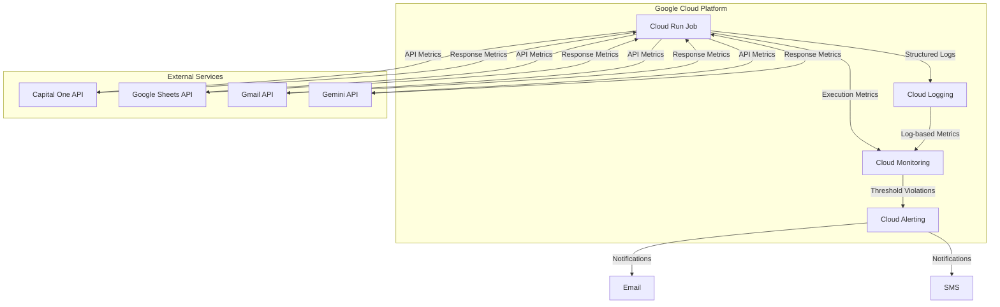
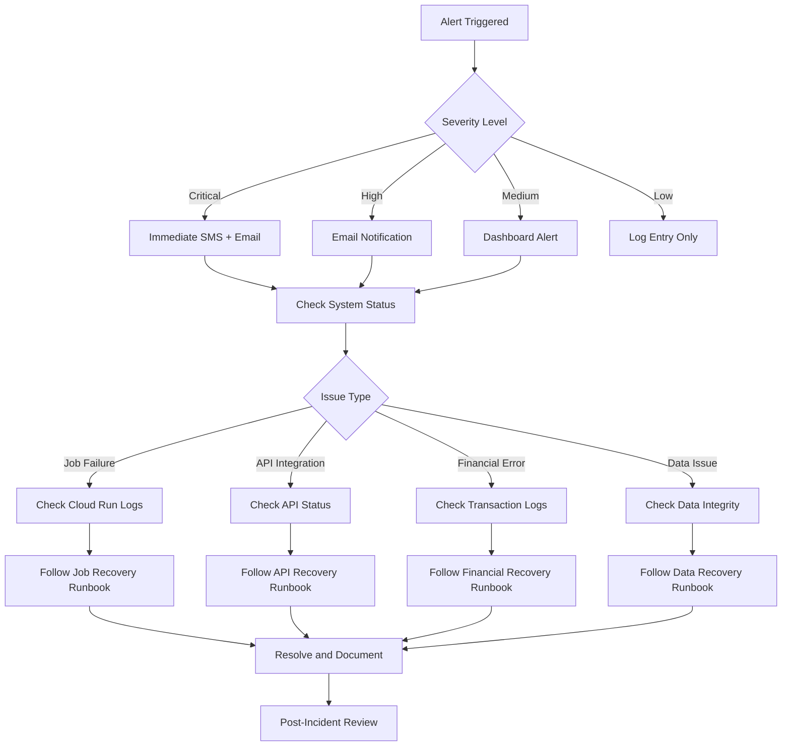
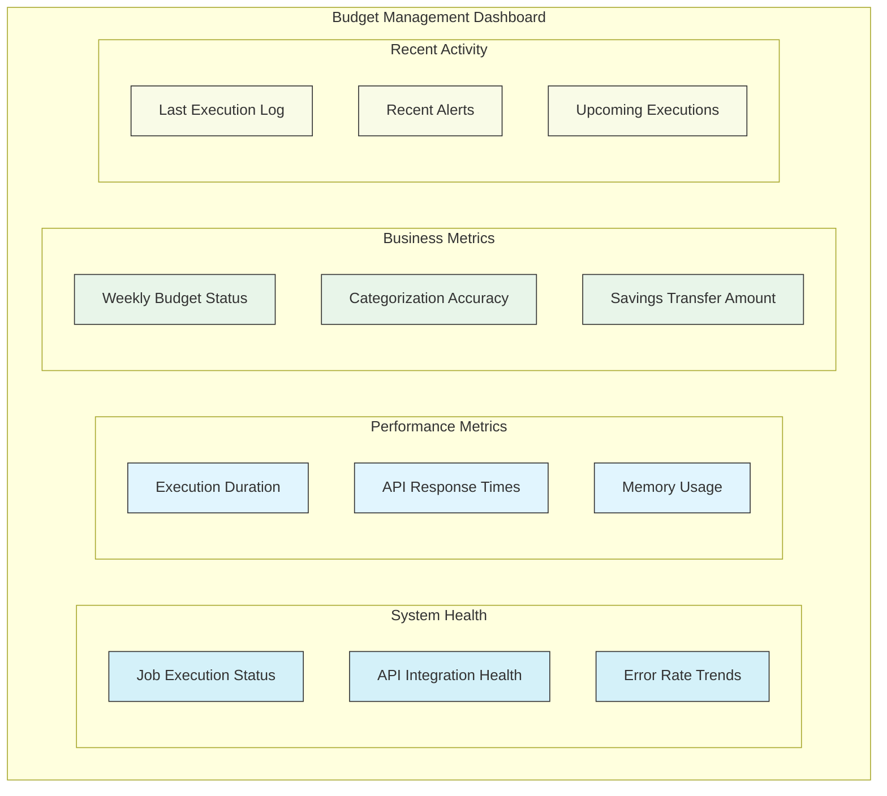
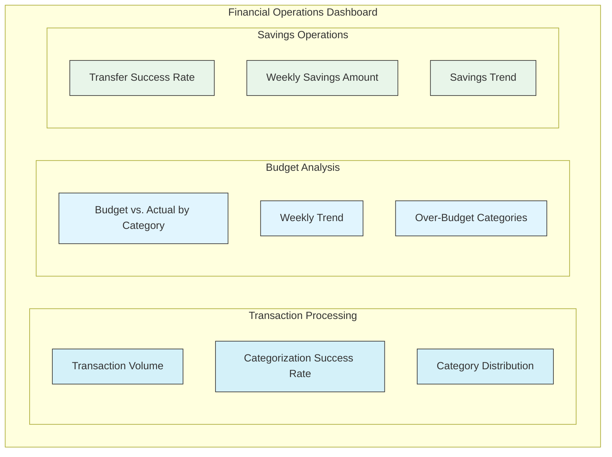

# Monitoring Guide for Budget Management Application

This document provides comprehensive guidance for monitoring the Budget Management Application, a serverless application that automates budget tracking, analysis, and savings allocation on a weekly schedule. It covers the monitoring infrastructure, dashboards, log-based metrics, alerting, and monitoring scripts.

## 1. Monitoring Architecture

The Budget Management Application implements a comprehensive monitoring strategy to ensure reliable operation and provide visibility into its performance, health, and business outcomes.

### 1.1 Monitoring Components



The monitoring architecture leverages Google Cloud’s native monitoring capabilities:

1. **Cloud Logging**: Centralized repository for all application logs
2. **Cloud Monitoring**: Collection and visualization of metrics
3. **Cloud Alerting**: Notification system for threshold violations
4. **Custom Log Metrics**: Extraction of application-specific metrics from logs

### 1.2 Metrics Collection

The application collects the following types of metrics:

| Metric Category | Key Metrics | Collection Method | Retention |
|-----------------|-------------|-------------------|-----------|
| Job Execution | Success/failure, Duration, Memory usage | Cloud Run metrics | 30 days |
| API Integration | Response times, Error rates, Rate limit usage | Custom logging | 30 days |
| Financial Operations | Transaction count, Categorization accuracy, Transfer success | Custom logging | 90 days |

#### Built-in Metrics

The following metrics are automatically collected by Google Cloud Run:

- `run.googleapis.com/job/execution_count`: Count of job executions by status
- `run.googleapis.com/job/execution/duration`: Duration of job executions
- `run.googleapis.com/container/memory/utilizations`: Memory utilization percentage
- `run.googleapis.com/container/cpu/utilizations`: CPU utilization percentage

#### Custom Log-Based Metrics

Custom metrics are extracted from structured logs using log-based metrics. These are defined in `infrastructure/monitoring/logs/log_metrics.json` and include:

- `api_response_time`: Measures API response times for external service calls
- `component_duration`: Measures execution duration of each application component
- `transaction_count`: Counts the number of transactions processed
- `categorization_accuracy`: Measures the percentage of transactions correctly categorized
- `savings_transfer_amount`: Records the amount transferred to savings account
- `budget_amount`: Records the budgeted amount for each category
- `actual_amount`: Records the actual spending amount for each category
- `total_budget`: Records the total budget amount across all categories
- `total_actual`: Records the total actual spending across all categories
- `total_variance`: Records the total budget variance (budget - actual)

See [Section 3: Log-Based Metrics](#3-log-based-metrics) for a complete list of custom metrics.

### 1.3 Log Aggregation

The application uses Google Cloud Logging as the centralized log repository with the following configuration:

| Log Type | Content | Severity Levels | Masking Rules |
|----------|---------|-----------------|---------------|
| Application Logs | Component operations, API interactions | INFO, WARNING, ERROR, CRITICAL | Financial data masked |
| Integration Logs | API requests/responses, authentication events | INFO, WARNING, ERROR | Credentials redacted |
| Financial Logs | Transaction processing, transfers | INFO, WARNING, ERROR, CRITICAL | Account numbers masked |

#### Structured Logging Format

All logs use a structured JSON format with consistent fields:

```json
{
  "timestamp": "2023-07-23T12:01:15.123Z",
  "execution_id": "exec-2023-07-23-12-00-00",
  "component": "savings_automator",
  "operation": "transfer_funds",
  "status": "success",
  "details": {
    "amount": "45.67",
    "source_account": "xxxx1234",
    "destination_account": "xxxx5678",
    "transfer_id": "tr-98765"
  },
  "duration_ms": 1250,
  "severity": "INFO"
}
```

#### Log Retention and Export

- Standard logs: 30-day retention in Cloud Logging
- Financial operation logs: Exported to Cloud Storage for 90-day retention
- Error logs: Exported to BigQuery for analysis and reporting

### 1.4 Alert Management

The application implements a tiered alerting strategy based on severity and impact:

| Alert Type | Trigger Condition | Severity | Notification Channel |
|------------|-------------------|----------|---------------------|
| Job Failure | Cloud Run job execution fails | Critical | Email + SMS |
| API Integration Failure | Any critical API call fails after retries | High | Email |
| Financial Transfer Error | Savings transfer fails | Critical | Email + SMS |
| Budget Overspend | Weekly spending exceeds budget by >20% | Medium | Email |
| Categorization Accuracy | Accuracy falls below 90% | Medium | Email |
| Email Delivery Failure | Weekly report email fails to send | High | Email |
| Authentication Failures | Multiple authentication failures | High | Email |

#### Alert Flow Diagram



See [Section 4: Alerting](#4-alerting) for detailed alert configuration.

## 2. Dashboards

The monitoring infrastructure includes predefined dashboards for visualizing the application's health, performance, and business metrics.

### 2.1 Main Dashboard

The main dashboard (`infrastructure/monitoring/dashboards/budget_management_dashboard.json`) provides a comprehensive view of the application's health and performance. It includes the following sections:

1. **System Health**: Job execution status, API integration health, error rates
2. **Performance Metrics**: Execution duration, API response times, memory usage
3. **Component Performance**: Execution times and error rates by component
4. **Financial Operations**: Transaction volume, categorization accuracy, budget vs. actual spending
5. **System Resources**: Memory and CPU usage
6. **Recent Logs**: Recent warning and error logs for troubleshooting

#### Dashboard Layout



### 2.2 Financial Operations Dashboard

A specialized dashboard for monitoring financial operations is also available:



This dashboard focuses on financial metrics and provides deeper insights into budget performance and savings operations.

### 2.3 Dashboard Deployment

To deploy the dashboards:

```bash
# Using the provided script
python src/scripts/monitoring/generate_dashboard.py

# Or manually through Google Cloud Console
1. Navigate to Google Cloud Console > Monitoring > Dashboards
2. Click "Create Dashboard"
3. Click "JSON Editor"
4. Paste the contents of budget_management_dashboard.json
5. Click "Save"
```

#### Dashboard Customization

The dashboards can be customized by modifying the JSON configuration files:

- `infrastructure/monitoring/dashboards/budget_management_dashboard.json`: Main dashboard
- Custom dashboards can be created by copying and modifying the existing templates

After modifying the configuration, redeploy using the `generate_dashboard.py` script.

## 3. Log-Based Metrics

The application uses custom log-based metrics to track application-specific metrics. These metrics are defined in `infrastructure/monitoring/logs/log_metrics.json` and are extracted from structured logs.

### 3.1 Key Metrics

| Metric | Description | Type | Unit |
|--------|-------------|------|------|
| api_response_time | Measures API response times | GAUGE | ms |
| component_duration | Measures execution duration of each component | GAUGE | s |
| transaction_count | Counts the number of transactions processed | GAUGE | 1 |
| categorization_accuracy | Measures the percentage of transactions correctly categorized | GAUGE | % |
| savings_transfer_amount | Records the amount transferred to savings account | GAUGE | USD |
| budget_amount | Records the budgeted amount for each category | GAUGE | USD |
| actual_amount | Records the actual spending amount for each category | GAUGE | USD |
| total_budget | Records the total budget amount across all categories | GAUGE | USD |
| total_actual | Records the total actual spending across all categories | GAUGE | USD |
| total_variance | Records the total budget variance (budget - actual) | GAUGE | USD |
| budget_variance_percentage | Records the budget variance as a percentage of budget | GAUGE | % |
| api_error_count | Counts API errors by service | DELTA | 1 |
| component_error_count | Counts errors by application component | DELTA | 1 |
| authentication_failure_count | Counts authentication failures | DELTA | 1 |
| email_delivery_status | Tracks email delivery success/failure | GAUGE | 1 |
| transfer_status | Tracks savings transfer success/failure | GAUGE | 1 |

### 3.2 Metric Configuration

Each metric is configured with the following properties:

- **name**: Unique identifier for the metric
- **display_name**: Human-readable name for the metric
- **description**: Detailed description of what the metric measures
- **metric_kind**: GAUGE (point-in-time value) or DELTA (change over time)
- **value_type**: Data type (INT64, DOUBLE, etc.)
- **unit**: Measurement unit (ms, s, %, USD, etc.)
- **labels**: Dimensions for filtering and grouping metrics
- **filter**: Log filter expression to identify relevant log entries
- **label_extractors**: Expressions to extract label values from logs
- **value_extractor**: Expression to extract the metric value from logs

Example metric configuration:

```json
{
  "name": "api_response_time",
  "display_name": "API Response Time",
  "description": "Measures API response times for external service calls",
  "metric_kind": "GAUGE",
  "value_type": "DOUBLE",
  "unit": "ms",
  "labels": [
    {
      "key": "api_name",
      "description": "Name of the API service (Capital One, Google Sheets, Gemini, Gmail)"
    },
    {
      "key": "operation",
      "description": "Specific API operation being performed"
    }
  ],
  "filter": "resource.type=\"cloud_run_job\" AND resource.labels.job_name=\"budget-management-job\" AND jsonPayload.api_response_time_ms != null",
  "label_extractors": {
    "api_name": "EXTRACT(jsonPayload.api_name)",
    "operation": "EXTRACT(jsonPayload.operation)"
  },
  "value_extractor": "EXTRACT(jsonPayload.api_response_time_ms)"
}
```

### 3.3 Metric Deployment

To deploy the log-based metrics:

```bash
# Using the provided script
python src/scripts/monitoring/alert_setup.py

# This script sets up both log-based metrics and alert policies
```

#### Logging Requirements

For log-based metrics to work correctly, the application must emit structured logs with the appropriate fields. For example, to track API response times, the application should log:

```python
logger.info("API call completed", extra={
    "api_name": "capital_one",
    "operation": "get_transactions",
    "api_response_time_ms": 235,
    "status": "success"
})
```

The logging service will automatically convert the `extra` parameters into JSON fields in the structured log entry.

## 4. Alerting

The monitoring infrastructure includes predefined alert policies for notifying stakeholders of issues based on severity.

### 4.1 Alert Policies

| Alert Type | Severity | Notification Channels | Description |
|------------|----------|----------------------|-------------|
| Job Failure | Critical | Email + SMS | Alerts when the weekly budget management job fails |
| API Integration Failure | High | Email | Alerts when API integration failures occur after maximum retries |
| Financial Transfer Error | Critical | Email + SMS | Alerts when savings transfer operations fail |
| Transaction Categorization Accuracy | Medium | Email | Alerts when categorization accuracy falls below 90% |
| Execution Time Warning | Medium | Email | Alerts when job execution time exceeds 8 minutes |
| Memory Usage Warning | Medium | Email | Alerts when memory utilization exceeds 85% |
| Budget Overspend | Medium | Email | Alerts when weekly spending exceeds budget by more than 20% |
| Email Delivery Failure | High | Email | Alerts when weekly report email fails to send |
| Authentication Failures | High | Email | Alerts when multiple authentication failures occur |
| Zero Transactions Warning | Medium | Email | Alerts when no transactions are retrieved |

### 4.2 Alert Configuration

Each alert policy is configured with the following properties:

- **display_name**: Human-readable name for the alert
- **description**: Detailed description of the alert condition
- **documentation**: Runbook or troubleshooting guide for the alert
- **conditions**: Metric threshold or log-based conditions that trigger the alert
- **notification_channels**: Where to send alert notifications
- **severity**: Critical, High, Medium, or Low
- **auto_close**: Duration after which to auto-close the alert if condition resolves

Example alert configuration:

```json
{
  "display_name": "Budget Management - Job Failure",
  "description": "Alerts when the weekly budget management job fails",
  "documentation": {
    "content": "## Troubleshooting Steps\n1. Check Cloud Run job logs for error details\n2. Verify API credentials are valid\n3. Check for service outages in external dependencies\n4. If needed, manually trigger the job using the script\n\n`python src/scripts/manual/trigger_job.py`",
    "mime_type": "text/markdown"
  },
  "conditions": [
    {
      "condition_threshold": {
        "filter": "resource.type=\"cloud_run_job\" AND resource.labels.job_name=\"budget-management-job\" AND metric.type=\"run.googleapis.com/job/execution_count\" AND metric.labels.status=\"failed\"",
        "comparison": "COMPARISON_GT",
        "threshold_value": 0,
        "duration": "0s",
        "trigger": {
          "count": 1
        },
        "aggregations": [
          {
            "alignment_period": "300s",
            "per_series_aligner": "ALIGN_SUM"
          }
        ]
      }
    }
  ],
  "notification_channels": [
    "projects/budget-management-prod/notificationChannels/email-primary",
    "projects/budget-management-prod/notificationChannels/sms-primary"
  ],
  "severity": "CRITICAL",
  "auto_close": "86400s"
}
```

### 4.3 Alert Deployment

To deploy the alert policies:

```bash
# Using the provided script
python src/scripts/monitoring/alert_setup.py

# Test notification channels
python src/scripts/monitoring/alert_setup.py --test

# Update existing alerts
python src/scripts/monitoring/alert_setup.py --update
```

#### Notification Channels

The following notification channels are configured:

- **Email**: Primary notification channel for all alerts
  - Primary: njdifiore@gmail.com
  - Secondary: nick@blitzy.com
- **SMS**: Used only for critical alerts
  - Primary phone number configured in Google Cloud Monitoring

### 4.4 Incident Response

When an alert is triggered, follow the incident response process:

1. **Acknowledge**: Acknowledge the alert in Google Cloud Monitoring
2. **Investigate**: Follow the troubleshooting steps in the alert documentation
3. **Mitigate**: Apply the appropriate fix or workaround
4. **Resolve**: Mark the alert as resolved once the issue is fixed
5. **Document**: Document the incident, root cause, and resolution

#### Escalation Procedures

For this personal application, the escalation path is simplified:

1. **Primary Contact**: Application owner (njdifiore@gmail.com)
2. **Secondary Contact**: None (personal application)
3. **Escalation Timeframes**:
   - Critical issues: Immediate notification
   - High severity: Within 1 hour
   - Medium severity: Daily digest
   - Low severity: Weekly summary

#### Post-Mortem Process

For significant incidents, a simple post-mortem process is followed:

1. **Document the incident**: What happened, when, and impact
2. **Root cause analysis**: Why it happened
3. **Resolution steps**: How it was fixed
4. **Preventive measures**: How to prevent recurrence
5. **Monitoring improvements**: What additional monitoring is needed

## 5. Monitoring Scripts

The application includes several scripts in the `src/scripts/monitoring/` directory to support monitoring and observability.

### 5.1 Job Status Checker

The `check_job_status.py` script checks the status of Cloud Run jobs and generates a comprehensive status report.

```bash
# Check job status for the past 7 days
python src/scripts/monitoring/check_job_status.py --days 7

# Check job status and send alert if failures are detected
python src/scripts/monitoring/check_job_status.py --days 7 --email

# Check job status and output in JSON format
python src/scripts/monitoring/check_job_status.py --days 7 --format json

# Check job status for a specific job
python src/scripts/monitoring/check_job_status.py --job-name budget-management-job
```

#### Job Status Report

The script generates a comprehensive report including:

- Job identification information
- Latest execution status
- Execution history and success rate
- Performance metrics (duration, memory usage)
- Error patterns and frequency
- Recommendations based on findings

### 5.2 Alert Setup

The `alert_setup.py` script configures monitoring alerts and custom metrics.

```bash
# Set up all alerts using the default configuration
python src/scripts/monitoring/alert_setup.py

# Update existing alerts
python src/scripts/monitoring/alert_setup.py --update

# Test notification channels
python src/scripts/monitoring/alert_setup.py --test

# Dry run (simulate alert creation without actually creating them)
python src/scripts/monitoring/alert_setup.py --dry-run

# Set up alerts for a specific project
python src/scripts/monitoring/alert_setup.py --project-id budget-management-prod
```

The script uses the configuration in `infrastructure/monitoring/alerts/budget_management_alerts.json` to create or update alert policies.

### 5.3 Log Analyzer

The `analyze_logs.py` script analyzes application logs to identify patterns and issues.

```bash
# Analyze logs for the past day
python src/scripts/monitoring/analyze_logs.py --days 1

# Analyze logs for specific component
python src/scripts/monitoring/analyze_logs.py --component transaction_retriever

# Analyze logs for specific severity
python src/scripts/monitoring/analyze_logs.py --severity ERROR

# Generate a detailed report
python src/scripts/monitoring/analyze_logs.py --days 7 --output-file log_analysis_report.json
```

The script provides insights into:

- Error frequency and patterns
- Performance metrics by component
- API response times and error rates
- Authentication and authorization issues
- Transaction processing statistics

### 5.4 Dashboard Generator

The `generate_dashboard.py` script creates and updates monitoring dashboards.

```bash
# Create or update the main dashboard
python src/scripts/monitoring/generate_dashboard.py

# Create or update a specific dashboard
python src/scripts/monitoring/generate_dashboard.py --dashboard financial_operations

# Create a dashboard with custom configuration
python src/scripts/monitoring/generate_dashboard.py --config-file custom_dashboard.json
```

The script uses the configuration in `infrastructure/monitoring/dashboards/` to create or update dashboards in Google Cloud Monitoring.

### 5.5 Performance Reporter

The `performance_report.py` script generates performance reports for the application.

```bash
# Generate weekly performance report
python src/scripts/monitoring/performance_report.py --period week

# Generate monthly performance report
python src/scripts/monitoring/performance_report.py --period month

# Generate report for specific date range
python src/scripts/monitoring/performance_report.py --start-date 2023-07-01 --end-date 2023-07-31

# Generate report with specific metrics
python src/scripts/monitoring/performance_report.py --metrics api_response_time,component_duration
```

The script generates a comprehensive performance report including:

- Execution time trends
- API response time statistics
- Memory and CPU utilization
- Transaction processing metrics
- Error rates and patterns
- Recommendations for optimization

## 6. Monitoring Best Practices

The monitoring infrastructure follows these best practices:

1. **Structured Logging**: All logs use structured JSON format with consistent fields
2. **Correlation IDs**: Each execution has a unique ID that traces through all operations
3. **Context Enrichment**: Logs include relevant context (component, operation, status)
4. **Sensitive Data Handling**: Financial data is masked in logs
5. **Error Classification**: Errors are categorized by type and severity
6. **Performance Tracking**: All operations include duration measurements
7. **Business Metrics**: Financial operations are tracked with specific metrics
8. **Tiered Alerting**: Alerts are prioritized by severity and impact
9. **Comprehensive Dashboards**: Visual monitoring of all key metrics
10. **Health Checks**: Proactive verification of system health

### 6.1 Logging Best Practices

Follow these logging best practices in the application code:

1. **Use Structured Logging**: Always use structured logging with consistent fields

```python
# Good
logger.info("Transaction processing completed", extra={
    "component": "transaction_retriever",
    "operation": "process_transactions",
    "transaction_count": 15,
    "duration_ms": 1250
})

# Avoid
logger.info(f"Processed 15 transactions in 1250ms")
```

2. **Include Correlation IDs**: Use execution_id to trace operations across components

```python
# At the start of execution
execution_id = f"exec-{datetime.now().strftime('%Y-%m-%d-%H-%M-%S')}"

# In all log messages
logger.info("Starting transaction retrieval", extra={
    "execution_id": execution_id,
    "component": "transaction_retriever"
})
```

3. **Mask Sensitive Data**: Redact account numbers and other sensitive information

```python
# Good
logger.info("Transfer completed", extra={
    "source_account": f"xxxx{account_number[-4:]}",
    "amount": amount
})

# Avoid
logger.info(f"Transfer from account {account_number} completed")
```

4. **Use Appropriate Log Levels**:
   - INFO: Normal operation events
   - WARNING: Potential issues that don't prevent execution
   - ERROR: Issues that prevent specific operations
   - CRITICAL: Issues that prevent overall job completion

### 6.2 Metric Collection Best Practices

Follow these metric collection best practices:

1. **Measure What Matters**: Focus on metrics that provide actionable insights
2. **Set Appropriate Thresholds**: Base alert thresholds on historical performance
3. **Include Business Metrics**: Track metrics that reflect business outcomes
4. **Use Consistent Units**: Standardize on units (ms for time, USD for money)
5. **Label Metrics Appropriately**: Use labels to enable filtering and grouping

```python
# Good - includes labels for filtering
logger.info("API call completed", extra={
    "api_name": "capital_one",
    "operation": "get_transactions",
    "api_response_time_ms": 235
})

# Avoid - no labels for filtering
logger.info("API call completed", extra={
    "api_response_time_ms": 235
})
```

### 6.3 Alert Configuration Best Practices

Follow these alert configuration best practices:

1. **Avoid Alert Fatigue**: Only alert on actionable conditions
2. **Include Runbooks**: Provide troubleshooting steps in alert documentation
3. **Set Appropriate Severity**: Match severity to business impact
4. **Use Notification Routing**: Route alerts to appropriate channels based on severity
5. **Implement Alert Grouping**: Group related alerts to reduce noise

```json
// Good - includes documentation with troubleshooting steps
{
  "display_name": "Budget Management - API Integration Failure",
  "documentation": {
    "content": "## Troubleshooting Steps\n1. Check API status\n2. Verify credentials\n3. Check network connectivity\n4. Review error logs",
    "mime_type": "text/markdown"
  }
}

// Avoid - no documentation
{
  "display_name": "Budget Management - API Integration Failure"
}
```

## 7. Maintenance Tasks

Regular maintenance tasks for the monitoring infrastructure:

### 7.1 Weekly Tasks

- Review job execution status and performance
- Check for any triggered alerts and their resolution
- Verify dashboard data accuracy

```bash
# Weekly health check script
python src/scripts/cron/weekly_healthcheck.py
```

### 7.2 Monthly Tasks

- Review alert thresholds and adjust if necessary
- Analyze performance trends and identify optimization opportunities
- Check log storage usage and cleanup if necessary

```bash
# Generate monthly performance report
python src/scripts/monitoring/performance_report.py --period month

# Check and optimize log storage
python src/scripts/maintenance/cleanup_logs.py
```

### 7.3 Quarterly Tasks

- Review and update runbooks based on incident history
- Test alert notification channels
- Update dashboard visualizations if needed
- Review and refine log-based metrics

```bash
# Test alert notification channels
python src/scripts/monitoring/alert_setup.py --test

# Update dashboards with latest configurations
python src/scripts/monitoring/generate_dashboard.py
```

## 8. Troubleshooting Guide

This section provides guidance for troubleshooting common monitoring issues.

### 8.1 Missing or Delayed Metrics

If metrics are missing or delayed:

1. **Check Log Entries**: Verify that the application is logging the expected data
   ```bash
   gcloud logging read "resource.type=cloud_run_job AND resource.labels.job_name=budget-management-job" --limit 10
   ```

2. **Verify Log-Based Metrics**: Check that the log-based metrics are properly configured
   ```bash
   gcloud logging metrics list
   ```

3. **Check Metric Latency**: Log-based metrics can have up to 5-minute delay
   - Wait for metrics to propagate before investigating further

4. **Verify Filters**: Ensure log filters in metric definitions match actual log entries
   - Review `infrastructure/monitoring/logs/log_metrics.json`

### 8.2 Alert Issues

If alerts are not firing or are firing incorrectly:

1. **Check Alert Conditions**: Verify that alert conditions are properly configured
   ```bash
   gcloud alpha monitoring policies list
   ```

2. **Test Alert Notifications**: Verify that notification channels are working
   ```bash
   python src/scripts/monitoring/alert_setup.py --test
   ```

3. **Check Notification Channels**: Verify that notification channels are properly configured
   ```bash
   gcloud alpha monitoring channels list
   ```

4. **Review Alert History**: Check if alerts have fired but notifications failed
   - Check Google Cloud Monitoring > Alerting > Incidents & Events

### 8.3 Dashboard Issues

If dashboards are not displaying correctly:

1. **Check Dashboard Configuration**: Verify that dashboard JSON is valid
   - Review `infrastructure/monitoring/dashboards/budget_management_dashboard.json`

2. **Verify Metric Availability**: Ensure that the metrics used in the dashboard exist
   ```bash
   gcloud logging metrics list
   ```

3. **Check Time Range**: Adjust the time range to ensure data is available
   - Some metrics may not have data for the selected time range

4. **Regenerate Dashboard**: Recreate the dashboard using the script
   ```bash
   python src/scripts/monitoring/generate_dashboard.py
   ```

### 8.4 Log Analysis Issues

If log analysis is not providing expected results:

1. **Check Log Retention**: Verify that logs are retained for the required period
   - Default retention is 30 days for standard logs

2. **Verify Log Format**: Ensure logs are in the expected structured format
   ```bash
   gcloud logging read "resource.type=cloud_run_job AND resource.labels.job_name=budget-management-job" --format=json --limit 1
   ```

3. **Check Log Filters**: Verify that log filters match the expected log entries
   ```bash
   gcloud logging read "resource.type=cloud_run_job AND resource.labels.job_name=budget-management-job AND jsonPayload.component='transaction_retriever'" --limit 5
   ```

4. **Use Log Explorer**: Use Google Cloud Logging's Log Explorer for advanced queries
   - Navigate to Google Cloud Console > Logging > Log Explorer

## 9. References

For more detailed information on monitoring the Budget Management Application, refer to the following documents:

- [Infrastructure Overview](infrastructure_overview.md): General infrastructure documentation
- [Google Cloud Monitoring Documentation](https://cloud.google.com/monitoring/docs)
- [Google Cloud Logging Documentation](https://cloud.google.com/logging/docs)
- [Google Cloud Run Jobs Documentation](https://cloud.google.com/run/docs/create-jobs)