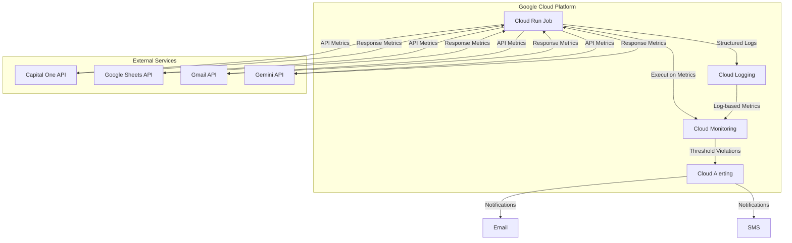
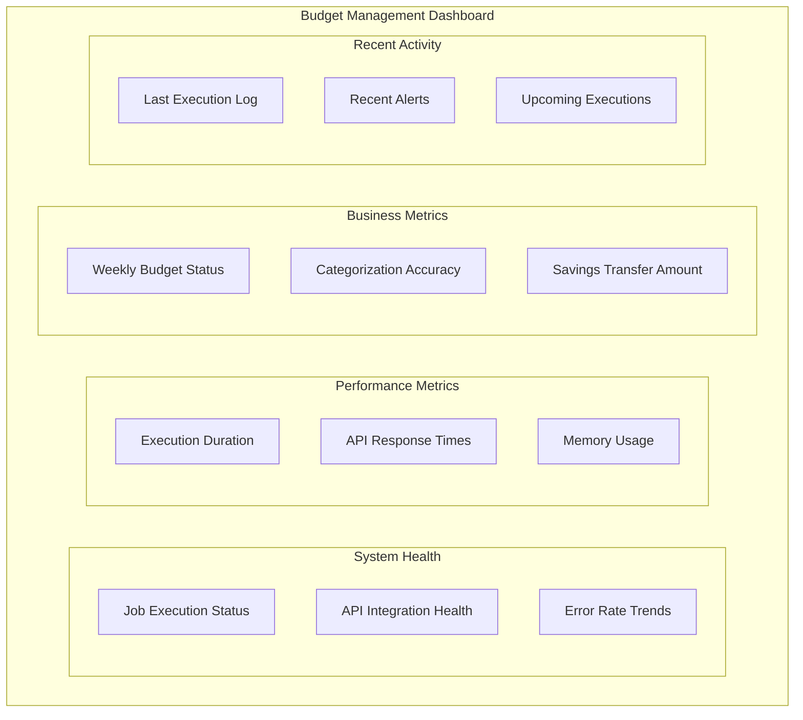

# Budget Management Application - Monitoring Infrastructure

This document provides an overview of the monitoring infrastructure for the Budget Management Application. It covers the monitoring components, dashboard configurations, log-based metrics, alerting, and monitoring scripts.

## Overview

The Budget Management Application implements a comprehensive monitoring approach to ensure reliable operation and provide visibility into its performance, health, and business outcomes. The monitoring infrastructure is built on Google Cloud Platform services and includes dashboards, log-based metrics, alerting, and monitoring scripts.

## Monitoring Architecture



The monitoring architecture leverages Google Cloud's native monitoring capabilities:

1. **Cloud Logging**: Centralized repository for all application logs
2. **Cloud Monitoring**: Collection and visualization of metrics
3. **Cloud Alerting**: Notification system for threshold violations
4. **Custom Log Metrics**: Extraction of application-specific metrics from logs

## Directory Structure

```
infrastructure/monitoring/
├── README.md                                # This file
├── dashboards/                              # Dashboard configurations
│   └── budget_management_dashboard.json     # Main dashboard configuration
├── logs/                                    # Log-based metrics configurations
│   └── log_metrics.json                     # Custom log-based metrics
└── alerts/                                  # Alert policy configurations
    └── budget_management_alerts.json        # Alert policies
```

## Dashboards

The monitoring infrastructure includes predefined dashboards for visualizing the application's health, performance, and business metrics.

### Main Dashboard

The main dashboard (`dashboards/budget_management_dashboard.json`) provides a comprehensive view of the application's health and performance. It includes the following sections:

1. **System Health**: Job execution status, API integration health, error rates
2. **Performance Metrics**: Execution duration, API response times, memory usage
3. **Component Performance**: Execution times and error rates by component
4. **Financial Operations**: Transaction volume, categorization accuracy, budget vs. actual spending
5. **System Resources**: Memory and CPU usage
6. **Recent Logs**: Recent warning and error logs for troubleshooting

#### Dashboard Preview



#### Dashboard Deployment

To deploy the dashboard:

```bash
# Using the provided script
python src/scripts/monitoring/generate_dashboard.py

# Or manually through Google Cloud Console
1. Navigate to Google Cloud Console > Monitoring > Dashboards
2. Click "Create Dashboard"
3. Click "JSON Editor"
4. Paste the contents of budget_management_dashboard.json
5. Click "Save"
```

## Log-Based Metrics

The application uses custom log-based metrics to track application-specific metrics. These metrics are defined in `logs/log_metrics.json` and are extracted from structured logs.

### Key Metrics

| Metric | Description | Type | Unit |
|--------|-------------|------|------|
| api_response_time | Measures API response times | GAUGE | ms |
| component_duration | Measures execution duration of each component | GAUGE | s |
| transaction_count | Counts the number of transactions processed | GAUGE | 1 |
| categorization_accuracy | Measures the percentage of transactions correctly categorized | GAUGE | % |
| savings_transfer_amount | Records the amount transferred to savings account | GAUGE | USD |
| budget_amount | Records the budgeted amount for each category | GAUGE | USD |
| actual_amount | Records the actual spending amount for each category | GAUGE | USD |
| total_budget | Records the total budget amount across all categories | GAUGE | USD |
| total_actual | Records the total actual spending across all categories | GAUGE | USD |
| total_variance | Records the total budget variance (budget - actual) | GAUGE | USD |
| budget_variance_percentage | Records the budget variance as a percentage of budget | GAUGE | % |
| api_error_count | Counts API errors by service | DELTA | 1 |
| component_error_count | Counts errors by application component | DELTA | 1 |
| authentication_failure_count | Counts authentication failures | DELTA | 1 |
| email_delivery_status | Tracks email delivery success/failure | GAUGE | 1 |
| transfer_status | Tracks savings transfer success/failure | GAUGE | 1 |

### Metric Deployment

To deploy the log-based metrics:

```bash
# Using the provided script
python src/scripts/monitoring/alert_setup.py

# This script sets up both log-based metrics and alert policies
```

## Alerting

The monitoring infrastructure includes predefined alert policies for notifying stakeholders of issues based on severity.

### Alert Policies

| Alert Type | Severity | Notification Channels | Description |
|------------|----------|----------------------|-------------|
| Job Failure | Critical | Email + SMS | Alerts when the weekly budget management job fails |
| API Integration Failure | High | Email | Alerts when API integration failures occur after maximum retries |
| Financial Transfer Error | Critical | Email + SMS | Alerts when savings transfer operations fail |
| Transaction Categorization Accuracy | Medium | Email | Alerts when categorization accuracy falls below 90% |
| Execution Time Warning | Medium | Email | Alerts when job execution time exceeds 8 minutes |
| Memory Usage Warning | Medium | Email | Alerts when memory utilization exceeds 85% |
| Budget Overspend | Medium | Email | Alerts when weekly spending exceeds budget by more than 20% |
| Email Delivery Failure | High | Email | Alerts when weekly report email fails to send |
| Authentication Failures | High | Email | Alerts when multiple authentication failures occur |
| Zero Transactions Warning | Medium | Email | Alerts when no transactions are retrieved |

### Alert Deployment

To deploy the alert policies:

```bash
# Using the provided script
python src/scripts/monitoring/alert_setup.py

# Test notification channels
python src/scripts/monitoring/alert_setup.py --test

# Update existing alerts
python src/scripts/monitoring/alert_setup.py --update
```

## Monitoring Scripts

The application includes several scripts in the `src/scripts/monitoring/` directory to support monitoring and observability:

1. **check_job_status.py**: Checks the status of Cloud Run jobs

```bash
# Check job status for the past 7 days
python src/scripts/monitoring/check_job_status.py --days 7

# Check job status and send alert if failures are detected
python src/scripts/monitoring/check_job_status.py --days 7 --alert

# Check job status and trigger a new execution if failures are detected
python src/scripts/monitoring/check_job_status.py --days 7 --trigger
```

2. **alert_setup.py**: Configures monitoring alerts

```bash
# Set up all alerts using the default configuration
python src/scripts/monitoring/alert_setup.py

# Update existing alerts
python src/scripts/monitoring/alert_setup.py --update

# Test notification channels
python src/scripts/monitoring/alert_setup.py --test
```

3. **analyze_logs.py**: Analyzes application logs

```bash
# Analyze logs for the past day
python src/scripts/monitoring/analyze_logs.py --days 1

# Analyze logs for specific component
python src/scripts/monitoring/analyze_logs.py --component transaction_retriever
```

4. **generate_dashboard.py**: Creates and updates dashboards

```bash
# Create or update the main dashboard
python src/scripts/monitoring/generate_dashboard.py
```

5. **performance_report.py**: Generates performance reports

```bash
# Generate weekly performance report
python src/scripts/monitoring/performance_report.py --period week
```

## Monitoring Best Practices

The monitoring infrastructure follows these best practices:

1. **Structured Logging**: All logs use structured JSON format with consistent fields
2. **Correlation IDs**: Each execution has a unique ID that traces through all operations
3. **Context Enrichment**: Logs include relevant context (component, operation, status)
4. **Sensitive Data Handling**: Financial data is masked in logs
5. **Error Classification**: Errors are categorized by type and severity
6. **Performance Tracking**: All operations include duration measurements
7. **Business Metrics**: Financial operations are tracked with specific metrics
8. **Tiered Alerting**: Alerts are prioritized by severity and impact
9. **Comprehensive Dashboards**: Visual monitoring of all key metrics
10. **Health Checks**: Proactive verification of system health

## Maintenance Tasks

Regular maintenance tasks for the monitoring infrastructure:

### Weekly Tasks
- Review job execution status and performance
- Check for any triggered alerts and their resolution
- Verify dashboard data accuracy

### Monthly Tasks
- Review alert thresholds and adjust if necessary
- Analyze performance trends and identify optimization opportunities
- Check log storage usage and cleanup if necessary

### Quarterly Tasks
- Review and update runbooks based on incident history
- Test alert notification channels
- Update dashboard visualizations if needed
- Review and refine log-based metrics

## Additional Documentation

For more detailed information on monitoring the Budget Management Application, refer to the following documents:

- [Application Monitoring Documentation](../../src/backend/docs/monitoring.md): Application-level monitoring details
- [Infrastructure Overview](../docs/infrastructure_overview.md): General infrastructure documentation
- [Disaster Recovery Documentation](../docs/disaster_recovery.md): Recovery procedures and practices

### External References

- [Google Cloud Monitoring Documentation](https://cloud.google.com/monitoring/docs)
- [Google Cloud Logging Documentation](https://cloud.google.com/logging/docs)
- [Google Cloud Run Jobs Documentation](https://cloud.google.com/run/docs/create-jobs)