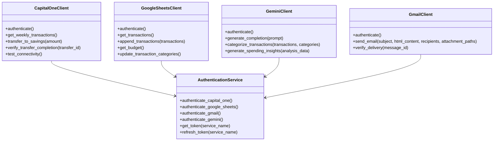
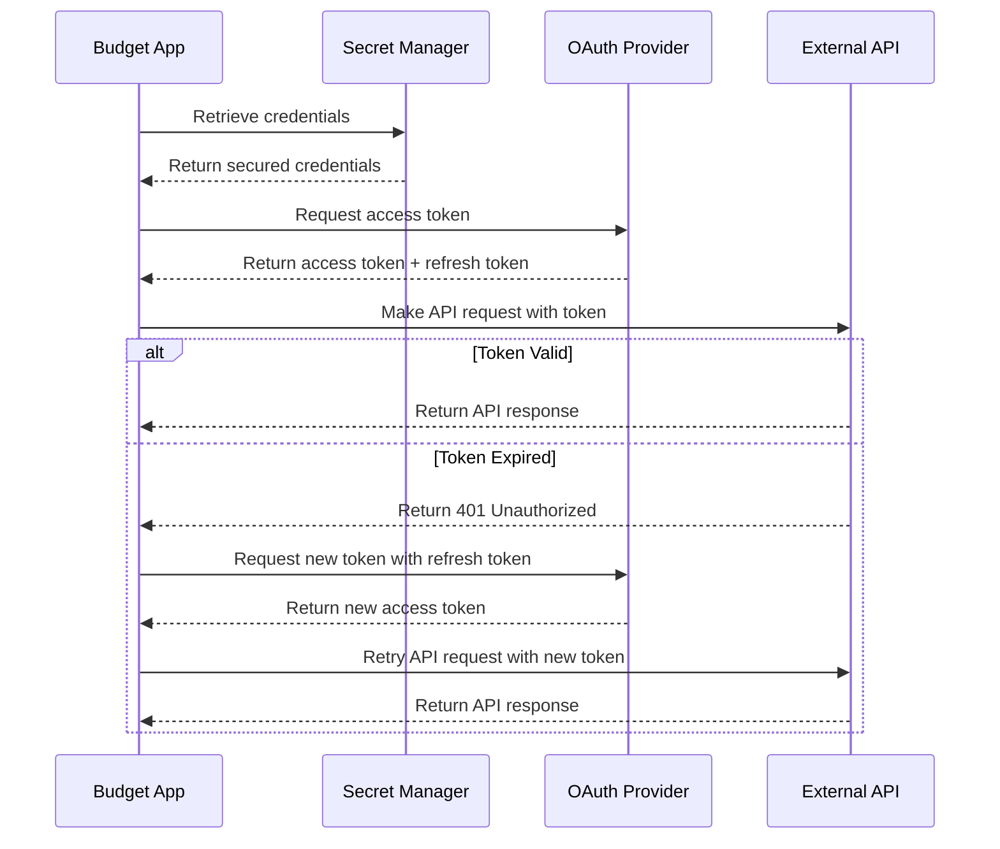
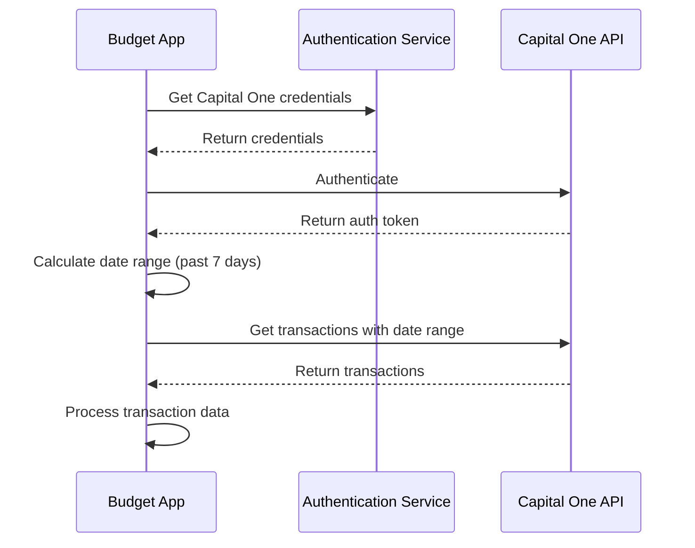
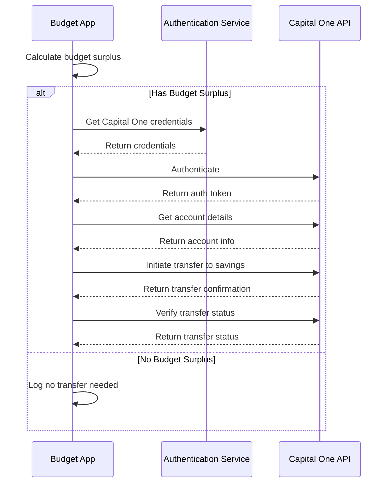
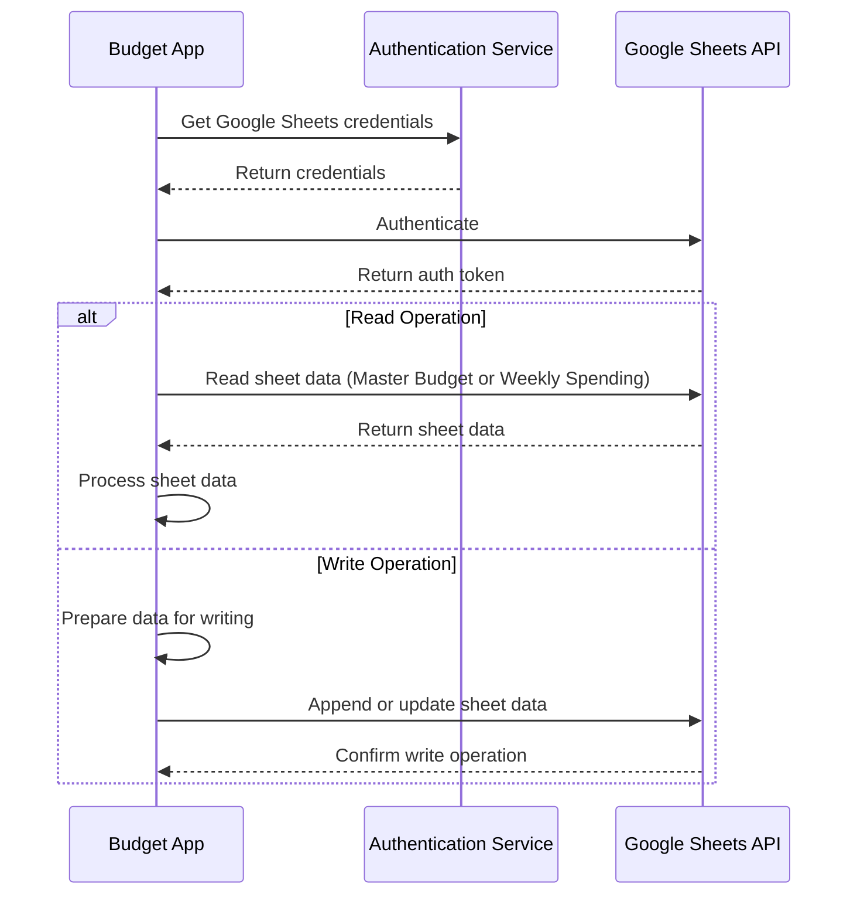
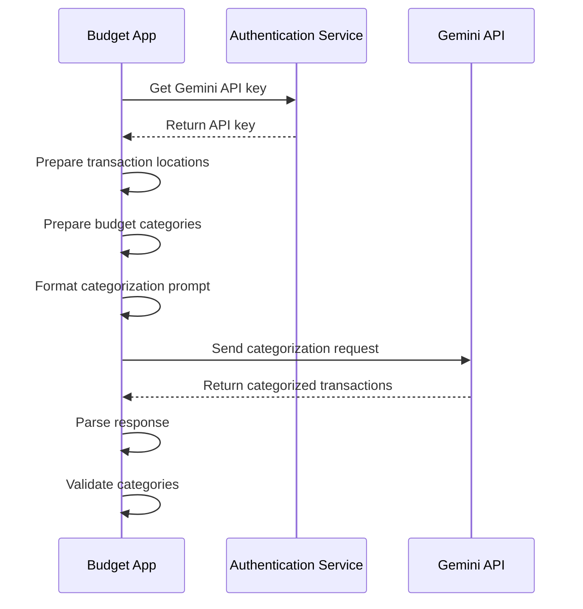
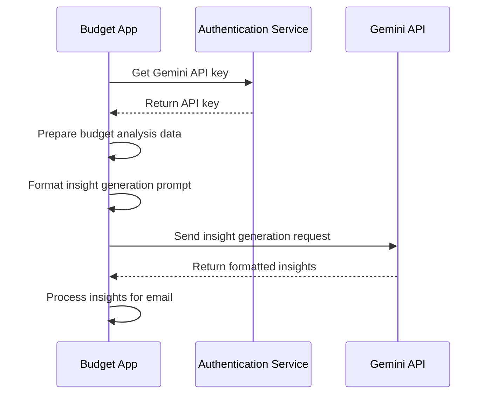
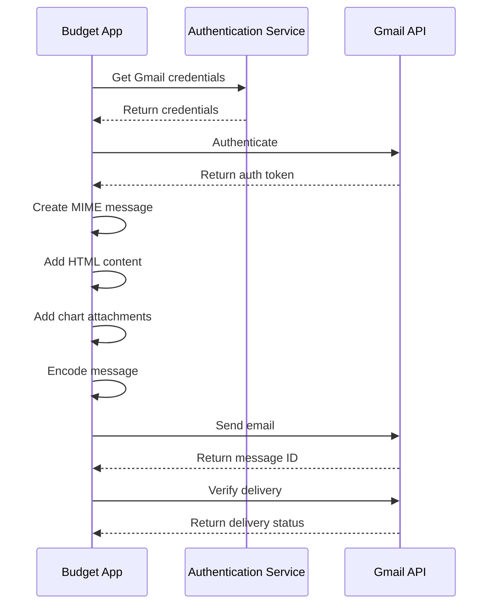

# API Integration Documentation

This document provides comprehensive documentation for the external API integrations used in the Budget Management Application. It covers authentication methods, request/response patterns, error handling strategies, and implementation details for each integrated service.

## 1. Overview

The Budget Management Application integrates with the following external APIs:

1. **Capital One API** - For retrieving financial transactions and performing savings transfers
2. **Google Sheets API** - For storing and retrieving budget and transaction data
3. **Gemini API** - For AI-powered transaction categorization and insight generation
4. **Gmail API** - For sending budget reports via email

These integrations form the core functionality of the application, enabling automated budget management without requiring a custom user interface.

### 1.1 Integration Architecture

```mermaid
graph TD
    subgraph "Budget Management Application"
        TR[Transaction Retriever]
        TC[Transaction Categorizer]
        BA[Budget Analyzer]
        IG[Insight Generator]
        RD[Report Distributor]
        SA[Savings Automator]
    end
    
    subgraph "Financial Services"
        CO[Capital One API]
        CO1[Transaction Endpoints]
        CO2[Account Endpoints]
        CO3[Transfer Endpoints]
        
        CO --- CO1
        CO --- CO2
        CO --- CO3
    end
    
    subgraph "Google Services"
        GS[Google Sheets API]
        GS1[Read Endpoints]
        GS2[Write Endpoints]
        
        GM[Gmail API]
        GM1[Send Endpoints]
        
        GE[Gemini API]
        GE1[Text Generation]
        GE2[Classification]
        
        GS --- GS1
        GS --- GS2
        GM --- GM1
        GE --- GE1
        GE --- GE2
    end
    
    TR --> CO1
    TR --> GS2
    TC --> GS1
    TC --> GE2
    TC --> GS2
    BA --> GS1
    IG --> GE1
    RD --> GM1
    SA --> CO2
    SA --> CO3
```



### 1.2 API Client Layer

The application implements a dedicated API client layer that abstracts the details of interacting with external services:



**Key Features of API Clients**:
- Encapsulate authentication logic
- Implement retry mechanisms with exponential backoff
- Handle error conditions gracefully
- Provide domain-specific methods for service interactions
- Abstract away API-specific details from business logic

## 2. Authentication Framework

The Budget Management Application implements a comprehensive authentication framework to secure access to external APIs and protect sensitive operations.

### 2.1 Authentication Methods

| API | Authentication Method | Implementation Details |
|-----|----------------------|------------------------|
| Capital One API | OAuth 2.0 | Client credentials flow with refresh token mechanism |
| Google Sheets API | OAuth 2.0 | Service account authentication for backend services |
| Gemini API | API Key | Secure API key storage in Secret Manager |
| Gmail API | OAuth 2.0 | Service account authentication with domain-wide delegation |

**Authentication Flow**:



### 2.2 Token Management

| Token Type | Storage Method | Refresh Mechanism | Expiration Handling |
|------------|----------------|-------------------|---------------------|
| OAuth Access Tokens | In-memory only | Automatic refresh when expired | Exponential backoff on auth failures |
| API Keys | Secret Manager | Manual rotation | Graceful error handling |
| Refresh Tokens | Secret Manager | N/A | Alert on expiration |

The application implements token caching to minimize authentication overhead:

```python
# Token cache implementation (simplified)
TOKEN_CACHE = {}
TOKEN_EXPIRY = {}

def cache_token(service_name, token, expires_in):
    TOKEN_CACHE[service_name] = token
    TOKEN_EXPIRY[service_name] = time.time() + expires_in

def is_token_expired(service_name):
    if service_name not in TOKEN_EXPIRY:
        return True
    return time.time() > TOKEN_EXPIRY[service_name]

def get_token(service_name):
    if service_name in TOKEN_CACHE and not is_token_expired(service_name):
        return TOKEN_CACHE[service_name]
    # Authenticate and get new token
    # ...
```

### 2.3 Credential Storage

The application leverages Google Secret Manager for secure credential storage, providing:

1. Automatic encryption of stored secrets
2. Version control for credentials
3. Fine-grained access control
4. Audit logging of secret access

**Credential Retrieval**:

```python
# Credential retrieval (simplified)
def get_api_credentials(service_name):
    """Retrieve API credentials from Secret Manager."""
    if service_name == 'capital_one':
        return load_json_secret('capital-one-credentials')
    elif service_name == 'google_sheets':
        return load_json_secret('google-sheets-service-account')
    elif service_name == 'gmail':
        return load_json_secret('gmail-service-account')
    elif service_name == 'gemini':
        return {'api_key': get_secret('gemini-api-key')}
    else:
        raise ValueError(f"Unknown service: {service_name}")
```

### 2.4 API Permissions

| API | Required Permissions | Scope Limitation Strategy |
|---------|---------------------|---------------------------|
| Capital One API | Transaction read, Transfer initiate | Limited to specific accounts only |
| Google Sheets API | Read/write specific sheets | Scoped to specific spreadsheet IDs |
| Gmail API | Send email | Limited to send-only permission |
| Gemini API | Text generation | Limited to required models only |

**Scope Configuration Example**:

```python
# API settings (simplified)
API_SETTINGS = {
    'GOOGLE_SHEETS': {
        'API_VERSION': 'v4',
        'SCOPES': ['https://www.googleapis.com/auth/spreadsheets']
    },
    'GMAIL': {
        'API_VERSION': 'v1',
        'SCOPES': ['https://www.googleapis.com/auth/gmail.send']
    }
    # ...
}
```

## 3. Capital One API Integration

The Capital One API integration enables the application to retrieve transaction data and perform savings transfers.

### 3.1 API Endpoints

| Endpoint | Method | Purpose | Request Parameters |
|----------|--------|---------|-------------------|
| `/accounts/{id}/transactions` | GET | Retrieve transactions | `startDate`, `endDate` |
| `/accounts/{id}` | GET | Get account details | None |
| `/transfers` | POST | Initiate fund transfer | `sourceAccountId`, `destinationAccountId`, `amount` |
| `/transfers/{id}` | GET | Check transfer status | None |

### 3.2 Authentication

**Authentication Method**: OAuth 2.0 Client Credentials Flow

**Authentication Process**:
1. Retrieve client ID and client secret from Secret Manager
2. Request access token from Capital One authentication endpoint
3. Store token with expiration time
4. Include token in Authorization header for API requests
5. Refresh token when expired

**Authentication Code Example**:

```python
def authenticate_capital_one(self):
    """Authenticate with Capital One API using OAuth 2.0."""
    try:
        # Check if valid token exists in cache and not expired
        if not is_token_expired('capital_one'):
            return TOKEN_CACHE['capital_one']
            
        # Get Capital One API credentials
        credentials = get_api_credentials('capital_one')
        client_id = credentials['client_id']
        client_secret = credentials['client_secret']
        
        # Prepare OAuth 2.0 token request
        auth_data = {
            'grant_type': 'client_credentials',
            'client_id': client_id,
            'client_secret': client_secret
        }
        
        # Send request to Capital One auth endpoint
        response = requests.post(
            API_SETTINGS['CAPITAL_ONE']['auth_url'],
            data=auth_data,
            headers={'Content-Type': 'application/x-www-form-urlencoded'}
        )
        
        # Validate response
        response.raise_for_status()
        auth_response = response.json()
        
        # Cache token with expiry time
        access_token = auth_response['access_token']
        expires_in = auth_response['expires_in']
        cache_token('capital_one', access_token, expires_in)
        
        return auth_response
    except Exception as e:
        handle_auth_error(e, 'Capital One')
        raise
```

### 3.3 Transaction Retrieval

**Process Flow**:



**Implementation Example**:

```python
def get_weekly_transactions(self):
    """Get transactions from the past week."""
    try:
        # Get date range for past week
        start_date, end_date = get_date_range()
        
        # Call get_transactions with date range
        response = self.get_transactions(start_date, end_date)
        
        # Check if response is successful
        if 'transactions' in response:
            # Extract transactions from response
            transactions = response['transactions']
            
            # Convert API transactions to Transaction objects
            return create_transactions_from_capital_one(transactions)
        else:
            logger.error(f"Failed to retrieve transactions: {response}")
            return []
    except Exception as e:
        logger.error(f"Error retrieving weekly transactions: {e}")
        return []
```

### 3.4 Savings Transfer

**Process Flow**:



**Implementation Example**:

```python
def transfer_to_savings(self, amount):
    """Transfer funds from checking to savings account."""
    try:
        # Validate amount is positive
        if amount <= 0:
            logger.warning(f"Cannot transfer non-positive amount: {amount}")
            return {"error": "Transfer amount must be positive"}
            
        # Initiate transfer
        response = self.initiate_transfer(
            amount=amount,
            source_account_id=self.checking_account_id,
            destination_account_id=self.savings_account_id
        )
        
        # Log transfer details (with masked account IDs)
        logger.info(
            f"Initiated transfer of ${amount} from checking to savings"
        )
        
        return response
    except Exception as e:
        logger.error(f"Error transferring to savings: {e}")
        return {"error": str(e)}
```

### 3.5 Error Handling

| Error Type | Handling Strategy | Recovery Action |
|------------|-------------------|----------------|
| Authentication Failure | Retry with credential refresh | Notify after max retries |
| API Timeout | Retry with exponential backoff | Retry up to 3 times with increasing delays |
| Rate Limiting | Implement backoff and retry | Wait according to API guidelines, then retry |
| Transaction Retrieval Error | Log error and return empty list | Continue with available data |
| Transfer Failure | Log error and abort transfer | Notify with clear explanation |

**Retry Implementation**:

```python
@retry_with_backoff(exceptions=(requests.RequestException,), max_retries=3)
def get_transactions(self, start_date, end_date):
    """Retrieve transactions from the checking account for a date range."""
    try:
        # Build API endpoint URL
        endpoint = f"{self.base_url}/accounts/{self.checking_account_id}/transactions"
        
        # Get authentication headers
        headers = self.get_auth_headers()
        
        # Set query parameters
        params = {
            'startDate': start_date,
            'endDate': end_date
        }
        
        # Make API request
        response = requests.get(endpoint, headers=headers, params=params)
        response.raise_for_status()
        
        return response.json()
    except requests.RequestException as e:
        return handle_api_error(e, "retrieving transactions")
```

## 4. Google Sheets API Integration

The Google Sheets API integration enables the application to store and retrieve budget and transaction data.

### 4.1 API Endpoints

| Endpoint | Method | Purpose | Request Parameters |
|----------|--------|---------|-------------------|
| `/spreadsheets/{id}/values/{range}` | GET | Read sheet data | `majorDimension`, `valueRenderOption` |
| `/spreadsheets/{id}/values/{range}:append` | POST | Append rows | `valueInputOption`, `insertDataOption`, `values` |
| `/spreadsheets/{id}/values/{range}` | PUT | Update cells | `valueInputOption`, `values` |
| `/spreadsheets/{id}/values:batchUpdate` | POST | Batch update | `data`, `valueInputOption` |

### 4.2 Authentication

**Authentication Method**: OAuth 2.0 Service Account

**Authentication Process**:
1. Retrieve service account credentials from Secret Manager
2. Create service account credentials object from JSON credentials
3. Set required scopes for Google Sheets API
4. Use credentials to build Google Sheets service

**Authentication Code Example**:

```python
def authenticate_google_sheets(self):
    """Authenticate with Google Sheets API using service account."""
    try:
        # Check if credentials exist in credentials_cache
        if 'google_sheets' in self.credentials_cache:
            return self.credentials_cache['google_sheets']
            
        # Get Google Sheets API credentials
        credentials_json = get_api_credentials('google_sheets')
        
        # Create service account credentials
        credentials = service_account.Credentials.from_service_account_info(
            credentials_json,
            scopes=API_SETTINGS['GOOGLE_SHEETS']['SCOPES']
        )
        
        # Refresh credentials to ensure they're valid
        request = google.auth.transport.requests.Request()
        credentials.refresh(request)
        
        # Cache credentials
        self.credentials_cache['google_sheets'] = credentials
        
        return credentials
    except Exception as e:
        handle_auth_error(e, 'Google Sheets')
        raise
```

### 4.3 Data Operations

**Process Flow**:



**Implementation Examples**:

```python
# Reading data
def get_weekly_spending_data(self):
    """Get transaction data from Weekly Spending sheet."""
    self.ensure_authenticated()
    range_name = f"{WEEKLY_SPENDING_SHEET_NAME}!A2:D"
    result = self.read_sheet(
        self.weekly_spending_id,
        range_name,
        'FORMATTED_VALUE'
    )
    logger.info(f"Retrieved {len(result)} transactions from Weekly Spending sheet")
    return result

# Writing data
def append_transactions(self, transactions):
    """Append transactions to Weekly Spending sheet."""
    self.ensure_authenticated()
    
    # Convert transactions to sheet format
    values = [transaction.to_sheets_format() for transaction in transactions]
    
    # Append to sheet
    result = self.append_rows(
        self.weekly_spending_id,
        f"{WEEKLY_SPENDING_SHEET_NAME}!A:D",
        values,
        'USER_ENTERED',
        'INSERT_ROWS'
    )
    
    logger.info(f"Appended {len(transactions)} transactions to Weekly Spending sheet")
    return len(transactions)
```

### 4.4 Error Handling

| Error Type | Handling Strategy | Recovery Action |
|------------|-------------------|----------------|
| Authentication Failure | Retry with credential refresh | Notify after max retries |
| API Timeout | Retry with exponential backoff | Retry up to 3 times with increasing delays |
| Rate Limiting | Implement backoff and retry | Wait according to API guidelines, then retry |
| Sheet Not Found | Log error and abort operation | Notify with clear explanation |
| Permission Error | Log error and abort operation | Verify service account permissions |

**Retry Implementation**:

```python
@retry_with_backoff(googleapiclient.errors.HttpError, max_retries=3)
def read_sheet(self, spreadsheet_id, range_name, value_render_option='FORMATTED_VALUE'):
    """Read data from a Google Sheet."""
    try:
        self.ensure_authenticated()
        result = self.service.spreadsheets().values().get(
            spreadsheetId=spreadsheet_id,
            range=range_name,
            valueRenderOption=value_render_option
        ).execute()
        
        values = result.get('values', [])
        return values
    except googleapiclient.errors.HttpError as e:
        error_details = json.loads(e.content.decode('utf-8'))
        logger.error(f"Error reading sheet: {error_details}")
        if e.resp.status == 404:
            logger.error(f"Sheet or range not found: {range_name}")
        raise
```

## 5. Gemini API Integration

The Gemini API integration enables AI-powered transaction categorization and spending insight generation.

### 5.1 API Endpoints

| Endpoint | Method | Purpose | Request Parameters |
|----------|--------|---------|-------------------|
| `/models/{model}:generateContent` | POST | Generate text | `contents`, `generationConfig`, `safetySettings` |
| `/models/{model}:streamGenerateContent` | POST | Stream generation | `contents`, `generationConfig`, `safetySettings` |

### 5.2 Authentication

**Authentication Method**: API Key

**Authentication Process**:
1. Retrieve Gemini API key from Secret Manager
2. Include API key in request headers

**Authentication Code Example**:

```python
def authenticate_gemini(self):
    """Authenticate with Gemini API using API key."""
    try:
        # Get Gemini API key
        api_key = get_secret('gemini-api-key')
        
        # Validate API key
        if not api_key or len(api_key) < 10:  # Simple validation
            raise AuthenticationError("Invalid Gemini API key")
            
        logger.info("Successfully authenticated with Gemini API")
        return {"api_key": api_key}
    except Exception as e:
        handle_auth_error(e, 'Gemini')
        raise
```

### 5.3 Transaction Categorization

**Process Flow**:



**Implementation Example**:

```python
def categorize_transactions(self, transaction_locations, budget_categories):
    """Categorize transactions using Gemini AI."""
    try:
        # Validate input parameters
        if not transaction_locations or not budget_categories:
            raise ValidationError("Missing transaction locations or budget categories")
            
        # Format transaction locations and budget categories
        locations_str = "\n".join(transaction_locations)
        categories_str = "\n".join(budget_categories)
        
        # Prepare variables for prompt template
        variables = {
            "transaction_locations": locations_str,
            "budget_categories": categories_str
        }
        
        # Format the categorization prompt
        prompt = self.format_prompt("categorization_prompt", variables)
        
        # Call Gemini API
        response_text = self.generate_completion(prompt)
        
        # Parse the response
        result = self.parse_categorization_response(response_text, budget_categories)
        
        logger.info(f"Successfully categorized {len(result)} transactions")
        return result
    except Exception as e:
        logger.error(f"Error categorizing transactions: {e}")
        raise
```

### 5.4 Insight Generation

**Process Flow**:



**Implementation Example**:

```python
def generate_spending_insights(self, budget_analysis):
    """Generate spending insights using Gemini AI."""
    try:
        # Validate budget_analysis input
        if not budget_analysis or 'total_status' not in budget_analysis:
            raise ValidationError("Invalid budget analysis data")
            
        # Extract required data
        total_status = budget_analysis['total_status']
        category_variances = budget_analysis['category_variances']
        
        # Format category breakdown
        category_breakdown = []
        for category in category_variances:
            category_breakdown.append(
                f"Category: {category['name']}\n"
                f"Budget: ${category['budget_amount']}\n"
                f"Actual: ${category['actual_amount']}\n"
                f"Variance: ${category['variance_amount']} ({category['variance_percentage']}%)"
            )
        category_breakdown_str = "\n\n".join(category_breakdown)
        
        # Prepare variables for prompt template
        variables = {
            "total_budget": total_status['total_budget'],
            "total_spent": total_status['total_actual'],
            "total_variance": total_status['total_variance'],
            "status": total_status['status'],
            "category_breakdown": category_breakdown_str
        }
        
        # Format the insight generation prompt
        prompt = self.format_prompt("insight_generation_prompt", variables)
        
        # Call Gemini API
        insights_text = self.generate_completion(prompt)
        
        logger.info("Successfully generated spending insights")
        return insights_text
    except Exception as e:
        logger.error(f"Error generating spending insights: {e}")
        raise
```

### 5.5 Error Handling

| Error Type | Handling Strategy | Recovery Action |
|------------|-------------------|----------------|
| Authentication Failure | Retry with new API key | Notify after max retries |
| API Timeout | Retry with exponential backoff | Retry up to 3 times with increasing delays |
| Rate Limiting | Implement backoff and retry | Wait according to API guidelines, then retry |
| Invalid Response | Retry with simplified prompt | Use template-based fallback after max retries |
| Token Limit Exceeded | Reduce prompt complexity | Simplify request and retry |

**Retry Implementation**:

```python
@retry_with_backoff(exceptions=(requests.RequestException,), max_retries=3)
def generate_completion(self, prompt, generation_config=None):
    """Generate a completion from Gemini AI."""
    try:
        # Ensure client is authenticated
        if not self.api_key:
            auth_result = self.authenticate()
            self.api_key = auth_result['api_key']
            
        # Set default generation config if not provided
        if generation_config is None:
            generation_config = {
                "temperature": 0.2,
                "topK": 40,
                "topP": 0.95,
                "maxOutputTokens": 1024,
            }
            
        # Prepare request payload
        payload = {
            "contents": [{
                "parts": [{
                    "text": prompt
                }]
            }],
            "generationConfig": generation_config
        }
        
        # Construct API endpoint URL
        url = f"{self.api_url}/models/{self.model}:generateContent"
        
        # Send request to Gemini API
        response = requests.post(
            url,
            headers={"Content-Type": "application/json", "x-goog-api-key": self.api_key},
            json=payload
        )
        response.raise_for_status()
        
        # Parse response
        response_json = response.json()
        
        # Validate response
        if not self.validate_api_response(response_json):
            raise APIError("Invalid response from Gemini API")
            
        # Extract generated text
        generated_text = self.extract_generated_text(response_json)
        
        return generated_text
    except requests.RequestException as e:
        return handle_api_error(e, "generating completion from Gemini AI")
```

## 6. Gmail API Integration

The Gmail API integration enables sending budget reports via email.

### 6.1 API Endpoints

| Endpoint | Method | Purpose | Request Parameters |
|----------|--------|---------|-------------------|
| `/users/{userId}/messages/send` | POST | Send email | `raw` (Base64 encoded MIME message) |
| `/users/{userId}/messages/{id}` | GET | Get message details | `format` |

### 6.2 Authentication

**Authentication Method**: OAuth 2.0 Service Account with Domain-Wide Delegation

**Authentication Process**:
1. Retrieve service account credentials from Secret Manager
2. Create service account credentials object from JSON credentials
3. Set required scopes for Gmail API
4. Use credentials to build Gmail service

**Authentication Code Example**:

```python
def authenticate_gmail(self):
    """Authenticate with Gmail API using service account."""
    try:
        # Check if credentials exist in credentials_cache
        if 'gmail' in self.credentials_cache:
            return self.credentials_cache['gmail']
            
        # Get Gmail API credentials
        credentials_json = get_api_credentials('gmail')
        
        # Create service account credentials
        credentials = service_account.Credentials.from_service_account_info(
            credentials_json,
            scopes=API_SETTINGS['GMAIL']['SCOPES']
        )
        
        # Add subject for domain-wide delegation
        delegated_credentials = credentials.with_subject(APP_SETTINGS['EMAIL_SENDER'])
        
        # Refresh credentials to ensure they're valid
        request = google.auth.transport.requests.Request()
        delegated_credentials.refresh(request)
        
        # Cache credentials
        self.credentials_cache['gmail'] = delegated_credentials
        
        return delegated_credentials
    except Exception as e:
        handle_auth_error(e, 'Gmail')
        raise
```

### 6.3 Email Sending

**Process Flow**:



**Implementation Example**:

```python
def send_email(self, subject, html_content, recipients, attachment_paths=None):
    """Sends an email via Gmail API."""
    try:
        # Validate recipients
        validate_email_addresses(recipients)
        
        # Ensure client is authenticated
        if not self.is_authenticated():
            self.authenticate()
            
        # Create base message
        message = create_message(
            sender=self.sender_email,
            recipients=recipients,
            subject=subject,
            html_content=html_content
        )
        
        # Add attachments if provided
        if attachment_paths:
            for i, path in enumerate(attachment_paths):
                content_id = f"image{i}" if path.endswith(('.png', '.jpg', '.jpeg', '.gif')) else None
                add_attachment(message, path, content_id)
                
        # Encode message
        encoded_message = base64.urlsafe_b64encode(message.as_bytes()).decode()
        
        # Send message
        result = self.service.users().messages().send(
            userId=self.user_id,
            body={'raw': encoded_message}
        ).execute()
        
        message_id = result.get('id')
        logger.info(f"Email sent successfully. Message ID: {message_id}")
        
        return {
            'success': True,
            'message_id': message_id
        }
    except Exception as e:
        logger.error(f"Error sending email: {e}")
        return {
            'success': False,
            'error': str(e)
        }
```

### 6.4 Error Handling

| Error Type | Handling Strategy | Recovery Action |
|------------|-------------------|----------------|
| Authentication Failure | Retry with credential refresh | Notify after max retries |
| API Timeout | Retry with exponential backoff | Retry up to 3 times with increasing delays |
| Rate Limiting | Implement backoff and retry | Wait according to API guidelines, then retry |
| Invalid Recipients | Filter invalid addresses | Continue with valid recipients |
| Attachment Error | Skip problematic attachments | Include text description of missing attachments |

**Retry Implementation**:

```python
@retry_with_backoff(exceptions=(APIError, googleapiclient.errors.HttpError), max_retries=3)
def authenticate(self):
    """Authenticates with Gmail API."""
    try:
        logger.info("Authenticating with Gmail API")
        
        # Get Gmail credentials
        credentials = self.auth_service.authenticate_gmail()
        
        # Create Gmail API service
        self.service = googleapiclient.discovery.build(
            'gmail', 'v1', credentials=credentials
        )
        
        logger.info("Successfully authenticated with Gmail API")
        return True
    except Exception as e:
        logger.error(f"Failed to authenticate with Gmail API: {e}")
        raise
```

## 7. Common Integration Patterns

The Budget Management Application implements several common patterns across all API integrations to ensure reliability, security, and maintainability.

### 7.1 Retry Strategy

All API integrations implement a consistent retry strategy using the `retry_with_backoff` decorator:

```python
def retry_with_backoff(exceptions, max_retries=3, backoff_factor=2, initial_wait=1):
    """Retry decorator with exponential backoff."""
    def decorator(func):
        @functools.wraps(func)
        def wrapper(*args, **kwargs):
            wait_time = initial_wait
            retries = 0
            
            while retries <= max_retries:
                try:
                    return func(*args, **kwargs)
                except exceptions as e:
                    retries += 1
                    if retries > max_retries:
                        logger.error(
                            f"Max retries ({max_retries}) exceeded for {func.__name__}"
                        )
                        raise
                        
                    # Check if error is retriable
                    if hasattr(e, 'response') and hasattr(e.response, 'status_code'):
                        if e.response.status_code not in RETRY_SETTINGS['RETRIABLE_STATUS_CODES']:
                            logger.error(f"Non-retriable status code: {e.response.status_code}")
                            raise
                    
                    # Calculate wait time with jitter
                    jitter = random.uniform(0.8, 1.2)
                    adjusted_wait = wait_time * jitter
                    
                    logger.warning(
                        f"Retrying {func.__name__} after error: {e}. "
                        f"Retry {retries}/{max_retries}. Waiting {adjusted_wait:.2f}s"
                    )
                    
                    time.sleep(adjusted_wait)
                    wait_time *= backoff_factor
        return wrapper
    return decorator
```

**Key Features**:
- Exponential backoff with jitter to prevent thundering herd problems
- Configurable retry count, backoff factor, and initial wait time
- Selective retry based on error type and status code
- Comprehensive logging of retry attempts

### 7.2 Error Handling

Standardized error handling is implemented across all API integrations:

```python
def handle_api_error(error, operation_description):
    """Standardized handling of API errors."""
    error_response = {
        "error": True,
        "message": f"Error {operation_description}"
    }
    
    if hasattr(error, 'response') and error.response is not None:
        status_code = error.response.status_code
        error_response["status_code"] = status_code
        
        # Try to extract error details from response
        try:
            error_details = error.response.json()
            error_response["details"] = error_details
        except (ValueError, AttributeError):
            error_response["details"] = str(error)
            
        # Log appropriate error message based on status code
        if status_code == 401:
            logger.error(f"Authentication error while {operation_description}: {error}")
            error_response["error_type"] = "authentication"
        elif status_code == 403:
            logger.error(f"Permission denied while {operation_description}: {error}")
            error_response["error_type"] = "permission"
        elif status_code == 404:
            logger.error(f"Resource not found while {operation_description}: {error}")
            error_response["error_type"] = "not_found"
        elif status_code == 429:
            logger.error(f"Rate limit exceeded while {operation_description}: {error}")
            error_response["error_type"] = "rate_limit"
        elif 500 <= status_code < 600:
            logger.error(f"Server error while {operation_description}: {error}")
            error_response["error_type"] = "server"
        else:
            logger.error(f"Error {operation_description}: {error}")
            error_response["error_type"] = "general"
    else:
        logger.error(f"Error {operation_description}: {error}")
        error_response["details"] = str(error)
        error_response["error_type"] = "general"
        
    return error_response
```

**Key Features**:
- Consistent error response format across all API integrations
- Detailed error logging with context
- Error categorization based on status code
- Extraction of error details from response when available

### 7.3 Credential Management

Secure credential management is implemented across all API integrations:

```python
# In settings.py
def get_secret(secret_name):
    """Retrieve a secret from Google Secret Manager."""
    try:
        # For local development, try environment variables first
        env_var = f"SECRET_{secret_name.upper().replace('-', '_')}"
        if os.environ.get(env_var):
            return os.environ.get(env_var)
            
        # In production, use Google Secret Manager
        from google.cloud import secretmanager
        
        client = secretmanager.SecretManagerServiceClient()
        name = f"projects/{PROJECT_ID}/secrets/{secret_name}/versions/latest"
        response = client.access_secret_version(request={"name": name})
        return response.payload.data.decode("UTF-8")
    except Exception as e:
        logger.error(f"Error retrieving secret {secret_name}: {e}")
        raise

def load_json_secret(secret_name):
    """Load a JSON-formatted secret."""
    secret_value = get_secret(secret_name)
    return json.loads(secret_value)
```

**Key Features**:
- Secure retrieval of credentials from Google Secret Manager
- Environment variable fallback for local development
- Support for both string and JSON-formatted credentials
- Error handling for credential retrieval failures

### 7.4 Rate Limiting

Rate limiting awareness is implemented across all API integrations:

```python
# Rate limit handling example
def handle_rate_limit(response):
    """Handle rate limiting by waiting the appropriate time."""
    if 'Retry-After' in response.headers:
        retry_after = int(response.headers['Retry-After'])
    else:
        # Default to 30 seconds if no Retry-After header
        retry_after = 30
        
    logger.warning(f"Rate limit exceeded. Waiting {retry_after} seconds before retry.")
    time.sleep(retry_after)
    return True
```

**Key Features**:
- Respect for API-provided Retry-After headers
- Fallback to reasonable default wait times
- Logging of rate limit events
- Integration with retry mechanism

## 8. Testing API Integrations

The Budget Management Application includes comprehensive testing for all API integrations.

### 8.1 Mock Implementations

Each API client has a corresponding mock implementation for testing:

```python
# Example mock implementation for Capital One client
class MockCapitalOneClient:
    def __init__(self, transactions=None, accounts=None, transfer_response=None):
        self.transactions = transactions or []
        self.accounts = accounts or {
            'checking': {'account_id': 'check123', 'balance': 1000.00},
            'savings': {'account_id': 'save456', 'balance': 5000.00}
        }
        self.transfer_response = transfer_response or {'transfer_id': 'tr123', 'status': 'completed'}
        self.transfer_initiated = False
        self.transfer_amount = 0
        
    def authenticate(self):
        return True
        
    def get_weekly_transactions(self):
        return self.transactions
        
    def get_checking_account_details(self):
        return self.accounts['checking']
        
    def get_savings_account_details(self):
        return self.accounts['savings']
        
    def transfer_to_savings(self, amount):
        self.transfer_initiated = True
        self.transfer_amount = amount
        return self.transfer_response
        
    def verify_transfer_completion(self, transfer_id):
        return True
        
    def test_connectivity(self):
        return True
```

### 8.2 Integration Tests

Integration tests verify the correct interaction with external APIs:

```python
# Example integration test for transaction retrieval
def test_transaction_flow(mocker):
    # Mock Capital One API responses
    mock_transactions = [
        {'location': 'Grocery Store', 'amount': 45.67, 'timestamp': '2023-07-20T14:30:00Z'},
        {'location': 'Gas Station', 'amount': 35.82, 'timestamp': '2023-07-21T10:15:00Z'}
    ]
    
    # Create mock client
    mock_capital_one = MockCapitalOneClient(transactions=mock_transactions)
    
    # Create mock sheets client
    mock_sheets = MockGoogleSheetsClient()
    
    # Create transaction retriever with mocks
    retriever = TransactionRetriever(
        capital_one_client=mock_capital_one,
        sheets_client=mock_sheets
    )
    
    # Execute retriever
    result = retriever.execute()
    
    # Verify results
    assert result['status'] == 'success'
    assert len(result['transactions']) == 2
    
    # Verify data was written to sheets
    sheet_data = mock_sheets.get_sheet_data('Weekly Spending')
    assert len(sheet_data) == 2
    assert sheet_data[0][0] == 'Grocery Store'
    assert float(sheet_data[0][1]) == 45.67
```

### 8.3 Error Scenario Testing

Tests for error scenarios ensure proper handling of API failures:

```python
# Example test for API error handling
def test_capital_one_api_error_handling(mocker):
    # Mock requests to simulate API error
    mock_response = mocker.Mock()
    mock_response.status_code = 429
    mock_response.json.return_value = {'error': 'Rate limit exceeded'}
    mock_response.raise_for_status.side_effect = requests.exceptions.HTTPError(
        "429 Client Error: Too Many Requests", response=mock_response
    )
    
    mocker.patch('requests.get', return_value=mock_response)
    
    # Create client with real implementation
    client = CapitalOneClient(auth_service=MockAuthenticationService())
    
    # Mock authenticate to return success
    mocker.patch.object(client, 'authenticate', return_value=True)
    mocker.patch.object(client, 'get_auth_headers', return_value={'Authorization': 'Bearer test-token'})
    
    # Call method that should trigger retry
    with pytest.raises(requests.exceptions.HTTPError):
        client.get_transactions('2023-07-01', '2023-07-31')
        
    # Verify retry was attempted (requests.get called multiple times)
    assert requests.get.call_count > 1
```

## 9. Security Considerations

The Budget Management Application implements several security measures for API integrations.

### 9.1 Secure Communication

All API communications use secure channels:

- HTTPS/TLS 1.2+ for all HTTP traffic
- Certificate validation to prevent MITM attacks
- Secure header practices (no sensitive data in headers)
- HTTP response validation before processing

### 9.2 Credential Protection

API credentials are protected using several mechanisms:

- Storage in Google Secret Manager with encryption at rest
- In-memory only for access tokens during execution
- No logging of sensitive credentials or tokens
- Automatic token refresh to minimize credential exposure
- Principle of least privilege for all API permissions

### 9.3 Data Protection

Sensitive data is protected throughout API interactions:

- Masking of account numbers in logs (e.g., `XXXX-XXXX-XXXX-1234`)
- Redaction of API tokens in logs (e.g., `[REDACTED]`)
- Minimal data retention - only storing what's needed
- Validation of data before processing to prevent injection attacks
- Secure handling of financial transaction data

### 9.4 API Permission Scopes

The application uses minimal permission scopes for each API:

| API | Scopes Used | Purpose |
|-----|------------|----------|
| Capital One API | `transactions:read`, `accounts:read`, `transfers:write` | Retrieve transactions, check account status, initiate transfers |
| Google Sheets API | `https://www.googleapis.com/auth/spreadsheets` | Read and write to specific spreadsheets |
| Gmail API | `https://www.googleapis.com/auth/gmail.send` | Send emails only (no read access) |
| Gemini API | Model access permissions | Access specific AI models for text generation |

## 10. Troubleshooting

This section provides guidance for troubleshooting common API integration issues.

### 10.1 Authentication Issues

**Common Problems**:
- Expired credentials
- Invalid API keys
- Insufficient permissions
- Misconfigured service accounts

**Troubleshooting Steps**:
1. Check logs for specific authentication errors
2. Verify credentials in Secret Manager
3. Ensure API services are enabled in Google Cloud Console
4. Check for expired tokens and force refresh
5. Verify service account has required permissions

### 10.2 API Response Issues

**Common Problems**:
- Rate limiting
- API service outages
- Malformed requests
- Unexpected response formats

**Troubleshooting Steps**:
1. Check logs for specific API error responses
2. Verify API service status (Capital One, Google, etc.)
3. Inspect request parameters for correctness
4. Check for rate limiting headers in responses
5. Verify API version compatibility

### 10.3 Data Processing Issues

**Common Problems**:
- Missing or invalid transaction data
- Incorrect categorization
- Budget calculation errors
- Failed transfers

**Troubleshooting Steps**:
1. Check logs for validation errors
2. Inspect Google Sheets data for consistency
3. Verify transaction data from Capital One
4. Check Gemini AI responses for expected format
5. Verify transfer confirmations from Capital One

### 10.4 Common Error Codes

| API | Error Code | Description | Resolution |
|-----|------------|-------------|------------|
| Capital One | 401 | Unauthorized | Refresh authentication token |
| Capital One | 429 | Rate limit exceeded | Implement backoff and retry |
| Google Sheets | 404 | Sheet not found | Verify spreadsheet ID and permissions |
| Google Sheets | 403 | Permission denied | Check service account permissions |
| Gemini | 400 | Invalid request | Check prompt format and parameters |
| Gemini | 429 | Quota exceeded | Implement backoff or optimize token usage |
| Gmail | 403 | Permission denied | Verify service account delegation |
| Gmail | 400 | Invalid message | Check email format and recipients |

## 11. Conclusion

The API integrations in the Budget Management Application form the core of its functionality, enabling automated transaction retrieval, data storage, AI-powered analysis, and communication. By implementing robust authentication, error handling, and security measures, the application ensures reliable operation with minimal maintenance requirements.

The modular design of the API client layer allows for easy updates or replacements of individual integrations without affecting the overall application architecture. This flexibility ensures the application can adapt to API changes or new requirements over time.