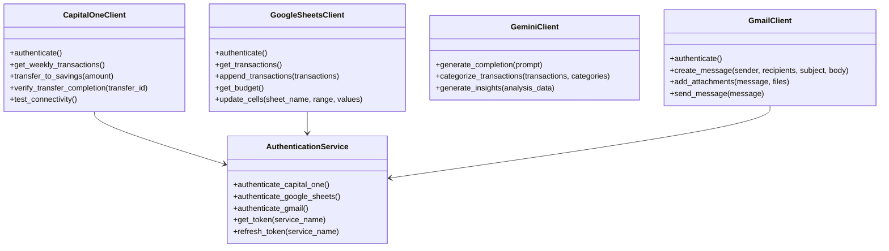

# Budget Management Application Architecture

This document provides a comprehensive overview of the Budget Management Application architecture, including system design, component interactions, data flow, and deployment architecture.

## 1. System Overview

The Budget Management Application is a serverless, event-driven system designed to automate personal budget tracking, analysis, and optimization. It operates autonomously on a weekly schedule, retrieving financial transactions, categorizing spending, analyzing budget performance, generating insights, and taking automated savings actions.

### 1.1 Architectural Style

The application follows a serverless, component-based architecture with the following key characteristics:

- **Serverless Execution**: Runs as a Google Cloud Run job triggered weekly by Cloud Scheduler
- **Event-Driven Design**: Processes data in a sequential workflow with clear boundaries between stages
- **Integration-Centric**: Leverages existing APIs (Capital One, Google Sheets, Gemini, Gmail) rather than building custom interfaces
- **Stateless Operation**: Maintains no persistent state between executions, relying on Google Sheets for data persistence

### 1.2 Key Architectural Principles

- **Separation of Concerns**: Each component handles a specific aspect of the budget management process
- **Idempotency**: Operations are designed to be safely repeatable without causing unintended side effects
- **Security-First Design**: Sensitive operations use secure authentication methods and credential management
- **Resilience**: Comprehensive error handling with retry mechanisms and graceful degradation
- **Observability**: Structured logging and monitoring for operational visibility

### 1.3 High-Level Architecture Diagram


## 2. Component Architecture

The application is structured as a set of specialized components, each responsible for a specific part of the budget management workflow. These components interact in a sequential flow, with each component building on the results of the previous one.

### 2.1 Component Overview


### 2.2 Component Details

#### 2.2.1 Transaction Retriever

**Purpose**: Extract transaction data from Capital One and store in Google Sheets

**Responsibilities**:
- Authenticate with Capital One API
- Retrieve transactions from the specified checking account for the past week
- Format transaction data for storage
- Write transaction data to the Weekly Spending Google Sheet

**Key Dependencies**:
- Capital One API for transaction data
- Google Sheets API for data storage
- Secret Manager for credential retrieval

#### 2.2.2 Transaction Categorizer

**Purpose**: Assign budget categories to transactions using Gemini AI

**Responsibilities**:
- Retrieve transaction data from the Weekly Spending sheet
- Retrieve budget categories from the Master Budget sheet
- Generate AI prompts for transaction categorization
- Process AI responses to extract category assignments
- Update the Weekly Spending sheet with assigned categories

**Key Dependencies**:
- Google Sheets API for data retrieval and storage
- Gemini API for AI-powered categorization

#### 2.2.3 Budget Analyzer

**Purpose**: Compare actual spending to budgeted amounts and calculate variances

**Responsibilities**:
- Retrieve categorized transactions from the Weekly Spending sheet
- Retrieve budget amounts from the Master Budget sheet
- Aggregate transactions by category
- Calculate variances between actual and budgeted amounts
- Determine total budget surplus or deficit

**Key Dependencies**:
- Google Sheets API for data retrieval

#### 2.2.4 Insight Generator

**Purpose**: Create comprehensive analysis of spending patterns using Gemini AI

**Responsibilities**:
- Prepare budget analysis data for AI processing
- Generate natural language insights using Gemini AI
- Create visualizations of budget performance
- Format content for email delivery

**Key Dependencies**:
- Gemini API for insight generation
- Visualization libraries for chart generation

#### 2.2.5 Report Distributor

**Purpose**: Send generated insights via email to specified recipients

**Responsibilities**:
- Authenticate with Gmail API
- Format email with insights and charts
- Send email to specified recipients
- Verify email delivery

**Key Dependencies**:
- Gmail API for email delivery

#### 2.2.6 Savings Automator

**Purpose**: Transfer budget surplus to a savings account

**Responsibilities**:
- Calculate transfer amount based on budget surplus
- Authenticate with Capital One API
- Initiate transfer from checking to savings account
- Verify transfer completion

**Key Dependencies**:
- Capital One API for fund transfer
- Budget surplus data from Budget Analyzer

### 2.3 API Client Layer

The application includes a dedicated API client layer that abstracts the details of interacting with external services:



**Key Features of API Clients**:
- Encapsulate authentication logic
- Implement retry mechanisms with exponential backoff
- Handle error conditions gracefully
- Provide domain-specific methods for service interactions
- Abstract away API-specific details from business logic

### 2.4 Model Layer

The application uses domain models to represent key business entities:


**Purpose of Models**:
- Provide type safety and validation
- Encapsulate business logic related to entities
- Facilitate data transformation between components
- Enable clean separation between data and behavior

### 2.5 Service Layer

The application includes cross-cutting services that provide functionality used by multiple components:


**Key Services**:
- **LoggingService**: Provides structured logging with context
- **ErrorHandlingService**: Standardizes error handling and retry logic
- **AuthenticationService**: Manages authentication with external APIs
- **DataTransformationService**: Handles data format conversions

## 3. Data Flow Architecture

The Budget Management Application processes data through a sequential workflow with the following primary data flows:

### 3.1 End-to-End Data Flow


### 3.2 Data Storage

The application uses Google Sheets as the primary data store, with the following structure:

#### Master Budget Sheet

| Column Name | Data Type | Description | Constraints |
|-------------|-----------|-------------|-------------|
| Spending Category | String | Name of budget category | Primary key, Unique, Required |
| Weekly Amount | Decimal | Budgeted amount for the week | Required, Non-negative |

#### Weekly Spending Sheet

| Column Name | Data Type | Description | Constraints |
|-------------|-----------|-------------|-------------|
| Transaction Location | String | Merchant name or location | Required |
| Transaction Amount | Decimal | Amount in USD | Required, Non-negative |
| Transaction Time | DateTime | Transaction timestamp in EST | Required |
| Corresponding Category | String | Budget category | Required, Foreign key to Master Budget |

**Data Relationships**:


### 3.3 Data Transformation

The application performs several key data transformations during processing:

1. **API Response to Transaction Objects**: Converting Capital One API responses to internal Transaction models
2. **Transaction Categorization**: Mapping transaction locations to budget categories using AI
3. **Budget Analysis**: Aggregating transactions by category and calculating variances
4. **Insight Generation**: Transforming raw analysis data into natural language insights
5. **Email Formatting**: Converting insights and charts into formatted email content

Each transformation is handled by the appropriate component, with standardized interfaces between components to ensure clean data flow.

## 4. Integration Architecture

The Budget Management Application integrates with multiple external APIs, each serving a specific purpose in the workflow.

### 4.1 API Integration Overview


### 4.2 API Authentication

| API | Authentication Method | Implementation Details |
|-----|----------------------|------------------------|
| Capital One API | OAuth 2.0 | Client credentials flow with refresh token mechanism |
| Google Sheets API | OAuth 2.0 | Service account authentication for backend services |
| Gemini API | API Key | Simple key-based authentication as per Google AI standards |
| Gmail API | OAuth 2.0 | Service account authentication with domain-wide delegation |

**Authentication Flow**:


### 4.3 Error Handling Strategy

| Error Type | Handling Approach | Recovery Mechanism |
|------------|-------------------|-------------------|
| Transient Errors | Retry with backoff | Exponential backoff with maximum retry limit |
| Data Validation Errors | Fallback processing | Continue with valid data, log invalid items |
| Authentication Errors | Token refresh | Automatic token refresh and retry |
| Critical Errors | Fail operation | Clear error notification, manual intervention |

**Error Handling Flow**:


### 4.4 Integration Specifications

#### 4.4.1 Capital One API

| Endpoint | Method | Purpose | Request Parameters |
|----------|--------|---------|-------------------|
| `/accounts/{id}/transactions` | GET | Retrieve transactions | `startDate`, `endDate` |
| `/accounts/{id}` | GET | Get account details | None |
| `/transfers` | POST | Initiate fund transfer | `sourceAccountId`, `destinationAccountId`, `amount` |
| `/transfers/{id}` | GET | Check transfer status | None |

#### 4.4.2 Google Sheets API

| Endpoint | Method | Purpose | Request Parameters |
|----------|--------|---------|-------------------|
| `/spreadsheets/{id}/values/{range}` | GET | Read sheet data | `majorDimension`, `valueRenderOption` |
| `/spreadsheets/{id}/values/{range}:append` | POST | Append rows | `valueInputOption`, `insertDataOption`, `values` |
| `/spreadsheets/{id}/values/{range}` | PUT | Update cells | `valueInputOption`, `values` |
| `/spreadsheets/{id}/values:batchUpdate` | POST | Batch update | `data`, `valueInputOption` |

#### 4.4.3 Gemini API

| Endpoint | Method | Purpose | Request Parameters |
|----------|--------|---------|-------------------|
| `/models/{model}:generateContent` | POST | Generate text | `contents`, `generationConfig`, `safetySettings` |
| `/models/{model}:streamGenerateContent` | POST | Stream generation | `contents`, `generationConfig`, `safetySettings` |

#### 4.4.4 Gmail API

| Endpoint | Method | Purpose | Request Parameters |
|----------|--------|---------|-------------------|
| `/users/{userId}/messages/send` | POST | Send email | `raw` (Base64 encoded MIME message) |
| `/users/{userId}/messages/{id}` | GET | Get message details | `format` |

## 5. Security Architecture

The Budget Management Application implements a comprehensive security architecture to protect sensitive financial data and ensure secure operations.

### 5.1 Authentication Framework

**Authentication Methods**:

| Token Type | Storage Method | Refresh Mechanism | Expiration Handling |
|------------|----------------|-------------------|---------------------|
| OAuth Access Tokens | In-memory only | Automatic refresh when expired | Exponential backoff on auth failures |
| API Keys | Secret Manager | Manual rotation | Graceful error handling |
| Refresh Tokens | Secret Manager | N/A | Alert on expiration |

**Credential Storage**:

The application leverages Google Secret Manager for secure credential storage, providing:

1. Automatic encryption of stored secrets
2. Version control for credentials
3. Fine-grained access control
4. Audit logging of secret access

### 5.2 Data Protection

**Encryption Standards**:

| Data Type | Encryption Method | Implementation |
|-----------|-------------------|---------------|
| API Credentials | AES-256 | Google Secret Manager encryption |
| Data in Transit | TLS 1.2+ | HTTPS for all API communications |
| Sensitive Logs | Redaction | PII and financial data masking |

**Data Masking Rules**:

| Data Element | Masking Rule | Example |
|--------------|--------------|----------|
| Account Numbers | Last 4 digits only | XXXX-XXXX-XXXX-1234 |
| Transaction Amounts | No masking (required for functionality) | $123.45 |
| Transaction Locations | No masking (required for categorization) | "Grocery Store" |
| API Tokens | Full masking in logs | [REDACTED] |

### 5.3 Financial Data Security

Given the application's focus on financial data, special attention is paid to securing financial operations:

| Financial Operation | Security Measures | Validation Steps |
|--------------------|-------------------|------------------|
| Transaction Retrieval | Read-only API access, Data validation | Verify transaction count and format |
| Savings Transfer | Amount validation, Transfer confirmation | Verify transfer receipt, Log confirmation |
| Budget Analysis | Data isolation, No persistent storage | Verify data cleanup after processing |

**Financial Transaction Security Flow**:


## 6. Deployment Architecture

The Budget Management Application is deployed on Google Cloud Platform using a serverless architecture centered around Cloud Run jobs.

### 6.1 Deployment Environment

**Target Environment**:

| Aspect | Details |
|--------|----------|
| Environment Type | Cloud-based (Google Cloud Platform) |
| Geographic Distribution | Single region deployment (us-east1) for proximity to EST time zone |
| Resource Requirements | Lightweight compute resources for weekly batch processing |

**Compute Resources**:

| Resource | Requirement | Justification |
|----------|-------------|---------------|
| CPU | 1 vCPU | Sufficient for sequential processing of personal transaction volume |
| Memory | 2 GB | Accommodates data processing and AI operations |
| Storage | Minimal (<1GB) | Application code and temporary files only |
| Network | Standard | No special networking requirements |

### 6.2 Cloud Services

| Service | Purpose | Configuration |
|---------|---------|---------------|
| Cloud Run Jobs | Execute the budget management application | 1 vCPU, 2GB memory, 10-minute timeout |
| Cloud Scheduler | Trigger weekly job execution | Cron schedule: `0 12 * * 0` (Sunday 12 PM EST) |
| Secret Manager | Store API credentials securely | Separate secrets for each API integration |
| Cloud Storage | Store application logs | Standard storage class, 30-day retention |

**Deployment Architecture Diagram**:


### 6.3 Containerization

The application is containerized using Docker with the following configuration:

```dockerfile
# Use Python slim image to minimize container size
FROM python:3.11-slim

# Set working directory
WORKDIR /app

# Copy requirements first for better layer caching
COPY requirements.txt .
RUN pip install --no-cache-dir -r requirements.txt

# Copy application code
COPY . .

# Set environment variables
ENV PYTHONUNBUFFERED=1

# Run the application
CMD ["python", "main.py"]
```

**Container Registry**: Google Container Registry (GCR)

**Image Versioning**: Semantic versioning with Git commit hash (e.g., v1.2.3-a1b2c3d)

### 6.4 CI/CD Pipeline

The application uses GitHub Actions for CI/CD with the following workflow:


**Deployment Workflow**:


## 7. Monitoring and Observability

The Budget Management Application implements a lightweight but comprehensive monitoring approach appropriate for a scheduled batch job running on Google Cloud Run.

### 7.1 Logging Strategy

The application uses Google Cloud Logging as the centralized log repository with the following configuration:

| Log Type | Content | Severity Levels | Masking Rules |
|----------|---------|-----------------|---------------|
| Application Logs | Component operations, API interactions | INFO, WARNING, ERROR, CRITICAL | Financial data masked |
| Integration Logs | API requests/responses, authentication events | INFO, WARNING, ERROR | Credentials redacted |
| Financial Logs | Transaction processing, transfers | INFO, WARNING, ERROR, CRITICAL | Account numbers masked |

**Structured Log Format**:

```json
{
  "timestamp": "2023-07-23T12:01:15.123Z",
  "execution_id": "exec-2023-07-23-12-00-00",
  "component": "savings_automator",
  "operation": "transfer_funds",
  "status": "success",
  "details": {
    "amount": "45.67",
    "source_account": "xxxx1234",
    "destination_account": "xxxx5678",
    "transfer_id": "tr-98765"
  },
  "duration_ms": 1250,
  "severity": "INFO"
}
```

### 7.2 Metrics Collection

| Metric Category | Key Metrics | Collection Method | Retention |
|-----------------|-------------|-------------------|----------|
| Job Execution | Success/failure, Duration, Memory usage | Cloud Run metrics | 30 days |
| API Integration | Response times, Error rates, Rate limit usage | Custom logging | 30 days |
| Financial Operations | Transaction count, Categorization accuracy, Transfer success | Custom logging | 90 days |

**Custom Log-Based Metrics**:

| Metric Name | Log Query | Purpose | Alert Threshold |
|-------------|-----------|---------|----------------|
| categorization_accuracy | jsonPayload.component="categorizer" | Track AI categorization performance | < 90% |
| transaction_count | jsonPayload.component="retriever" | Monitor expected transaction volume | < 3 or > 50 |
| savings_transfer_amount | jsonPayload.component="savings" | Track savings performance | $0 for 2 weeks |

### 7.3 Alerting Strategy

| Alert Type | Trigger Condition | Severity | Notification Channel |
|------------|-------------------|----------|---------------------|
| Job Failure | Cloud Run job execution fails | Critical | Email + SMS |
| API Integration Failure | Any critical API call fails after retries | High | Email |
| Financial Transfer Error | Savings transfer fails | Critical | Email + SMS |
| Budget Overspend | Weekly spending exceeds budget by >20% | Medium | Email |

**Alert Flow Diagram**:


### 7.4 Dashboard Design

The application utilizes Google Cloud Monitoring dashboards to visualize key metrics and system health.

**Main Dashboard Layout**:


## 8. Disaster Recovery

The Budget Management Application implements the following disaster recovery procedures:

### 8.1 Recovery Procedures

| Scenario | Recovery Procedure | Recovery Time Objective |
|----------|-------------------|-------------------------|
| Job Execution Failure | Manual trigger via Cloud Console | < 1 hour |
| Infrastructure Corruption | Redeploy via Terraform | < 4 hours |
| Data Access Issue | Verify and update API credentials | < 2 hours |
| Code Deployment Issue | Rollback to previous container version | < 30 minutes |

**Recovery Process Flow**:

```mermaid
flowchart TD
    A[Incident Detected] --> B{Incident Type}
    
    B -->|Job Failure| C[Check Cloud Run Logs]
    C --> D{Root Cause}
    D -->|Transient Error| E[Manual Trigger]
    D -->|Configuration Issue| F[Fix Configuration]
    D -->|Code Bug| G[Deploy Fix or Rollback]
    
    B -->|API Integration| H[Check API Status]
    H --> I{Root Cause}
    I -->|API Unavailable| J[Wait for Service Restoration]
    I -->|Authentication| K[Update Credentials]
    I -->|Rate Limiting| L[Adjust Request Patterns]
    
    B -->|Data Corruption| M[Verify Sheet Structure]
    M --> N[Restore from Version History]
    
    E --> O[Verify Recovery]
    F --> O
    G --> O
    J --> O
    K --> O
    L --> O
    N --> O
    
    O --> P{Recovery Successful?}
    P -->|Yes| Q[Document Incident]
    P -->|No| R[Escalate to Developer]
    
    Q --> S[Implement Preventive Measures]
    R --> T[Develop Comprehensive Fix]
    T --> O