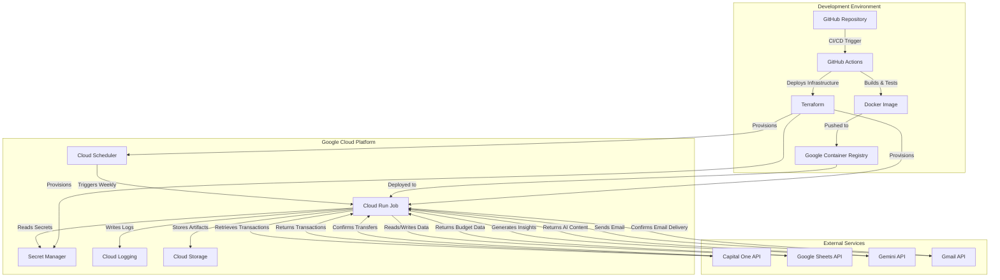
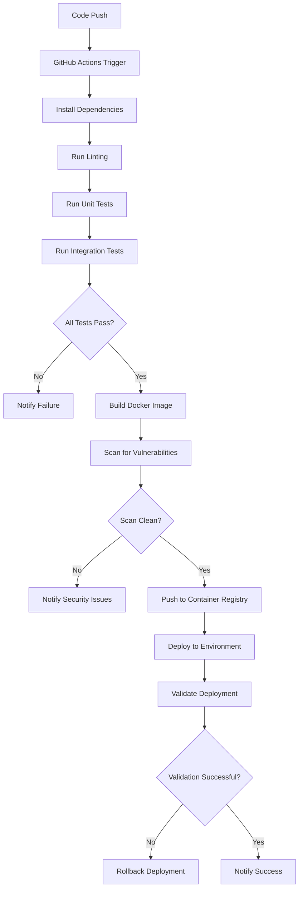

# Budget Management Application Deployment Guide

This document provides comprehensive instructions for deploying the Budget Management Application to Google Cloud Platform. It covers environment setup, containerization, infrastructure provisioning, CI/CD pipeline configuration, and operational procedures.

## 1. Deployment Overview

The Budget Management Application is deployed as a containerized application running on Google Cloud Run jobs, triggered by Cloud Scheduler on a weekly basis. The deployment process uses infrastructure as code (Terraform) and continuous integration/continuous deployment (CI/CD) practices to ensure reliable and reproducible deployments.

### 1.1 Deployment Architecture



### 1.2 Deployment Components

| Component | Purpose | Technology |
|-----------|---------|------------|
| Container Image | Packaged application code | Docker |
| Container Registry | Store container images | Google Container Registry |
| Serverless Runtime | Execute application code | Google Cloud Run jobs |
| Scheduler | Trigger weekly execution | Google Cloud Scheduler |
| Secret Management | Store API credentials | Google Secret Manager |
| Infrastructure as Code | Provision cloud resources | Terraform |
| CI/CD Pipeline | Automate build and deployment | GitHub Actions |

### 1.3 Deployment Environments

| Environment | Purpose | Deployment Trigger |
|-------------|---------|-------------------|
| Development | Local testing and development | Manual |
| Testing | Integration testing and validation | Pull request or manual |
| Production | Live execution | Merge to main branch |

## 2. Prerequisites

Before deploying the Budget Management Application, ensure the following prerequisites are met:

### 2.1 Google Cloud Platform Setup

1. **Google Cloud Project**
   - Create a new Google Cloud Project or use an existing one
   - Enable billing for the project
   - Note the Project ID for deployment configuration

2. **Required APIs**
   - Enable the following Google Cloud APIs:
     - Cloud Run API (`run.googleapis.com`)
     - Cloud Scheduler API (`cloudscheduler.googleapis.com`)
     - Secret Manager API (`secretmanager.googleapis.com`)
     - Container Registry API (`containerregistry.googleapis.com`)
     - Cloud Build API (`cloudbuild.googleapis.com`)
     - Cloud Logging API (`logging.googleapis.com`)
     - Cloud Storage API (`storage.googleapis.com`)

3. **Service Account**
   - Create a service account for the application with the following roles:
     - `roles/run.invoker` - For Cloud Scheduler to trigger Cloud Run jobs
     - `roles/secretmanager.secretAccessor` - For accessing secrets
     - `roles/logging.logWriter` - For writing logs
     - `roles/storage.objectUser` - For accessing Cloud Storage

### 2.2 External API Credentials

1. **Capital One API**
   - Obtain API key, client ID, and client secret
   - Note checking and savings account IDs

2. **Google Sheets API**
   - Create service account credentials with access to Google Sheets
   - Share the Master Budget and Weekly Spending sheets with the service account
   - Note the spreadsheet IDs for both sheets

3. **Gemini API**
   - Obtain API key for Gemini AI services

4. **Gmail API**
   - Create OAuth credentials for sending emails
   - Configure domain-wide delegation if using a Google Workspace account

### 2.3 Development Environment

1. **Required Tools**
   - Git (latest version)
   - Docker (latest version)
   - Google Cloud SDK (latest version)
   - Terraform (v1.0.0 or later)
   - Python 3.11 or later

2. **Authentication**
   - Configure Google Cloud SDK authentication:
     ```bash
     gcloud auth login
     gcloud config set project [PROJECT_ID]
     gcloud auth application-default login
     ```

## 3. Containerization

The Budget Management Application is containerized using Docker to ensure consistent execution across environments.

### 3.1 Dockerfile

```dockerfile
# Use Python slim image to minimize container size
FROM python:3.11-slim

# Set working directory
WORKDIR /app

# Copy requirements first for better layer caching
COPY requirements.txt .
RUN pip install --no-cache-dir -r requirements.txt

# Copy application code
COPY . .

# Set environment variables
ENV PYTHONUNBUFFERED=1

# Run the application
CMD ["python", "main.py"]
```

### 3.2 Building the Container

To build the container image locally:

```bash
# Navigate to the backend directory
cd src/backend

# Build the Docker image
docker build -t budget-management:latest .

# Test the image locally
docker run --rm \
  -e CAPITAL_ONE_API_KEY=test \
  -e CAPITAL_ONE_CLIENT_ID=test \
  -e CAPITAL_ONE_CLIENT_SECRET=test \
  -e CAPITAL_ONE_CHECKING_ACCOUNT_ID=test \
  -e CAPITAL_ONE_SAVINGS_ACCOUNT_ID=test \
  -e GEMINI_API_KEY=test \
  -e MASTER_BUDGET_SHEET_ID=test \
  -e WEEKLY_SPENDING_SHEET_ID=test \
  -e GOOGLE_SHEETS_CREDENTIALS=test \
  -e GMAIL_CREDENTIALS=test \
  budget-management:latest
```

### 3.3 Pushing to Container Registry

To push the container image to Google Container Registry:

```bash
# Tag the image for Google Container Registry
docker tag budget-management:latest gcr.io/[PROJECT_ID]/budget-management:latest

# Configure Docker to use gcloud credentials
gcloud auth configure-docker

# Push the image to Google Container Registry
docker push gcr.io/[PROJECT_ID]/budget-management:latest
```

### 3.4 Image Versioning

The application uses the following versioning strategy for container images:

| Version Component | Strategy | Example |
|-------------------|----------|----------|
| Semantic Versioning | MAJOR.MINOR.PATCH | v1.2.3 |
| Build Identifier | Git commit hash (short) | v1.2.3-a1b2c3d |
| Latest Tag | For development/testing | latest |

In the CI/CD pipeline, images are automatically tagged with both the Git commit hash and `latest` to support rollbacks and easy deployment.

## 4. Infrastructure as Code

The Budget Management Application infrastructure is provisioned using Terraform to ensure consistent and reproducible deployments.

### 4.1 Terraform Configuration

The Terraform configuration is organized into the following files:

| File | Purpose |
|------|----------|
| `main.tf` | Main configuration file that orchestrates all resources |
| `variables.tf` | Variable definitions for customizing deployments |
| `cloud_run.tf` | Cloud Run job configuration |
| `cloud_scheduler.tf` | Cloud Scheduler configuration |
| `secret_manager.tf` | Secret Manager configuration |
| `iam.tf` | IAM permissions configuration |
| `outputs.tf` | Output values for reference after deployment |

### 4.2 Resource Configuration

#### 4.2.1 Cloud Run Job

```hcl
resource "google_cloud_run_job" "budget_management" {
  name     = "${var.app_name}-job"
  location = var.region

  template {
    template {
      containers {
        image = var.container_image
        resources {
          limits = {
            cpu    = var.cpu
            memory = var.memory
          }
        }
        env {
          name  = "GOOGLE_CLOUD_PROJECT"
          value = var.project_id
        }
        # Secret mounts configured here
      }
      timeout_seconds = var.timeout_seconds
      service_account_name = var.service_account_email
    }
  }
}
```

#### 4.2.2 Cloud Scheduler

```hcl
resource "google_cloud_scheduler_job" "budget_management" {
  name             = "${var.app_name}-scheduler"
  description      = "Triggers the Budget Management job every Sunday at 12 PM EST"
  schedule         = var.schedule_cron
  time_zone        = var.schedule_timezone
  attempt_deadline = "320s"

  http_target {
    http_method = "POST"
    uri         = "https://${var.region}-run.googleapis.com/apis/run.googleapis.com/v1/namespaces/${var.project_id}/jobs/${var.cloud_run_job_name}:run"
    
    oauth_token {
      service_account_email = var.service_account_email
    }
  }
}
```

#### 4.2.3 Secret Manager

```hcl
resource "google_secret_manager_secret" "capital_one_api_key" {
  secret_id = var.capital_one_api_key_secret_id
  replication {
    automatic = true
  }
}

# Similar resources for other secrets
```

### 4.3 Applying Terraform Configuration

To apply the Terraform configuration manually:

```bash
# Navigate to the Terraform directory
cd src/backend/deploy/terraform

# Initialize Terraform
terraform init -backend-config="bucket=[PROJECT_ID]-terraform-state" -backend-config="prefix=budget-management/[ENVIRONMENT]"

# Plan the deployment
terraform plan -var="project_id=[PROJECT_ID]" -var="region=[REGION]" -var="app_name=budget-management" -var="container_image=gcr.io/[PROJECT_ID]/budget-management:latest" -var="service_account_email=[SERVICE_ACCOUNT]" -out=tfplan

# Apply the plan
terraform apply -auto-approve tfplan
```

### 4.4 Environment-Specific Configuration

Environment-specific variables are stored in `.tfvars` files in the `infrastructure/environments` directory:

| File | Purpose |
|------|----------|
| `dev.tfvars` | Development environment configuration |
| `test.tfvars` | Testing environment configuration |
| `prod.tfvars` | Production environment configuration |

Example `prod.tfvars` content:

```hcl
project_id = "budget-management-prod"
region = "us-east1"
app_name = "budget-management"
cpu = "1"
memory = "2Gi"
timeout_seconds = 600
max_retries = 3
schedule_cron = "0 12 * * 0"
schedule_timezone = "America/New_York"
```

## 5. CI/CD Pipeline

The Budget Management Application uses GitHub Actions for continuous integration and continuous deployment.

### 5.1 CI/CD Workflow



### 5.2 GitHub Actions Configuration

The CI/CD pipeline is defined in `.github/workflows/ci.yml` and `.github/workflows/cd.yml`.

#### 5.2.1 Continuous Integration Workflow

```yaml
name: CI

on:
  push:
    branches: [ main, develop ]
  pull_request:
    branches: [ main, develop ]

jobs:
  test:
    runs-on: ubuntu-latest
    steps:
      - uses: actions/checkout@v3
      - name: Set up Python
        uses: actions/setup-python@v4
        with:
          python-version: '3.11'
      - name: Install dependencies
        run: |
          python -m pip install --upgrade pip
          pip install -r src/backend/requirements.txt
          pip install -r src/backend/tests/requirements.txt
      - name: Lint with flake8
        run: |
          pip install flake8
          flake8 src/backend
      - name: Test with pytest
        run: |
          pytest src/backend/tests/unit
          pytest src/backend/tests/integration
      - name: Build Docker image
        run: |
          cd src/backend
          docker build -t budget-management:test .
      - name: Scan for vulnerabilities
        uses: aquasecurity/trivy-action@master
        with:
          image-ref: 'budget-management:test'
          format: 'table'
          exit-code: '1'
          ignore-unfixed: true
          severity: 'CRITICAL,HIGH'
```

#### 5.2.2 Continuous Deployment Workflow

```yaml
name: CD

on:
  push:
    branches: [ main ]
    paths:
      - 'src/backend/**'
      - '.github/workflows/cd.yml'

jobs:
  deploy:
    runs-on: ubuntu-latest
    steps:
      - uses: actions/checkout@v3
      - name: Set up Cloud SDK
        uses: google-github-actions/setup-gcloud@v1
        with:
          project_id: ${{ secrets.GCP_PROJECT_ID }}
          service_account_key: ${{ secrets.GCP_SA_KEY }}
          export_default_credentials: true
      - name: Set up Docker Buildx
        uses: docker/setup-buildx-action@v2
      - name: Build and push
        uses: docker/build-push-action@v4
        with:
          context: ./src/backend
          push: true
          tags: |
            gcr.io/${{ secrets.GCP_PROJECT_ID }}/budget-management:latest
            gcr.io/${{ secrets.GCP_PROJECT_ID }}/budget-management:${{ github.sha }}
      - name: Set up Terraform
        uses: hashicorp/setup-terraform@v2
        with:
          terraform_version: 1.0.0
      - name: Terraform Init
        run: |
          cd src/backend/deploy/terraform
          terraform init -backend-config="bucket=${{ secrets.GCP_PROJECT_ID }}-terraform-state" -backend-config="prefix=budget-management/prod"
      - name: Terraform Plan
        run: |
          cd src/backend/deploy/terraform
          terraform plan -var="project_id=${{ secrets.GCP_PROJECT_ID }}" \
            -var="region=${{ secrets.GCP_REGION }}" \
            -var="app_name=budget-management" \
            -var="container_image=gcr.io/${{ secrets.GCP_PROJECT_ID }}/budget-management:${{ github.sha }}" \
            -var="service_account_email=${{ secrets.GCP_SERVICE_ACCOUNT }}" \
            -out=tfplan
      - name: Terraform Apply
        run: |
          cd src/backend/deploy/terraform
          terraform apply -auto-approve tfplan
      - name: Validate Deployment
        run: |
          python src/scripts/deployment/validate_deployment.py \
            --project-id=${{ secrets.GCP_PROJECT_ID }} \
            --region=${{ secrets.GCP_REGION }} \
            --job-name=budget-management-job \
            --container-image=gcr.io/${{ secrets.GCP_PROJECT_ID }}/budget-management:${{ github.sha }}
```

### 5.3 Deployment Triggers

| Trigger | Action | Environment |
|---------|--------|-------------|
| Push to main | Build, test, deploy | Production |
| Pull request | Build, test | Testing |
| Manual trigger | Build, test, deploy | User-selected |

### 5.4 Rollback Procedures

In case of deployment issues, the following rollback procedures can be used:

1. **Container Image Rollback**
   ```bash
   # Update Cloud Run job to use previous container image
   gcloud run jobs update budget-management-job \
     --image=gcr.io/[PROJECT_ID]/budget-management:[PREVIOUS_VERSION] \
     --region=[REGION]
   ```

2. **Infrastructure Rollback**
   ```bash
   # Navigate to the Terraform directory
   cd src/backend/deploy/terraform
   
   # Apply the previous Terraform state
   terraform apply -target=google_cloud_run_job.budget_management -var="container_image=gcr.io/[PROJECT_ID]/budget-management:[PREVIOUS_VERSION]"
   ```

3. **Complete Rollback Script**
   ```bash
   # Execute the rollback script
   src/scripts/deployment/rollback.sh --version=[PREVIOUS_VERSION] --environment=prod
   ```

## 6. Secret Management

The Budget Management Application uses Google Secret Manager to securely store sensitive credentials and configuration.

### 6.1 Required Secrets

| Secret Name | Description | Format |
|------------|-------------|--------|
| `capital-one-api-key` | Capital One API key | Plain text |
| `capital-one-client-id` | Capital One client ID | Plain text |
| `capital-one-client-secret` | Capital One client secret | Plain text |
| `capital-one-checking-account-id` | Capital One checking account ID | Plain text |
| `capital-one-savings-account-id` | Capital One savings account ID | Plain text |
| `gemini-api-key` | Gemini AI API key | Plain text |
| `master-budget-sheet-id` | Google Sheets ID for Master Budget | Plain text |
| `weekly-spending-sheet-id` | Google Sheets ID for Weekly Spending | Plain text |
| `google-sheets-credentials` | Google Sheets API credentials | JSON |
| `gmail-credentials` | Gmail API credentials | JSON |

### 6.2 Creating Secrets

To create secrets manually:

```bash
# Create a secret
gcloud secrets create capital-one-api-key --replication-policy="automatic"

# Add a secret version with the actual value
echo -n "your-api-key-value" | gcloud secrets versions add capital-one-api-key --data-file=-

# Grant access to the service account
gcloud secrets add-iam-policy-binding capital-one-api-key \
  --member="serviceAccount:budget-management-service@[PROJECT_ID].iam.gserviceaccount.com" \
  --role="roles/secretmanager.secretAccessor"
```

To create secrets using Terraform:

```hcl
resource "google_secret_manager_secret" "capital_one_api_key" {
  secret_id = "capital-one-api-key"
  replication {
    automatic = true
  }
}

resource "google_secret_manager_secret_iam_binding" "capital_one_api_key" {
  project = google_secret_manager_secret.capital_one_api_key.project
  secret_id = google_secret_manager_secret.capital_one_api_key.secret_id
  role = "roles/secretmanager.secretAccessor"
  members = [
    "serviceAccount:${var.service_account_email}",
  ]
}
```

### 6.3 Secret Rotation

Secrets should be rotated periodically to maintain security. The following script can be used to rotate secrets:

```bash
# Execute the credential rotation script
src/scripts/maintenance/rotate_credentials.py --secret-name=capital-one-api-key
```

Recommended rotation schedule:

| Secret Type | Rotation Frequency |
|------------|--------------------|
| API Keys | Every 90 days |
| OAuth Credentials | Every 180 days |
| Service Account Keys | Every 365 days |

## 7. Deployment Validation

After deployment, it's important to validate that the application is correctly deployed and functioning as expected.

### 7.1 Deployment Verification

The `validate_deployment.py` script performs the following checks:

1. **Container Image Verification**
   - Verifies that the deployed container image matches the expected image

2. **Resource Settings Verification**
   - Verifies that CPU, memory, and timeout settings are correctly configured

3. **Service Account Verification**
   - Verifies that the correct service account is assigned to the Cloud Run job

4. **Secret Mounts Verification**
   - Verifies that all required secrets are properly mounted

5. **API Connectivity Testing**
   - Tests connectivity to all required external APIs

To run the validation script manually:

```bash
python src/scripts/deployment/validate_deployment.py \
  --project-id=[PROJECT_ID] \
  --region=[REGION] \
  --job-name=budget-management-job \
  --container-image=gcr.io/[PROJECT_ID]/budget-management:[VERSION] \
  --test-apis \
  --test-trigger
```

### 7.2 Manual Testing

To manually trigger the Cloud Run job for testing:

```bash
gcloud run jobs execute budget-management-job --region=[REGION]
```

To monitor the job execution:

```bash
gcloud run jobs executions list --job=budget-management-job --region=[REGION]
```

To view logs from a specific execution:

```bash
gcloud logging read "resource.type=cloud_run_job AND resource.labels.job_name=budget-management-job AND resource.labels.execution_name=[EXECUTION_NAME]" --project=[PROJECT_ID] --format=json
```

### 7.3 Smoke Tests

The following smoke tests should be performed after deployment:

1. **Job Execution Test**
   - Trigger the job manually and verify it completes successfully

2. **API Integration Test**
   - Verify the job can connect to all required external APIs

3. **Data Processing Test**
   - Verify transactions are retrieved and categorized correctly

4. **Email Delivery Test**
   - Verify the budget report email is delivered correctly

5. **Savings Transfer Test**
   - Verify the savings transfer is executed correctly (if applicable)

## 8. Operational Procedures

This section covers operational procedures for managing the deployed application.

### 8.1 Monitoring

The application can be monitored using Google Cloud Monitoring and Logging.

#### 8.1.1 Cloud Run Job Monitoring

```bash
# View recent job executions
gcloud run jobs executions list --job=budget-management-job --region=[REGION]

# View execution details
gcloud run jobs executions describe [EXECUTION_NAME] --job=budget-management-job --region=[REGION]
```

#### 8.1.2 Log Analysis

```bash
# View all logs for the job
gcloud logging read "resource.type=cloud_run_job AND resource.labels.job_name=budget-management-job" --project=[PROJECT_ID]

# View error logs only
gcloud logging read "resource.type=cloud_run_job AND resource.labels.job_name=budget-management-job AND severity>=ERROR" --project=[PROJECT_ID]

# View logs for a specific component
gcloud logging read "resource.type=cloud_run_job AND resource.labels.job_name=budget-management-job AND jsonPayload.component='transaction_retriever'" --project=[PROJECT_ID]
```

#### 8.1.3 Custom Metrics

The application exports the following custom metrics to Cloud Monitoring:

| Metric Name | Description | Alert Threshold |
|-------------|-------------|----------------|
| `categorization_accuracy` | Percentage of transactions correctly categorized | < 90% |
| `transaction_count` | Number of transactions processed | < 3 or > 50 |
| `savings_transfer_amount` | Amount transferred to savings | $0 for 2 weeks |

### 8.2 Maintenance

#### 8.2.1 Dependency Updates

To update dependencies:

```bash
# Update Python dependencies
src/scripts/maintenance/update_dependencies.sh

# Rebuild and deploy with updated dependencies
src/scripts/deployment/build_docker_image.sh --push
src/scripts/deployment/deploy_cloud_run.sh --container-image=gcr.io/[PROJECT_ID]/budget-management:latest
```

#### 8.2.2 Credential Rotation

To rotate credentials:

```bash
# Rotate a specific credential
src/scripts/maintenance/rotate_credentials.py --secret-name=[SECRET_NAME]

# Rotate all credentials
src/scripts/maintenance/rotate_credentials.py --rotate-all
```

#### 8.2.3 Backup Procedures

To backup Google Sheets data:

```bash
# Backup sheets to Cloud Storage
src/scripts/maintenance/backup_sheets.py --project-id=[PROJECT_ID] --bucket=[BACKUP_BUCKET]
```

### 8.3 Troubleshooting

#### 8.3.1 Common Issues

| Issue | Possible Causes | Resolution |
|-------|----------------|------------|
| Job execution failure | API authentication error | Check and rotate API credentials |
| Missing transactions | Capital One API rate limiting | Implement backoff and retry logic |
| Categorization errors | Gemini API prompt issues | Update categorization prompt template |
| Email delivery failure | Gmail API authentication | Refresh Gmail credentials |
| Savings transfer failure | Insufficient funds | Verify account balance before transfer |

#### 8.3.2 Debugging

To enable debug logging:

```bash
# Update the Cloud Run job with debug environment variable
gcloud run jobs update budget-management-job \
  --set-env-vars=LOG_LEVEL=DEBUG \
  --region=[REGION]
```

To run the job locally with debug logging:

```bash
# Run the container with debug logging
docker run --rm \
  -e LOG_LEVEL=DEBUG \
  -e CAPITAL_ONE_API_KEY=... \
  # Other environment variables
  gcr.io/[PROJECT_ID]/budget-management:latest
```

### 8.4 Disaster Recovery

#### 8.4.1 Recovery Procedures

| Scenario | Recovery Procedure | Recovery Time Objective |
|----------|-------------------|-------------------------|
| Job Execution Failure | Manual trigger via Cloud Console | < 1 hour |
| Infrastructure Corruption | Redeploy via Terraform | < 4 hours |
| Data Access Issue | Verify and update API credentials | < 2 hours |
| Code Deployment Issue | Rollback to previous container version | < 30 minutes |

#### 8.4.2 Emergency Procedures

In case of critical issues:

```bash
# Stop scheduled job execution
gcloud scheduler jobs pause budget-management-scheduler --location=[REGION]

# Disable the Cloud Run job
gcloud run jobs update budget-management-job --no-execution-environment --region=[REGION]

# Execute emergency recovery
src/scripts/disaster_recovery/emergency_stop.py --reason="[REASON]" --notify
```

## 9. Deployment Checklist

Use this checklist to ensure a successful deployment:

### 9.1 Pre-Deployment

- [ ] All unit and integration tests pass
- [ ] Container builds successfully
- [ ] Vulnerability scan passes with no critical issues
- [ ] All required APIs are enabled in Google Cloud
- [ ] Service account exists with appropriate permissions
- [ ] All required secrets are created in Secret Manager
- [ ] Terraform configuration is validated

### 9.2 Deployment

- [ ] Container image is built and pushed to Container Registry
- [ ] Terraform apply completes successfully
- [ ] Cloud Run job is created with correct configuration
- [ ] Cloud Scheduler is configured with correct schedule
- [ ] Secret mounts are correctly configured

### 9.3 Post-Deployment

- [ ] Deployment validation passes all checks
- [ ] Manual job execution completes successfully
- [ ] API connectivity tests pass
- [ ] Email delivery test succeeds
- [ ] Savings transfer test succeeds (if applicable)
- [ ] Logs show no unexpected errors
- [ ] Monitoring dashboard shows correct metrics

## 10. References

- [Google Cloud Run Documentation](https://cloud.google.com/run/docs)
- [Terraform Google Provider Documentation](https://registry.terraform.io/providers/hashicorp/google/latest/docs)
- [GitHub Actions Documentation](https://docs.github.com/en/actions)
- [Docker Documentation](https://docs.docker.com/)
- [Google Secret Manager Documentation](https://cloud.google.com/secret-manager/docs)
- [Google Cloud Scheduler Documentation](https://cloud.google.com/scheduler/docs)

### 10.1 Internal References

- [Architecture Documentation](architecture.md)
- [API Integration Documentation](api_integration.md)
- [Security Documentation](security.md)
- [Monitoring Documentation](monitoring.md)
- [Testing Documentation](testing.md)
- [Development Guide](development.md)