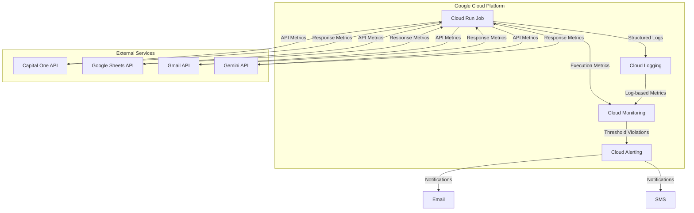
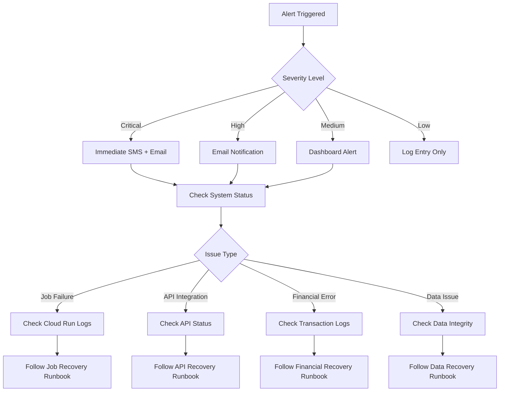
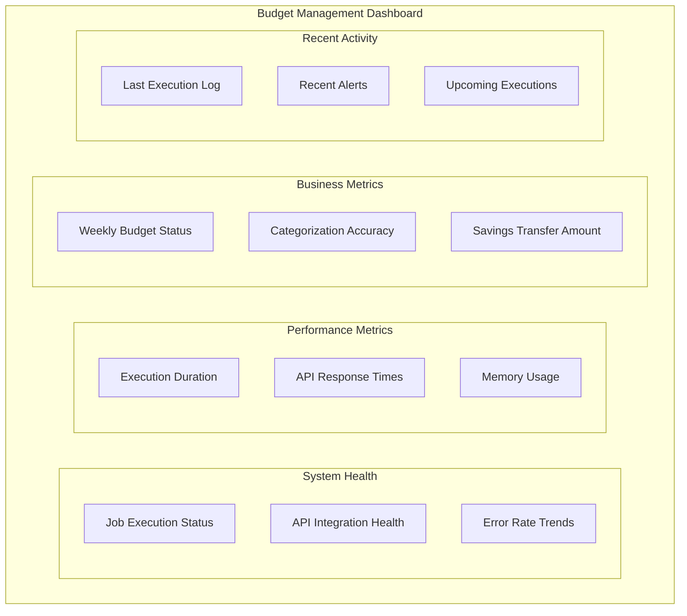
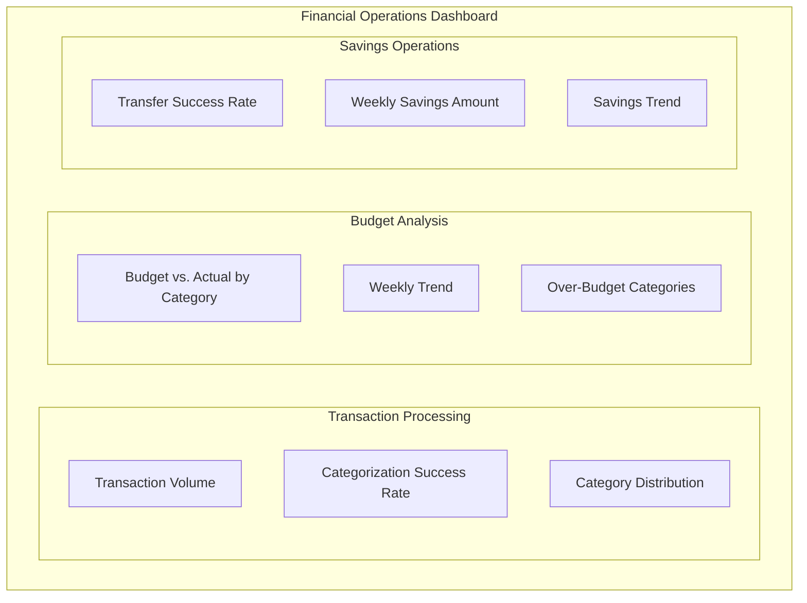

# Budget Management Application Monitoring

This document provides a comprehensive overview of the monitoring and observability approach for the Budget Management Application. It covers logging strategy, metrics collection, alerting, dashboards, and troubleshooting procedures.

## 1. Monitoring Overview

The Budget Management Application implements a lightweight but comprehensive monitoring approach appropriate for a scheduled batch job running on Google Cloud Run. The monitoring infrastructure focuses on execution success, integration health, and financial operation accuracy.

Key monitoring objectives:

- Ensure reliable weekly execution of the budget management workflow
- Detect and alert on API integration failures
- Monitor financial operation accuracy and success
- Track performance metrics for optimization
- Provide visibility into application behavior without manual inspection

### 1.1 Monitoring Architecture



The monitoring architecture leverages Google Cloud's native monitoring capabilities:

1. **Cloud Logging**: Centralized repository for all application logs
2. **Cloud Monitoring**: Collection and visualization of metrics
3. **Cloud Alerting**: Notification system for threshold violations
4. **Custom Log Metrics**: Extraction of application-specific metrics from logs

## 2. Logging Strategy

The Budget Management Application implements a comprehensive logging strategy to provide visibility into its operations and facilitate troubleshooting.

### 2.1 Logging Levels

| Log Level | Usage | Examples |
|-----------|-------|----------|
| INFO | Normal operation events | Job start/completion, API calls, data processing steps |
| WARNING | Potential issues that don't prevent execution | Slow API responses, partial data retrieval |
| ERROR | Issues that prevent specific operations | API failures, data validation errors |
| CRITICAL | Issues that prevent overall job completion | Authentication failures, critical dependency unavailability |

### 2.2 Structured Logging

All logs use a structured JSON format to enable efficient filtering, searching, and metric extraction:

```json
{
  "timestamp": "2023-07-23T12:01:15.123Z",
  "execution_id": "exec-2023-07-23-12-00-00",
  "component": "savings_automator",
  "operation": "transfer_funds",
  "status": "success",
  "details": {
    "amount": "45.67",
    "source_account": "xxxx1234",
    "destination_account": "xxxx5678",
    "transfer_id": "tr-98765"
  },
  "duration_ms": 1250,
  "severity": "INFO"
}
```

Key structured logging features:

1. **Correlation IDs**: Each execution has a unique ID that traces through all operations
2. **Component Context**: Logs include the component name for easy filtering
3. **Operation Tracking**: Each operation is named and tracked
4. **Duration Measurement**: Performance metrics are included
5. **Sensitive Data Masking**: Financial data is masked in logs

### 2.3 Logging Implementation

The application uses the `LoggingService` module to provide consistent logging across all components:

```python
# Example component logging setup
from services.logging_service import get_component_logger, LoggingContext

logger = get_component_logger('transaction_retriever')

def retrieve_transactions():
    with LoggingContext(logger, "retrieve_transactions", {'source': 'capital_one'}) as log_ctx:
        # Log entry is automatically created
        
        # Add additional context if needed
        log_ctx.update_context({'transaction_count': 15})
        
        # Log specific events
        logger.info('Retrieved transactions', extra={'count': 15})
        
        # Log exit is automatically created
```

For performance tracking, the `PerformanceLogger` class is used:

```python
from services.logging_service import get_component_logger, PerformanceLogger

logger = get_component_logger('budget_analyzer')

def analyze_budget():
    perf_logger = PerformanceLogger(logger, 'analyze_budget', {'categories': 10})
    perf_logger.start()
    
    # Perform first operation
    perf_logger.checkpoint('data_retrieval')
    
    # Perform second operation
    perf_logger.checkpoint('calculation')
    
    # Complete operation
    total_time = perf_logger.stop()
    return total_time
```

### 2.4 Log Storage and Retention

| Log Type | Storage Location | Retention Period | Access Control |
|----------|------------------|------------------|---------------|
| Application Logs | Google Cloud Logging | 30 days | IAM-restricted |
| Error Logs | Google Cloud Logging | 90 days | IAM-restricted |
| Execution Logs | Google Cloud Logging | 30 days | IAM-restricted |

Logs are automatically exported to Cloud Storage for long-term retention if needed for compliance or historical analysis.

## 3. Metrics Collection

The application collects various metrics to monitor its health, performance, and business outcomes.

### 3.1 System Metrics

| Metric | Description | Collection Method | Alert Threshold |
|--------|-------------|-------------------|----------------|
| Job Execution Status | Success/failure of weekly job | Cloud Run metrics | Any failure |
| Job Execution Duration | Total runtime of job | Cloud Run metrics | > 8 minutes |
| Memory Usage | Peak memory consumption | Cloud Run metrics | > 90% |
| CPU Usage | Peak CPU utilization | Cloud Run metrics | > 90% |

### 3.2 API Integration Metrics

| Metric | Description | Collection Method | Alert Threshold |
|--------|-------------|-------------------|----------------|
| API Response Time | Response time for each external API | Custom log metric | > 2s (Capital One)<br>> 3s (Google APIs)<br>> 5s (Gemini) |
| API Error Rate | Percentage of API calls resulting in errors | Custom log metric | > 5% |
| Authentication Failures | Count of authentication failures | Custom log metric | > 3 in 1 hour |

### 3.3 Business Metrics

| Metric | Description | Collection Method | Alert Threshold |
|--------|-------------|-------------------|----------------|
| Transaction Count | Number of transactions processed | Custom log metric | < 3 or > 50 |
| Categorization Accuracy | Percentage of transactions correctly categorized | Custom log metric | < 90% |
| Budget Variance | Difference between budget and actual spending | Custom log metric | > 20% over budget |
| Savings Transfer Amount | Amount transferred to savings | Custom log metric | $0 for 2 consecutive weeks |

### 3.4 Component Performance Metrics

| Component | Metrics | Target Performance |
|-----------|---------|-------------------|
| Transaction Retriever | Execution time, Transaction count | < 30 seconds |
| Transaction Categorizer | Execution time, Categorization accuracy | < 60 seconds, > 95% accuracy |
| Budget Analyzer | Execution time | < 30 seconds |
| Insight Generator | Execution time | < 30 seconds |
| Report Distributor | Execution time, Email delivery success | < 10 seconds, 100% delivery |
| Savings Automator | Execution time, Transfer success | < 30 seconds, 100% success |

### 3.5 Custom Log-Based Metrics

The application defines custom metrics extracted from structured logs:

```yaml
# Example of custom log-based metrics configuration
- name: api_response_time
  display_name: "API Response Time"
  description: Measures API response times for external service integrations
  filter: resource.type="cloud_run_job" AND resource.labels.job_name="budget-management-job" AND jsonPayload.api_name=~".*" AND jsonPayload.response_time>0
  metric_descriptor:
    metric_kind: GAUGE
    value_type: DOUBLE
    unit: ms
    labels:
      - key: api_name
        description: Name of the API (capital_one, google_sheets, gemini, gmail)
      - key: operation
        description: API operation being performed
  value_extractor: EXTRACT(jsonPayload.response_time)
  label_extractors:
    api_name: EXTRACT(jsonPayload.api_name)
    operation: EXTRACT(jsonPayload.operation)
```

See `infrastructure/monitoring/logs/log_metrics.json` for the complete list of custom metrics.

## 4. Alerting Strategy

The application implements a tiered alerting strategy to notify stakeholders of issues based on severity.

### 4.1 Alert Types

| Alert Type | Trigger Condition | Severity | Notification Channel |
|------------|-------------------|----------|---------------------|
| Job Failure | Cloud Run job execution fails | Critical | Email + SMS |
| API Integration Failure | Any critical API call fails after retries | High | Email |
| Financial Transfer Error | Savings transfer fails | Critical | Email + SMS |
| Budget Overspend | Weekly spending exceeds budget by >20% | Medium | Email |
| Authentication Failure | Multiple authentication failures | High | Email |
| Resource Exhaustion | Memory or CPU usage > 90% | High | Email |

### 4.2 Alert Flow



### 4.3 Alert Configuration

Alerts are configured in Google Cloud Monitoring with the following parameters:

```yaml
# Example alert policy configuration
name: job-failure-alert
displayName: "Budget Management Job Failure"
combiner: OR
conditions:
  - displayName: "Job Execution Failure"
    conditionThreshold:
      filter: resource.type="cloud_run_job" AND resource.labels.job_name="budget-management-job" AND metric.type="run.googleapis.com/job/execution_count" AND metric.labels.status="failed"
      aggregations:
        - alignmentPeriod: 3600s
          perSeriesAligner: ALIGN_SUM
      comparison: COMPARISON_GT
      thresholdValue: 0
      duration: 0s
alertStrategy:
  autoClose: 86400s
notificationChannels:
  - "projects/[PROJECT_ID]/notificationChannels/[EMAIL_CHANNEL_ID]"
  - "projects/[PROJECT_ID]/notificationChannels/[SMS_CHANNEL_ID]"
```

### 4.4 Notification Channels

| Channel | Purpose | Configuration |
|---------|---------|---------------|
| Email | Primary notification method | Configured to send to njdifiore@gmail.com |
| SMS | Critical alerts only | Configured to send to primary phone number |
| Dashboard | Visual indication of issues | Displayed on monitoring dashboard |

## 5. Dashboards

The application uses Google Cloud Monitoring dashboards to visualize key metrics and system health.

### 5.1 Main Dashboard

The main monitoring dashboard provides a comprehensive view of the application's health and performance:



The dashboard is configured in `infrastructure/monitoring/dashboards/budget_management_dashboard.json`.

### 5.2 Financial Operations Dashboard

A dedicated dashboard for financial operations provides detailed insights into budget performance:



### 5.3 Dashboard Access

| Dashboard | URL | Access Control |
|-----------|-----|---------------|
| Main Dashboard | https://console.cloud.google.com/monitoring/dashboards/custom/budget-management | IAM-restricted |
| Financial Operations | https://console.cloud.google.com/monitoring/dashboards/custom/budget-financial | IAM-restricted |

## 6. Health Checks

The application implements several health check mechanisms to verify proper operation.

### 6.1 Job Execution Health Check

The `check_job_status.py` script in the `src/scripts/monitoring` directory provides a comprehensive health check for the Cloud Run job:

```bash
# Example usage
python src/scripts/monitoring/check_job_status.py --days 7 --alert --trigger
```

This script:
1. Retrieves the execution history of the Cloud Run job
2. Analyzes success/failure patterns
3. Sends alerts if failures are detected
4. Optionally triggers a new job execution if recent executions failed

The script can be run manually or scheduled to execute periodically as a supplementary monitoring mechanism.

### 6.2 API Connectivity Checks

The application performs pre-execution connectivity tests for all external APIs:

```python
def check_api_health():
    """Performs health checks on all required APIs before main execution."""
    health_status = {}
    
    # Check Capital One API
    try:
        capital_one_client.test_connectivity()
        health_status['capital_one'] = 'healthy'
    except Exception as e:
        health_status['capital_one'] = f'unhealthy: {str(e)}'
        logger.error(f"Capital One API health check failed: {e}")
    
    # Check other APIs similarly
    
    return health_status
```

These checks are performed at the start of each job execution to detect API availability issues early.

### 6.3 Data Integrity Checks

The application performs data integrity checks throughout the processing pipeline:

1. **Transaction Data Validation**: Verifies transaction count and format
2. **Budget Data Validation**: Ensures budget categories and amounts are properly structured
3. **Categorization Validation**: Verifies that all transactions have valid categories
4. **Transfer Validation**: Confirms transfer amounts are within acceptable limits

Any integrity issues are logged and may trigger alerts depending on severity.

## 7. Troubleshooting

This section provides guidance for troubleshooting common issues with the Budget Management Application.

### 7.1 Common Issues

| Issue | Possible Causes | Troubleshooting Steps |
|-------|-----------------|----------------------|
| Job Execution Failure | API authentication issues, resource constraints, code errors | Check Cloud Run logs, verify API credentials, check for API service outages |
| Transaction Retrieval Failure | Capital One API unavailable, authentication issues, rate limiting | Check Capital One API status, verify credentials, check rate limit headers |
| Categorization Errors | Gemini API issues, unexpected transaction formats, token limits | Check Gemini API status, review transaction data, verify prompt format |
| Email Delivery Failure | Gmail API issues, authentication problems, formatting errors | Check Gmail API status, verify credentials, check email format |
| Savings Transfer Failure | Capital One API issues, insufficient funds, account restrictions | Check Capital One API status, verify account status, check transfer limits |

### 7.2 Log Analysis

To analyze logs for troubleshooting:

1. **View Cloud Run Job Logs**:
   ```bash
   gcloud logging read "resource.type=cloud_run_job AND resource.labels.job_name=budget-management-job" --limit=50
   ```

2. **Filter for Errors**:
   ```bash
   gcloud logging read "resource.type=cloud_run_job AND resource.labels.job_name=budget-management-job AND severity>=ERROR" --limit=20
   ```

3. **View Component-Specific Logs**:
   ```bash
   gcloud logging read "resource.type=cloud_run_job AND resource.labels.job_name=budget-management-job AND jsonPayload.component='transaction_retriever'" --limit=20
   ```

4. **View API Integration Logs**:
   ```bash
   gcloud logging read "resource.type=cloud_run_job AND resource.labels.job_name=budget-management-job AND jsonPayload.api_name='capital_one'" --limit=20
   ```

### 7.3 Manual Job Triggering

To manually trigger the job for testing or recovery:

```bash
# Using gcloud command line
gcloud run jobs execute budget-management-job --region=us-east1

# Using the check_job_status.py script
python src/scripts/monitoring/check_job_status.py --trigger
```

### 7.4 Recovery Procedures

| Scenario | Recovery Procedure | Recovery Time Objective |
|----------|-------------------|-------------------------|
| Job Execution Failure | Manual trigger via Cloud Console | < 1 hour |
| API Authentication Issue | Verify and update API credentials | < 2 hours |
| Data Access Issue | Check Google Sheets permissions | < 2 hours |
| Email Delivery Failure | Verify Gmail API credentials and permissions | < 1 hour |
| Transfer Failure | Verify Capital One API status and account status | < 2 hours |

## 8. Monitoring Best Practices

The application follows these monitoring best practices:

1. **Structured Logging**: All logs use structured JSON format with consistent fields
2. **Correlation IDs**: Each execution has a unique ID that traces through all operations
3. **Context Enrichment**: Logs include relevant context (component, operation, status)
4. **Sensitive Data Handling**: Financial data is masked in logs
5. **Error Classification**: Errors are categorized by type and severity
6. **Performance Tracking**: All operations include duration measurements
7. **Business Metrics**: Financial operations are tracked with specific metrics
8. **Tiered Alerting**: Alerts are prioritized by severity and impact
9. **Comprehensive Dashboards**: Visual monitoring of all key metrics
10. **Health Checks**: Proactive verification of system health

## 9. References

- [Google Cloud Monitoring Documentation](https://cloud.google.com/monitoring/docs)
- [Google Cloud Logging Documentation](https://cloud.google.com/logging/docs)
- [Google Cloud Run Jobs Documentation](https://cloud.google.com/run/docs/create-jobs)
- [Budget Management Architecture](architecture.md)
- [Logging Service Implementation](../services/logging_service.py)
- [Job Status Checker Script](../../scripts/monitoring/check_job_status.py)
- [Dashboard Configuration](../../../infrastructure/monitoring/dashboards/budget_management_dashboard.json)
- [Log Metrics Configuration](../../../infrastructure/monitoring/logs/log_metrics.json)