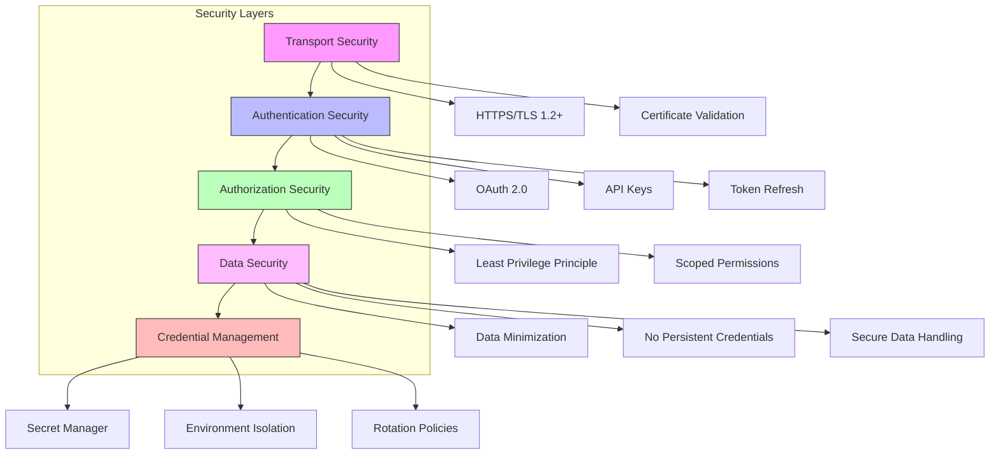
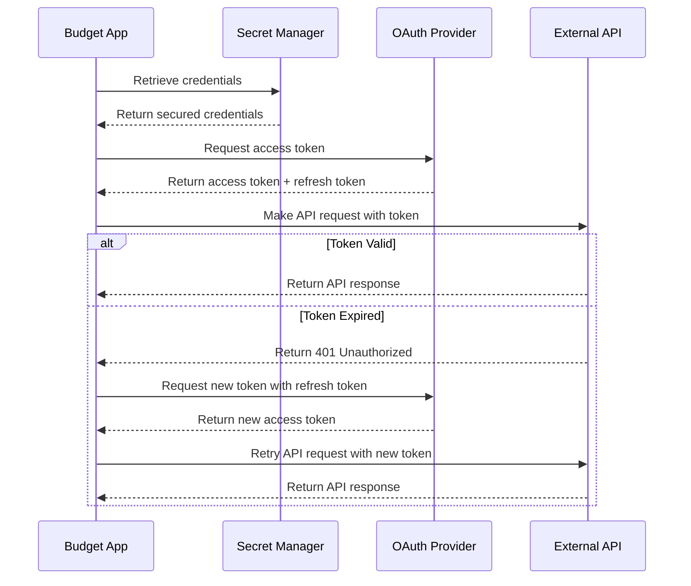
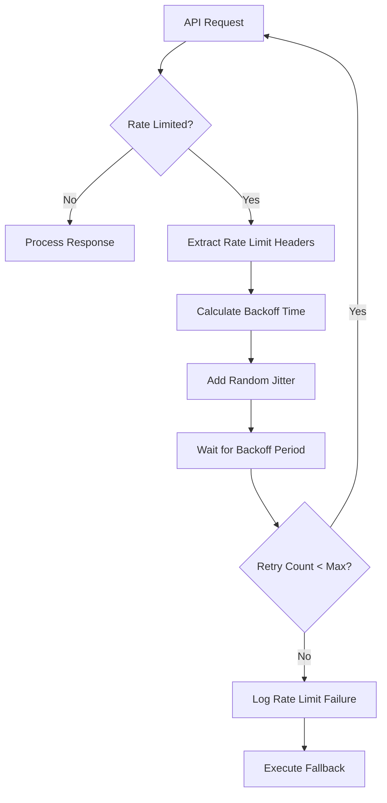
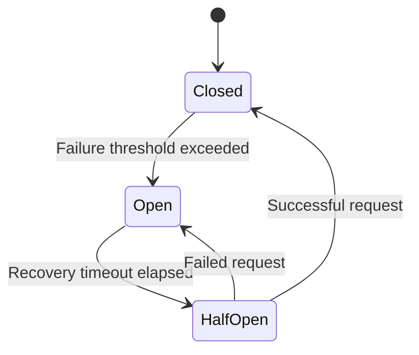
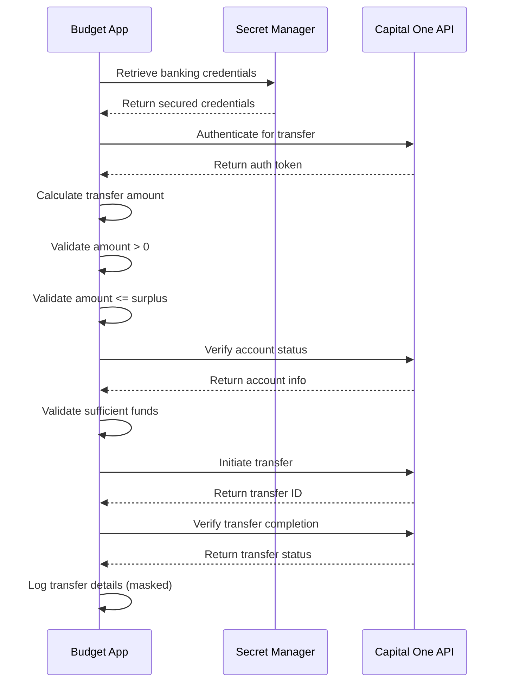
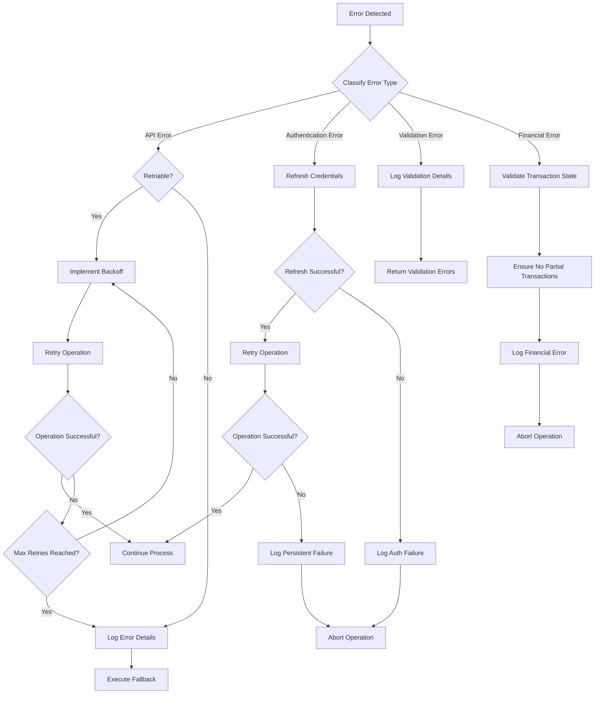
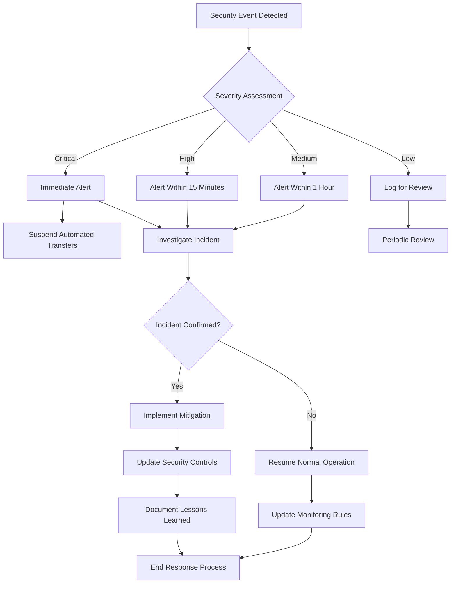

# Budget Management Application Security

This document provides a comprehensive overview of the security architecture implemented in the Budget Management Application. It covers authentication mechanisms, data protection, API security, financial data security, and security best practices.

## 1. Security Overview

The Budget Management Application handles sensitive financial data and requires secure integration with banking APIs, making security a critical aspect of the system design. The application implements a comprehensive security architecture to protect user financial information and ensure secure operations.

Key security principles implemented in the application include:

- **Defense in Depth**: Multiple layers of security controls
- **Principle of Least Privilege**: Minimal permissions for each component
- **Secure by Default**: Security built into the core architecture
- **Data Protection**: Encryption and masking of sensitive information
- **Comprehensive Logging**: Audit trail of security-relevant events
- **Secure API Integration**: Protected communication with external services

### 1.1 Security Architecture Diagram



### 1.2 Security Threat Model

The Budget Management Application addresses the following key security threats:

| Threat | Mitigation Strategy |
|--------|---------------------|
| Unauthorized API Access | OAuth 2.0 authentication, API key protection, Secret Manager |
| Data Interception | TLS 1.2+ encryption for all communications |
| Credential Theft | No persistent storage of credentials, Secret Manager for secure storage |
| Financial Fraud | Transaction validation, amount limits, transfer confirmation |
| Data Exposure | Data masking, minimal data collection, secure logging |
| API Rate Limiting | Exponential backoff, circuit breaker pattern |
| Service Disruption | Retry mechanisms, fallback strategies, graceful degradation |

## 2. Authentication Framework

The application implements a comprehensive authentication framework to secure access to external APIs and protect sensitive operations.

### 2.1 Authentication Methods

| API | Authentication Method | Implementation Details |
|-----|----------------------|------------------------|
| Capital One API | OAuth 2.0 | Client credentials flow with refresh token mechanism |
| Google Sheets API | OAuth 2.0 | Service account authentication for backend services |
| Gemini API | API Key | Simple key-based authentication as per Google AI standards |
| Gmail API | OAuth 2.0 | Service account authentication with domain-wide delegation |

The `AuthenticationService` class centralizes all authentication logic, providing a consistent interface for obtaining and refreshing authentication tokens across different services.

### 2.2 Token Management

| Token Type | Storage Method | Refresh Mechanism | Expiration Handling |
|------------|----------------|-------------------|---------------------|
| OAuth Access Tokens | In-memory only | Automatic refresh when expired | Exponential backoff on auth failures |
| API Keys | Secret Manager | Manual rotation | Graceful error handling |
| Refresh Tokens | Secret Manager | N/A | Alert on expiration |

**Token Caching:**

The application implements an in-memory token cache to minimize authentication requests:

```python
# Token cache implementation (simplified)
TOKEN_CACHE = {}
TOKEN_EXPIRY = {}

def is_token_expired(service_name):
    if service_name not in TOKEN_EXPIRY:
        return True
    return time.time() > TOKEN_EXPIRY[service_name]

def cache_token(service_name, token, expires_in):
    TOKEN_CACHE[service_name] = token
    TOKEN_EXPIRY[service_name] = time.time() + expires_in
```

### 2.3 Authentication Flow



The authentication flow includes automatic token refresh when expired tokens are detected, with exponential backoff for retry attempts to prevent API rate limiting issues.

### 2.4 Credential Storage

The application leverages Google Secret Manager for secure credential storage, providing:

1. **Automatic encryption** of stored secrets
2. **Version control** for credentials
3. **Fine-grained access control**
4. **Audit logging** of secret access

Credentials are never stored in code, configuration files, or logs. They are retrieved at runtime from Secret Manager and held in memory only for the duration needed.

## 3. Data Protection

The application implements comprehensive data protection measures to secure sensitive financial information throughout its lifecycle.

### 3.1 Encryption Standards

| Data Type | Encryption Method | Implementation |
|-----------|-------------------|---------------|
| API Credentials | AES-256 | Google Secret Manager encryption |
| Data in Transit | TLS 1.2+ | HTTPS for all API communications |
| Sensitive Logs | Redaction | PII and financial data masking |

All communication with external APIs is encrypted using TLS 1.2 or higher, with certificate validation to prevent man-in-the-middle attacks.

### 3.2 Data Masking Rules

| Data Element | Masking Rule | Example |
|--------------|--------------|----------|
| Account Numbers | Last 4 digits only | XXXX-XXXX-XXXX-1234 |
| Transaction Amounts | No masking (required for functionality) | $123.45 |
| Transaction Locations | No masking (required for categorization) | "Grocery Store" |
| API Tokens | Full masking in logs | [REDACTED] |

**Implementation Example:**

```python
def mask_account_id(account_id):
    """Masks an account ID for secure logging"""
    if isinstance(account_id, str) and len(account_id) > 4:
        return 'X' * (len(account_id) - 4) + account_id[-4:]
    return '[INVALID_ACCOUNT_ID]'
```

### 3.3 Secure Logging

The application implements secure logging practices to prevent sensitive data exposure:

1. **Structured JSON logs** with consistent fields
2. **Sensitive data masking** before logging
3. **Appropriate log levels** to control verbosity
4. **Correlation IDs** to trace requests across components

**Example Log Format:**

```json
{
  "timestamp": "2023-07-23T12:01:15.123Z",
  "execution_id": "exec-2023-07-23-12-00-00",
  "component": "savings_automator",
  "operation": "transfer_funds",
  "status": "success",
  "details": {
    "amount": "45.67",
    "source_account": "xxxx1234",
    "destination_account": "xxxx5678",
    "transfer_id": "tr-98765"
  },
  "duration_ms": 1250,
  "severity": "INFO"
}
```

### 3.4 Data Minimization

The application follows data minimization principles:

1. **Collect only necessary data** required for functionality
2. **Process data for intended purpose** only
3. **Retain data only as long as needed**
4. **Delete temporary data** after processing

For example, transaction data is retrieved only for the past week, and only essential transaction details (location, amount, timestamp) are stored.

## 4. API Security

The application integrates with multiple external APIs and implements comprehensive security measures for these integrations.

### 4.1 API Authentication

Each API integration uses appropriate authentication mechanisms as detailed in section 2.1. The application implements the following additional security measures:

1. **Scoped permissions** to limit access to only required resources
2. **Token validation** before use
3. **Automatic token refresh** when expired
4. **Secure token storage** in memory only

**API Scope Requirements:**

| API | Required Scopes | Purpose |
|-----|----------------|----------|
| Capital One API | `transactions:read`, `accounts:read`, `transfers:write` | Transaction retrieval and savings transfers |
| Google Sheets API | `https://www.googleapis.com/auth/spreadsheets` | Read/write access to budget spreadsheets |
| Gemini API | Model access permissions | AI-powered categorization and insights |
| Gmail API | `https://www.googleapis.com/auth/gmail.send` | Send budget reports via email |

### 4.2 API Request Security

All API requests implement the following security measures:

1. **TLS encryption** for data in transit
2. **Request validation** before sending
3. **Response validation** after receiving
4. **Error handling** for security-related errors
5. **Rate limiting awareness** to prevent API abuse

**Example Secure API Request:**

```python
def get_transactions(self, start_date=None, end_date=None):
    """Retrieve transactions from the checking account for a date range"""
    try:
        if not start_date or not end_date:
            start_date, end_date = get_date_range()
            
        endpoint = f"{self.base_url}/accounts/{self.checking_account_id}/transactions"
        headers = self.get_auth_headers()
        params = {"startDate": start_date, "endDate": end_date}
        
        response = requests.get(endpoint, headers=headers, params=params)
        response.raise_for_status()
        
        return response.json()
    except requests.RequestException as e:
        return handle_api_error(e, "Capital One", "get_transactions")
```

### 4.3 Rate Limiting and Backoff

The application implements rate limiting awareness and backoff strategies to prevent API abuse:

1. **Exponential backoff** for retries
2. **Jitter** to prevent thundering herd problem
3. **Maximum retry limits** to prevent infinite loops
4. **Circuit breaker pattern** to prevent repeated calls to failing services



**Implementation Example:**

```python
@retry_with_backoff(requests.RequestException, max_retries=RETRY_SETTINGS['DEFAULT_MAX_RETRIES'])
def get_transactions(self, start_date=None, end_date=None):
    # Implementation with automatic retry and backoff
```

### 4.4 Circuit Breaker Pattern

The application implements the circuit breaker pattern to prevent repeated calls to failing services:



**Implementation:**

The `CircuitBreaker` class in `error_handling_service.py` provides a robust implementation of the circuit breaker pattern with configurable failure thresholds and recovery timeouts.

## 5. Financial Data Security

Given the application's focus on financial data, special attention is paid to securing financial operations.

### 5.1 Transaction Security

| Financial Operation | Security Measures | Validation Steps |
|--------------------|-------------------|------------------|
| Transaction Retrieval | Read-only API access, Data validation | Verify transaction count and format |
| Savings Transfer | Amount validation, Transfer confirmation | Verify transfer receipt, Log confirmation |
| Budget Analysis | Data isolation, No persistent storage | Verify data cleanup after processing |

All financial operations implement comprehensive validation and verification to ensure data integrity and prevent unauthorized or erroneous transactions.

### 5.2 Transfer Validation

The application implements multiple validation steps for savings transfers:

1. **Amount validation**:
   - Verify amount is positive
   - Verify amount is within transfer limits
   - Verify amount does not exceed available balance

2. **Account validation**:
   - Verify source and destination accounts exist
   - Verify accounts are active
   - Verify accounts belong to the user

3. **Transfer confirmation**:
   - Verify transfer was initiated successfully
   - Verify transfer completed successfully
   - Log transfer details with masked account information

### 5.3 Financial Transaction Flow



This secure flow ensures that all financial transactions are properly validated, executed, and verified.

## 6. Error Handling and Security

The application implements comprehensive error handling with security considerations.

### 6.1 Secure Error Handling

| Error Type | Handling Strategy | Security Considerations |
|------------|-------------------|---------------------------|
| Authentication Errors | Retry with credential refresh | Prevent credential exposure in logs |
| API Errors | Retry with backoff, Circuit breaker | Prevent sensitive data in error messages |
| Validation Errors | Detailed validation context | Sanitize error messages |
| Financial Errors | Abort operation, Clear notification | Ensure no partial transactions |

The application's error handling is designed to provide useful information for troubleshooting while preventing sensitive data exposure.

### 6.2 Error Handling Flow



This flow ensures that errors are handled securely, with appropriate retry mechanisms, fallbacks, and logging.

### 6.3 Secure Logging of Errors

The application implements secure error logging practices:

1. **Mask sensitive data** in error logs
2. **Use appropriate log levels** based on error severity
3. **Include context** for troubleshooting without exposing sensitive details
4. **Standardized error format** for consistent handling

**Example Error Response Format:**

```json
{
  "status": "error",
  "error_type": "api_error",
  "message": "Failed to retrieve transactions",
  "details": {
    "service": "Capital One API",
    "operation": "get_transactions",
    "status_code": 429,
    "reason": "Rate limit exceeded"
  },
  "recovery": {
    "retriable": true,
    "suggestion": "Retry after 30 seconds"
  }
}
```

## 7. Security Controls Matrix

| Control Category | Control Measure | Implementation | Verification Method |
|------------------|-----------------|----------------|---------------------|
| Access Control | Least Privilege | Minimal API scopes | Regular permission audit |
| Authentication | OAuth 2.0 | Implemented for all APIs that support it | Authentication logging |
| Data Protection | Encryption | TLS for all communications | TLS version verification |
| Credential Management | Secret Manager | All API keys and tokens | Access audit logs |
| Logging | Structured Logging | JSON format with sensitive data masking | Log review |
| Error Handling | Secure Failure | No sensitive data in error messages | Error message review |
| API Security | Rate Limiting | Exponential backoff with jitter | API response monitoring |
| Financial Security | Transaction Validation | Multi-step validation process | Transfer verification logs |

These security controls are implemented consistently across the application to ensure comprehensive protection of sensitive financial data.

## 8. Security Monitoring

The application implements security monitoring to detect and respond to security events.

### 8.1 Security Logging

| Log Type | Content | Severity Levels | Masking Rules |
|----------|---------|-----------------|---------------|
| Authentication Logs | Authentication attempts, token refreshes | INFO, WARNING, ERROR | Credentials redacted |
| API Logs | API requests, responses, errors | INFO, WARNING, ERROR | Sensitive parameters masked |
| Financial Logs | Transaction processing, transfers | INFO, WARNING, ERROR, CRITICAL | Account numbers masked |
| Error Logs | Exceptions, validation failures | WARNING, ERROR, CRITICAL | Stack traces in debug only |

All security-relevant events are logged with appropriate context and masking of sensitive data.

### 8.2 Security Alerting

| Alert Type | Trigger Condition | Severity | Notification Channel |
|------------|-------------------|----------|---------------------|
| Authentication Failure | Multiple failed authentication attempts | High | Email |
| API Security | Unusual API error patterns | Medium | Email |
| Financial Security | Failed transfer attempts | Critical | Email + SMS |
| Data Validation | Repeated validation failures | Medium | Email |

Security alerts are configured to notify administrators of potential security issues requiring attention.

### 8.3 Security Incident Response



This incident response process ensures timely detection, investigation, and mitigation of security incidents.

## 9. Security Best Practices

The application implements the following security best practices:

### 9.1 Secure Coding Practices

1. **Input validation** for all external data
2. **Output encoding** to prevent injection attacks
3. **Parameterized queries** for data access
4. **Error handling** without sensitive information disclosure
5. **Secure dependencies** with regular updates
6. **Code reviews** with security focus

### 9.2 Secure Configuration

1. **Environment-based configuration** for different deployment environments
2. **Secrets management** using Google Secret Manager
3. **Minimal permissions** for service accounts
4. **Secure defaults** for all configuration options
5. **Configuration validation** at startup

### 9.3 Secure Deployment

1. **Container security** with minimal base images
2. **Vulnerability scanning** during CI/CD pipeline
3. **Immutable infrastructure** for consistent deployments
4. **Secure infrastructure as code** with Terraform
5. **Deployment verification** with security checks

### 9.4 Ongoing Security Maintenance

1. **Regular dependency updates** to address vulnerabilities
2. **Credential rotation** on a scheduled basis
3. **Security log review** for unusual patterns
4. **Security control testing** to verify effectiveness
5. **Security documentation updates** to reflect changes

## 10. Compliance Considerations

While this personal budget application is not subject to formal regulatory compliance requirements, it implements security best practices aligned with financial data handling standards:

| Best Practice Area | Implementation | Benefit |
|--------------------|----------------|----------|
| Data Minimization | Only essential data collected and processed | Reduces exposure risk |
| Secure Authentication | OAuth 2.0 and API keys via Secret Manager | Prevents credential theft |
| Audit Logging | Comprehensive logging of all operations | Enables incident investigation |
| Secure Communications | TLS 1.2+ for all API interactions | Prevents data interception |
| Financial Data Protection | Account masking, validation checks | Protects sensitive financial information |

These practices help ensure the application handles financial data securely and responsibly, even without formal compliance requirements.

## 11. Conclusion

The Budget Management Application implements a comprehensive security architecture to protect sensitive financial data and ensure secure operations. By following security best practices for authentication, data protection, API security, and financial data handling, the application provides a secure platform for automated budget management.

Key security strengths include:

1. **Robust Authentication**: OAuth 2.0 and secure credential management
2. **Data Protection**: Encryption, masking, and minimization
3. **API Security**: Secure integration with financial and productivity services
4. **Financial Security**: Comprehensive validation for financial operations
5. **Error Handling**: Secure error processing with appropriate logging

This security architecture supports the application's primary goal of automating budget tracking, analysis, and optimization while ensuring the security and privacy of financial data.